# Formatter Overview

## What Is a Code Formatter?

A **code formatter** is a tool that transforms source code into a canonical textual form — standardizing indentation, spacing, and line breaks — without changing the program's meaning. The goal is not aesthetic improvement but mechanical enforcement: the programmer writes whatever they like, runs the formatter, and the output is the only accepted style for that language.

This idea was mainstreamed by Go's [`gofmt`](https://pkg.go.dev/cmd/gofmt), released with Go 1.0 in 2012. Before `gofmt`, every project had its own style guide, every code review included arguments about brace placement and indentation width, and every merge produced spurious diffs from inconsistent whitespace. `gofmt` eliminated all of this by making one simple promise: there is exactly one way to format Go code, and the tool produces it. The Go team remarked: "No one is 100% happy with `gofmt`, but people adapt surprisingly quickly to styles that at first seem foreign." The value is not in the specific style chosen — it is in the elimination of choice.

The downstream effects are concrete. Code reviews stop containing formatting feedback. Version control diffs contain only semantic changes. New contributors produce idiomatic-looking code immediately. Automated tooling can rewrite and emit code without producing noise. The formatter makes these effects irreversible because any deviation is immediately undone by the next format pass.

Every major language now has a canonical formatter: Rust has [`rustfmt`](https://github.com/rust-lang/rustfmt), JavaScript and TypeScript have [Prettier](https://prettier.io/), Python has [Black](https://github.com/psf/black), Dart has `dart format`, Gleam has [`gleam format`](https://gleam.run/writing-gleam/), and Zig formats as part of `zig fmt`. Ori's formatter, `ori_fmt`, lives in `compiler/ori_fmt/` and follows in this tradition.

### The Formatting Algorithm Design Space

Formatters differ fundamentally in how they decide when and where to break lines. The design space has three major positions:

**Source-preserving formatters** — exemplified by `gofmt` — respect the programmer's existing line breaks. If the programmer placed something on one line, it stays on one line. If they broke it across two lines, the formatter preserves that break, and then normalizes spacing within each line. This approach is simple to implement, runs in a single pass, and produces output that feels familiar because it matches what the programmer typed. The critical flaw is non-determinism: two programmers formatting the same code will get different results if they started with different line breaks. The formatter does not produce a canonical form from the AST alone; it produces a cleaned-up version of whatever was given to it.

**Width-based formatters** — exemplified by Prettier, `dart format`, and the academic algorithm of Wadler and Lindig — make line-breaking decisions based on a maximum column width. The algorithm tries to render each expression inline (all on one line). If the inline form would exceed the width limit, it breaks the expression according to construct-specific rules, then recurses. The output is fully determined by the AST and the width limit, producing a true canonical form: any two formatters given the same AST produce the same text. The cost is occasional brittleness — adding a single character to a long expression can cause the whole construct to shift from inline to multi-line format.

The theoretical foundation for width-based formatting was established by Philip Wadler in ["A prettier printer" (2003)](https://homepages.inf.ed.ac.uk/wadler/papers/prettier/prettier.pdf) and refined by Christian Lindig in ["Strictly Pretty" (2000)](https://lindig.github.io/papers/strictly-pretty-2000.pdf). The core insight is that formatting decisions can be framed as a search problem over a document algebra. A **document** is a tree of `text` nodes (literal strings), `line` nodes (breaks that become either a space or a newline), and `group` nodes (subtrees that try to render inline). A width-aware renderer walks this tree, trying inline rendering for each group; if the inline form would overflow the line, it switches to broken rendering. Wadler's presentation is lazy and therefore not strictly O(n); Lindig's strict version eliminates the laziness and proves O(n) time. Both formalisms are influential in language tooling but are often simplified or replaced in practice by less general but more implementation-friendly approaches.

**Hybrid formatters** — exemplified by `rustfmt` and Black — combine both approaches. They use width-based breaking as the default while respecting some programmer signals that indicate intentional layout choices. `rustfmt` tracks "user intent" signals (like trailing commas) to decide between inline and multi-line layouts. Black has an "uncompromising" philosophy but applies width-based formatting uniformly with no configuration; its sole concession to user intent is preserving magic trailing commas to force multi-line layout. These formatters produce deterministic canonical output while allowing programmers one lightweight escape valve.

Ori's formatter follows the **width-based** approach with **user intent preservation** — a hybrid design philosophically closest to `rustfmt` and Gleam's formatter, using a two-pass measure-then-render algorithm instead of Wadler's document IR.

## What Makes Ori's Formatter Distinctive

### Five-Layer Architecture

Monolithic formatters — where spacing, line breaking, indentation, and construct-specific rules are all handled in one pass of one module — are common in practice and present a characteristic failure mode: changes to one behavior affect others unpredictably. Adding a new spacing rule accidentally changes line breaking. A fix to method chain formatting disturbs boolean expression formatting. The code becomes a pile of special cases.

Ori's formatter is organized into five distinct **layers**, each with a single responsibility and strict dependency direction. Higher layers depend on lower layers; lower layers are never aware of higher layers.

1. **Spacing** (`spacing/`): Token-level horizontal whitespace between adjacent tokens. Purely declarative lookup table. No awareness of line breaking or indentation.
2. **Packing** (`packing/`): Inline-or-stack decisions for containers (function arguments, list literals, struct fields, match arms). No awareness of the emitter or current column position.
3. **Shape** (`shape/`): Width tracking and indentation state as the formatter descends into nested constructs. The `Shape` struct threads through the render pass to enable independent nested breaking.
4. **Rules** (`rules/`): Eight named construct-specific breaking rules for method chains, short function bodies, boolean expressions, chained if-else, nested for loops, parentheses, loops, and sequence helpers.
5. **Orchestration** (`formatter/`): The two-pass measure-then-render algorithm. `WidthCalculator` measures inline widths bottom-up; `Formatter` renders top-down using those measurements.

This layering means each concern is isolated. Adding a spacing rule requires changing only `spacing/`. Adding a new container kind requires changing only `packing/`. Adding a construct-specific breaking rule requires adding to `rules/`. The layers compose because they operate at genuinely different granularities — token pairs, container shapes, expression widths, and complete files — and those granularities do not overlap.

### Two-Pass Width-Based Algorithm

The central algorithmic question in a width-based formatter is: "will this expression fit on the current line if rendered inline?" The answer determines whether the formatter renders a construct inline or breaks it across multiple lines.

The naive approach — try to render inline, and if the rendered output overflows, back up and try again in broken form — requires backtracking. In the worst case, a deeply nested expression forces exponentially many retries. Prettier avoids this via lazy evaluation (deferred rendering decisions), but the implementation is subtle and the performance characteristics are hard to reason about.

Ori uses a clean **two-pass** approach:

**Pass 1 — Measure** (bottom-up): `WidthCalculator` traverses the entire AST and computes the **inline width** of every node — the number of characters the node would occupy if rendered entirely on a single line. These widths are cached in an `FxHashMap<ExprId, usize>`. Nodes that are always multi-line (match expressions, try blocks, certain function bodies) receive a sentinel width of `usize::MAX` — the `ALWAYS_STACKED` constant — which ensures they always break regardless of available width. The measure pass is purely computational; it produces no output and does not touch the emitter.

**Pass 2 — Render** (top-down): `Formatter::format()` traverses the AST again, maintaining the current column position. At each node, it checks `column + pre_measured_width <= max_width`. If the inline form fits, it renders inline. If not, it renders broken. Because the width is pre-computed, this check is O(1) and the render pass never backtracks.

The total time is O(n) — two linear traversals with constant-time decisions at each node. This is a key property for a tool that runs on every save or commit.

The tradeoff is memory: the `FxHashMap` cache holds one `usize` per expression node in the file. For typical source files this is negligible (a 500-line file might have 2,000 expression nodes, consuming ~32 KB).

### Independent Nested Breaking

Consider this expression, where `run(...)` breaks because the full inline form exceeds 100 characters:

```ori
let result = run(
    process(items.map(x -> x * 2)),
    validate(result),
)
```

The outer `run(...)` breaks. The inner `process(...)` does not break — it fits on one line at its indentation level. This is **independent nested breaking**: each container makes its own line-breaking decision based on its own inline width and the column position at which it starts, not based on whether its parent chose to break.

Without independent breaking, the formatter would use **cascading breaking**: when the outer `run(...)` breaks, it forces all of its children to break too, producing:

```ori
// With cascading breaking (do not want):
let result = run(
    process(
        items.map(
            x -> x * 2,
        ),
    ),
    validate(result),
)
```

Cascading breaking is simpler to implement — the formatter just threads a "broken" flag through the recursion — but produces excessive vertical expansion. Code that uses nested function calls becomes enormously tall. Independent breaking requires the pre-computed width cache (Pass 1) so that each node knows its own inline width without needing to render its children first.

The `Shape` struct in Layer 3 tracks the information needed for independent breaking: the available width at the current column position, the current indentation level, and the column offset. When the formatter descends into a nested construct, it calls `Shape::for_nested()`, which creates a new `Shape` for the child's context — the same max width, but a new column position reflecting the child's indentation. The child's decision is made against this nested `Shape`, not the parent's.

### User Intent Preservation

Width-based formatters are deterministic from the AST alone. This is their great strength, but it creates tension: a programmer who carefully chose to put a list of items on separate lines — perhaps because the list will grow, or because the items group logically, or simply because the multi-line form is easier to read — finds the formatter collapsing their layout to a single line because it fits within 100 characters.

Ori's formatter recognizes three **user intent signals** that override the width-based decision and force multi-line layout:

**Trailing commas.** A trailing comma after the last item in a container signals that the programmer wants one-item-per-line layout. The formatter preserves this, even if the content would fit inline. This is the same mechanism used by `rustfmt` and Black. Trailing commas are idiomatic in Ori for long-lived lists — if you write a trailing comma, you are telling the formatter you expect this list to change over time and want each item on its own line for clean diffs.

**Comments between items.** If a comment appears between any two items in a container, the container must be multi-line — there is no way to preserve the comment in inline form. The formatter detects this through the `CommentIndex` and forces one-per-line layout.

**Blank lines between items.** If the programmer placed a blank line between items in the source, the formatter preserves the multi-line structure. The blank line itself may or may not be preserved (depending on construct type), but the multi-line layout is preserved.

Any of these signals overrides the width calculation. A container with a trailing comma is formatted one-per-line even if all items fit on one line. This makes user intent signals composable: you can add a trailing comma to any container to permanently opt it into multi-line layout, without any configuration change.

### AST-Based, Not Token-Based

The formatter operates on the parsed AST — `ExprArena`, `ExprId`, `ExprKind` — not on a raw token stream. This is the more structurally ambitious approach, and it enables capabilities that token-based formatters cannot have.

A **token-based formatter** (like `gofmt`, or `clang-format` in some modes) rewrites the token stream: it walks tokens, normalizing spaces and breaks between them. This approach is close to the source and can preserve arbitrary programmer choices because it never loses track of what tokens were present. But it cannot answer questions like "is this a method chain?" or "does this if-else have four chained branches?" because those are structural questions about the parse tree, not the flat token sequence.

An **AST-based formatter** (like `rustfmt`, Ori's formatter, Prettier) works from the parsed representation. It can detect method chains by looking for a chain of `ExprKind::MethodCall` nodes. It can detect nested for loops by checking whether the body of a `for` expression is another `for` expression. It can classify constructs by their `ConstructKind` for packing decisions. All of Ori's eight construct-specific rules (Layer 4) require AST-level structural understanding.

The tradeoff is that the AST discards some source information. Arbitrary whitespace within a line is not in the AST. Inline comments appear in the AST only through the `CommentIndex` sidecar, not inline with the nodes they annotate. This means the formatter cannot "preserve" arbitrary formatting — it always produces the canonical form, modulo the three user intent signals above.

Ori uses the AST-based approach because Ori's syntax is rich in structural patterns that require structural decisions: method chains, lambda bodies, nested for loops, chained else-if expressions, pattern matching arms. These could not be handled correctly with a token-level formatter.

### Zero-Configuration Philosophy

Ori's `FormatConfig` has exactly three settings: `max_width` (default 100), `indent_size` (default 4), and `trailing_commas` (default `Always`). This is deliberate.

Every configuration option in a formatter is a decision that every team must make, document, enforce, and revisit when people disagree. `rustfmt` provides dozens of options — brace placement, where to put the return type of long functions, whether to normalize doc comments, and more. Each of these options is a `rustfmt.toml` key that generates pull request comments when changed and inconsistency when not enforced. The options are meant to give teams control, but in practice they recreate the style debates that formatters exist to eliminate.

`gofmt` has no options (except input/output encoding). This is why Go code looks the same everywhere: there are no dials to turn. Ori follows this philosophy. The three settings that exist are genuinely necessary — `max_width` affects the readability of output on different screens, `indent_size` affects vertical density, and `trailing_commas` is necessary because Ori uses trailing commas as user intent signals. Beyond these, there are no options. The formatter's output is the style.

## Architecture

The five layers, their components, and their dependencies:

```mermaid
flowchart TB
    Formatter["Formatter\nformat() dispatch\nemit_inline / emit_broken\nemit_stacked"]
    Width["WidthCalculator\nBottom-up measure\nCache: ExprId → usize"]
    MC["MethodChainRule\nAll-or-nothing chains\nMIN_CHAIN_LENGTH = 2"]
    SB["ShortBodyRule\n~20 char threshold\nInline short bodies"]
    BB["BooleanBreakRule\nOR_THRESHOLD = 3\nBreak long || chains"]
    CE["ChainedElseIfRule\nKotlin-style else-if\nNewline per branch"]
    NF["NestedForRule\nIncremental indent\nNo extra blank lines"]
    Shape["Shape\nwidth / indent / offset\nfits() / for_nested()"]
    Pack["Packing\nFitOrOnePerLine\nFitOrPackMultiple\nAlwaysOnePerLine / AlwaysStacked"]
    Rules["RulesMap\n(TokenCategory, TokenCategory)\n→ SpaceAction\nO(1) lookup + fallback scan"]

    Formatter --> Width
    Formatter --> MC
    Formatter --> SB
    Formatter --> BB
    Formatter --> CE
    Formatter --> NF
    Formatter --> Shape
    Formatter --> Pack
    Formatter --> Rules

    classDef frontend fill:#1e3a5f,stroke:#60a5fa,color:#dbeafe
    classDef canon fill:#3b1f6e,stroke:#a78bfa,color:#e9d5ff
    classDef interpreter fill:#1a4731,stroke:#34d399,color:#d1fae5
    classDef native fill:#5c3a1e,stroke:#f59e0b,color:#fef3c7

    class Formatter frontend
    class Width frontend
    class MC canon
    class SB canon
    class BB canon
    class CE canon
    class NF canon
    class Shape interpreter
    class Pack interpreter
    class Rules native
```



### The Formatting Pipeline

From source file to formatted output, the complete pipeline is:

```mermaid
flowchart LR
    Source["Source\n.ori file"] --> Pre["Preprocess\ntabs_to_spaces()"]
    Pre --> Lex["Lex\ntokens + CommentList"]
    Lex --> Parse["Parse\nModule + ExprArena"]
    Parse --> Measure["Measure Pass\nWidthCalculator\nExprId → usize"]
    Measure --> Render["Render Pass\nFormatter\ninline / broken / stacked"]
    Render --> Finalize["FormatContext::finalize()\ntrim trailing blanks\nensure trailing newline"]
    Finalize --> Output["Formatted\noutput"]

    classDef frontend fill:#1e3a5f,stroke:#60a5fa,color:#dbeafe
    classDef canon fill:#3b1f6e,stroke:#a78bfa,color:#e9d5ff

    class Source,Pre,Lex,Parse frontend
    class Measure,Render,Finalize,Output canon
```



**Preprocessing** normalizes tab characters to spaces before lexing, ensuring the formatter never sees mixed indentation.

**Lexing** produces both a flat token list and a `CommentList` — a sidecar structure that records every comment and its byte position in the source. The `CommentIndex` built from this list maps comments to their nearest AST node positions using binary search, enabling the formatter to detect when comments appear between container items (triggering the user intent signal).

**Parsing** produces a `Module` (the top-level declaration sequence) and an `ExprArena` (the arena of all expression nodes, indexed by `ExprId`). The formatter works directly from these structures; it never re-parses or modifies the AST.

**The measure pass** traverses the `ExprArena` bottom-up, computing the inline width of every expression. Width is computed compositionally: the width of a function call is the sum of the widths of its callee, arguments, delimiters, and separators. Nodes flagged as always-stacked receive `ALWAYS_STACKED` (`usize::MAX`), which propagates upward to make any parent that contains them also always break.

**The render pass** traverses top-down, making inline-or-broken decisions at each node using the pre-computed widths. It calls into the spacing layer for token pairs, the packing layer for container layout strategies, the shape layer for width tracking, and the rules layer for construct-specific decisions.

**Finalization** trims any trailing blank lines, ensures exactly one trailing newline, and returns the completed string from `StringEmitter`.

### CLI Integration

The formatter is invoked through `ori fmt`, which supports:

| Command | Behavior |
|---------|----------|
| `ori fmt` | Format all `.ori` files recursively from the current directory |
| `ori fmt path` | Format a specific file or directory |
| `ori fmt --check` | Exit 1 if any file would change; suitable for CI gates |
| `ori fmt --diff` | Print a unified diff of changes without modifying files |
| `ori fmt --stdin` | Read source from stdin, write formatted output to stdout |
| `ori fmt --no-ignore` | Ignore `.orifmtignore` exclusion files |

Directory formatting uses `rayon` for parallel file processing, walking the directory tree and dispatching each file to the formatter on a thread pool. File-level formatting is stateless — files do not affect each other's formatting — so parallelism is safe and produces a significant speedup on large codebases.

### Configuration

`FormatConfig` controls three settings, reflecting the zero-configuration philosophy:

| Setting | Default | Meaning |
|---------|---------|---------|
| `max_width` | `100` | Maximum column width before breaking lines |
| `indent_size` | `4` | Spaces per indentation level |
| `trailing_commas` | `Always` | Whether to add trailing commas in stacked containers |

The `trailing_commas` field accepts `Always`, `Never`, and `Preserve`. The default `Always` is the idiomatic Ori style and produces the cleanest diffs when items are added or reordered. `Preserve` respects the programmer's trailing comma choices — this is where the user intent signal is most visible. `Never` removes trailing commas even when the programmer added them; it overrides the user intent signal.

These three settings are the only knobs. There is no option for brace style, no option for where to break function signatures, no option for whether to use trailing newlines. Those decisions are made by the formatter and enforced uniformly.

### Emitter Abstraction

Output is produced through the `Emitter` trait, which abstracts over the output destination:

```rust
pub trait Emitter {
    fn emit(&mut self, text: &str);
    fn emit_newline(&mut self);
    fn emit_indent(&mut self, depth: usize, size: usize);
    fn emit_space(&mut self);
}
```

The primary implementation is `StringEmitter`, which builds an in-memory `String`. The abstraction exists to support future streaming emitters (for LSP diagnostics that show formatted output without writing to disk) and testing emitters (that capture output for assertion).

`FormatContext` wraps an `Emitter` together with formatting state: the current column position, the current indentation depth, the `Shape` (Layer 3), and the last emitted `TokenCategory` (used by the spacing layer). The `FormatContext` is threaded through the render pass as a mutable reference; every formatting operation goes through it.

`FormatContext::finalize()` post-processes the output: it trims any trailing blank lines (which can accumulate if the last declaration emits an extra newline), and ensures the file ends with exactly one newline character, conforming to POSIX convention.

### Incremental Formatting

The `incremental` module supports reformatting only the declarations that overlap with a changed byte range. This is designed for LSP integration — format-on-type and format-on-save — where reformatting an entire file on every keystroke would be perceptibly slow on large files.

The `IncrementalResult` enum has three variants:

- `Regions(Vec<TextEdit>)` — the changed regions, as a list of text replacements. The LSP applies only these edits to the document buffer.
- `FullFormatNeeded` — the change was to something that affects the whole file (an import, a constant, a file-level attribute), so the full pipeline must run.
- `NoChangeNeeded` — the affected declarations are already formatted correctly; no edit required.

The minimum unit of incremental formatting is a complete top-level declaration. The formatter cannot partially reformat a function — if a change touches a function body, the entire function declaration is reformatted. This is a deliberate simplification: declaration-level granularity is fine-grained enough for LSP performance while avoiding the complexity of expression-level incremental updates.

Changes to imports, constants, and file-level attributes always produce `FullFormatNeeded`. These constructs have canonical orderings (imports sorted alphabetically by module path, grouped by stdlib vs relative, with blank lines between groups) that depend on the entire set of declarations at the file level. A change to one import can change the grouping, which can affect the spacing around all other imports.

### Comment Handling via CommentIndex

Comments are not AST nodes in Ori's representation — they appear in the `CommentList` sidecar produced by the lexer. The `CommentIndex` bridges comments and AST positions using binary search: given an AST node's byte span, it can find all comments that appear before the node, after the node, or between the node and its next sibling.

The formatter uses `CommentIndex` for three purposes:

**User intent detection.** When deciding whether a container has a comment between its items, the formatter queries `CommentIndex` for each inter-item gap. A comment in any gap triggers `AlwaysOnePerLine` packing.

**Comment emission.** Before emitting any declaration or statement, the formatter asks `CommentIndex` for comments that precede it and emits them first, preserving their attachment to the code that follows.

**Doc comment normalization.** Documentation comments (`// Description`, `// * field:`, `// ! Warning:`, `// > example`) are reordered into canonical order: description (rank 0) first, member docs (rank 1) next, warnings (rank 2) after, examples (rank 3) last. Within each rank, the original order is preserved. The formatter also normalizes the spacing after `//`: a single space is required, and extra spaces are collapsed.

## Prior Art

**[`gofmt`](https://pkg.go.dev/cmd/gofmt)** established the zero-configuration philosophy that Ori follows most directly. `gofmt` is the formatter that proved canonical formatting could be adopted at scale: Go code looks the same everywhere, and Go programmers have internalized this as part of the language culture. Technically, `gofmt` is source-preserving and walks the AST while emitting tokens, normalizing spacing case-by-case within the formatting logic itself. It does not use a width-based algorithm and does not break lines based on column position — line breaks present in the source are preserved, and new line breaks are never inserted (except for imports, which `gofmt` sorts). Ori adds width-based breaking because Ori's expression-based syntax — with nested function calls, method chains, and lambda expressions — produces naturally longer lines than Go's statement-based syntax. A source-preserving approach would leave those lines unbroken whenever the programmer first wrote them inline.

**[Prettier](https://prettier.io/)** introduced the width-based breaking algorithm to mainstream formatting and is the most widely-used formatter in the JavaScript ecosystem. Prettier's approach is theoretically principled: it converts the AST to an intermediate **print IR** using combinators (`text()`, `hardline`, `softline`, `line`, `group()`, `indent()`, `fill()`) that describe breaking decisions declaratively, then runs a width-aware renderer over that IR. This allows constructs to describe their own breaking behavior without knowing the available width. Ori's two-pass measure-then-render approach achieves a similar result through a different mechanism — pre-computing widths bottom-up rather than building an intermediate document tree — which is simpler to implement and easier to extend with construct-specific rules.

**[`rustfmt`](https://github.com/rust-lang/rustfmt)** is the closest analog to Ori's formatter in terms of feature set and design decisions. Like Ori's formatter, `rustfmt` operates on the AST (via the `rustc` AST), uses width-based breaking with independent nested decisions, preserves user intent via trailing commas, and implements construct-specific breaking rules for method chains and boolean expressions. `rustfmt` also uses a two-pass approach internally. The key difference is configuration: `rustfmt` offers dozens of options (`max_width`, `tab_spaces`, `brace_style`, `where_single_line`, `trailing_semicolon`, and many more), and different Rust projects configure it differently, which erodes some of the benefit of canonical formatting. Ori deliberately limits configuration to three settings.

**[`gleam format`](https://gleam.run/writing-gleam/)** influenced Ori's packing strategy. Gleam's formatter uses a fit-or-stack approach — no intermediate packing strategies — with trailing comma preservation for user intent. Gleam's all-or-nothing container breaking, the use of trailing commas as layout signals, and independent nested breaking all directly inform Ori's Layer 2 (Packing) design. The `Packing` enum and `ConstructKind` classification system trace their lineage to how Gleam's formatter thinks about containers.

**[Wadler's "A prettier printer"](https://homepages.inf.ed.ac.uk/wadler/papers/prettier/prettier.pdf) (2003)** and **[Lindig's "Strictly Pretty"](https://lindig.github.io/papers/strictly-pretty-2000.pdf) (2000)** are the theoretical foundations for width-based formatting. Wadler showed that the formatting problem can be framed as evaluation of a document algebra — a small set of combinators that decouple the description of breaking decisions from the rendering algorithm. Lindig showed that Wadler's algorithm, which relies on lazy evaluation, can be made strict (eager) without changing the output, enabling efficient implementation in strict languages. The core insight shared by both papers — that formatting decisions can be made by comparing the remaining line width against the measured inline width of each sub-expression — is the idea underlying Ori's two-pass approach. Ori does not use the full document algebra (no `group` nodes, no intermediate IR), but the width-comparison principle is the same.

**[Black](https://github.com/psf/black)** for Python popularized the "uncompromising code formatter" philosophy and the phrase "you can have any style you want, as long as it's Black." Black applies width-based formatting with no configuration and a strong aesthetic point of view (notably, it uses double quotes everywhere and has specific opinions about blank lines). Black's influence on Ori is philosophical: the conviction that fewer options leads to better team outcomes, and that a formatter's job is to be the last word on style, not to facilitate style debates at a lower level of granularity.

## Design Tradeoffs

### AST-Based vs Token-Based

**AST-based** enables structural decisions: recognizing method chains, detecting nested for loops, identifying chained if-else sequences, classifying containers by their `ConstructKind`. These decisions require knowing the parse tree structure, not just the linear token sequence. Ori's eight construct-specific rules in Layer 4 are all structurally motivated.

**Token-based** preserves arbitrary programmer choices and is simpler to implement: walk the token stream, normalize spaces, preserve the programmer's line breaks. It cannot make structural decisions.

The cost of AST-based formatting is that arbitrary whitespace choices are lost — the formatter does not "remember" that the programmer aligned struct field values or inserted extra blank lines for visual grouping (beyond the three user intent signals it explicitly preserves). For Ori, the structural richness of the language justifies the AST-based approach: the formatter's construct-specific rules produce significantly better output for Ori code than a token-based approach would.

### Two-Pass vs Single-Pass

**Two-pass** (measure, then render) guarantees O(n) performance with no backtracking. The render pass never needs to reverse decisions. The cost is a second traversal and an `FxHashMap` cache.

**Single-pass with backtracking** (render inline; on overflow, rerender broken) is conceptually simple but has worst-case exponential complexity for deeply nested expressions. In practice, real code rarely triggers the worst case, but the unpredictability is a problem for a tool that must perform consistently on all inputs.

**Single-pass with lookahead** (Wadler's algorithm via lazy evaluation, Lindig's strict version) achieves O(n) without a separate measure pass by computing widths on-demand during rendering. This is elegant in theory but requires either lazy evaluation (a language feature Rust does not have) or careful manual simulation of laziness. Ori's explicit two-pass approach is straightforward to implement and debug.

### Zero-Configuration vs Customizable

**Zero-configuration** eliminates style debates at the configuration level, not just at the formatting level. Teams using Ori do not decide on `max_width` — they use 100. They do not decide on `indent_size` — they use 4. They do not decide on trailing comma policy — they use `Always`. These defaults are part of the Ori language specification, not project-level choices.

**Customizable** formatters (`rustfmt`, `clang-format`) give teams control but recreate the style debates in `.toml` files instead of in source code. The number of open pull requests on `rustfmt` requesting new configuration options illustrates the failure mode: every team has a slightly different style, and the formatter becomes a medium for relitigating those differences rather than eliminating them.

The tradeoff is that individual programmers who prefer different defaults cannot use them in Ori projects. This is the same tradeoff `gofmt` made, and the Go community's experience suggests it is the right one: the reduction in coordination overhead more than compensates for the loss of individual preference.

### Independent vs Cascading Breaks

**Independent breaking** produces more compact output by letting nested constructs stay inline when they fit, even when their parents break. It requires the pre-computed width cache from the measure pass.

**Cascading breaking** is simpler — when a parent breaks, mark its children as broken too, and they break too. The output is more uniform vertically (nested constructs align more consistently) but much more verbose. Every broken outer expression forces all inner expressions to break, even short ones.

The independent approach requires slightly more complexity in the `Shape` system — the formatter must track the column position at the start of each nested construct and compute available width relative to that position. This is a worthwhile investment: the resulting output is significantly more readable for code that uses nested function calls, which is common in Ori's expression-based style.

### Width-Based vs Source-Preserving

**Width-based** produces canonical output: any two formatters given the same AST produce the same text. Code review diffs contain only semantic changes. The formatter can clean up code imported from other sources.

**Source-preserving** respects programmer intent more broadly — not just the three user intent signals, but all of the programmer's layout choices. It is predictable in a different sense: the formatter will not surprise the programmer by reformatting something they laid out deliberately.

The fundamental problem with source-preserving formatting for Ori is that it cannot enforce line length. If a programmer writes a 200-character line, a source-preserving formatter will keep it as a 200-character line. Ori's expression-based syntax encourages compositions that naturally produce long lines, so source-preserving formatting would require programmers to manually break lines everywhere — exactly the burden that a width-based formatter eliminates.

## Related Documents

- [Token Spacing](./spacing.md) — Layer 1: declarative O(1) spacing rules, `SpaceAction`, `TokenCategory`, `RulesMap`, priority bands 10–90
- [Packing](./packing.md) — Layer 2: container inline/break decisions, `Packing` enum, `ConstructKind`, user intent signals, `is_simple_item()`
- [Formatting Rules](./rules.md) — Layers 2–4: width calculation details, `WidthCalculator`, the eight construct-specific rules, `Shape` and `FormatContext`
