# Packing (Layer 2)

## What Is Container Packing?

A **container** in a code formatter is any syntactic construct that holds a delimited sequence of items. Function argument lists, list literals, struct field definitions, map entries, tuple elements, match arms, generic parameter lists, where clauses, import item lists, sum type variant lists — all of these are containers. Each has an opening delimiter, zero or more items separated by a separator token, and a closing delimiter.

The central question that the packing layer must answer for every container it encounters: should those items be rendered on one line, or should each item occupy its own line?

This is the most consequential formatting decision. Token spacing (Layer 1) handles the micro-level — individual spaces between adjacent tokens within a line. Packing handles the macro-level — whether code expands vertically at all. Get packing wrong and the output is either too wide (everything crammed onto one line until columns overflow) or too tall (trivial containers broken across lines for no reason). Get it right and the output reads naturally: short things stay short, long things break cleanly, and the formatter's choices are invisible.

### The Design Space

Formatters have explored several approaches to packing containers. Understanding each one — its mechanics, its tradeoffs, and why it succeeded or failed for real codebases — is essential context for understanding why Ori makes the choices it does.

**Fit-or-stack** is the simplest strategy and the one used by `gofmt`, Gleam's formatter, and many others. The algorithm is: try to render all items on one line. If the total width exceeds the line limit, give up on the inline form entirely and put each item on its own line. There is no middle ground — a container either fits inline or it becomes fully stacked.

The appeal of fit-or-stack is its simplicity and its predictability. The output for any given AST is uniquely determined: a container either fits or it does not. This produces extremely stable diffs — changing one item in a container does not cause other items to move between lines. The downside is what might be called the "twenty-item problem": a list of twenty short integers either fits on one line (which might be eighty characters wide and hard to scan) or becomes twenty lines of one integer each, with no compact multi-column form available. For most constructs — function parameters, struct fields, match arms — this is fine. For pure data, it can be limiting.

**Bin-packing** is the strategy used by formatters like `clang-format` for some constructs and by Prettier for its `fill` document node. The algorithm is: when items do not fit on one line, fill lines greedily — emit items in sequence, inserting a line break whenever the current line would overflow. Items that fit on the current line stay there; items that do not fit start a new line. This produces a multi-column layout reminiscent of newspaper typesetting.

The result is compact and visually dense. A list of fifty integers might occupy four or five lines instead of one or fifty. The problem is stability: the packing of items onto lines depends on the total set of items and their widths. Add one item, or change one item's width, and items shift between lines across the entire container. This produces large, noisy diffs that are hard to review. For code that is frequently modified — configurations, test data, lookup tables — bin-packing creates ongoing friction.

**The Wadler/Lindig document algebra** — described in Philip Wadler's 1997 paper "A Prettier Printer" and refined by Christian Lindig in "Strictly Pretty" (2000) — provides a mathematically elegant framework for expressing layout decisions. The core idea is to compile the AST into a **document IR** made up of combinators: `text(s)` for literal text, `line` for a break point (either a space or a newline), `group(doc)` for a region where all line breaks are either all spaces or all newlines, and `indent(n, doc)` for indentation. A single-pass renderer then decides, for each `group`, whether to render inline or broken based on the remaining width.

This algebra is remarkably expressive. Prettier's formatter is built on it. The `group` combinator captures exactly the fit-or-stack decision: a group renders inline if it fits, broken if it does not. Nested groups make independent decisions. The `fill` combinator enables bin-packing. The algebra composes cleanly — any document can be embedded in any other document.

The subtlety is that `group` semantics in the strict mathematical sense — where all breaks within a group are either all spaces or all newlines — differ from what many constructs actually need. Consider a function call where only the argument list should break, not the method name and dot before it. Encoding this requires careful group nesting. In practice, formatters built on this algebra spend considerable effort expressing "this part can break independently of that part." Ori's two-pass approach achieves the same independence through pre-computed widths rather than group nesting, which some find more direct to reason about.

**Hybrid strategies** combine fit-or-stack with bin-packing by classifying constructs (or items) and applying different algorithms to each class. `rustfmt` and Ori both use hybrid approaches. The classification step adds complexity — something must decide whether a given container should use fit-or-stack or bin-packing — but captures the main practical benefit of bin-packing (compact data layout) without applying it where it creates diff instability. For most code, fit-or-stack is the right algorithm; for pure-data lists of simple items, bin-packing is the better choice.

Ori uses the hybrid approach. The `Packing` enum provides four strategies. The `determine_packing()` function selects one based on the construct kind, the complexity of the items, and signals left by the programmer in the source. The following sections describe each strategy and the classification algorithm in detail.

## Ori's Packing Strategies

The `Packing` enum has four variants:

```rust
pub enum Packing {
    FitOrOnePerLine,
    FitOrPackMultiple,
    AlwaysOnePerLine,
    AlwaysStacked,
}
```

Each variant describes a *policy* — what to do if items do not fit (or regardless of fit). The actual fit-vs-break decision is made by the orchestration layer (Layer 5), which compares the pre-computed inline width against the available space and calls into the packing layer's layout logic.

### `FitOrOnePerLine` (Default)

`FitOrOnePerLine` is the workhorse strategy — fit-or-stack applied to a single container. Try to render all items on one line with the inline separator. If the total width exceeds the line limit, switch to one-item-per-line with a trailing comma after each item and the closing delimiter on its own line.

Consider a function parameter list. With a short signature, everything fits inline:

```ori
@add (x: int, y: int) -> int = x + y;
```

Add a third parameter that pushes the signature past 100 characters, and the list breaks:

```ori
@add (
    x: int,
    y: int,
    z: int,
) -> int = x + y + z;
```

Note the trailing comma after `z: int`. In broken form, every item — including the last — receives a trailing comma. This is not a concession to inconsistency; it is the correct style choice. Trailing commas on the last item make reordering, additions, and removals each produce a single-line diff rather than a two-line diff that touches the separator on the previously-last item.

`FitOrOnePerLine` is used for: function parameters, function arguments, struct field definitions, struct field values (construction and spread), map entries, generic parameters, where clauses, capability lists, import item lists, tuple elements, and sum type variant lists when formatted with commas.

The decision boundary is sharp. There is no "mostly fits" — if one character pushes the width over the limit, the entire container breaks to one per line. This sharpness is a feature: it means there is exactly one canonical form for any given container content, regardless of how the programmer originally wrote it.

### `FitOrPackMultiple`

`FitOrPackMultiple` applies bin-packing when items do not fit inline. It is restricted to containers where every item is classified as "simple" (see below). Try inline first. If the inline form does not fit, emit items in sequence on the indented block, inserting a newline whenever the current line would overflow if the next item were added.

A list of integers that fits inline stays on one line:

```ori
let coords = [0, 1, 2, 3, 4, 5];
```

A longer list that does not fit breaks to multiple lines, with as many items as possible on each line:

```ori
let primes = [
    2, 3, 5, 7, 11, 13, 17, 19, 23, 29,
    31, 37, 41, 43, 47, 53, 59, 61, 67, 71,
    73, 79, 83, 89, 97,
]
```

The wrapping algorithm is: emit the opening delimiter, enter indented context, emit items with comma separators; before each item (after the first on a new line), check whether adding the item plus its separator would push the current column past the limit; if yes, emit a newline instead. After all items, emit a trailing comma on the last item, dedent, and emit the closing delimiter on its own line.

The diff-stability caveat applies here: adding one item to a long list can cause items to shift between lines. Ori accepts this tradeoff for simple-item lists because: (1) simple items are literals and identifiers — they tend to be stable; (2) the visual compactness benefit for data-heavy files (lookup tables, test vectors, coordinate data) is real; and (3) the classifier ensures that `FitOrPackMultiple` is never applied to containers with function calls or other complex items where line-level comprehension matters.

### `AlwaysOnePerLine`

`AlwaysOnePerLine` is not determined by width — it is determined by programmer intent. When the programmer signals that they want multi-line layout (via any of the three intent signals described below), the formatter honors that intent even if the content would fit on one line.

This means a programmer can write:

```ori
let colors = [
    Red,
    Green,
    Blue,
]
```

and the formatter will preserve that layout, even though `[Red, Green, Blue]` would fit within 100 characters. The trailing comma after `Blue` is the signal. If the programmer removes it and reformats, the list collapses to the inline form. The comma is a lightweight, non-invasive formatting control that does not require configuration options or pragma comments.

`AlwaysOnePerLine` is also applied when comments or blank lines appear between items, since those structural elements can only be preserved in a multi-line layout.

### `AlwaysStacked`

`AlwaysStacked` is for constructs that are always multi-line regardless of width or programmer intent. These are constructs where the multi-line form is canonical — not a fallback for when the inline form doesn't fit, but the only acceptable form.

`match` expressions are always stacked:

```ori
match result {
    Ok(value) -> process(input: value),
    Err(e) -> handle_error(err: e),
}
```

Even `match x { A -> 1, B -> 2 }` would be reformatted to stacked form. This is an intentional choice: `match` arms carry significant semantic weight, and the vertical layout makes it easy to scan the set of patterns, identify missing cases, and notice guards. Forcing inline `match` expressions would harm readability even when the content is short.

`AlwaysStacked` is used for: `match` expressions (arms block), `try` blocks, `recurse` expressions, `parallel` expressions, `spawn` expressions, and `nursery` expressions. These are the constructs defined in the spec as "always stacked" — constructs where layout is part of the language's visual grammar, not just an aesthetic preference.

## Construct Classification

The `ConstructKind` enum assigns every type of container to one of the packing categories. There are 22 variants, organized into three groups:

```mermaid
flowchart TB
    A["Always Stacked"]
    A1["MatchArms"]
    A2["Try"]
    A3["Recurse"]
    A4["Parallel"]
    A5["Spawn"]
    A6["Nursery"]

    B["Width-Based (One Per Line)"]
    B1["FnParams"]
    B2["FnArgs"]
    B3["Generics"]
    B4["WhereClauses"]
    B5["FieldDefs / FieldValues"]
    B6["MapEntries"]
    B7["Variants (comma)"]
    B8["ImportItems"]
    B9["TupleItems"]
    B10["Capabilities"]

    C["Width-Based (Pack Multiple)"]
    C1["ListItems (all simple)"]

    A --> A1
    A --> A2
    A --> A3
    A --> A4
    A --> A5
    A --> A6

    B --> B1
    B --> B2
    B --> B3
    B --> B4
    B --> B5
    B --> B6
    B --> B7
    B --> B8
    B --> B9
    B --> B10

    C --> C1

    classDef native fill:#5c3a1e,stroke:#f59e0b,color:#fef3c7
    classDef canon fill:#3b1f6e,stroke:#a78bfa,color:#e9d5ff
    classDef interpreter fill:#1a4731,stroke:#34d399,color:#d1fae5

    class A,A1,A2,A3,A4,A5,A6 native
    class B,B1,B2,B3,B4,B5,B6,B7,B8,B9,B10 canon
    class C,C1 interpreter
```



The classification is static — it is determined by the syntactic role of the container, not by the content of its items (except for the `ListItems` case, which also checks item complexity). A function argument list is always `FnArgs`, regardless of how many arguments it has or what they contain.

The `ListItems` variant is the only one that can map to either `FitOrPackMultiple` or `FitOrOnePerLine`. The mapping to `FitOrPackMultiple` is conditional: it only applies when the `determine_packing()` function confirms that every item in the list is simple. If any item is complex, `ListItems` falls through to `FitOrOnePerLine`.

Sum type variants deserve special mention. They use `Pipe` separator (not `Comma`) and have their own `Variants` kind. When formatted inline, variants are separated by ` | `. When broken, each variant gets its own line with a `| ` prefix:

```ori
// Inline:
type Color = Red | Green | Blue

// Broken:
type Color =
    | Red
    | Green
    | Blue
```

The pipe-prefix style for broken variants is common in functional languages (OCaml, Gleam, Elm) and makes it visually clear that each line is an alternative, not a continuation.

## The Packing Decision

The `determine_packing()` function is the central algorithm of the packing layer. It takes the construct kind, the list of items, and an arena reference, and returns a `Packing` variant. The decision follows a strict priority order:

**Step 1 — Always-stacked constructs.** If the construct kind is `MatchArms`, `Try`, `Recurse`, `Parallel`, `Spawn`, or `Nursery`, return `AlwaysStacked` immediately. No further checks are needed.

**Step 2 — User intent signals.** Inspect the source metadata attached to the container. If there is a trailing comma after the last item, or if any comments appear between items, or if blank lines appear between items, return `AlwaysOnePerLine`. The programmer has communicated a layout preference, and the formatter honors it.

**Step 3 — Item complexity check.** If the construct kind is `ListItems` and every item passes the `is_simple_item()` predicate, return `FitOrPackMultiple`. This is the only path to bin-packing, and it requires both the right construct kind and uniformly simple content.

**Step 4 — Default.** Return `FitOrOnePerLine`.

An important subtlety: `determine_packing()` returns a *policy* — it answers "how should this container break if it breaks?" The question of *whether* it breaks is answered separately by the orchestration layer (Layer 5). The orchestration layer has already computed the inline width of the container (via the measure pass) and knows the current column position. It compares `column + inline_width` against the line limit. If the container fits, it renders inline regardless of the packing strategy — `FitOrOnePerLine` and `FitOrPackMultiple` are only consulted when the inline form does not fit.

`AlwaysOnePerLine` and `AlwaysStacked` are exceptions: they override the width comparison. Even if the container would fit inline, these strategies force multi-line output.

This separation — packing decides the *shape* of breaking, orchestration decides *whether* to break — keeps the packing layer free of context about the current column position. The packing layer operates on content structure; the orchestration layer operates on geometry. Neither needs to know the details of the other's job.

## Simple vs Complex Items

The `is_simple_item()` predicate is the gate that controls access to `FitOrPackMultiple`. It classifies expressions into two categories based on their cognitive complexity when rendered on a shared line with other items.

**Simple items** — items that can share a line with other items without demanding individual attention:

- Integer literals: `42`, `0xFF`, `1_000_000`
- Float literals: `3.14`, `2.5e-8`
- String literals: `"hello"`
- Character literals: `'a'`
- Boolean literals: `true`, `false`
- Duration literals: `100ms`, `1.5s`
- Size literals: `4kb`, `1mb`
- Plain identifiers: `Red`, `None`, `my_constant`
- `None` (the Option variant)
- Unit `()` (the empty tuple/void literal)

**Complex items** — items that occupy cognitive space and benefit from vertical isolation:

- Function calls with arguments: `process(input: x)`
- Method calls: `items.map(x -> x * 2)`
- Binary expressions: `a + b`, `x && y`
- Lambda expressions: `x -> x * 2`
- Nested containers: `[1, 2, 3]`, `{ key: value }`, `(a, b)`
- `match`, `try`, `loop` expressions
- Any other expression with internal structure

The distinction is about **cognitive load** — the mental effort required to parse the item while reading a line that contains other items. A line like `2, 3, 5, 7, 11, 13, 17, 19` is scannable at a glance; the eye sweeps across it and the contents register without deliberate attention. A line like `process(items.filter(is_valid)), transform(results.skip(n: 1))` demands that the reader parse each item individually, tracking parentheses and argument names. The first is data; the second is logic. Data can be dense; logic needs space.

The classifier draws the line conservatively: only the most obviously data-like items qualify as simple. If there is any doubt — a single-argument function call like `Some(42)`, for example — the item is classified as complex and gets its own line. This conservatism occasionally produces more vertical output than strictly necessary, but it never produces a line that is hard to read.

## User Intent Signals

Three categories of source metadata override the width-based packing decision, forcing `AlwaysOnePerLine`:

### Trailing Commas

A **trailing comma** is a comma placed after the last item in a container. In Ori (as in Rust and some other languages), trailing commas are syntactically valid in most containers. The formatter treats their presence as a signal that the programmer wants multi-line layout.

Consider:

```ori
// Without trailing comma — formatter decides based on width:
let colors = [Red, Green, Blue]

// With trailing comma — formatter forces multi-line:
let colors = [
    Red,
    Green,
    Blue,
]
```

If the programmer writes `[Red, Green, Blue,]` with a trailing comma, the formatter will always expand it to the stacked form, even though `[Red, Green, Blue]` fits on one line. If the programmer removes the trailing comma and reformats, the list collapses to inline. The trailing comma is a formatting control disguised as punctuation.

This mechanism is deliberately non-invasive. It does not require special pragma comments like `// @format: multiline`, configuration options, or per-project style decisions. It is already part of the syntax, and it already has semantic neutrality — a trailing comma changes nothing about the meaning of the code. Repurposing it as a layout signal has zero cost.

The tradeoff is that the formatter is not purely deterministic from the AST alone — the source text influences the output through the trailing comma signal. Two snippets with the same AST structure but different trailing comma placement will format differently. This is a deliberate choice: it prioritizes programmer expressiveness over strict AST-to-output determinism.

### Comments Between Items

If any comments appear interspersed with the items of a container, the container must be multi-line to preserve the comments' positions. Comments between items cannot be represented in an inline container — there is nowhere to put them. The formatter detects this via the `CommentIndex` (which associates comments with AST node positions) and forces `AlwaysOnePerLine`:

```ori
[
    // Primary colors
    Red,
    Green,
    Blue,
    // Secondary colors
    Cyan,
    Magenta,
    Yellow,
]
```

Formatting this inline would require discarding the comments or moving them outside the container, both of which would corrupt the programmer's intent. Forcing multi-line preserves the structure exactly.

### Blank Lines Between Items

If the programmer placed blank lines between items in the source, the formatter treats these as grouping intent — the programmer is visually separating the items into logical clusters. Like comments, blank lines between items force multi-line layout.

```ori
let handlers = [
    handle_login,
    handle_logout,

    handle_post,
    handle_put,
    handle_delete,
]
```

The blank line between the authentication handlers and the resource handlers signals a grouping that the formatter preserves. This allows programmers to impose visual structure on long lists without requiring language-level grouping constructs.

## Independent Nested Breaking

The most important architectural principle in the packing system: **nested containers make independent packing decisions based on their own inline width, not their parent container's state.**

This principle is best understood through a concrete example. Consider:

```ori
let result = run(
    process(items.map(x -> x * 2)),
    validate(result),
)
```

The outer `run(...)` call breaks to multi-line because its inline form — `let result = run(process(items.map(x -> x * 2)), validate(result))` — exceeds 100 characters. The inner `process(items.map(x -> x * 2))` stays inline because, when rendered at the 4-space indentation level of the outer container's body, it fits within the remaining space.

The packing layer does not know or care that the outer container broke. It is asked: "does `process(items.map(x -> x * 2))` fit at the current column?" The current column happens to be 4 (from indentation). The inline width of `process(...)` is roughly 30 characters. `4 + 30 <= 100`, so it renders inline. The inner call's decision is structurally independent of the outer call's decision.

This independence has two practical benefits:

**Stability.** Changing a sibling item in the outer container does not cause the inner container to reformat. If `validate(result)` were replaced with a longer argument, the outer container might remain broken (it was already broken), but the inner `process(...)` call would only change if its own content changed.

**No negotiation.** Parent containers do not need to communicate their breaking state to child containers. Each container asks the same question — "does my inline form fit here?" — and gets the same answer regardless of context. The two-pass architecture (measure, then render) enables this: the inline width of every sub-expression is computed in the measure pass and cached; the render pass can query any sub-expression's inline width in O(1) without traversal.

The alternative — cascading breaks, where a parent container's decision to break forces all child containers to also break — would produce more visually uniform output in some cases. If the outer call breaks, one might argue that the inner call should also break for consistency. But cascading breaks cause excessive vertical expansion: a single outer break ripples through all nested containers, turning a complex expression into a tower of indentation. Independent breaking produces more compact and readable output in real-world code.

This is the same approach used by `rustfmt` and is one of the few design decisions in modern formatter design that is nearly universally agreed upon as correct.

## Stacking Layout

When a container's packing strategy determines that items should be stacked — either because the inline form does not fit (for `FitOrOnePerLine`) or because the strategy mandates it (for `AlwaysOnePerLine` or `AlwaysStacked`) — the formatter applies a consistent layout procedure:

**Step 1 — Opening delimiter.** Emit the opening delimiter on the current line, immediately after whatever precedes the container (with spacing applied by Layer 1). For a function call `foo(`, the `(` is on the same line as `foo`.

**Step 2 — Indent.** Increase the current indentation level by 4 spaces (or `indent_size` from `FormatConfig`). All subsequent items will be emitted at this indentation level.

**Step 3 — Items.** Emit each item on its own line. After emitting each item, emit a comma (the separator for `Comma`-separated containers) and a newline. The last item also gets a trailing comma — this is the `trailing_commas: Always` policy in `FormatConfig`. For `AlwaysStacked` constructs like `match` arms, the separator style follows the construct's grammar (a comma after each arm for match, for example).

**Step 4 — Dedent.** Decrease the indentation level back to the original level.

**Step 5 — Closing delimiter.** Emit the closing delimiter on its own line at the original indentation level.

This produces the canonical stacked form:

```ori
@create_user (
    name: str,
    email: str,
    role: UserRole,
    is_active: bool,
) -> Result<User, Error>
```

**Empty containers** are always rendered without spacing: `()`, `[]`, `{}`. The rule "closing delimiter on its own line" does not apply when there are no items — an empty container is always a zero-width delimiter pair.

**Single-item containers** follow the normal width-based decision. There is no special case for single items — if `[some_long_expression]` fits on one line, it renders inline; if it does not, it breaks to stacked form with one item. This is occasionally surprising (a one-item list breaking to three lines) but is the correct behavior: the layout depends on the content's width, not the item count.

## Separators

The `Separator` enum controls what appears between items in both inline and broken forms:

| Separator | Inline form | Broken form |
|-----------|-------------|-------------|
| `Comma` | `", "` (comma + space) | `","` + newline |
| `Pipe` | `" \| "` (space + pipe + space) | newline + `"| "` (pipe + space prefix) |

**`Comma`** is the default separator and is used for: function parameters, function arguments, struct fields, map entries, list items, tuple elements, generic parameters, where clause bounds, import items, and capability lists. In inline form, items are separated by comma-space. In broken form, each item is on its own line and the trailing comma is part of the item's suffix (not the next item's prefix).

**`Pipe`** is used for sum type variant lists. In inline form, variants are separated by space-pipe-space: `Red | Green | Blue`. In broken form, each variant gets its own line with a `| ` prefix — the pipe leads the line rather than trailing the previous one. This is the typographic convention for algebraic types in ML-family languages and makes the structure of the sum type visually clear when scanning vertically.

The separator is determined by the construct kind and is a property of `ConstructKind`, not of the packing strategy. A variant list uses `Pipe` regardless of whether it is rendered inline or stacked.

## Prior Art

**[Gleam's formatter](https://gleam.run/writing-gleam/)** uses the same fit-or-stack approach as Ori's `FitOrOnePerLine`, with no hybrid bin-packing. Gleam's influence on Ori's packing layer is direct and acknowledged. The all-or-nothing container breaking policy, the trailing comma as a multi-line signal, and the independent nested breaking principle all follow Gleam's model. Gleam's formatter is notable for being one of the cleanest implementations of fit-or-stack in a production formatter — its source is worth studying for anyone designing a formatter for an expression-oriented language.

**[Prettier](https://prettier.io/)** uses a document IR built on Wadler's algorithm, with `group` nodes that decide between inline and broken rendering at the render pass. Prettier's `fill` combinator enables bin-packing for constructs like JSX attributes and import lists. The document IR approach is more expressive than Ori's enum-based approach — any layout expressible in the algebra can be specified — but it requires the programmer generating the IR to think carefully about group nesting to achieve the desired independence behavior. Ori's two-pass approach achieves independence structurally (by computing widths in the measure pass) without requiring explicit group nesting at IR construction time.

**[`gofmt`](https://pkg.go.dev/cmd/gofmt)** preserves source line breaks — it never inserts or removes breaks in container contents. A Go programmer who writes a function call with arguments across multiple lines will get that layout back from `gofmt`; a programmer who writes them on one line gets one line back. This means `gofmt` has no packing layer at all. The tradeoff is that two programmers can format the same Go code differently and both outputs are "correct" according to `gofmt`. Ori deliberately does not follow this approach — it performs full width-based reformatting, producing a single canonical output regardless of how the programmer originally wrote the code.

**[`rustfmt`](https://github.com/rust-lang/rustfmt)** is the closest analog to Ori's formatter in terms of overall design philosophy. `rustfmt` also operates on the AST, uses width-based breaking with independent nested decisions, preserves trailing comma signals, and applies construct-specific breaking rules. The key difference in the packing layer is that `rustfmt`'s strategy selection is distributed across many construct-specific formatting functions rather than centralized in a `determine_packing()` function, making it harder to see the overall policy in one place. Ori's explicit `ConstructKind` enum and `determine_packing()` function are intended to make the policy legible.

**[`dart format`](https://dart.dev/tools/dart-format)** uses a width-based approach with interesting special handling for Dart's cascade operator (`..`), which chains method calls on a single object. Dart's formatter treats cascades as their own container kind and applies construct-specific breaking rules. The approach is similar in spirit to Ori's `ConstructKind` classification — the formatter knows the syntactic role of each container and applies the appropriate strategy — though Dart's cascade handling is more complex than anything in Ori's current classifier.

## Design Tradeoffs

**Fit-or-stack vs bin-packing.** The fit-or-stack default (`FitOrOnePerLine`) eliminates ambiguity — there is exactly one canonical form for any given container content at a given line width. Bin-packing (`FitOrPackMultiple`) produces more compact output for data-heavy containers but creates instability where adding one item reshuffles lines. The hybrid approach — using `FitOrPackMultiple` only for lists of simple items — captures the main practical benefit of bin-packing (compact integer/identifier lists) while restricting it to the cases where diff instability matters least (data that changes infrequently or in bulk).

**Simple/complex classification as a heuristic.** The `is_simple_item()` predicate is a heuristic, not a formal criterion. It draws a line based on observable complexity — items with no internal structure (literals, identifiers) versus items with internal structure (calls, expressions). The line is debatable: is `Some(42)` simple? Is `my_constant` simple when `my_constant` is itself a complex value? Ori answers conservatively — only obviously terminal items qualify — which means the classifier errs toward one-per-line rather than toward packing. This conservatism occasionally produces more vertical output than a human might choose, but it never produces a line that requires parsing to understand.

**User intent signals make formatting non-deterministic from the AST.** Preserving trailing commas, comments, and blank lines as layout signals means that two source files with identical ASTs but different source formatting can produce different formatter output. This violates the strict "one canonical form" principle. Ori accepts this violation deliberately: the trailing comma mechanism gives programmers a lightweight, portable way to control layout without configuration options. The alternative — ignoring all source formatting signals and producing purely AST-driven output — would occasionally produce output that the programmer actively does not want and cannot correct without adding a pragma.

**Independent vs cascading breaks.** Independent breaking (each container decides its own layout independently) occasionally produces output that is visually inconsistent — a parent container might break while a child stays inline, which can look asymmetric. Cascading breaks would produce more visually uniform output by propagating the parent's decision downward. However, cascading breaks cause excessive vertical expansion: a single outer break ripples through all nested expressions, turning a five-line function body into twenty lines of deeply indented sub-expressions. Real-world experience with formatters that tried cascading (various early Prettier configurations, some `rustfmt` options) consistently showed that users preferred independent breaking's compactness over cascading's uniformity.

**`ConstructKind` enum vs unified strategy.** Classifying every container as a specific `ConstructKind` variant means adding a new construct to the language requires adding a `ConstructKind` variant and a classification entry. A unified strategy — where the packing algorithm inspects only the items and their separators, not their syntactic role — would be easier to extend. The tradeoff is that the construct-specific approach allows the formatter to make better decisions: `match` arms are always stacked not because of their content but because of their semantic role. A unified approach cannot express "always stack this construct regardless of content" without folding the construct-identity information back in, at which point the two approaches converge.

## Related Documents

- [Formatter Overview](./index.md) — five-layer architecture, two-pass algorithm, configuration
- [Token Spacing](./spacing.md) — Layer 1: declarative O(1) spacing rules for adjacent token pairs
