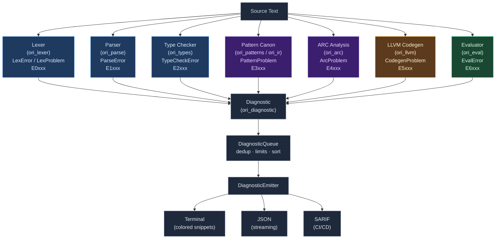

# Diagnostics Overview

A compiler's diagnostic system is the interface between the compiler and the human writing code. Every decision made about how errors look — how much context to show, whether to suggest fixes, whether to emit a code — shapes the daily experience of using the language. This chapter explains the design of Ori's diagnostic system from first principles, then walks through every component of the `ori_diagnostic` crate.

## What Is a Compiler Diagnostic System?

A **diagnostic** is a structured message from the compiler to the programmer. At minimum, it reports that something went wrong and where. At best, it explains what happened, why it is a problem, and what to do about it. The word "diagnostic" is intentional — it frames the compiler not as a gatekeeper handing down verdicts, but as a tool helping the programmer understand their code.

The evolution of compiler diagnostics spans four generations, each adding meaningfully to programmer productivity.

### Minimal Diagnostics (Early C Compilers)

The earliest C compilers produced output like:

```text
error: syntax error on line 42
```

The programmer gets a severity, a category, and a line number. Nothing more. This works for experienced users who already know the language well enough to interpret a line number as a diagnosis, but it is hostile to learners and to anyone working in an unfamiliar part of a large codebase. There is no source context, no indication of what the parser expected, and no suggestion of what to do.

### Source-Snippet Diagnostics (GCC, Clang)

The next generation added the source line itself, with a caret pointing at the problem:

```text
main.c:42:15: error: expected ';' before '}' token
   if (x > 0) {
               ^
```

This is a major improvement. The programmer sees exactly which token the compiler is pointing at without opening their editor and counting characters. Clang extended this further by adding colored output, multiple carets, and fix-it hints — short inline suggestions printed alongside the error. These fix-it hints, introduced around 2009, were the first machine-applicable diagnostic suggestions in widespread use.

### Rich Diagnostics (Rust, Elm)

Rust and Elm independently arrived at a third generation: errors as teaching tools. A Rust type error shows multiple annotated spans across the same source file, secondary labels explaining why each location is relevant, a note explaining the underlying concept, and sometimes a concrete suggestion with a code snippet. Elm, in its 2016 "compiler errors for humans" initiative, went further still — it pioneered showing type diffs side-by-side and writing error messages that explicitly teach the type system rather than assuming the programmer already understands it.

The core insight of this generation is that an error is an opportunity. A programmer who encounters a diagnostic learns something about the language if the diagnostic is good; they learn nothing, and may learn something wrong, if the diagnostic is just an error code.

### Machine-Applicable Fixes (Rust Clippy, TypeScript)

The fourth generation adds structured suggestions that tools can apply automatically. Clippy lints in Rust emit not just a message but a precise span replacement — the range of bytes to delete and the text to insert. A compatible editor or the `cargo fix` command can apply these automatically, with no human involvement. TypeScript's language server does the same thing through its `codeFixProvider` API.

Machine-applicable fixes require distinguishing between suggestions the compiler is confident about — typo corrections, missing syntax — and suggestions that might change semantics. A confidence level (Rust calls it "applicability") is attached to each suggestion so that tooling knows whether to auto-apply or to prompt.

Ori targets the rich diagnostics tier and is building toward full machine-applicable fix support. The current system has the infrastructure for all four categories; production fixes are registered for a growing set of errors.

## What Makes Ori's Diagnostics Distinctive

Several design decisions differentiate Ori's diagnostic system from the baseline.

### ErrorGuaranteed: Type-Level Proof of Error Reporting

**`ErrorGuaranteed`** is a zero-size struct with a private constructor. The only way to obtain an instance is by emitting an error through `DiagnosticQueue::emit_error`. This gives compiler phases a way to prove, at compile time, that an error has actually been reported before returning an error result.

```rust
#[derive(Copy, Clone, Eq, PartialEq, Hash, Debug)]
pub struct ErrorGuaranteed(());

impl ErrorGuaranteed {
    pub(crate) fn new() -> Self { ErrorGuaranteed(()) }
}
```

Phases that encounter errors return `Result<T, ErrorGuaranteed>`. The type system then enforces that any code path producing an `Err` variant did so by actually emitting a diagnostic — not by silently failing. Without this pattern, it is easy to write code that returns an error type while forgetting to call the reporting function, leaving the user with no output and no idea what went wrong. This pattern is directly borrowed from rustc's `ErrorGuaranteed` (introduced in 2022).

A secondary constructor, `from_error_count(count: usize) -> Option<Self>`, exists for phases that accumulate errors into their own data structures before converting them in batch.

### Phase-Specific Problem Types

There is no unified `Problem` enum shared across all compiler phases. Each phase defines its own error type with its own vocabulary, and each implements `into_diagnostic()` independently. The lexer produces `LexError`, the parser produces `ParseError`, the type checker produces `TypeCheckError`, the pattern canonicalizer produces `PatternProblem`, the ARC analyzer produces `ArcProblem`, and the evaluator produces `EvalError`.

This design keeps each phase self-contained. A `TypeCheckError` can carry a `PoolTypeId` — an index into the type inference pool — that would be meaningless to the lexer or the evaluator. By keeping error types phase-local, the domain-specific context that makes errors useful is preserved without leaking across phase boundaries.

The conversion to `Diagnostic` happens at the point where the phase hands off to the orchestrating `oric` crate, which has the context needed to resolve type indices to human-readable names, look up source file paths, and so on.

### DiagnosticQueue with Layered Filtering

**`DiagnosticQueue`** is not a plain accumulator. It applies four layers of filtering before accepting a diagnostic:

1. **Error limit**: after reaching the configured maximum (default 10), further errors are silently dropped. This prevents the cascade of hundreds of follow-on errors that a single bad import can produce in large codebases.
2. **Follow-on suppression**: messages containing "invalid operand", "invalid type", or the literal string `<error>` are recognized as artifacts of earlier errors and filtered out. These phrases appear when a type checker propagates error sentinels rather than real types.
3. **Same-line syntax dedup**: if a parser error has already been recorded on a given line, subsequent parser errors on the same line are dropped. Recovery in Parsers tends to generate spurious cascading errors at the recovery point.
4. **Message-prefix hash dedup**: for non-syntax errors, the first 30 characters of the message are hashed (using `DefaultHasher`, allocation-free) and compared against the previous error on the same line. If they match, the duplicate is dropped.

Errors are not sorted as they arrive. Instead, `flush()` checks whether the queue is already sorted (an O(n) scan that is the common case for single-file compilation) and only performs an O(n log n) sort when needed. The sorted diagnostics are then handed to the emitter.

The hard/soft distinction — `DiagnosticSeverity::Hard` vs `DiagnosticSeverity::Soft` — allows phases to mark speculative errors. After any hard error is recorded, soft errors are suppressed. Type inference failures caused by an earlier hard type error are a classic example of soft errors: the real message is the hard one; the inferences are noise.

### `define_error_codes!` Macro

All error codes are declared in a single `define_error_codes!` macro invocation in `error_code/mod.rs`. The macro generates:

- The `ErrorCode` enum itself, with doc comments derived from the descriptions
- `ALL: &[ErrorCode]` — a complete slice of all variants, used for iteration and exhaustive testing
- `COUNT: usize` — the variant count as a compile-time constant
- `as_str() -> &'static str` — the code as a string, e.g. `"E2001"`
- `description() -> &'static str` — the one-line description
- `Display` — delegates to `as_str()`
- `FromStr` — case-insensitive parse derived from `ALL` and `as_str()`, so it is automatically exhaustive

Adding a new code requires one line in the macro invocation. No other files need updating for the code to be valid and parseable. Phase classification predicates (`is_lexer_error()`, `is_type_error()`, etc.) use `as_str().starts_with("E0")` string prefix checks, so they too require no maintenance when new codes are added.

### Three Output Formats

The `DiagnosticEmitter` trait has three implementations: `TerminalEmitter`, `JsonEmitter`, and `SarifEmitter`. Each implements:

```rust
pub trait DiagnosticEmitter {
    fn emit(&mut self, diagnostic: &Diagnostic);
    fn emit_all(&mut self, diagnostics: &[Diagnostic]);
    fn flush(&mut self);
    fn emit_summary(&mut self, error_count: usize, warning_count: usize);
}
```

`JsonEmitter` writes JSON manually — no serde dependency. This keeps `ori_diagnostic` dependency-free for its output path, which matters for build times in a crate that every other compiler crate depends on.

`SarifEmitter` uses a `BTreeSet<ErrorCode>` to accumulate the rule IDs seen during a run, producing a stable-ordered rules array in the final SARIF output regardless of the order errors were emitted.

### Cross-File Labels

A `Label` can carry an optional `SourceInfo` — the file path and content for a span in a different file. When a label has `source_info`, the terminal emitter renders it with `::: path` notation rather than `-->`:

```text
error[E2001]: type mismatch
  --> src/main.ori:10:5
   |
10 |     let x: int = get_name()
   |                  ^^^^^^^^^^ expected `int`, found `str`
   |
  ::: src/lib.ori:25:1
   |
25 | @get_name () -> str
   | ------------------- return type defined here
```

This allows a type error in one file to point at the definition in another, which is essential for module-scale error messages.

### Embedded Error Documentation

Documentation for each error code lives in a `.md` file in `compiler/ori_diagnostic/src/errors/`. These files are embedded at compile time using `include_str!` and loaded into a `LazyLock<HashMap<ErrorCode, &'static str>>` on first access. The `ErrorDocs` struct provides O(1) lookup:

```rust
pub struct ErrorDocs;

impl ErrorDocs {
    pub fn get(code: ErrorCode) -> Option<&'static str>;
    pub fn all_codes() -> impl Iterator<Item = ErrorCode>;
    pub fn has_docs(code: ErrorCode) -> bool;
}
```

Embedding at compile time means documentation is always available — it does not require a network connection, a documentation server, or a separate install step. The `ori --explain E2001` command retrieves and prints the documentation directly. 64 of the 78 current error codes have documentation; the gaps are in the E4xxx (ARC), E5xxx (codegen), and E6xxx (eval) ranges.

### `#[cold]` on Error Paths

Every `Diagnostic` constructor (`Diagnostic::error`, `Diagnostic::warning`) is marked `#[cold]`. All pre-built factory functions (`type_mismatch`, `unexpected_token`, `unclosed_delimiter`, etc.) are similarly marked. The `too_many_errors` queue function is also `#[cold]`.

`#[cold]` tells the compiler that a function is called rarely. The optimizer uses this hint to move cold code out of the hot instruction cache, improving branch prediction for the common case (no errors). In a compiler that processes millions of tokens to compile a large program, keeping error paths cold has a measurable effect on performance.

### `#[must_use]` on `Diagnostic`

```rust
#[must_use = "diagnostics should be reported or returned, not silently dropped"]
pub struct Diagnostic { ... }
```

Silently dropping a `Diagnostic` is almost always a bug. The `#[must_use]` attribute makes the Rust compiler warn when a `Diagnostic` value is computed but not used — catching "forgotten" errors during development.

## Architecture

The following diagram shows how errors flow from source code through the compiler phases and into the diagnostic output formats.



Each phase produces its own error type, converts it to `Diagnostic` via `into_diagnostic()` (or a dedicated render function), and pushes it into `DiagnosticQueue`. The queue filters and sorts, then hands the results to whichever `DiagnosticEmitter` was configured.

## Core Types

### Diagnostic

**`Diagnostic`** is the central type. It carries everything needed to render an error in any format:

```rust
#[must_use = "diagnostics should be reported or returned, not silently dropped"]
#[derive(Clone, Eq, PartialEq, Hash, Debug)]
pub struct Diagnostic {
    pub code: ErrorCode,
    pub severity: Severity,
    pub message: String,
    pub labels: Vec<Label>,
    pub notes: Vec<String>,
    pub suggestions: Vec<String>,
    pub structured_suggestions: Vec<Suggestion>,
}
```

The `Clone, Eq, PartialEq, Hash, Debug` derives are required for Salsa compatibility — Salsa query results must be internable, and `Diagnostic` appears in several query return types.

`Diagnostic` is built using a fluent builder API:

```rust
Diagnostic::error(ErrorCode::E2001)
    .with_message("type mismatch: expected `int`, found `str`")
    .with_label(span, "expected `int`")
    .with_secondary_label(annotation_span, "type annotation here")
    .with_note("Ori has no implicit conversions")
    .with_suggestion("use `str(value)` to convert explicitly")
    .with_fix("wrap in str()", span, format!("str({})", src))
```

The distinction between `suggestions` (plain strings) and `structured_suggestions` (`Vec<Suggestion>`) is intentional. Text suggestions are human-readable hints that require no parsing: "did you mean `print`?" Text suggestions with no code spans are correct to display in any context. Structured suggestions carry precise span replacements for `ori fix` and the LSP code action API.

Pre-built factory functions cover the most common diagnostics so that call sites do not repeat the builder chain:

```rust
pub fn type_mismatch(span: Span, expected: &str, found: &str, context: &str) -> Diagnostic;
pub fn unexpected_token(span: Span, expected: &str, found: &str) -> Diagnostic;
pub fn expected_expression(span: Span, found: &str) -> Diagnostic;
pub fn unclosed_delimiter(open_span: Span, close_span: Span, delimiter: char) -> Diagnostic;
pub fn unknown_identifier(span: Span, name: &str) -> Diagnostic;
pub fn missing_pattern_arg(span: Span, pattern: &str, arg: &str) -> Diagnostic;
pub fn unknown_pattern_arg(span: Span, pattern: &str, arg: &str, valid: &[&str]) -> Diagnostic;
```

Factory functions with more than three parameters use a config struct to avoid positional argument ambiguity:

```rust
pub struct TypeMismatchConfig<'a> {
    pub span: Span,
    pub expected: &'a str,
    pub found: &'a str,
    pub context: &'a str,
}

impl<'a> TypeMismatchConfig<'a> {
    pub fn into_diagnostic(self) -> Diagnostic { ... }
}
```

### Severity

**`Severity`** has four levels:

| Variant | Display | Meaning |
|---------|---------|---------|
| `Error` | `error` | Compilation cannot proceed |
| `Warning` | `warning` | Potential problem, compilation succeeds |
| `Note` | `note` | Additional context, not actionable on its own |
| `Help` | `help` | Actionable suggestion for improvement |

`Display` produces lowercase strings, as the terminal emitter uses `severity` directly in its header rendering.

### Label

**`Label`** associates a message with a source span. A diagnostic can have multiple labels — one primary (the main error site) and any number of secondaries (related context). Primary labels use `^` underlines in terminal output; secondary labels use `-`.

```rust
pub struct Label {
    pub span: Span,
    pub message: String,
    pub is_primary: bool,
    pub source_info: Option<SourceInfo>,
}
```

When `source_info` is `Some`, the label references a span in a different file. The terminal emitter renders these with `::: path` notation, and the SARIF emitter uses a separate `artifactLocation`. The `is_cross_file()` predicate tests this.

Four constructors cover the matrix of primary/secondary × same-file/cross-file:
`Label::primary`, `Label::secondary`, `Label::primary_cross_file`, `Label::secondary_cross_file`.

### ErrorCode

**`ErrorCode`** is generated by the `define_error_codes!` macro. The current definition declares 78 codes across 9 ranges. The full table:

| Range | Phase | Count | Examples |
|-------|-------|-------|---------|
| E0xxx | Lexer | 13 | E0001 unterminated string, E0011 unicode confusable |
| E1xxx | Parser | 16 | E1001 unexpected token, E1003 unclosed delimiter |
| E2xxx | Type checker | 40 | E2001 type mismatch, E2024 trait not object-safe |
| E3xxx | Pattern | 3 | E3001 unknown pattern, E3003 pattern type error |
| E4xxx | ARC analysis | 4 | E4001 unsupported expression, E4004 FBIP violation |
| E5xxx | Codegen/LLVM | 9 | E5001 module verification, E5006 linker failed |
| E6xxx | Runtime/eval | 22 | E6001 division by zero, E6031 stack overflow |
| E9xxx | Internal | 2 | E9001 internal compiler error, E9002 too many errors |
| W1xxx / W2xxx | Warnings | 3 | W1001 detached doc comment, W2001 infinite iterator |

Phase classification uses string prefix predicates:

```rust
pub fn is_lexer_error(&self) -> bool { self.as_str().starts_with("E0") }
pub fn is_type_error(&self) -> bool  { self.as_str().starts_with("E2") }
pub fn is_warning(&self) -> bool     { self.as_str().starts_with('W') }
// ... and so on for each phase
```

`FromStr` is derived from `ALL` and `as_str()` — case-insensitive, automatically exhaustive with no manual mapping required.

### ErrorGuaranteed

**`ErrorGuaranteed`** is a zero-size proof type:

```rust
#[derive(Copy, Clone, Eq, PartialEq, Hash, Debug)]
pub struct ErrorGuaranteed(());
```

Its constructor is `pub(crate)`, accessible only within `ori_diagnostic`. The queue's `emit_error` method is the sole public way to obtain an instance. `from_error_count` provides a secondary path for phases that track errors independently.

Because `ErrorGuaranteed` is `Copy`, it can be threaded through Salsa query results and stored in data structures without clone overhead. Being `Copy` does not weaken the guarantee — you can only copy an instance you already have, and you can only get the first instance by emitting.

### DiagnosticQueue

**`DiagnosticQueue`** is the accumulation and filtering layer. Its public interface:

```rust
impl DiagnosticQueue {
    pub fn new() -> Self;
    pub fn with_config(config: DiagnosticConfig) -> Self;

    // Primary entry points
    pub fn emit_error(&mut self, diag: Diagnostic, line: u32, column: u32) -> ErrorGuaranteed;
    pub fn emit_error_with_source(&mut self, diag: Diagnostic, source: &str) -> ErrorGuaranteed;
    pub fn add_with_severity(&mut self, diag: Diagnostic, line: u32, column: u32,
                             severity: DiagnosticSeverity) -> bool;
    pub fn add_with_source_and_severity(&mut self, diag: Diagnostic, source: &str,
                                        severity: DiagnosticSeverity) -> bool;

    // Inspection
    pub fn has_errors(&self) -> Option<ErrorGuaranteed>;
    pub fn error_count(&self) -> usize;
    pub fn has_hard_error(&self) -> bool;
    pub fn limit_reached(&self) -> bool;
    pub fn peek(&self) -> impl Iterator<Item = &Diagnostic>;

    // Consumption
    pub fn flush(&mut self) -> Vec<Diagnostic>;
}
```

`flush()` clears the queue and resets all deduplication state after returning the sorted diagnostics.

**`DiagnosticConfig`** controls behavior:

```rust
pub struct DiagnosticConfig {
    pub error_limit: usize,      // Default: 10 (0 = unlimited)
    pub filter_follow_on: bool,  // Default: true
    pub deduplicate: bool,       // Default: true
}
```

`DiagnosticConfig::unlimited()` disables all limits — useful in test contexts where you want to see every diagnostic.

### Suggestion and Substitution

**`Suggestion`** has two forms:

- **Text-only**: a human-readable message with no code substitutions. Created via `Suggestion::text()`, `Suggestion::did_you_mean()`, `Suggestion::wrap_in()`.
- **Span-bearing**: a message with a list of `Substitution` values. Created via `Suggestion::machine_applicable()`, `Suggestion::maybe_incorrect()`, `Suggestion::has_placeholders()`.

The `priority` field (0–3, lower is higher priority) controls ordering when multiple suggestions are shown. Priority 0 is "most likely to be what the user wants" — typo corrections, missing syntax — while priority 3 is "speculative or unlikely."

**`Applicability`** communicates confidence:

| Variant | Meaning | Safe to auto-apply? |
|---------|---------|-------------------|
| `MachineApplicable` | Definitely correct | Yes |
| `MaybeIncorrect` | Probably correct | Human review recommended |
| `HasPlaceholders` | Template requiring user input | No |
| `Unspecified` | Unknown confidence | No |

**`Substitution`** is a `(span, snippet)` pair. A suggestion may have multiple substitutions for edits that require changes in more than one place — wrapping an expression in a function call, for example, adds text before and after the original span:

```rust
Suggestion::maybe_incorrect("convert to str", open_span, "str(")
    .with_substitution(close_span, ")")
```

### LineOffsetTable

**`LineOffsetTable`** pre-computes line offsets for efficient line/column lookup. It is used by `TerminalEmitter` and `DiagnosticQueue` wherever multiple lookups on the same source file are needed.

Construction is O(n) — one pass over the source text to find all newlines:

```rust
pub fn build(source: &str) -> Self
```

Lookup is O(log L) via binary search over the offsets array:

```rust
pub fn line_from_offset(&self, offset: u32) -> u32
pub fn offset_to_line_col(&self, source: &str, offset: u32) -> (u32, u32)
pub fn line_text<'a>(&self, source: &'a str, line: u32) -> Option<&'a str>
```

For single lookups, `span_utils::offset_to_line_col(source, offset)` performs a linear O(n) scan. The table is worth building whenever more than a handful of lookups will be performed.

## Error Code Design

Error codes serve two purposes: they give programmers a stable, searchable identifier for each class of error, and they let tooling classify errors by phase without parsing error messages.

The phase ranges are chosen so that the first digit immediately conveys where in the compilation pipeline the error originated. E0xxx came from the lexer — something is wrong with the characters in the source. E2xxx came from the type checker — the program is syntactically valid but semantically incorrect. E6xxx are runtime errors emitted by the interpreter. This naming convention is human-readable without documentation.

The `define_error_codes!` macro enforces that every code has a description. There is no way to add a code without also providing a one-line description, which is embedded as a doc comment on the enum variant and returned by `description()`. This prevents codes from being added as bare numbers with no explanation.

Stability is an explicit design constraint. Once a code is published, tools, scripts, CI filters, and documentation references all depend on it. Codes are never renumbered. If a code's semantics change substantially, a new code is added. Deprecated codes remain in the enum as dead variants rather than being removed.

Warning codes use the `W` prefix with the same phase digit convention: W1xxx for parser warnings, W2xxx for type checker warnings. The `is_warning()` predicate checks for the `W` prefix.

### Adding a New Code

1. Add one line to the `define_error_codes!` invocation in `error_code/mod.rs`:
   ```rust
   E2041, "Description of the new error";
   ```
2. Create `compiler/ori_diagnostic/src/errors/E2041.md` with the documentation.
3. Add the `include_str!` entry to the `DOCS` array in `errors/mod.rs`.
4. Use `ErrorCode::E2041` in the phase that emits the error.

The macro handles everything else: the enum variant, `ALL` inclusion, `as_str()`, `description()`, `Display`, `FromStr`.

## The Diagnostic Pipeline

Understanding how an error flows from detection to output helps when adding new diagnostics or debugging why an error is or is not appearing.

**Step 1: Detection.** A compiler phase (say, the type checker) detects an error while processing some expression. It constructs a phase-specific error value — a `TypeCheckError` variant — using whatever domain context it has at hand: type IDs, spans, variable names.

**Step 2: Conversion.** The phase converts its error type to `Diagnostic`. For type errors, this happens in `oric/src/reporting/typeck/` where a `TypeErrorRenderer` resolves `PoolTypeId` indices to human-readable type names using the inference pool. For simpler errors, `into_diagnostic()` is called directly on the error value. The resulting `Diagnostic` is a self-contained, renderable message with no dependencies on the inference pool or any other compiler state.

**Step 3: Queue entry.** The `Diagnostic` is pushed into `DiagnosticQueue` via `emit_error` (which returns `ErrorGuaranteed`) or `add_with_severity` (which returns a boolean indicating whether the diagnostic was accepted). The line and column are computed from the primary span and the source text, either by the caller or by `add_with_source_and_severity`.

**Step 4: Filtering.** Before accepting the diagnostic, the queue checks the error limit, then checks whether the diagnostic is a follow-on (message contains "invalid operand", "invalid type", or `<error>`), then checks for duplicates using the same-line syntax dedup or the message-prefix hash. Soft errors are suppressed if a hard error has already been seen.

**Step 5: Sorting.** When `flush()` is called at the end of a compilation phase, the queue sorts by `(line, column)`. If the diagnostics are already in order — the common case when a single file is processed top-to-bottom — the sort is skipped after an O(n) check.

**Step 6: Emission.** The sorted `Vec<Diagnostic>` is passed to `DiagnosticEmitter::emit_all`. Each emitter handles the rendering independently: the terminal emitter builds source snippets and applies color codes; the JSON emitter writes the structured representation; the SARIF emitter accumulates results for a final document.

## Error Documentation System

Every error code can have associated documentation, accessible via `ori --explain <code>`. The documentation system uses compile-time embedding to keep documentation always available and zero-cost at startup.

The `DOCS` static in `errors/mod.rs` is an array of `(ErrorCode, &'static str)` pairs. Each `&'static str` is embedded via `include_str!` at compile time:

```rust
static DOCS: &[(ErrorCode, &str)] = &[
    (ErrorCode::E0001, include_str!("E0001.md")),
    (ErrorCode::E0002, include_str!("E0002.md")),
    // ...
];
```

The `LazyLock<HashMap<ErrorCode, &'static str>>` is initialized on first access from this array, giving O(1) lookup for subsequent calls:

```rust
static DOCS_MAP: LazyLock<HashMap<ErrorCode, &'static str>> =
    LazyLock::new(|| DOCS.iter().copied().collect());
```

Each `.md` file follows a consistent format:

```text
# EXXXX: Error Name

One-sentence description.

## Example

(ori code block showing the error)

## Explanation

(paragraph explaining why this is an error)

## Common Causes

(numbered list of common situations)

## Solutions

(numbered list of concrete fixes with code examples)

## See Also

(links to related error codes)
```

This format is not mechanically enforced, but the `ori --explain` output renders it as markdown, so maintaining the structure ensures good formatting. The `all_codes()` iterator enables tooling to enumerate every documented code.

The current documentation gap — 64 of 78 codes documented — concentrates in the E4xxx (ARC analysis), E5xxx (codegen/LLVM), and E6xxx (eval) ranges. These phases are newer and their error conditions are less stable, making comprehensive documentation a work-in-progress.

## Prior Art

The design of Ori's diagnostic system draws from a rich body of prior art in compiler design.

**[rustc](https://github.com/rust-lang/rust)** is the primary reference. The `ErrorGuaranteed` pattern originates directly from rustc's `rustc_errors` crate, where it was introduced to enforce that every error path produces at least one diagnostic. The builder pattern for `Diagnostic`, the multi-span label model, structured suggestions with `Applicability`, the `--explain` CLI for per-code documentation, and the `DiagCtxt` accumulation model all come from rustc. Where Ori differs is in its phase-specific problem types — rustc uses a more unified diagnostic construction API — and in its simpler JSON output (no serde).

**[Elm](https://elm-lang.org/)** pioneered treating compiler errors as teaching tools, most visibly in Evan Czaplicki's 2015–2016 work on "compiler errors for humans." Elm messages name the programmer directly ("I am having trouble with this..."), explain the type system concept that applies, and offer suggestions calibrated to what beginners typically misunderstand. The `Expected<T>` context pattern — carrying forward context about what type was expected at each inference step — produces type errors that show not just "these two types don't match" but "here is where each type came from." Ori's `notes` and `suggestions` separation is influenced by this model: notes provide context, suggestions provide action.

**[Roc](https://roc-lang.org/)** demonstrates `to_diff()`, a function that compares two types and produces a colored diff-style display showing which parts match and which diverge. This makes type mismatch errors significantly more readable for large record types. Roc's treatment of error reporting as a first-class architectural concern — the reporting infrastructure is built before much of the type system — influenced the decision to give `ori_diagnostic` its own crate at the base of the dependency graph.

**[TypeScript](https://www.typescriptlang.org/)** demonstrates two patterns. Message chains — where a type error in a nested generic produces a cascade of "Type X is not assignable to type Y" messages, each explaining one level of the type structure — are useful for complex type errors. `diagnosticMessages.json`, a centralized catalog of all diagnostic messages with localization hooks, shows how to make diagnostics maintainable at scale. The `define_error_codes!` macro serves a similar centralization role in Ori.

**[Clang](https://clang.llvm.org/)** introduced fix-it hints — structured suggestions attached to diagnostics — as a first-class feature in 2009. The LLVM diagnostic infrastructure's separation between "note" (informational) and "suggestion" (actionable) matches the `notes` vs `suggestions` distinction in `Diagnostic`. Clang also pioneered automatic suppression of follow-on errors after a parse error, which is mirrored in the queue's follow-on filtering.

**[GHC](https://www.haskell.org/ghc/)** provides a reference for typed errors with structured rendering. GHC's `SDoc` (structured document) type allows errors to be rendered at different verbosities and in different output formats from a single representation. The `Diagnostic` struct with its multiple rendering paths (terminal/JSON/SARIF) is a simpler version of this idea.

## Design Tradeoffs

Several design decisions involve real tradeoffs worth understanding explicitly.

**Phase-specific problem types vs. a unified `Problem` enum.** A unified enum makes it easy to pass errors across phase boundaries and would allow a single `into_diagnostic()` implementation. Phase-specific types preserve domain context — a `TypeCheckError` can carry `PoolTypeId` values that the lexer has no concept of — and enforce phase boundaries at the type level. The cost is more boilerplate and more conversion points. The chosen design favors architectural cleanliness over code economy.

**`ErrorGuaranteed` proof type vs. runtime assertion.** An alternative is `debug_assert!(error_was_reported)` in the error return paths. The type-level approach catches violations at compile time rather than runtime, works in release builds, and composes well with Rust's type system — the compiler enforces the invariant across refactors. The cost is that `ErrorGuaranteed` must be threaded through return types, adding noise to function signatures. The benefit is that it is impossible to forget.

**Hash-prefix dedup vs. exact message dedup.** The queue compares only the first 30 characters of a message, hashed, rather than the full message string. This is O(1) and allocation-free — no `String` heap allocation for the comparison key. Hash collisions suppress a rare legitimate duplicate, which is an acceptable false positive. Exact comparison would require either allocating a `String` per comparison or storing the previous message in the queue, adding allocation overhead to a hot path.

**Embedded `.md` docs vs. external docs.** Embedding at compile time means the binary always has the documentation available, with no file system access, no network request, and no potential for version skew between the binary and its documentation. The cost is binary size — 64 markdown files add modest but nonzero size. External docs would reduce binary size and allow documentation updates without recompilation. Embedded docs were chosen because developer-tool latency (waiting for a network request) is far more annoying than binary size.

**Manual JSON construction vs. serde.** `JsonEmitter` writes JSON by hand rather than depending on serde. This keeps `ori_diagnostic` dependency-free for its output path. Serde would produce more correct JSON (proper escaping, structural validation) with less code. The chosen approach uses a local `escape_json` function and manual string construction. The tradeoff is code complexity and theoretical correctness risk for zero added dependencies.

**`#[cold]` on error paths vs. normal inlining.** `#[cold]` prevents the optimizer from inlining error constructors into hot paths and from placing cold code adjacent to hot code in the instruction stream. This matters when the compiler processes millions of tokens in a compilation where most succeed. The cost is negligible — `#[cold]` is a hint, not a guarantee — and the benefit is improved branch prediction in successful paths.

## Related Documents

- [Problem Types](problem-types.md) — per-phase error type design, `LexProblem`, `SemanticProblem`, `EvalError`, and their conversion to `Diagnostic`
- [Code Fixes](code-fixes.md) — the `CodeFix` trait, `FixRegistry`, `TextEdit`, `CodeAction`, and the framework for machine-applicable suggestions
- [Emitters](emitters.md) — `TerminalEmitter`, `JsonEmitter`, `SarifEmitter`, color schemes, and output format details
