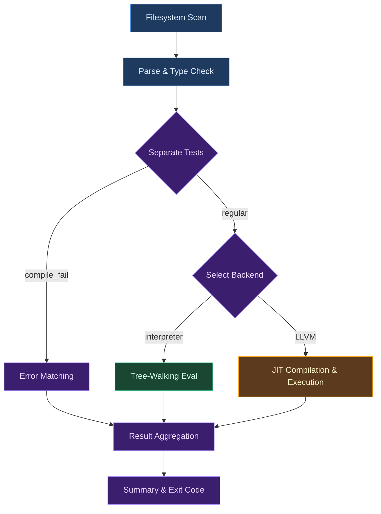

# Testing System Overview

Testing in a compiler is fundamentally different from testing in an application. An application test checks that a known input produces a known output. A compiler test must verify that an entire language --- its syntax, type system, evaluation semantics, and code generation --- behaves correctly across an unbounded space of programs. Every program a user might write is a potential test case. Every error message the compiler might produce is a contract. The testing system is not a peripheral concern bolted onto the compiler; it is the mechanism by which the compiler earns trust.

This chapter examines compiler testing through the lens of the Ori compiler, which integrates testing deeply into the language. Tests are bound to functions via first-class syntax, tracked in the dependency graph, and executed incrementally. Test enforcement is configurable --- from silent (default) to strict (compilation error) --- allowing teams to choose the level that fits their workflow. The design consequences of this integration ripple through the entire system --- from how tests are represented in the AST, to how the test runner shares interned strings across files, to how incremental execution skips tests whose targets have not changed.

## Conceptual Foundations

Compilers occupy a unique position in the testing landscape. Most software has a finite, enumerable API surface: a web server handles certain routes, a library exposes certain functions. A compiler, by contrast, must correctly process every valid program in an infinite language while rejecting every invalid one with a precise, helpful diagnostic. This asymmetry shapes every decision in the testing system.

### Classical Approaches

The history of testing in compiled languages follows a clear progression toward deeper integration.

**External test harnesses** (JUnit, pytest, and their descendants) treat the language under test as a black box. Tests are written in the same language but executed by an external framework that discovers, runs, and reports on test functions. This approach is maximally flexible --- the framework can do anything --- but creates a separation between the language and its tests. The compiler knows nothing about testing; it simply compiles the test code like any other code.

**Inline tests** (Rust's `#[test]`) close some of this gap. The compiler recognizes test annotations and includes test functions in a special compilation mode. The test binary is still separate from the production binary, but the compiler participates in the process: it understands that `#[test]` functions exist, it can gate compilation on test mode, and the build system can discover tests without parsing source files. [Rust's testing documentation](https://doc.rust-lang.org/book/ch11-01-writing-tests.html) describes this model in detail.

**Language-integrated tests** go further. [Zig's `test` blocks](https://ziglang.org/documentation/master/#toc-Zig-Test) are first-class syntax that the compiler parses and understands natively. [D's `unittest` blocks](https://dlang.org/spec/unittest.html) are similar: the compiler recognizes them as a distinct construct and can execute them during compilation. These approaches give the compiler richer information about what is being tested, but they remain optional --- a D program without `unittest` blocks compiles without complaint.

**Compile-time testing** ([Zig's `comptime`](https://ziglang.org/documentation/master/#comptime)) pushes further still, allowing assertions to execute during compilation itself. If a `comptime` assertion fails, compilation fails. This is the most integrated form of testing, but it is limited to what can be evaluated at compile time.

**Doctest-style testing** (Python, Rust, Elixir) embeds tests in documentation comments. These serve double duty as both tests and examples. The tradeoff is that doctests are typically limited to simple expressions and cannot test complex interactions.

### The Spectrum from Optional to Strict

Most languages treat tests as optional. You can write a Rust program with no `#[test]` functions and `cargo build` will succeed without complaint. You can ship a Go package with no `_test.go` files. Python, JavaScript, C, C++ --- in all of these, tests are a social convention enforced by code review and CI pipelines, not by the language itself.

A few languages nudge harder. Rust's `#[warn(missing_docs)]` lint warns about undocumented public items but does not require tests. Go's `go vet` checks for common mistakes but does not enforce test coverage. These are recommendations, not requirements.

Ori provides configurable test enforcement with three levels:

- **`off`** (default) --- tests run when present, but missing tests are not flagged. This is the most permissive mode, suitable for prototyping and exploratory coding.
- **`warn`** --- the compiler warns about untested functions. This nudges toward coverage without blocking compilation.
- **`error`** --- untested functions are compilation errors (`E0500`). This is the strictest mode, ensuring every function has at least one attached test.

The exemption list is the same at all levels: `@main`, test functions themselves, constants, type definitions, trait definitions, and implementations.

### Why Configurable Enforcement

The decision to make test enforcement configurable rests on several observations.

First, the cost of writing a test rises exponentially with time. A test written alongside the function it verifies is trivial --- the author knows exactly what the function should do, what edge cases exist, and what the invariants are. A test written six months later by a different developer requires archaeology. Configurable enforcement lets teams ratchet up strictness as their codebase matures.

Second, strict enforcement changes the economics of API design. When every function must be tested, developers naturally write smaller, more focused functions --- because smaller functions are easier to test. The enforcement requirement acts as a constant pressure toward better decomposition.

Third, the testing infrastructure enables features regardless of enforcement level. Because the compiler knows which functions are tested by which tests, it can build a dependency graph and execute only affected tests when code changes. This incremental execution makes even strict enforcement practical: the developer does not pay the cost of running all tests on every change, only the tests that matter.

### Attached vs. Floating Tests

Ori distinguishes between two kinds of tests. An **attached test** declares which function or functions it verifies using the `tests` keyword: `@test_add tests @add () -> void`. This creates an explicit, compiler-tracked relationship between the test and its target. A **floating test** uses `tests _` to indicate that it tests no specific function --- it is an integration or infrastructure test that exercises the system as a whole.

This distinction is not merely organizational. Attached tests satisfy the coverage requirement for their targets (when enforcement is enabled). Floating tests do not. Attached tests participate in incremental execution: if none of a test's targets have changed, the test can be skipped. Floating tests always run when explicitly requested via `ori test` but never run during normal compilation.

## What Makes Ori's Testing Distinctive

Several properties of Ori's testing system, taken together, distinguish it from the approaches described above.

**Configurable test enforcement.** Test enforcement is configurable: `off` (default), `warn`, or `error`. At the `error` level, a function without tests produces compilation error `E0500`, making untested code impossible to ship. At `warn`, the compiler flags untested functions without blocking compilation. At `off`, the infrastructure remains available but enforcement is silent.

**Attached tests with dependency tracking.** The `tests` keyword creates a first-class relationship in the AST between a test and the functions it verifies. The compiler uses these relationships to build a dependency graph, determine which tests are affected by a code change, and skip unaffected tests during incremental execution. No external tool or convention is needed to maintain this mapping --- it is part of the language syntax.

**Compile-fail tests as first-class constructs.** The `#compile_fail` attribute marks a test that should fail during type checking. The attribute supports rich matching: by error code (`code: "E2001"`), by message substring (`message: "type mismatch"`), by source location (`line: 5, column: 10`), or any combination. Multiple `#compile_fail` attributes on a single test expect multiple errors. This makes it possible to write precise regression tests for the compiler's error reporting without resorting to external snapshot-testing tools.

**Runtime failure testing.** The `#fail("message")` attribute marks a test that should panic at runtime with a message containing the specified substring. A test that completes without panicking, or panics with the wrong message, fails. This provides a clean way to verify that invariant violations, assertion failures, and intentional panics produce the expected diagnostics.

**Dual-backend execution.** The same tests can run on both the tree-walking interpreter and the LLVM JIT backend. This provides a powerful cross-validation mechanism: any discrepancy between the two backends reveals a bug in one of them. The interpreter provides fast feedback during development; the LLVM backend verifies that codegen produces correct results.

**Shared interner architecture.** All test files processed in a single run share one `SharedInterner` (an `Arc`-wrapped string interner). This ensures that `Name` values --- interned identifiers used throughout the compiler --- are comparable across file boundaries. Without this sharing, a test in one file could not reliably reference a function defined in another file, because the same identifier string would produce different `Name` values in different interners.

**Type error isolation.** When a file contains both `#compile_fail` tests and regular tests, the expected type errors inside `compile_fail` test bodies do not block the regular tests from running. The test runner filters errors by span: errors within a `compile_fail` test's span are matched against that test's expectations, while errors outside any `compile_fail` span block regular test execution. This isolation makes it practical to keep compile-fail and regular tests in the same file.

## Architecture

The testing pipeline moves through six stages: discovery, file processing, test separation, backend execution, result aggregation, and reporting. The following diagram shows the full flow.



**Discovery** scans the filesystem for `.ori` files, skipping hidden directories and common non-source directories (`target`, `node_modules`, `.git`). The result is a sorted list of file paths --- no parsing occurs at this stage. Discovery handles both single-file and directory inputs: if given a file, it returns just that file; if given a directory, it recurses.

**File processing** parses each discovered file using a `CompilerDb` instance that shares the global `SharedInterner`. The parser produces a `Module` containing function definitions and test definitions. Type checking runs next, producing typed IR and collecting any errors. Each file gets its own `CompilerDb` for Salsa query storage, but all share the same interner via `Arc`, ensuring that interned `Name` values are comparable across file boundaries.

**Test separation** partitions tests into two groups: those with `#compile_fail` attributes and those without. This partition determines which execution path each test follows. The partition is based on the presence of `expected_errors` in the `TestDef` AST node --- a test with any `#compile_fail` attributes will have a non-empty `expected_errors` vector.

**Backend execution** takes two forms. Compile-fail tests never execute; they are verified purely by matching the type checker's errors against the test's expectations. Regular tests execute on the configured backend: the interpreter (default, parallel via Rayon with a 32 MiB stack per worker thread) or LLVM JIT (sequential, due to context creation contention). For LLVM, a "compile once, run many" strategy compiles the entire file's functions once and then invokes each test wrapper individually, achieving O(N + M) performance rather than O(N * M). The large stack size accommodates debug builds where unoptimized frames, Salsa memo verification, and tracing spans can exhaust smaller stacks.

**Result aggregation** collects per-test outcomes into per-file summaries, then into a global summary. The summary tracks pass, fail, skip, unchanged-skip, and LLVM-compile-fail counts separately. Each `FileSummary` also records any file-level errors (such as parse failures) that prevented test extraction.

**Reporting** prints results and exits with code 0 (all passed), 1 (failures exist), or 2 (no tests found). In verbose mode, all test results are shown; in default mode, only failures and skips are displayed.

## Test Types

### Attached Tests

An attached test declares the function it verifies using the `tests` keyword:

```ori
@add (a: int, b: int) -> int = a + b

@test_add tests @add () -> void =
    assert_eq(actual: add(a: 2, b: 3), expected: 5)
```

The `tests @add` clause creates a compile-time link between `@test_add` and `@add`. This link serves three purposes: it satisfies the coverage requirement for `@add` (when enforcement is enabled), it registers `@test_add` in the dependency graph for incremental execution, and it documents intent --- a reader can see at a glance which function this test is meant to verify.

### Multi-Target Tests

A test can declare multiple targets by repeating the `tests` keyword:

```ori
@test_roundtrip tests @parse tests @format () -> void = {
    let $ast = parse(input: "x + 1");
    let $output = format(ast: ast);
    assert_eq(actual: output, expected: "x + 1");
}
```

This test covers both `@parse` and `@format`. If either target changes, the test will run during incremental execution. When enforcement is enabled, it satisfies the coverage requirement for both targets. Multi-target tests are common for functions that form a logical pair (encode/decode, parse/format, serialize/deserialize) where the most meaningful verification exercises both directions.

### Floating Tests

A floating test uses `_` as its target, indicating it tests no specific function:

```ori
@test_integration tests _ () -> void = {
    let $result = full_pipeline(input: "program");
    assert_ok(result: result);
}
```

Floating tests do not satisfy coverage requirements for any function. They do not run during normal compilation (`ori check`). They run only when explicitly requested via `ori test`. The `_` token is consistent with its meaning elsewhere in Ori: a wildcard that explicitly discards a binding.

### Compile-Fail Tests

A compile-fail test expects type checking to produce specific errors:

```ori
#compile_fail("type mismatch")
@test_type_error tests _ () -> void = {
    let x: int = "hello";
    ()
}
```

The test passes if type checking fails and at least one error message contains the substring `"type mismatch"`. It fails if type checking succeeds, or if no error matches the expected substring.

### Runtime-Fail Tests

A runtime-fail test expects execution to panic with a specific message:

```ori
#fail("division by zero")
@test_div_zero tests @divide () -> void = {
    divide(a: 10, b: 0);
    ()
}
```

The test passes if execution panics and the panic message contains `"division by zero"`. It fails if execution completes normally, or if the panic message does not contain the expected substring.

### Skipped Tests

A skipped test is parsed and type-checked but not executed:

```ori
#skip("waiting for async support")
@test_async tests @async_fetch () -> void = {
    let $result = async_fetch(url: "https://example.com");
    assert_ok(result: result);
}
```

The `#skip` attribute has a critical constraint: the test body must type-check cleanly. If the test body contains type errors, those errors block the skip --- the compiler reports the type errors rather than honoring the skip. This is intentional: `#skip` means "this test is correct but should not run yet," not "this test is broken and I want to suppress the errors."

## Test Attributes

### `#skip("reason")`

Marks a test for skipping. The string argument is the reason, displayed in test output. Skipped tests still satisfy the coverage requirement for their targets --- the function is considered tested, just not verified on this run.

The type-check requirement for skip is a deliberate design choice. It ensures that skipped tests remain compilable as the codebase evolves. A test that is skipped because a feature is not yet implemented will produce a type error when the feature's API changes, alerting the developer that the test needs updating. Without this requirement, skipped tests would silently rot.

### `#compile_fail(...)`

Marks a test that should fail during compilation. The attribute supports several matching modes:

```ori
// Simple substring match
#compile_fail("type mismatch")

// Error code match
#compile_fail(code: "E2001")

// Combined match
#compile_fail(code: "E2001", message: "type mismatch")

// Position-specific match
#compile_fail(message: "undeclared", line: 5)
#compile_fail(message: "undeclared", line: 5, column: 10)

// Multiple expected errors (one attribute per error)
#compile_fail("type mismatch")
#compile_fail("unknown identifier")
@test_multiple_errors tests _ () -> void = ...
```

The matching algorithm is greedy and one-to-one: each expected error must be matched by exactly one actual error, and each actual error can satisfy at most one expectation. Unmatched expectations produce a failure message listing what was expected but not found. Unmatched actual errors are tolerated (a test may trigger additional errors beyond those it explicitly expects).

For files containing multiple `compile_fail` tests, errors are first filtered to those within the test's AST span. If no errors fall within the span, the matcher falls back to all module-level errors. This span isolation prevents one test's expected errors from accidentally satisfying another test's expectations.

The error matching system checks both type errors and pattern problems (exhaustiveness violations, redundant arms). For each expectation, type errors are tried first, then pattern problems.

### `#fail("message")`

Marks a test that should panic at runtime. The string argument is a substring that must appear in the panic message. The semantics are straightforward:

- If execution completes without panicking, the test **fails** (expected a panic but did not get one).
- If execution panics and the message contains the substring, the test **passes**.
- If execution panics but the message does not contain the substring, the test **fails** (wrong panic message).

This attribute is useful for testing precondition violations, assertion failures, out-of-bounds access, and other intentional panics. It complements `assert_panics` and `assert_panics_with` in the prelude, which test panics at the expression level rather than the test level.

## Test Results and Outcomes

Every test execution produces a `TestOutcome` that classifies what happened:

**Passed** --- the test executed and all assertions held (for regular tests), or all expected errors were found (for compile-fail tests), or the expected panic occurred with the right message (for fail tests). This is the only fully successful outcome.

**Failed(String)** --- the test executed but something went wrong. The string contains the failure message: an assertion failure, an unexpected panic, a missing expected error, or a compile-fail test that compiled successfully. This is the primary failure mode and always counts as a test failure in the summary.

**Skipped(String)** --- the test was not executed because it carries a `#skip` attribute. The string is the skip reason. Skipped tests do not count as failures.

**SkippedUnchanged** --- the test was not executed because incremental change detection determined that none of its targets have changed since the last successful run. This outcome is produced only when the runner is configured with `incremental: true` and the `TestRunCache` contains a matching entry. It does not count as a failure.

**LlvmCompileFail(String)** --- the test could not execute because LLVM compilation of its file failed. This is distinct from `Failed`: it indicates a backend problem, not a test logic problem. These outcomes are tracked separately in the summary and displayed as LLVM compilation issues rather than test failures. This separation prevents a single LLVM bug from marking dozens of unrelated tests as failed.

## The Testing Philosophy

Testing in Ori is not an afterthought; it is a design philosophy with consequences throughout the system.

### Coverage Enforcement

When test enforcement is enabled and the compiler encounters a function without tests, it emits diagnostic `E0500`:

```
error[E0500]: function @multiply has no tests
  --> src/math.ori:15:1
   |
15 | @multiply (a: int, b: int) -> int = a * b
   | ^^^^^^^^^ untested function
   |
   = help: add a test with `@test_multiply tests @multiply () -> void = ...`
```

The severity depends on the enforcement level: at `error`, this blocks compilation like a type mismatch; at `warn`, it produces a warning; at `off` (the default), it is silent.

The exemption list is deliberately minimal: `@main` (the entry point has no meaningful unit test), test functions themselves (tests do not need tests), constants (`let $name = ...`), type definitions, trait definitions, and implementations.

### Dependency Graphs and Incremental Execution

The `tests` keyword creates edges in a dependency graph. When function `@parse` changes, the compiler computes the reverse transitive closure of `@parse` --- the set of all functions that directly or transitively depend on it --- and runs every test whose target falls in that set.

This makes even strict enforcement practical. A project with 500 functions and 500 tests does not run all 500 tests on every change. If the developer modifies `@parse`, only the tests targeting `@parse` and the functions that call it need to run. The rest are skipped with the `SkippedUnchanged` outcome.

The `TestRunCache` stores function content hashes and test results from the previous run. On the next run, the cache is consulted to determine which functions have changed. The cache is keyed by content hash, not by timestamp, so touching a file without changing its content does not invalidate the cache.

### Interaction with the Capability System

Ori's capability system (`uses Http`, `uses FileSystem`) poses a challenge for testing: how do you test a function that performs I/O without actually performing I/O? The answer is capability mocking via `with...in`:

```ori
@fetch_data (url: str) -> Result<str, Error> uses Http =
    Http.get(url: url)

@test_fetch tests @fetch_data () -> void =
    with Http = handler(state: ()) {
        get: (s, url:) -> (s, Ok("mock response")),
    } in {
        let $result = fetch_data(url: "https://example.com");
        assert_eq(actual: result, expected: Ok("mock response"));
    }
```

The `with...in` expression replaces the `Http` capability with a mock handler for the duration of the test body. This makes effectful functions testable without network access, file system access, or any other side effect. Because the capability system is part of the type system, the compiler verifies that the mock provides all required operations --- a mock that is missing an operation produces a type error, not a runtime failure.

### The Tradeoff

Strict test enforcement (`error` mode) imposes real upfront friction. A developer cannot write a quick prototype without also writing tests. This is the intended tradeoff: more friction at the point of creation, in exchange for a codebase where every function has at least one verified behavior. Whether this tradeoff is worthwhile depends on the project's priorities --- which is why enforcement is configurable. Teams working on systems where correctness matters can set `error` mode; teams prototyping can use `off` and ratchet up later.

### Test Organization

Ori enforces a physical separation between source code and test code. All tests must reside in a `_test/` subdirectory with a `.test.ori` suffix. A function defined in `src/math.ori` is tested by tests in `src/_test/math.test.ori`. This is not merely a convention --- it is enforced by the compiler (error `E0501`).

This separation has two advantages. First, it keeps source files focused on their primary purpose: defining types and functions. Second, it simplifies build output: test files are excluded from compiled output by directory path alone, with no need for conditional compilation flags or build-time stripping.

Test files can import private items from their source files using the `::` prefix (`use "../math" { ::internal_helper }`), ensuring that private implementation details remain testable without being publicly exposed.

## Prior Art

**Rust** provides the most familiar comparison. Rust's `#[test]` attribute marks functions that should run under `cargo test`, and `#[cfg(test)]` gates test-only code. Tests live in the same file as the code they test (in a `mod tests` block) or in a separate `tests/` directory for integration tests. The system is well-designed and widely used, but it is entirely optional: `cargo build` succeeds regardless of test coverage. Rust has no built-in mechanism linking a test to the function it verifies, so incremental test execution based on code changes requires external tools like [cargo-nextest](https://nexte.st/). Ori's attached test syntax (`tests @target`) and configurable coverage enforcement are direct responses to these gaps.

**Zig** integrates tests more deeply into the language. A `test "descriptive name" { ... }` block is first-class syntax that the compiler understands natively. Zig also provides `comptime` assertions that execute during compilation, catching errors before any code is generated. However, Zig tests are optional --- a file without tests compiles without issue. Zig's approach influenced Ori's decision to make tests a language construct rather than an annotation, but Ori goes further with configurable enforcement and the target-linking mechanism.

**D** includes `unittest` blocks as a language feature. These blocks are compiled and executed when the `-unittest` flag is passed. D's approach is notable for its simplicity: a `unittest` block is just code that runs before `main`. However, like Zig, D tests are optional, and there is no mechanism for declaring which function a `unittest` block is meant to verify.

**Go** takes a convention-based approach: test files end in `_test.go`, test functions start with `Test`, and the `testing.T` argument provides assertion and logging methods. Go's approach is deliberately simple and requires no special syntax --- tests are just functions with a naming convention. The tradeoff is that the compiler knows nothing about tests; all test logic lives in the `go test` tool. Go has no mechanism for linking tests to functions or for incremental test execution based on code changes.

**Elm** prioritizes testability through its type system: pure functions with immutable data are inherently easy to test. The [elm-test](https://github.com/elm-explorations/test) package provides a test runner, but testing is not enforced by the language. Elm's influence on Ori is indirect: Ori's expression-based, immutable-by-default design makes functions easier to test, which makes strict test enforcement less burdensome.

**Roc** shares Ori's philosophy of testability-by-design. [Roc's](https://www.roc-lang.org/) pure functional core and effect system make functions inherently testable, and the language's design decisions consistently favor properties that make testing easier. Roc's `expect` keyword provides inline assertions that are checked during development, blurring the line between tests and contracts. While Roc's testing infrastructure differs in specifics, the shared conviction that language design should serve testability is a clear point of alignment.

## Design Tradeoffs

**Configurable enforcement vs. fixed policy.** Strict enforcement (`error` mode) guarantees that every function has at least one verified behavior. Permissive enforcement (`off` mode) allows faster prototyping and exploratory coding. Ori chose configurable enforcement because different projects have different needs, but the incremental execution system mitigates the cost of strict mode: developers pay for tests at creation time but do not pay a runtime cost proportional to the total number of tests. The exemption list (`@main`, test functions, types, traits, impls) prevents strict enforcement from becoming absurd --- you do not need a test for a type definition.

**Attached (targeted) vs. free-form tests.** Attached tests (`tests @target`) create a compiler-tracked relationship that enables incremental execution and coverage checking. Free-form tests (like Rust's `#[test]`) offer more flexibility but provide less information to the compiler. Ori supports both (attached and floating), but only attached tests satisfy coverage requirements (when enforcement is enabled), strongly incentivizing the targeted form.

**Language-integrated vs. external test harness.** Integrating tests into the language syntax gives the compiler full visibility into test structure: it can parse test attributes, link tests to targets, and separate compile-fail from regular tests during compilation. An external harness (like pytest or Jest) is more flexible and can evolve independently of the language, but it cannot participate in compilation or type checking. Ori chose integration because the testing infrastructure --- dependency tracking, incremental execution, coverage enforcement --- demands compiler cooperation.

**Skip requiring type-check vs. unconditional skip.** Ori requires `#skip` tests to type-check cleanly. An unconditional skip would be simpler and would allow developers to skip tests with type errors. Ori chose the stricter option because unconditional skips enable test rot: a skipped test with type errors will silently remain broken as the codebase evolves, and the developer will not learn about the breakage until they remove the skip. The type-check requirement ensures that skipped tests remain compilable.

**Dual-backend execution vs. single-backend.** Running tests on both the interpreter and LLVM JIT doubles the verification surface: a bug that exists only in codegen (or only in the interpreter) will be caught by the other backend. The cost is additional execution time and the complexity of maintaining two backends. Ori mitigates the cost by making LLVM testing opt-in (`--backend=llvm`) and by using the "compile once, run many" strategy to amortize LLVM compilation costs. The diagnostic script `dual-exec-verify.sh` automates batch comparison between the two backends, flagging any discrepancies.

## Related Documents

- [Test Discovery](test-discovery.md) --- filesystem scanning, file filtering, and the `TestFile` structure
- [Test Runner](test-runner.md) --- execution dispatch, parallel scheduling, backend support, and result aggregation
