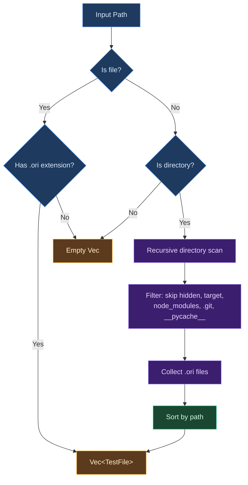
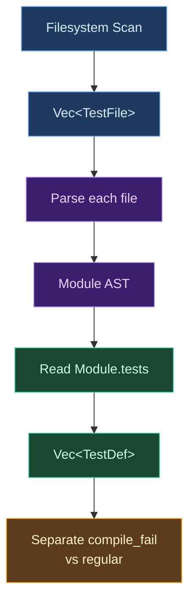
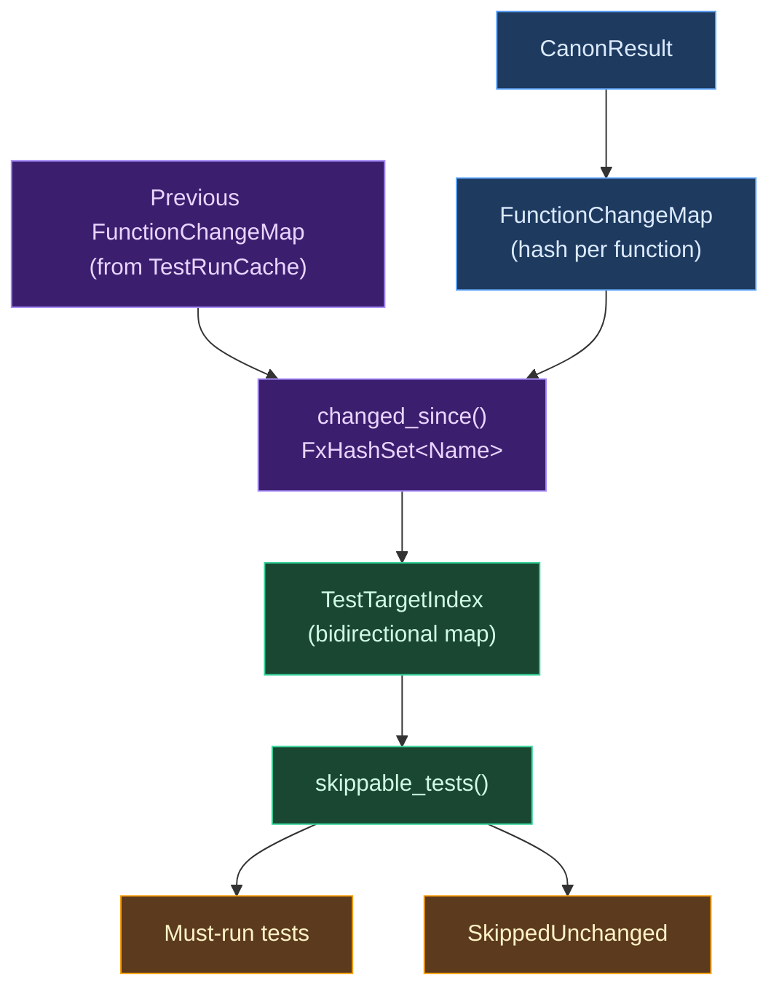
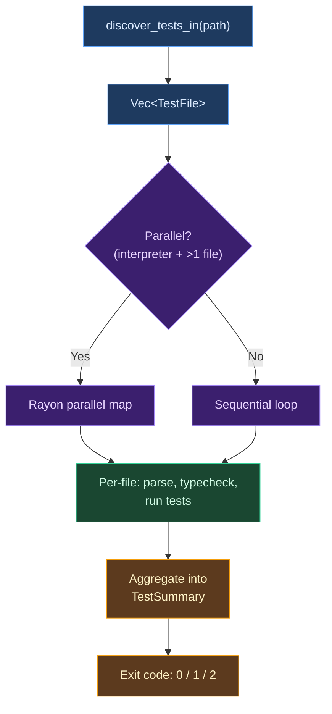

# Test Discovery

Every test framework must answer a deceptively simple question: which code should be treated as a test? The answer involves two distinct subproblems -- finding the files that might contain tests, and extracting the test definitions from those files. These subproblems have different performance characteristics, different correctness requirements, and different coupling constraints, which is why conflating them often leads to systems that are either slow (requiring compilation to enumerate tests) or imprecise (relying on naming conventions that produce false positives).

Ori separates these concerns cleanly: discovery is a pure filesystem operation that produces a list of paths, and extraction is a parsing operation that reads `TestDef` nodes from the AST. This chapter examines both levels, the incremental change detection system that determines which discovered tests actually need to run, and the integration point where discovery feeds into the test runner.

## Conceptual Foundations

Test discovery is the process by which a test runner identifies the tests it should execute. In any language with more than a handful of source files, manual test enumeration becomes untenable, so every mature testing system automates discovery in one of several ways.

**Annotation-based discovery** relies on the compiler or runtime to mark functions as tests. Rust's `#[test]` attribute and JUnit's `@Test` annotation are canonical examples. The compiler sees the annotation during compilation and collects marked functions into a test harness. This approach is precise -- there are no false positives -- but it requires full compilation before any tests can be identified. In [Rust's implementation](https://doc.rust-lang.org/book/ch11-01-writing-tests.html), `cargo test` compiles the entire crate with the test harness enabled, and the `#[test]` functions are collected during macro expansion. The strength of annotation-based systems is their tight coupling to the language's type system: only well-formed, correctly-typed functions can be annotated as tests, so the set of discovered tests is always valid. The weakness is latency: the full compilation pipeline must run before the test runner knows what to execute.

**Convention-based discovery** uses file or function naming patterns to identify tests without any special syntax. [Go](https://pkg.go.dev/testing) requires test files to end with `_test.go` and test functions to start with `Test`. [Python's unittest](https://docs.python.org/3/library/unittest.html#test-discovery) looks for `test_*.py` files and `test_*` methods. Convention-based systems are easy to understand and require no special syntax, but they introduce an inherent ambiguity: the naming pattern is a heuristic, not a guarantee. A file named `test_utils.py` might contain only helper functions used by actual tests. A file named `data_processor.py` might contain test functions whose names happen not to match the convention. The system has no way to distinguish intent from coincidence.

**Registration-based discovery** requires the programmer to explicitly register each test with a test suite. Older C and C++ frameworks like [CUnit](https://cunit.sourceforge.net/) and Google Test's `TEST()` macro use this approach. Registration gives the programmer full control over test organization and execution order, but it creates a maintenance burden: every new test requires updating the registration code, and forgetting to register a test means it silently never runs. This failure mode -- a test that exists but is never executed -- is particularly insidious because it produces no error and no warning.

**Directory-based discovery** scans a directory tree for files matching certain criteria, then examines each file for test constructs. [pytest](https://docs.pytest.org/en/stable/goodpractices.html#test-discovery) and [Jest](https://jestjs.io/docs/configuration#testmatch-arraystring) use this approach, combining directory scanning with pattern matching on file names and then introspecting the files for test definitions. Directory-based systems scale naturally to large projects because they require no central registry and no compilation pass -- the filesystem itself is the registry.

**Hybrid approaches** combine multiple strategies. A framework might scan directories for test files (directory-based) and then look for annotated functions within them (annotation-based). Ori falls into this hybrid category: it scans directory trees for `.ori` files (directory-based) and then parses each file to extract functions declared with the `tests` keyword (annotation-based at the syntax level). The hybrid approach inherits the scalability of directory scanning and the precision of syntactic identification.

These approaches reflect a fundamental tension in test discovery design. There are two distinct levels at which tests must be found: **file discovery** determines which files might contain tests, and **test extraction** determines which constructs within those files are actually tests. Some systems collapse these levels -- Rust's `#[test]` handles both during compilation, since any `.rs` file in the crate can contain test functions. Others separate them explicitly -- Go uses `_test.go` suffixes for file discovery and `Test` prefixes for function extraction. Ori chooses explicit separation: filesystem scanning for file discovery, AST inspection for test extraction. This separation is deliberate, and the rest of this chapter explains why.

## What Makes Ori's Discovery Distinctive

Ori's test discovery has three properties that, taken together, distinguish it from the approaches described above. Each reflects a deliberate design choice rooted in Ori's language philosophy.

First, **discovery operates at the filesystem level while extraction operates at the AST level**. The discovery phase produces a `Vec<TestFile>` containing only file paths -- no parsing, no compilation, no metadata beyond the path itself. The extraction phase happens later, when the test runner parses each file and reads the `tests` field of the resulting `Module` AST node. The `Module` struct in `ori_ir` stores test definitions as `tests: Vec<TestDef>`, where each `TestDef` carries the test's name, its declared targets, its body expression, attributes like `#skip` and `#compile_fail`, and its source span. This rich structure is available only after parsing, which is why discovery deliberately avoids it -- producing `TestDef` values requires the parser, the expression arena, and the string interner, none of which should be involved in a filesystem scan.

Second, **any `.ori` file can contain tests**. Unlike Go, which requires the `_test.go` suffix, Ori imposes no naming requirement on files that contain tests. The `_test/` directory convention and `.test.ori` suffix are organizational aids for human readers, not enforced by the discovery system. A file named `math.ori` can contain both the `@add` function and its `@test_add tests @add` test. This design follows from Ori's testing philosophy: tests are a fundamental part of source files, not optional extras to be segregated. When test enforcement is enabled, every function (except `@main`) requires tests. Requiring a naming convention for test files would impose friction on the most common workflow (writing a function and its tests together) while providing little benefit beyond what the syntactic `tests` keyword already provides.

Third, **discovered files are sorted by path before being returned**. This sorting step guarantees deterministic test ordering across runs, regardless of filesystem traversal order. Different operating systems and filesystems return directory entries in different orders -- ext4 returns entries in hash table order, APFS in B-tree order, NTFS in directory entry order. Without sorting, the same test suite could produce different output on different machines, making CI failures harder to reproduce. The sort is lexicographic on the full path, which groups files by directory naturally: all files in `tests/spec/types/` appear together, followed by all files in `tests/spec/traits/`, and so on.

Deterministic ordering also makes test output diffable. When a developer adds a new test file, the diff in CI output shows exactly one new entry in its expected position, rather than a shuffled reordering of all tests. This property is valuable for code review: a reviewer can look at the test output diff and immediately see which tests are new, rather than mentally sorting a randomized list.

## Discovery Algorithm

The discovery system provides two entry points. `discover_tests_in` handles both individual files and directories, dispatching to the appropriate strategy based on the path type. `discover_tests` performs the recursive directory scan when given a directory root. The internal `discover_recursive` function does the actual tree traversal.



The `discover_tests_in` function is the primary entry point. When given a file path, it checks whether the file has the `.ori` extension and returns either a single-element vector or an empty vector. When given a directory path, it delegates to `discover_tests`, which initializes a collection vector, calls the recursive walker, and sorts the results. When given a path that is neither a file nor a directory (a symlink to nothing, a device node, a path that does not exist), it returns an empty vector without error. This silent handling of invalid paths is intentional -- the caller (typically the test runner) is responsible for reporting "no tests found" to the user.

The recursive walker `discover_recursive` reads directory entries and applies two filters. The first filter skips hidden files and directories -- anything whose name starts with a dot. This catches `.git`, `.vscode`, `.cache`, `.env`, and similar directories that should never contain source code. The filter applies to both files and directories, so a hidden directory like `.backup/` is skipped entirely (no recursion into its children).

The second filter skips known non-source directories by name: `target` (Rust build output, which can contain tens of thousands of files in a large Cargo workspace), `node_modules` (JavaScript dependencies, routinely containing hundreds of thousands of files), `.git` (version control internals, already caught by the hidden filter but listed explicitly in the `matches!` guard for defense in depth), and `__pycache__` (Python bytecode cache). These skip patterns are hardcoded rather than configurable, reflecting a pragmatic assessment that the set of "obviously not source code" directories is small and stable. If a project uses an unusual build directory or dependency cache, the hidden-file convention (prefix with `.`) provides an escape hatch.

For every entry that passes both filters, the walker checks whether it is a directory (and recurses) or a file with the `.ori` extension (and collects it). Files with other extensions are silently ignored -- `.md` documentation, `.toml` configuration, `.rs` compiler sources, and any other non-Ori files are simply not collected.

The error handling strategy is deliberately permissive. The walker uses `entries.flatten()` to skip directory entries that produce I/O errors (broken symlinks, permission-denied on individual entries, filesystem corruption). The outer `let Ok(entries) = fs::read_dir(dir) else { return }` silently skips entire directories that cannot be read. This permissiveness is appropriate because discovery is not a validation step -- it is a best-effort scan. If a directory cannot be read, the worst outcome is that some test files are not discovered, which the runner will surface as "no tests found" rather than a confusing I/O error. A stricter approach that reported every unreadable directory would produce noisy output on systems with permission boundaries (containers, shared filesystems, sandboxed environments) without adding meaningful value.

The extension check uses `path.extension().is_some_and(|e| e == "ori")` rather than a string suffix check on the filename. This correctly handles edge cases like files named `.ori` (hidden file with no stem, caught by the hidden-file filter), `file.ori.bak` (extension is `bak`, not `ori`), and `file.ORI` (case-sensitive comparison, consistent with Ori's case-sensitive identifier rules).

## TestFile Type

The `TestFile` type is deliberately minimal:

```rust
pub struct TestFile {
    pub path: PathBuf,
}
```

It wraps a single `PathBuf` with no additional metadata. There is no file size, no modification time, no content hash, no flag indicating whether the file actually contains tests. This simplicity is a design choice, not an oversight.

Discovery is a filesystem operation. Its job is to answer "which files should the runner consider?" not "which files contain tests?" or "how many tests does each file have?" Those questions require parsing, and parsing is expensive. By keeping `TestFile` as a bare path, discovery remains fast: it performs only `stat` and `readdir` system calls, never `open` or `read`. A project with thousands of `.ori` files can be discovered in milliseconds.

The minimal type also keeps the discovery module decoupled from the rest of the compiler. `TestFile` does not depend on the parser, the AST, the string interner, or any Salsa query. It lives in a module that imports only `std::fs` and `std::path`. This means discovery can be tested independently of the compiler, and changes to the parser or AST do not require changes to discovery.

This decoupling has a practical consequence for testability. The discovery module's own tests can create temporary directory trees, populate them with `.ori` files (whose contents are irrelevant to discovery), and verify that the correct paths are returned in the correct order. No compiler infrastructure is needed. The tests are fast, deterministic, and isolated from the rest of the system.

By contrast, a discovery system that returned parsed AST nodes would require a working parser, a string interner, and potentially a Salsa database -- turning a simple filesystem test into an integration test. The current design means that a bug in the parser cannot cause a bug in discovery, and a refactoring of the AST types cannot break the discovery module. The only contract between discovery and the rest of the system is the `PathBuf` type, which is about as stable a contract as possible.

## File Conventions

Ori uses several conventions for organizing tests, none of which are enforced by the discovery system.

A source file `foo.ori` may contain both production functions and their tests. This is the simplest organization and works well for small modules where the tests provide documentation alongside the code they verify. A `@sum` function and its `@test_sum tests @sum` test can live in the same file, making it easy to see the intended behavior while reading the implementation.

A dedicated test file `_test/foo.test.ori` separates tests from production code. The `_test/` directory convention groups test files in a predictable location, and the `.test.ori` suffix signals intent to human readers. This organization works better for larger modules where inline tests would obscure the production code. It also mirrors the pattern used in Ori's own compiler test suite, where `tests/spec/` contains conformance tests organized by language feature, each in its own `.ori` file.

Both patterns coexist freely within the same project. A developer might use inline tests for simple utility functions where the test serves as documentation, and dedicated test files for complex integration tests that exercise multiple modules. The discovery system treats all `.ori` files identically -- it does not inspect file names, check for `_test/` in the path, or apply any naming heuristic. The convention is purely organizational, enforced by team practice rather than tooling.

This contrasts sharply with Go's strict `_test.go` requirement, where the suffix is semantically meaningful: Go excludes `_test.go` files from production builds, and only `_test.go` files can use the `testing` package. Ori does not need this build-time separation because test functions are syntactically distinct (they use the `tests` keyword) and the compiler can identify them during parsing regardless of file location. When Ori compiles a production binary, the compiler simply ignores `TestDef` nodes in the AST -- the same file serves both purposes without needing separate compilation modes.

## Two-Level Architecture

The separation between discovery and extraction is the central architectural decision in Ori's test system.

Discovery (Level 1) is a pure filesystem operation that produces `Vec<TestFile>`.
Extraction (Level 2) is a parsing operation that reads each file, builds a `Module` AST, and reads the `tests: Vec<TestDef>` field from that module.



This separation produces three concrete benefits.

**Discovery is fast.** The filesystem scan involves no parsing, no memory allocation beyond the path vector, and no I/O beyond `readdir` and `stat` calls. For a project with 500 `.ori` files scattered across a deep directory tree, discovery completes in single-digit milliseconds. If discovery required parsing each file to determine whether it contained tests, the same operation would take hundreds of milliseconds. This speed difference matters most in interactive workflows: when a developer saves a file and the IDE triggers a test run, the time between the save and the first test result is dominated by discovery, parsing, and compilation latency. A fast discovery phase keeps the total latency low.

**Files without tests are cheaply skipped.** After parsing, the runner checks `parse_result.module.tests.is_empty()`. If the file contains no test functions, the runner moves on immediately. The cost of "discovering" a non-test file is one parse operation, not zero, but the alternative -- pre-scanning files for the `tests` keyword without a full parse -- would be fragile and would duplicate lexer logic outside the lexer.

**No false positives from naming conventions.** Because extraction uses the parser rather than filename patterns, there are no edge cases where a file is incorrectly classified. A file named `test_helpers.ori` that contains only helper functions (no `tests` keyword) will not produce any test definitions. A file named `math.ori` that contains test functions will produce all of them. The parser is the single source of truth for what constitutes a test.

The cost of this approach is one parse per discovered file, even for files that contain no tests. In practice this cost is small: Ori's parser processes source at 95+ MiB/s, and most source files are under 10 KB. Parsing a 10 KB file takes roughly 100 microseconds. Even scanning 1,000 files, the total parsing overhead for test extraction is under 100 milliseconds -- well within acceptable latency for an interactive development workflow. The alternative of pre-filtering files by naming convention would save this parsing time but would introduce the ambiguity problems described above.

## Incremental Change Detection

For large projects, re-running every test after every change is wasteful. If a developer modifies a single function in a file containing fifty functions, only the tests targeting that function (and any floating tests) need to re-execute. The other tests, whose targets are provably unchanged, will produce the same results they produced on the previous run. Ori's change detection system identifies which tests can be safely skipped, reducing the edit-test cycle time from "run everything" to "run only what matters."

The system operates at the function granularity, not the file granularity. A file-level system would re-run all tests in any modified file, which is too coarse: most edits touch one or two functions while leaving dozens of others intact. A statement-level system would provide finer granularity but would be complex to implement and fragile in the face of refactoring. Function-level change detection hits a practical sweet spot: it is precise enough to skip most unchanged tests, simple enough to implement correctly, and stable enough that refactoring within a function body (without changing its semantics) does not trigger unnecessary re-runs.

The system consists of three components that work in concert with the discovery layer.

**FunctionChangeMap** stores a content hash for every function and test body in a file. It is computed from the `CanonResult` -- the canonical intermediate representation produced after type checking -- using `hash_canonical_subtree`, which walks the canonical expression tree and hashes its structure and values while ignoring source spans. Two functions that differ only in whitespace, formatting, or comments produce the same hash, because the canonical representation strips source-level variation that does not affect semantics. Two functions that differ in any semantic way -- a different operator, a different literal value, a different variable reference, a different type annotation -- produce different hashes. The hash uses `FxHasher` (a fast, non-cryptographic hash from the `rustc_hash` crate) because collision resistance is not a security concern here: a hash collision means a test runs unnecessarily, not that it is skipped incorrectly.

**TestTargetIndex** is a bidirectional mapping between functions and their tests, built from a module's `Vec<TestDef>` by iterating each test's `targets` field. In Ori, a test declares its targets explicitly: `@test_add tests @add` declares that `test_add` targets the function `add`. Multi-target tests like `@test_math tests @add tests @subtract` create edges to both functions. The forward direction of the index (function to tests) answers "which tests should I re-run if this function changed?" The reverse direction (test to functions) answers "can I skip this test because none of its targets changed?" The index provides two key operations: `tests_for_changed` computes the full set of tests that must re-run given a set of changed functions, and `skippable_tests` computes the complement -- tests that can be safely skipped.

**TestRunCache** persists `FunctionChangeMap` snapshots across test runs, keyed by file path. When the runner processes a file, it computes a fresh `FunctionChangeMap` from the current canonical IR, retrieves the previous snapshot from the cache, and calls `changed_since` to determine which functions have changed. After processing, the runner stores the new snapshot back into the cache, so the next run has an up-to-date baseline. The cache is currently in-memory only, which means it provides value primarily in watch mode where the runner process persists across edits and the cache accumulates snapshots over the session. A future on-disk serialization would extend the benefit to separate `ori test` invocations, allowing incremental testing across terminal sessions and CI pipeline stages.

The change detection algorithm proceeds in four steps:

1. **Hash**: Compute a `FunctionChangeMap` for the current file from its `CanonResult`. Each root in the canonical tree (functions, tests, constants) gets a hash entry. The `from_canon` constructor iterates `canon.roots`, calling `hash_canonical_subtree` on each root's body expression.
2. **Compare**: Call `current.changed_since(previous)` to get the set of changed function names. A function is "changed" if it is new (present in current but not previous), deleted (present in previous but not current), or modified (present in both but with different hashes). The comparison uses `FxHashSet` for the result, enabling O(1) membership checks in subsequent steps.
3. **Propagate**: Build a `TestTargetIndex` from the module's test definitions, then call `tests_for_changed` to find tests that target any changed function. The propagation also checks whether any test's own name appears in the changed set, because test bodies are included in `CanonResult.roots` alongside function bodies -- a modified test body appears as a "changed function" in the hash comparison.
4. **Skip**: Call `skippable_tests` to identify tests that can receive the `SkippedUnchanged` outcome. A test is skippable only if it has at least one declared target, none of its targets appear in the changed set, and its own body hash is unchanged.

Two invariants govern skip decisions, and both err on the side of safety.

First, floating tests -- those with no `targets` (declared as `tests _` or with no `tests` clause) -- are **never** skipped. A floating test might exercise any combination of functions in the module, and without explicit target declarations, the system has no way to determine whether the test's behavior depends on a changed function. Skipping a floating test could hide a regression, so the system conservatively runs all floating tests on every invocation. This creates a natural incentive for developers to declare test targets: targeted tests benefit from incremental skipping, while floating tests always pay the full execution cost.

Second, test body changes always trigger re-execution, even if none of the test's declared targets have changed. A modified assertion, an updated expected value, or a new edge case in the test body could expose a previously-hidden bug. The test runner treats the test body as an implicit additional target: if its canonical hash differs from the previous run, the test must re-execute.



## Integration with the Test Runner

The test runner is the primary consumer of the discovery system, and the interface between them is intentionally narrow: the runner receives a `Vec<TestFile>` and is responsible for all subsequent processing. This narrow interface means that discovery can be replaced or extended (for example, with a file-watching system that detects new files) without changing the runner, and the runner can change its processing strategy (parallel, sequential, incremental) without affecting discovery.

When the user invokes `ori test path/`, the runner calls `discover_tests_in(path)` to get the list of files, then decides whether to process them in parallel or sequentially.

The parallel/sequential decision depends on two factors: the number of discovered files and the backend. For the interpreter backend, the runner uses [Rayon](https://docs.rs/rayon/latest/rayon/) for work-stealing parallelism when more than one file is discovered, processing files concurrently with a dedicated thread pool. Each worker thread gets a 32 MiB stack to accommodate the deep call stacks that arise from Salsa memo verification, tracing spans, and the type-checking pipeline in debug builds. The runner uses `build_scoped` rather than the global Rayon pool to ensure cleanup completes before the function returns, avoiding hangs from Rayon's `atexit` handlers.

The LLVM backend forces sequential execution regardless of file count. This is a pragmatic response to LLVM's internal architecture: `Context::create()` contends on a global lock inside the LLVM library, so parallel LLVM context creation serializes at the library level despite appearing parallel at the Rayon level. Empirical measurement showed that sequential LLVM execution (1-2 seconds) dramatically outperformed parallel execution (57 seconds) due to this lock contention, matching the patterns used by [Roc](https://github.com/roc-lang/roc) and `rustc` for LLVM parallelism.

Each file is processed independently. The runner creates a fresh `CompilerDb` (Salsa query storage) for each file but shares a single `SharedInterner` (Arc-wrapped string interner) across all files so that `Name` values -- interned identifiers used throughout the compiler -- are comparable across compilation units. Without a shared interner, two files that both reference a function named `add` would produce different `Name` values, making cross-file test targeting impossible. The processing pipeline for each file follows a fixed sequence: read the source text, parse it into a `Module` AST, separate compile-fail tests from regular tests, type-check the module, run compile-fail tests (which verify that expected type errors occurred, without evaluation), run regular tests (through the interpreter or LLVM backend), apply the `#fail` wrapper for tests expecting runtime failure, and collect results into a `FileSummary`.

The file-level results are aggregated into a `TestSummary` that reports total, passed, failed, skipped, and unchanged counts. The runner returns exit code 0 if all tests passed, 1 if any test failed, and 2 if no tests were found. The exit code convention follows the Unix tradition where zero means success and nonzero means failure, with distinct nonzero codes for different failure modes. The "no tests found" exit code (2) is deliberately different from the "tests failed" code (1) so that CI systems can distinguish between "something is broken" and "the test path is misconfigured."

The coverage report, when requested via `ori test --coverage`, also uses discovery as its starting point. The runner calls `discover_tests_in(path)` a second time to enumerate files, parses each one, and examines which functions are targeted by tests and which are untested. This reuse of the same discovery infrastructure ensures that the coverage report and the test run agree on which files are in scope -- a coverage report that examines a different set of files than the test run would produce confusing results where functions appear "untested" simply because their tests live in a file that the coverage system did not discover.



## Prior Art

Ori's test discovery draws on ideas from several language ecosystems while making different tradeoffs suited to its design goals.

**Rust** takes the annotation-based approach to its logical conclusion. The `#[test]` attribute marks functions as tests, and `cargo test` compiles the crate with a generated test harness that calls each marked function. There is no separate discovery phase -- test identification happens during compilation, and the harness is linked into the test binary. This means Rust must compile all code before it can determine which tests exist, which makes "list all tests" an expensive operation. Ori's filesystem-level discovery allows the runner to know which files to process without compiling anything, though it still must parse each file to find the actual test functions. The Rust approach guarantees zero false positives (every `#[test]` function is a test), while Ori's approach trades compilation cost for faster enumeration. See the [Rust testing chapter](https://doc.rust-lang.org/book/ch11-01-writing-tests.html) for details.

**Go** uses convention-based discovery with strict naming requirements. Test files must end with `_test.go`, and test functions must start with `Test` and accept a `*testing.T` parameter. The `go test` command scans the current package (or specified packages) for matching files and functions. This two-level convention -- file suffix plus function prefix -- is simple and predictable, but it means that a file without the `_test.go` suffix cannot contain tests, even if the developer wants to co-locate tests with production code in the same file. Go also uses the suffix convention for build-time separation: `_test.go` files are excluded from production binaries, which is a clean solution to the problem of test-only code inflating binary size. Ori achieves similar separation through AST-level filtering rather than file-level exclusion: the compiler ignores `TestDef` nodes when building production binaries, regardless of which file they appear in. See the [Go testing package](https://pkg.go.dev/testing) documentation.

**Python's pytest** is the closest analogue to Ori's approach. It performs directory-based discovery with configurable file patterns (defaulting to `test_*.py` and `*_test.py`), then introspects each matching file for functions and classes whose names match `test_*` or `Test*`. Like Ori, pytest separates file discovery from test extraction, and like Ori, it recursively walks directory trees with configurable exclusion patterns. Unlike Ori, pytest uses naming conventions for both levels -- a function named `helper_for_tests` will not be collected, while a function named `test_helper` will be. pytest also supports marker-based discovery via the `@pytest.mark` decorator system, which is closer to annotation-based discovery. Ori avoids the naming convention ambiguity entirely by using a syntactic keyword (`tests`) that is unambiguous to the parser. See the [pytest discovery documentation](https://docs.pytest.org/en/stable/goodpractices.html#test-discovery).

**Jest** provides highly configurable discovery with `testMatch` and `testPathIgnorePatterns` options. By default, it finds files matching `**/__tests__/**/*.[jt]s?(x)`, `**/?(*.)+(spec|test).[jt]s?(x)` and similar patterns. Within each file, `test()` and `it()` calls register tests at runtime, which means test identification requires executing the file's top-level code -- a form of dynamic discovery that can have side effects.

Jest's approach is flexible but complex. The configuration space is large (multiple overlapping options for include/exclude patterns), the runtime registration model means that import-time side effects can affect which tests are discovered, and the JavaScript module system's dynamic nature means that tests can be conditionally registered based on environment variables or feature flags. Ori's simpler model (scan for `.ori`, parse for `tests` keyword) trades configurability for predictability: there are no configuration options, no runtime evaluation during discovery, and no way for the discovery result to depend on the environment. See the [Jest configuration documentation](https://jestjs.io/docs/configuration#testmatch-arraystring).

**Zig** uses inline `test` blocks that are collected by the compiler during compilation, similar to Rust's `#[test]` but with block syntax rather than function annotation. Like Rust, test identification requires compilation. Unlike Rust, Zig's test blocks can appear at any scope level and are not restricted to functions. Zig also provides `comptime` testing where test blocks are evaluated at compile time, blurring the line between testing and static analysis.

Ori's `tests` keyword is syntactically similar to Zig's `test` blocks in that tests are declared inline with production code, but there is a key architectural difference: Ori's two-level discovery means the filesystem scan can happen independently of compilation. In Zig, running `zig test file.zig` must compile the file to discover its test blocks; in Ori, `discover_tests_in(path)` enumerates files without touching the compiler at all. See the [Zig testing documentation](https://ziglang.org/documentation/master/#Zig-Test).

The common thread across all of these systems is the tension between **precision** and **speed**. Precision means identifying exactly and only the real tests, with no false positives (non-test functions treated as tests) and no false negatives (test functions that are never run). Speed means knowing what to execute without doing expensive work upfront. Compiler-integrated approaches like Rust and Zig achieve perfect precision because the compiler sees the test annotations during compilation, but they pay for it with compilation latency -- you cannot list the tests without first compiling the entire crate.

Convention-based approaches like Go and pytest achieve speed by using simple pattern matching on file names and function names, but they sacrifice precision: naming conventions are heuristics that can both over-match (collecting a function named `test_helper` that is not a test) and under-match (missing a test in a file that does not follow the naming convention).

Ori's hybrid approach occupies a middle ground. The filesystem scan is as fast as convention-based discovery: it requires only directory traversal and extension checks, with no file content inspection. The parser-based extraction is as precise as annotation-based discovery: the `tests` keyword in Ori's grammar is syntactically unambiguous, so the parser can identify tests with zero false positives and zero false negatives. And neither level requires a full compilation pass -- parsing is dramatically cheaper than type-checking and code generation, so the total cost of discovery plus extraction is a small fraction of the cost of full compilation.

## Design Tradeoffs

Several design decisions in Ori's test discovery reflect conscious tradeoffs between competing concerns. Each tradeoff involves a dimension along which the system could have been designed differently, with clear costs and benefits on both sides.

**Filesystem discovery vs. compiler-integrated discovery.** Rust and Zig identify tests during compilation, which means test discovery is perfectly accurate but requires a full compile. Ori identifies test *files* via filesystem scanning and test *functions* via parsing, which means the runner can enumerate files cheaply but must parse each file to find tests. The tradeoff is speed of enumeration vs. accuracy of identification. Since Ori's parser is fast (95+ MiB/s throughput) and test files are typically small, the parse-per-file cost is acceptable. The filesystem scan provides value in watch mode, where the runner can detect new or deleted files without re-parsing unchanged ones.

**Convention-free naming vs. convention-enforced naming.** Go requires `_test.go` suffixes, which makes it immediately obvious which files contain tests but prevents co-locating tests with production code in the same file. Ori allows any `.ori` file to contain tests, which supports Ori's design principle that tests are part of the code they verify. The tradeoff is discoverability for humans: in a Go project, `ls *_test.go` shows all test files; in an Ori project, finding test files requires either following the `_test/` convention or grepping for the `tests` keyword. The convention exists as an organizational aid, but the system does not enforce it.

**Eager parsing during discovery vs. lazy parsing in the runner.** The current design defers all parsing to the runner. An alternative would be to parse files during discovery and include test metadata (count, names, targets) in `TestFile`. This would allow the runner to make smarter scheduling decisions -- for example, processing files with many tests first to maximize parallelism utilization, or pre-filtering files that contain no tests to avoid allocating a `CompilerDb` for them. However, eager parsing would make discovery slower, couple it to the parser and AST types, and complicate the module's dependency graph. The current approach keeps discovery fast and simple at the cost of making the runner responsible for all file inspection.

**Deterministic ordering vs. filesystem ordering.** The sort step after directory traversal guarantees that tests run in the same order on every machine and every run. This makes test output reproducible and CI failures easier to diagnose. The cost is an O(n log n) sort on the file list, which is negligible for any realistic number of files (sorting 10,000 paths takes microseconds). The alternative -- using filesystem order -- would be marginally faster but would produce platform-dependent test ordering that could mask order-dependent bugs.

**Minimal `TestFile` vs. metadata-rich discovery.** `TestFile` contains only a `PathBuf`. A richer type might include file size (to schedule large files first), modification time (for incremental discovery), or a content hash (to skip unchanged files without parsing). Each addition would make discovery more useful to the runner but would also make it slower (more `stat` calls), more complex (more fields to maintain), and more coupled to the runner's concerns. The current design pushes all intelligence into the runner and keeps discovery as a pure "find files" operation.

**Canonical hashing for change detection vs. source-text hashing.** The change detection system hashes canonical IR trees rather than raw source text. This means that reformatting a file (changing whitespace, reordering comments, adjusting indentation) does not trigger test re-execution, because the canonical representation is identical. Running `ori fmt` on an entire project would not invalidate any cached test results. The cost is that computing canonical hashes requires running the full parsing and type-checking pipeline, whereas source-text hashing could be done with a simple file read and hash. The canonical approach is more expensive per-file but produces fewer false positives (unnecessary test runs), which is the right tradeoff for an incremental system that aims to minimize total wall-clock time across many edit-test cycles.

**Hardcoded skip list vs. configurable ignore patterns.** The discovery system hardcodes its list of skipped directories (`target`, `node_modules`, `.git`, `__pycache__`) rather than reading from a configuration file or `.oriignore` pattern. This simplifies the implementation -- there is no configuration file format to design, no pattern matching library to integrate, no precedence rules to document -- and avoids a class of user errors where misconfigured ignore patterns silently exclude test files. The tradeoff is flexibility: a project with an unusual build output directory or an unconventional dependency cache cannot customize the skip list. In practice, the hidden-file convention (prefix directories with `.`) provides a sufficient escape hatch for project-specific exclusions, and the hardcoded list covers the overwhelmingly common cases.

## Related Documents

- [Testing System Overview](index.md) -- architecture, test types, attributes, outcomes, and the overall design philosophy behind Ori's testing system
- [Test Runner](test-runner.md) -- execution dispatch, parallel and sequential strategies, interpreter and LLVM backend support, compile-fail test handling, and result reporting
