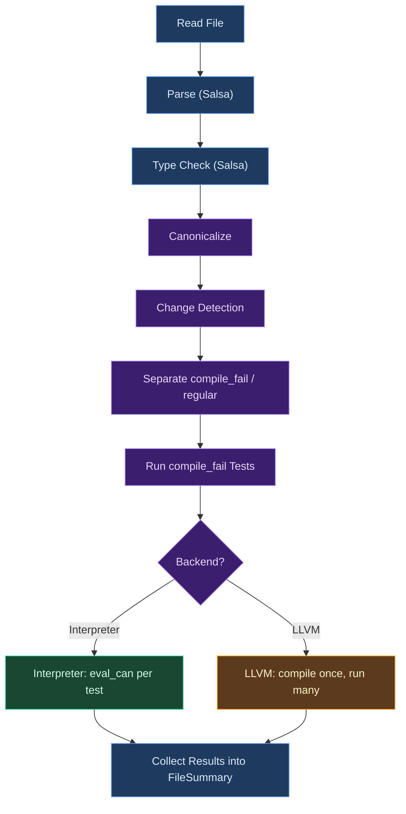
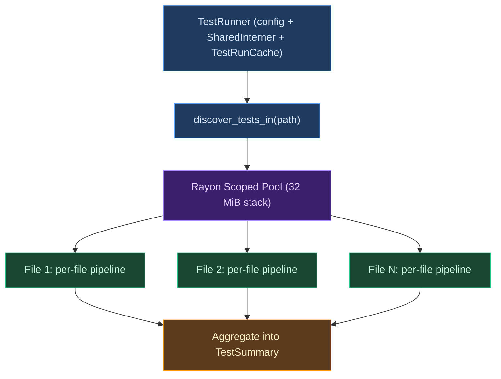

# Test Runner

A test runner is the component of a language toolchain that discovers executable test definitions,
orchestrates their execution, and reports outcomes. In compiled languages, the runner must navigate
a tension that interpreted languages avoid entirely: the code under test must be compiled before it
can run, which means the runner participates in (or at least coordinates with) the compilation
pipeline. This chapter examines test runner design through the lens of Ori's implementation, which
confronts an unusually sharp version of this tension by supporting two execution backends --- a
tree-walking interpreter and an LLVM JIT compiler --- from a single set of test definitions.

## Conceptual Foundations

Every test runner solves the same fundamental problem: given a set of test definitions, execute each
one, determine whether it passed or failed, and present those results to the developer. The
differences between runners lie in how they handle isolation, parallelism, compilation, and failure
reporting. Before examining Ori's specific design, it is worth surveying the major architectural
families.

### Classical Architectures

**In-process runners** execute tests within the same OS process as the runner itself. Rust's `libtest` harness and Zig's built-in test runner follow this pattern. The advantage is speed: no process creation overhead, and shared memory for efficient result collection. The disadvantage is isolation --- a test that corrupts memory or calls `abort()` takes down the entire runner. Rust mitigates this by catching panics; Zig compiles tests as separate compilation units within the same binary.

**Fork-per-test runners** spawn a child process for each test (Google Test in death-test mode, parts of Go's testing infrastructure). Isolation is excellent but the overhead of `fork()` or `posix_spawn()` per test is significant, particularly on Windows. The fork model also complicates result collection: the parent must communicate with children via pipes, shared memory, or exit codes.

**External harness runners** operate as a separate process that orchestrates test execution. JUnit, pytest, and Jest all follow this pattern --- the runner discovers test files, invokes the language runtime, and parses structured output (JSON or XML) to collect results. This provides maximum flexibility and extensibility but introduces serialization overhead and makes it harder to share compilation state.

**Compiler-integrated runners** embed test execution directly into the compiler pipeline. Zig's comptime tests are the purest example: test blocks are evaluated during compilation, and failures are compilation errors. Ori occupies a middle ground: the runner is part of the compiler binary (`oric`) and shares compilation infrastructure (Salsa caching, the string interner, the type pool), but test execution is a distinct phase that happens after compilation completes.

### Parallelism Strategies

**File-level parallelism** processes entire test files concurrently but runs tests within a file
sequentially. This is the safest approach when tests within a file share state (imports,
module-level bindings, evaluator instances). Ori and Go both use this strategy as their primary
parallelism mode.

**Test-level parallelism** runs individual tests concurrently regardless of which file they belong
to. Rust's `libtest` does this by default, relying on the fact that Rust tests have no shared
mutable state. This approach extracts more parallelism from suites where a few files contain many
tests, but requires stronger isolation guarantees.

**Work-stealing** parallelism, as implemented by libraries like
[rayon](https://github.com/rayon-rs/rayon), distributes work units across a thread pool where idle
threads steal tasks from busy threads' queues. This provides good load balancing when test execution
times vary widely. Ori uses rayon for its file-level parallelism, getting work-stealing load
balancing without test-level isolation concerns.

### The Dual-Backend Challenge

Most test runners execute tests against a single backend. Rust tests always run compiled native
code. Python tests always run interpreted bytecode. But some languages face the challenge of
maintaining behavioral equivalence across multiple execution engines. Ori is one of them: the
interpreter and the LLVM JIT must produce identical results for every test. This creates a
requirement that the test runner be backend-agnostic at the test definition level while
backend-specific at the execution level --- presenting a uniform interface (discovery, filtering,
reporting) regardless of which backend is active, while internally dispatching to very different
execution strategies.

## What Makes Ori's Runner Distinctive

**Dual-backend execution.** Every test can run under either the tree-walking interpreter or the LLVM
JIT compiler. The interpreter is the default for development (fast startup, no LLVM dependency)
while the LLVM backend validates that compiled code produces identical results. The `--backend=llvm`
flag switches execution engines without changing test definitions, serving as a correctness oracle:
any behavioral divergence between backends indicates a compiler bug.

**Compile-once-run-many for LLVM.** When using the LLVM backend, the runner compiles all functions
and test wrappers in a file into a single JIT module, then invokes each test wrapper from that
module. This provides O(N + M) performance where N is the number of functions and M is the number of
tests, versus the O(N * M) cost of recompiling per test.

**Shared interner architecture.** All test files share a single `SharedInterner` (an `Arc`-wrapped
`StringInterner` with sharded `RwLock` concurrency). This ensures that `Name` values --- the
interned identifiers used throughout the compiler --- are comparable across files, which is
essential for coverage reporting, incremental caching, and test-target resolution.

**Per-file CompilerDb.** Each test file gets its own [Salsa](https://salsa-rs.github.io/salsa/)
query database (`CompilerDb`), which holds the incremental computation caches for parsing, type
checking, and canonicalization. Because Salsa databases are not `Sync`, sharing one across threads
would require coarse-grained locking. Giving each file its own database enables lock-free parallel
execution while the shared interner maintains name comparability.

**Type error isolation.** When a file contains both `#compile_fail` tests (which deliberately
introduce type errors) and regular tests, the runner prevents expected errors from blocking regular
tests through span-based isolation: errors whose source spans fall within a `compile_fail` test body
are scoped to that test and do not affect other tests in the file.

**Scoped rayon pool.** The runner creates a dedicated rayon thread pool with `build_scoped` rather
than using rayon's global pool, ensuring deterministic cleanup and avoiding `atexit` handler hangs.
Each worker thread gets a 32 MiB stack to accommodate deep call chains from Salsa memo verification,
tracing instrumentation, and type inference in debug builds.

**Three-tier result reporting.** Results flow through `TestResult` (per-test) to `FileSummary`
(per-file) to `TestSummary` (global), with each tier tracking distinct failure modes (test failures,
parse errors, LLVM compilation failures).

## Runner Architecture

The following diagram shows the per-file execution pipeline. Frontend phases share the dark blue
color. Canonicalization and analysis phases use purple. Interpreter execution is green, and LLVM
execution is amber.



The parallel execution model distributes file processing across a rayon thread pool. The
`TestRunner` owns the shared interner and cache; the pool fans out to per-file pipelines; results
converge into a global summary.



## TestRunner and Configuration

The `TestRunner` struct holds the runner's configuration, the shared interner, and the incremental
test cache. It is the single entry point for all test execution, whether invoked from the CLI (`ori
test`) or programmatically from integration tests.

`TestRunnerConfig` controls execution behavior through six fields:

| Field | Type | Default | Purpose |
|-------|------|---------|---------|
| `filter` | `Option<String>` | `None` | Substring match on test names |
| `verbose` | `bool` | `false` | Enable detailed output |
| `parallel` | `bool` | `true` | Enable parallel file processing |
| `coverage` | `bool` | `false` | Generate coverage report |
| `backend` | `Backend` | `Interpreter` | Execution engine |
| `incremental` | `bool` | `false` | Skip unchanged tests |

The `Backend` enum has two variants: `Interpreter` (the tree-walking evaluator, used by default) and
`LLVM` (the JIT compiler, enabled with `--backend=llvm`). When the LLVM backend is selected, the
runner forces sequential execution regardless of the `parallel` setting. This is because LLVM's
`Context::create()` has global lock contention --- when rayon spawns many parallel tasks that each
create an LLVM context, they serialize at the LLVM library level despite appearing parallel.
Empirical testing showed sequential execution is dramatically faster (1--2 seconds versus 57 seconds
for the full test suite) and matches the patterns used by [Roc](https://github.com/roc-lang/roc) and
`rustc` for LLVM-based test execution.

The CLI maps directly to these configuration fields:

```bash
ori test                        # defaults: interpreter, parallel
ori test --backend=llvm         # LLVM JIT, forced sequential
ori test --filter="math"        # substring filter
ori test --no-parallel          # force sequential
ori test --verbose              # detailed output
ori test --coverage             # coverage report
```

## Per-File Execution Pipeline

Each test file passes through a multi-phase pipeline that mirrors the compiler's own phase
structure. The runner creates a fresh `CompilerDb` per file (with the shared interner) so that Salsa
query caches are independent across files, enabling lock-free parallel processing. The pipeline is
implemented in `run_file_with_interner()`, the core static method that both parallel and sequential
execution paths invoke.

**Phase 1: Read and Parse.** The runner reads the file from disk and creates a `SourceFile` input
for the Salsa query system. The `parsed()` query tokenizes and parses the file, producing a
`ParseOutput` containing the AST (`Module`) and any parse errors. If parse errors exist, the runner
records them in the `FileSummary` and skips the file --- there is no point in type checking a
malformed AST.

**Phase 2: Type Check.** The `typed()` Salsa query runs Hindley-Milner type inference over the
parsed module, producing a `TypeCheckResult` with typed function signatures, expression types, and
any type errors. The `typed_pool()` query retrieves the type pool (the arena of interned types) for
downstream use. Both queries are memoized by Salsa. The source text is borrowed from the Salsa
database without cloning, since all subsequent database access is through shared borrows.

**Phase 3: Canonicalize.** The `canonicalize_cached()` function transforms the typed AST into
canonical form --- a normalized, pattern-compiled representation suitable for both interpretation
and code generation. Canonicalization runs even when type errors exist, because pattern problems
(non-exhaustive matches, redundant arms) are independent of type correctness. The result is stored
in a `SharedCanonResult` (`Arc`-wrapped) so both backends can access it without copying.

**Phase 4: Change Detection.** When incremental mode is enabled, the runner computes body hashes for
all functions and tests using `FunctionChangeMap::from_canon()`, which hashes each canonical subtree
via `hash_canonical_subtree()`. It compares these hashes against the previous run's snapshot (stored
in the `TestRunCache`) to determine which functions changed. A function is considered "changed" if
it is new, deleted, or its body hash differs from the previous snapshot. The `TestTargetIndex`
builds a bidirectional map between functions and the tests that target them, then computes the set
of skippable tests: those whose targets are all unchanged and whose own bodies are also unchanged.
Floating tests (those with no targets) are never skipped, since there is no dependency information
to prove they are unaffected by changes elsewhere in the module.

**Phase 5: Separate.** The runner partitions tests into `compile_fail` tests and regular tests. This
separation is essential because the two groups follow entirely different execution paths ---
compile-fail tests are validated against type checker output without runtime execution, while
regular tests require a functioning evaluator or JIT compiler.

**Phase 6: Run compile-fail tests.** Each compile-fail test is matched against the type errors and
pattern problems produced during type checking. This phase runs before regular test execution
because it requires no evaluator setup.

**Phase 7: Type error isolation.** Before running regular tests, the runner checks for type errors
outside compile-fail test spans. If any exist, all regular tests in the file are blocked. For the
interpreter backend, these become `Failed` results; for the LLVM backend, they become
`LlvmCompileFail` results (tracked separately, not counted as real failures).

**Phase 8: Effect-driven prioritization.** When incremental mode is enabled, regular tests are
sorted by effect class: tests targeting effectful functions (those with capabilities like `Http` or
`FileSystem`) run first, followed by read-only tests, then pure tests. Effectful tests exercise I/O
paths and are more likely to detect real regressions; pure tests are deterministic and more likely
to be skippable.

**Phase 9: Run regular tests.** The runner dispatches to the chosen backend to execute each regular
test. Filtering, incremental skipping, and `#fail` wrapper application happen at this level.

**Phase 10: Collect.** All results are aggregated into a `FileSummary` and returned for global
aggregation.

## Compile-Fail Test Execution

Compile-fail tests verify that the compiler correctly rejects invalid programs. Unlike regular
tests, they never execute code --- they validate that type checking (or pattern checking) produces
the expected errors. This makes them a form of negative testing: the test passes when compilation
fails in the right way.

### Span Isolation

A single file can contain both compile-fail and regular tests. Without isolation, the deliberate
type errors in compile-fail test bodies would block all regular tests. The runner prevents this by
collecting the source spans of all compile-fail test bodies and filtering type errors by location.
For each compile-fail test, the runner first attempts to match errors whose spans fall within that
test's body. This provides isolation when multiple compile-fail tests exist in the same file. If no
errors fall within the test's span (which happens for tests checking module-level errors like
missing impl members), the runner falls back to matching against all module errors. The same
span-filtering applies to pattern problems.

Errors outside all compile-fail test spans are considered real type problems. If any exist, all
regular tests in the file are blocked. This two-layer filtering allows a file to mix negative and
positive tests without interference.

### Error Matching Algorithm

The error matching algorithm uses greedy one-to-one matching, implemented in `match_all_errors()`.
For each expected error specification, it searches through unmatched actual errors for the first one
satisfying all specified criteria. Once an actual error matches an expectation, neither can
participate in further matching. The algorithm tries type errors first, then pattern problems. This
ordering reflects practical priority: type errors are more common and more specific, so matching
them first reduces false positives.

Each `ExpectedError` can specify up to four matching criteria:

| Criterion | Match Type | Example |
|-----------|------------|---------|
| `message` | Substring containment | `"type mismatch"` |
| `code` | Exact string equality | `"E2001"` |
| `line` | Exact line number (1-based) | `5` |
| `column` | Exact column number (1-based) | `10` |

All specified criteria must match simultaneously. Unspecified criteria act as wildcards. Multiple
`#compile_fail` attributes on a single test create multiple expectations, all of which must be
satisfied. Line and column numbers are computed from byte offsets using `offset_to_line_col()`.

### Pattern Problem Matching

Pattern problems from the exhaustiveness checker are matched with the same multi-criteria logic.
`NonExhaustive` problems (E3002) carry a `match_span` and a list of missing patterns; their
formatted message reads `"non-exhaustive match: missing patterns: X, Y"`. `RedundantArm` problems
(E3003) carry an `arm_span` and the index of the unreachable arm; their formatted message reads
`"redundant pattern: arm N is unreachable"`. The span provides source location for line/column
matching; the formatted message provides text for substring matching.

## Regular Test Execution

### Interpreter Backend

The interpreter backend creates an `Evaluator` in `TestRun` mode, which configures a 500-depth
recursion limit and enables test result collection. The evaluator receives the shared canonical
result and registers the prelude (built-in functions like `print`, `assert_eq`, and `panic`).
`TestRun` mode differs from the default `Run` mode in stricter recursion limits and captured (rather
than printed) evaluation errors.

The `load_module()` call loads the parsed module's functions, types, and imports into the
evaluator's environment. Loading is done once per file; all tests share the loaded module state. For
each regular test, the runner looks up the test's canonical root expression via `canon_root_for()`
and evaluates it with `eval_can()`. A successful evaluation produces a `Passed` result. An
evaluation error (assertion failure, panic, division by zero, index out of bounds) produces a
`Failed` result with the error message. Each test is independently timed for per-test duration
reporting.

The interpreter backend supports parallel execution via rayon because each file gets its own
evaluator instance with entirely thread-local state --- the environment, call stack, and value heap
are never shared across files.

### LLVM Backend

The LLVM backend follows a substantially more complex path because it must drive the full
compilation pipeline --- import resolution, cross-module type checking, type pool merging, ARC
lowering, borrow inference, and LLVM code generation --- before any test can execute.

**Import resolution.** The runner resolves imports using the same unified pipeline as the type
checker and interpreter (`resolve_imports()`), producing imported modules with parsed ASTs, source
files, and module paths. Prelude functions are not compiled into the JIT module because most prelude
content is traits (no code to compile), generic utility functions are skipped by codegen, and some
non-generic prelude functions use types the codegen does not yet support (such as sum types for
`Ordering`). Test utilities like `assert_eq` come from `std.testing` via explicit import.

**Cross-module type checking.** Each imported module is type-checked via Salsa queries (when a
`SourceFile` is available) or via direct type checking (for modules resolved without a Salsa-tracked
source). The results are cached by Salsa's dependency graph, so importing `std.testing` from
multiple test files does not trigger redundant work.

**Merkle Pool Identity.** Each imported module has its own type pool with its own `Idx` namespace.
To enable safe cross-module type references, the runner clones the main file's pool and re-interns
all imported types into it, building a merged pool where every `Idx` value is valid. This eliminates
cross-pool index misuse --- a class of bugs where an `Idx` from one pool is accidentally used to
look up a type in another pool, returning a completely unrelated type. The re-interning walks each
imported `CanonResult` arena and remaps every `TypeId` via `remap_types()`. Per-module re-interning
caches (mapping source `Idx` to target `Idx`) keep the overall cost at O(n) in pool size per module.

**ARC lowering and borrow inference.** The `lower_and_infer_borrows()` function lowers all functions
to ARC IR in four sequential passes: local module functions, imported functions, impl methods, and
monomorphized generic functions. Each function is lowered via `lower_to_arc()`, producing an
`ArcFunction` (the basic-block IR representation) and its associated lambda closures. Borrow
inference runs via `infer_borrows_scc()` on the flattened list of ARC functions to determine which
parameters should be `Owned` (caller transfers ownership) versus `Borrowed` (caller retains
ownership, callee must not decrement). Imported functions are inferred separately because they may
not appear in the local call graph; their annotated signatures are merged with local results to
produce a complete set of borrow annotations for LLVM codegen. If ARC lowering produces problems
(unsupported patterns, internal errors), they are emitted as diagnostics and an empty result is
returned, causing all tests to receive `LlvmCompileFail` outcomes.

**Compilation.** The entire module --- all functions plus test wrappers --- is compiled into a
single LLVM JIT engine via `compile_module_with_tests()`. This is the "compile once, run many"
pattern: one LLVM compilation pass produces native code for all functions, then each test is invoked
by calling its wrapper function in the JIT engine. The compilation is wrapped in `catch_unwind` to
gracefully handle panics in any phase (ARC classification, LLVM IR generation, IR verification,
machine code emission) without aborting the entire test runner. An `OwnedLLVMEvaluator` is created
with the merged pool so that compound type resolution (needed for sret calling conventions on large
struct returns) uses correct type information.

**Execution.** Each test is invoked from the compiled module via `run_test(test.name)`, which looks
up the test wrapper function in the JIT engine and calls it. Skip checks and `#fail` wrapper
application are identical to the interpreter path. If LLVM compilation fails (either through an
error return or a caught panic), all tests in the file receive the `LlvmCompileFail` outcome rather
than `Failed`. The panic message is extracted from the `Any` payload (as `String` or `&str`, with a
fallback to a generic message). This distinction matters for reporting: LLVM compilation failures
indicate a compiler limitation, not a test logic error, and are tracked separately in the summary
without counting as real test failures.

## The #fail Wrapper

The `#fail` attribute inverts pass/fail semantics. A test annotated with `#fail("expected message")`
is expected to fail at runtime with an error containing the specified substring --- Ori's equivalent
of Rust's `#[should_panic(expected = "...")]`.

| Inner Result | Wrapper Result | Rationale |
|-------------|----------------|-----------|
| `Failed("...expected message...")` | `Passed` | Expected failure occurred |
| `Failed("different error")` | `Failed("expected 'X', got 'Y'")` | Wrong failure |
| `Passed` | `Failed("expected failure, but passed")` | Missing failure |
| `Skipped(reason)` | `Skipped(reason)` | Pass-through |
| `SkippedUnchanged` | `SkippedUnchanged` | Pass-through |
| `LlvmCompileFail(msg)` | `LlvmCompileFail(msg)` | Pass-through |

The wrapper is applied after test execution for both backends. Skip outcomes and LLVM compilation
failures pass through unchanged because the test did not actually run. The matching uses
`contains()` on the error message, not exact equality --- error messages may include context (file
paths, line numbers) that makes exact matching brittle.

## Parallel Execution Design

The runner creates a scoped rayon thread pool with 32 MiB stack per worker thread and work-stealing
scheduling.

**Stack size.** The 32 MiB figure was chosen empirically. In debug builds on Windows and macOS,
unoptimized frames are substantially larger than in release builds. Salsa memo verification, tracing
instrumentation, and type inference can exhaust smaller stacks. For comparison, `rustc` uses 16 MiB
for release builds; debug CI needs more. Doubling to 32 MiB provides headroom for the worst-case
combination of debug mode, complex types, and deep import chains.

**Scoped pool semantics.** The pool uses `build_scoped` to ensure all worker threads are joined
before the function returns. Without this, rayon's global pool registers an `atexit` handler that
can hang in long-running processes (particularly the LSP server). The `build_scoped` API guarantees
deterministic cleanup within a single function call.

**Interner concurrency.** The `SharedInterner` uses per-shard `RwLock` concurrency. Name interning
is heavily read-biased (most names are interned during parsing, before parallel execution begins),
so contention is low in practice. The shard count exceeds the typical thread count, keeping most
lock acquisitions uncontended.

**Database isolation.** Each file's `CompilerDb` is entirely local to the worker thread. No
cross-file sharing of Salsa query caches eliminates the primary source of lock contention. The cost
is that two files importing the same module type-check it independently, but per-query memoization
within each database prevents redundant work within a file.

**LLVM sequential constraint.** When the LLVM backend is selected, parallelism is disabled entirely.
LLVM's `Context::create()` acquires a global lock; parallel execution serializes at this lock with
worse performance than sequential execution due to scheduling overhead. Sequential execution also
simplifies `catch_unwind` recovery from LLVM panics.

**Fallback.** If thread pool creation fails, the runner falls back to sequential execution with a
`tracing::warn!` diagnostic rather than aborting.

## Result Aggregation

Test results flow through a three-tier hierarchy mirroring the file-level parallelism model.

**TestResult** represents a single test's outcome. It carries the test's interned name (`Name`), the
list of target functions (also interned), the outcome variant, and the wall-clock duration. The five
outcome variants are:

- `Passed` --- the test completed without error.
- `Failed(String)` --- the test failed with the given error message.
- `Skipped(String)` --- the test was skipped with a human-supplied reason from `#skip`.
- `SkippedUnchanged` --- the test was skipped by incremental change detection (no human reason).
- `LlvmCompileFail(String)` --- the LLVM backend could not compile the file containing this test.

The distinction between `Skipped` and `SkippedUnchanged` affects output formatting: the former
prints a reason string, the latter is typically suppressed in non-verbose mode.

**FileSummary** aggregates all test results for a single file. It tracks per-outcome counts (passed,
failed, skipped, skipped-unchanged, LLVM-compile-fail), the total duration, any file-level errors
(parse failures, type errors that blocked all tests), and a boolean flag indicating whether the
file-level errors are from LLVM compilation failure. The `has_failures()` method returns true only
for real failures --- `failed > 0` or file-level errors that are not LLVM compilation issues. This
allows the summary to distinguish "the test logic is wrong" from "the LLVM backend cannot compile
this yet."

**TestSummary** aggregates all file summaries into a global report. It sums per-outcome counts
across files, counts files with errors (separately tracking LLVM compilation failure files versus
real error files), and records total wall-clock duration. The `has_failures()` method checks for
real test failures or real file errors.

Exit codes follow a three-value convention:

| Code | Meaning |
|------|---------|
| 0 | All tests passed (or all were skipped) |
| 1 | At least one test failed or at least one file had real errors |
| 2 | No tests were found at all |

Code 2 distinguishes "no tests found" from "all tests passed," which matters for CI pipelines that
want to fail on empty test discovery.

## Coverage Reporting

When `--coverage` is enabled, the runner generates a report showing which functions are tested and
which are not. Coverage is measured by test targeting: a function is "covered" if at least one test
declares it as a target via `tests @function_name`. This is a static analysis --- it requires only
parsing, not test execution.

The `CoverageReport` struct tracks per-function coverage with `FunctionCoverage` entries that record
the function name and the names of all tests targeting it. The report excludes `@main` functions
(which are entry points, not testable units). Coverage percentage is computed as `covered / total *
100`, where `total` is the number of non-main functions and `covered` is the number with at least
one targeting test. The `is_complete()` method checks whether all functions have at least one test.
The `untested()` iterator yields the names of uncovered functions, providing an actionable
checklist.

This is a coarser measure than line coverage or branch coverage, but it aligns with Ori's testing
philosophy: every function (except `@main`) should have at least one test (enforced when
`test-enforcement` is set to `warn` or `error`). Finer-grained
coverage (line-level, branch-level) would require instrumentation at the evaluator or LLVM codegen
level --- a potential future enhancement. The function-level approach has the advantage of being
entirely static: it requires only parsing, not test execution, making it fast even for large
codebases.

## Test Filtering

Test filtering uses case-sensitive substring matching on test names. When a filter is set via
`--filter="math"`, only tests whose names contain `"math"` are executed. Non-matching tests are
silently skipped without appearing in output. Filtering is applied at two points: before
compile-fail tests and before regular tests. For the LLVM backend, filtering happens before
compilation so the JIT module only includes matching test wrappers, reducing compilation time.

## Prior Art

**Rust's [cargo test](https://doc.rust-lang.org/cargo/commands/cargo-test.html) and libtest** provide the closest analogy. Like Ori, Rust runs tests in-process with parallel execution by default. Rust's `#[should_panic]` inspired Ori's `#fail`, though Ori matches error message substrings rather than panic messages. Rust's compile-fail testing is handled through the [`trybuild`](https://github.com/dtolnay/trybuild) crate or `rustc`'s UI test suite, both of which compile each test as a separate process --- heavier than Ori's span-based isolation but providing stronger process-level guarantees. The key structural difference is that Rust has only one execution backend, while Ori must maintain behavioral equivalence across two.

**[Go's testing package](https://pkg.go.dev/testing)** organizes tests per-package with `go test`. Go's `-run` flag provides regex-based filtering (more powerful than Ori's substring matching), and its `-parallel` flag controls per-package concurrency at a finer granularity than Ori's file-level parallelism. Go's subtests allow hierarchical organization within a single test function; Ori achieves similar structure through multi-target tests (`tests @a tests @b`) and dedicated test files.

**[Zig's test runner](https://ziglang.org/documentation/master/)** is the most compiler-integrated of the comparisons. Zig's `test` blocks are compiled and executed as part of the build process, with comptime tests evaluated during compilation itself. Zig's `@compileError` is similar in spirit to Ori's `#compile_fail`, though Zig operates at the expression level rather than the test level. Zig does not support dual-backend execution but does support cross-compilation.

**[pytest](https://docs.pytest.org/)** exemplifies the external harness pattern. Its fixture system provides dependency injection, `@pytest.mark.parametrize` enables parametric testing, and its `-k` flag provides expression-based filtering more sophisticated than Ori's substring matching (e.g., `-k "test_add and not slow"`). Ori's tighter compiler integration limits extensibility but enables deeper optimizations (shared interner, Salsa caching, cross-file incremental detection) that would be difficult in an external harness.

**[Jest](https://jestjs.io/)** introduced watch mode and snapshot testing to the JavaScript ecosystem. Jest's worker pool distributes test files across child processes, similar to Ori's rayon pool but with process-level isolation. Ori's incremental test execution (via `TestRunCache` and `FunctionChangeMap`) provides a more precise version of Jest's change detection: where Jest tracks file-level modification timestamps, Ori tracks function-body hashes, enabling individual test skipping when only some functions in a file change.

**[elm-test](https://github.com/rtfeldman/elm-test)** is closest to Ori in philosophy: both languages emphasize pure functions, and both testing frameworks focus on testing pure transformations without side effects. Elm-test's fuzz testing provides property-based testing that Ori does not yet offer. Elm's runner is an external Node.js-based harness, while Ori's is embedded in the compiler --- but both share the principle that the test framework should reflect the language's core values.

## Design Tradeoffs

**Interpreter-first vs LLVM-first default.** The interpreter is the default because it has zero
startup cost (no LLVM context creation, no ARC lowering, no machine code emission) and supports the
full language including features the LLVM backend does not yet handle. The LLVM backend requires the
`llvm` feature flag at compile time and takes longer to start due to the multi-phase compilation
pipeline (import resolution, type pool merging, ARC lowering, borrow inference, LLVM IR generation,
machine code emission). While interpreter execution is slower per test than JIT-compiled code, for
most test suites the LLVM compilation overhead dominates, making the interpreter faster end-to-end.
The LLVM backend exists primarily to verify codegen correctness, not for performance.

**File-level parallelism vs test-level parallelism.** Ori parallelizes at the file level because
each file gets its own non-thread-safe `CompilerDb`. Test-level parallelism would require either a
shared database with locking or pre-computing all type information sequentially. File-level
parallelism is simpler and works well for Ori projects where each source file has a corresponding
test file.

**Shared interner (correctness) vs per-file interner (performance).** A shared interner adds
contention but guarantees cross-file `Name` comparability, needed for coverage reporting,
test-target resolution, and the incremental cache. Per-file interners would eliminate contention but
break these features. Since interning is heavily read-biased after parsing, contention is low --- a
clear correctness-over-performance choice.

**Span-based error isolation vs separate compilation units.** Ori isolates compile-fail errors by
span containment checks. The alternative (separate compilation units, as Rust does) provides
stronger isolation but requires re-parsing and re-type-checking each test independently. Span-based
isolation is O(1) per error and leverages the existing single-pass type checking result.

**Greedy error matching vs optimal matching.** The greedy algorithm matches expectations to errors
in order, taking the first satisfying match. An optimal approach (the [Hungarian
algorithm](https://en.wikipedia.org/wiki/Hungarian_algorithm)) would minimize unmatched
expectations. In practice, compile-fail tests are specific enough that greedy matching produces
correct results, and O(n * m) greedy is simpler and faster than O(n^3) Hungarian.

**32 MiB stack (safe) vs smaller stack (memory efficient).** Each worker thread consumes 32 MiB of
virtual address space (256 MiB for 8 threads, though physical memory is demand-paged). A smaller
stack risks overflows in debug builds with complex type expressions. The 32 MiB choice prioritizes
reliability, following `rustc`'s precedent for compiler worker threads.

## Related Documents

- [Testing System Overview](index.md) --- test types, attributes, output format, and overall architecture
- [Test Discovery](test-discovery.md) --- filesystem scanning, file conventions, and discovery filtering
