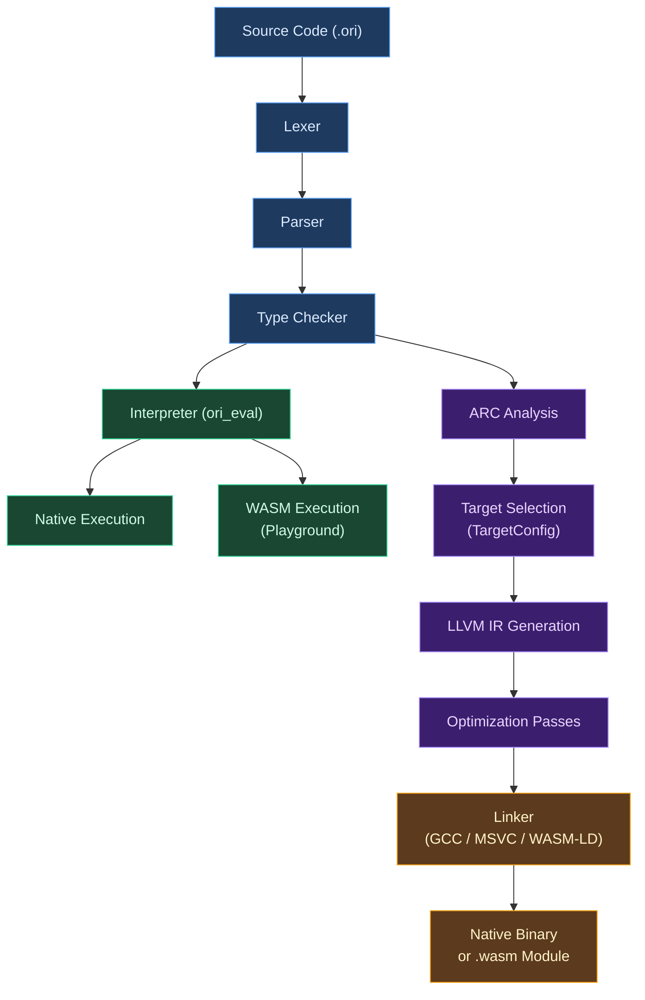

# Platform Targets

## Conceptual Foundations

A programming language's relationship with the hardware it runs on is one of the oldest tensions in language design. A language that ignores the platform gets portability at the cost of performance; a language that embraces it gets speed at the cost of being tethered to a single architecture. The engineering challenge is not choosing one extreme over the other but finding the seam where abstraction and specificity meet.

### What It Means to Target Multiple Platforms

When a compiler claims "multi-platform support," there are two independent dimensions to that claim, and conflating them leads to confused expectations.

**Compiler portability** asks: *on which platforms can the compiler itself run?* A compiler written in C can be compiled for Linux, macOS, and Windows. A compiler written in Rust can be compiled for those plus WebAssembly. This dimension concerns the toolchain developer more than the application developer -- it determines where you can install the compiler, not what the compiler produces.

**Output portability** asks: *on which platforms can the compiled programs run?* This is the dimension application developers care about. A compiler running on Linux that produces x86-64 machine code can only generate programs for x86-64 machines. A compiler running on Linux that produces WebAssembly can generate programs for any WASM runtime, regardless of the runtime's host architecture. A *cross-compiler* running on Linux can produce machine code for ARM, Windows, or any other target it has been taught to understand.

### Classical Approaches

Language implementations have explored several strategies for spanning these two dimensions.

**Single-target compilers** emit code for exactly one architecture. Early C compilers worked this way: the compiler ran on and produced code for the same machine. Porting required rewriting the backend. This approach is simple but scales poorly.

**Fat binaries** embed code for multiple architectures in a single executable. Apple's [Universal Binary](https://developer.apple.com/documentation/apple-silicon/building-a-universal-macos-binary) format packages both x86-64 and ARM64 code, with the OS loading the appropriate slice at runtime. This provides transparent multi-architecture support but increases binary size proportionally with the number of targets.

**Cross-compilation** separates the host (where the compiler runs) from the target (where the output runs). The compiler carries enough knowledge about the target -- its instruction set, calling conventions, system call interface, standard library paths -- to generate code for it without running on it. [GCC](https://gcc.gnu.org/) and [Clang](https://clang.llvm.org/) have mature cross-compilation infrastructure. [Zig](https://ziglang.org/) made cross-compilation a first-class design goal, shipping a compiler that can target any supported platform from any other supported platform with no additional toolchain installation.

**Conditional compilation** lets source code adapt to the target platform at compile time. [Rust](https://doc.rust-lang.org/reference/conditional-compilation.html) uses `#[cfg(target_os = "linux")]` attributes. [Go](https://pkg.go.dev/cmd/go#hdr-Build_constraints) uses build tags and file-name conventions (`file_linux.go`). [Swift](https://docs.swift.org/swift-book/documentation/the-swift-programming-language/statements/#Conditional-Compilation-Block) uses `#if os(macOS)` blocks. The mechanism varies, but the purpose is the same: write platform-specific code within a portable codebase.

**Platform abstraction layers** hide platform differences behind a common interface. Go's `os` package provides a uniform file system API across Linux, macOS, and Windows. Rust's `std::fs` does the same. The abstraction is in the standard library rather than the compiler, but the effect on application code is identical: write once, the library handles the platform-specific details.

Each strategy has costs. Cross-compilation requires sysroots. Conditional compilation fragments the codebase. Abstraction layers impose indirection. Practical compilers combine several strategies, and the interesting question is which combination best serves the language's goals.


## What Makes Ori's Platform Support Distinctive

Ori's platform model combines two modes that are usually found in different language ecosystems: **interpreter portability** for development and embedding, and **LLVM-based cross-compilation** for production deployment. Neither mode alone is unusual -- Python runs its interpreter on many platforms, and Rust cross-compiles via LLVM -- but supporting both from the same codebase, with the interpreter itself targeting WebAssembly, creates a design space worth examining.

### Two Execution Paths, One Compiler

The Ori toolchain provides two ways to execute a program.

The **interpreter** (`ori_eval`) evaluates Ori's canonical IR directly. Because `ori_eval` is written in Rust and avoids platform-specific dependencies (no Salsa, no LLVM, no OS-level threading), it compiles cleanly to WebAssembly via Rust's standard `wasm32-unknown-unknown` target. This is what powers the browser-based Ori Playground: the entire front end (lexer, parser, type checker) and the evaluator run as a WASM module loaded by a web page. The same evaluator also runs natively for `ori run`, with the `ori_stack` crate handling the divergence in stack management.

The **LLVM backend** (`ori_llvm`) compiles Ori programs to native machine code or WebAssembly binaries. It supports 10 officially maintained targets spanning three operating system families and two architectures. Unlike the interpreter path, this mode requires LLVM libraries on the host machine and, for cross-compilation, a sysroot for the target platform.

The two paths share the entire front end: lexing, parsing, type checking, and ARC analysis are identical regardless of whether the program will be interpreted or compiled. They diverge only at the execution boundary. This means a bug in the type checker affects both modes equally, and a type-checked program is guaranteed to be accepted by either execution path.

### TargetConfig and the Builder Pattern

The `TargetConfig` struct encapsulates everything the LLVM backend needs to know about a compilation target: the target triple, parsed into its components for convenient querying; the CPU and feature strings; optimization level, relocation model, and code model. It exposes a builder-pattern API for composing configurations fluently:

```rust
let config = TargetConfig::from_triple("x86_64-unknown-linux-gnu")?
    .with_cpu("skylake")
    .with_features("+avx2,+fma")
    .with_opt_level(OptimizationLevel::Default);
```

`TargetConfig::native()` auto-detects the host machine. `TargetConfig::from_triple()` validates against the supported target list and initializes the appropriate LLVM target backend. The struct also provides platform queries (`is_wasm()`, `is_linux()`, `is_windows()`, `is_macos()`) and derived properties (`pointer_size()`, `pointer_align()`, `is_little_endian()`) that downstream code uses without re-parsing the triple.

### TargetTripleComponents

Target triples follow the `<arch>-<vendor>-<os>[-<env>]` format established by GCC and adopted by LLVM and Rust. The `TargetTripleComponents` struct parses a triple into its constituent parts and exposes a `family()` method that classifies any target into one of three families:

| Family | Targets |
|--------|---------|
| `unix` | All Linux variants, macOS |
| `windows` | All Windows variants |
| `wasm` | Standalone WASM, WASI |

This three-way family classification is deliberately coarser than the full triple. Most platform-conditional logic in the compiler and standard library branches on family, not on individual OS or ABI variants. Linker selection, for instance, dispatches on family: Unix targets use `GccLinker`, Windows MSVC uses `MsvcLinker`, WASM uses `WasmLinker`.

### One-Time LLVM Initialization

LLVM target backends must be initialized before use, and initialization is not idempotent in the general case -- calling it twice is harmless, but the initialization itself involves global state. Ori uses `std::sync::Once` guards to ensure each target backend is initialized exactly once, regardless of how many compilation units request it:

```rust
static X86_TARGET_INIT: Once = Once::new();
static AARCH64_TARGET_INIT: Once = Once::new();
static WASM_TARGET_INIT: Once = Once::new();
```

The `initialize_target_for_triple()` function dispatches on the architecture component of the triple and calls the appropriate `Target::initialize_*` method inside the corresponding `Once` guard. This is safe for concurrent use and imposes zero cost after the first call.

### The `ori_stack` Crate

Deep recursion is the platform-sensitivity fault line in the interpreter. Native operating systems can grow stacks dynamically (Linux's default 8MB stack can be extended, and the `stacker` crate allocates additional segments on demand). WebAssembly runtimes cannot: the stack is fixed at module instantiation, typically around 1MB in browsers.

The `ori_stack` crate abstracts this difference behind a single function:

```rust
// Native: dynamically grow if within 100KB of the limit
#[cfg(not(target_arch = "wasm32"))]
pub fn ensure_sufficient_stack<R>(f: impl FnOnce() -> R) -> R {
    stacker::maybe_grow(RED_ZONE, STACK_PER_RECURSION, f)
}

// WASM: pass through (stack management is the runtime's responsibility)
#[cfg(target_arch = "wasm32")]
pub fn ensure_sufficient_stack<R>(f: impl FnOnce() -> R) -> R {
    f()
}
```

Every recursive call site in the parser, type checker, and evaluator wraps its recursion in `ensure_sufficient_stack`. On native targets, this enables recursion depths exceeding 100,000. On WASM, where the function is a no-op, a separate depth-tracking mechanism in the interpreter (`CallStack` with configurable `max_depth`) catches runaway recursion before the WASM stack is exhausted, producing a clear error message instead of a cryptic "memory access out of bounds."


## Supported Targets

The LLVM backend officially supports 10 compilation targets, covering the three major desktop/server operating system families plus WebAssembly.

| Target Triple | Architecture | OS | C Library / ABI | Family |
|---------------|--------------|----|------------------|--------|
| `x86_64-unknown-linux-gnu` | x86-64 | Linux | glibc | unix |
| `x86_64-unknown-linux-musl` | x86-64 | Linux | musl (static) | unix |
| `aarch64-unknown-linux-gnu` | ARM64 | Linux | glibc | unix |
| `aarch64-unknown-linux-musl` | ARM64 | Linux | musl (static) | unix |
| `x86_64-apple-darwin` | x86-64 | macOS | libSystem | unix |
| `aarch64-apple-darwin` | ARM64 | macOS | libSystem | unix |
| `x86_64-pc-windows-msvc` | x86-64 | Windows | MSVC CRT | windows |
| `x86_64-pc-windows-gnu` | x86-64 | Windows | MinGW | windows |
| `wasm32-unknown-unknown` | WASM32 | None | Freestanding | wasm |
| `wasm32-wasi` | WASM32 | WASI | wasi-libc | wasm |

**Linux** has four variants to cover both major architectures (x86-64 and ARM64) and both major C library choices (glibc for compatibility, musl for fully-static binaries). The musl targets are particularly useful for container deployments where a single static binary with no runtime dependencies simplifies distribution.

**macOS** supports both Intel and Apple Silicon. The two targets produce separate binaries; creating a Universal Binary requires compiling for both and merging with `lipo`, which is outside the compiler's scope.

**Windows** supports two ABIs. The MSVC target uses Microsoft's Visual C++ runtime and link against Windows system libraries. The GNU target uses MinGW's implementation, which is particularly relevant for cross-compilation from Linux.

**WebAssembly** has two modes. The standalone target (`wasm32-unknown-unknown`) produces a WASM module with no host API access -- suitable for embedding in browsers with JavaScript providing all I/O. The WASI target provides a standardized system interface for file I/O, stdio, clocks, and environment variables, enabling command-line programs to run in WASM runtimes like [Wasmtime](https://wasmtime.dev/) or [Wasmer](https://wasmer.io/).

### Sysroot Management

Cross-compilation requires access to the target platform's system libraries and headers (the "sysroot"). Ori provides CLI commands for managing sysroots:

```
ori target list              # Show installed targets
ori target add <triple>      # Install a target's sysroot
ori target remove <triple>   # Remove a target's sysroot
```

For WASM targets, the sysroot is minimal (WASI targets look for [wasi-sdk](https://github.com/WebAssembly/wasi-sdk), standalone targets need only a marker directory). For native cross-compilation targets, `ori target add` searches for existing system toolchains (e.g., `gcc-aarch64-linux-gnu` on Debian) and creates symlinks to their sysroots.


## Architecture

The following diagram shows how source code flows through the Ori compiler and forks into the two execution paths. The shared front end produces a single typed representation that both the interpreter and the LLVM backend consume.



### Target-Dependent Dispatch Points

Although the front end is target-independent, several points in the backend branch on target properties.

**Linker selection** is the most visible dispatch point. The compiler selects a linker driver based on the target family: `GccLinker` for Unix targets, `MsvcLinker` for Windows MSVC targets, and `WasmLinker` for WebAssembly targets. Each linker driver knows how to invoke the appropriate system linker (`cc`/`ld` on Unix, `link.exe` on Windows, `wasm-ld` for WASM), pass the correct flags, and locate the runtime library (`libori_rt.a`). The WASM linker additionally supports JavaScript binding generation and post-compilation optimization via [wasm-opt](https://github.com/WebAssembly/binaryen).

**Relocation model** defaults to PIC (position-independent code) on Linux targets, supporting the modern PIE (position-independent executable) linking standard. Other targets use LLVM's default relocation model. This is a single branch in `TargetConfig` construction, not a pervasive concern.

**Pointer size** affects code generation for collections and reference counting. WASM32 targets use 4-byte pointers; all other supported targets use 8-byte pointers. The `pointer_size()` method on `TargetConfig` provides this value to the codegen layer.

### WASM-Compatible Crate Boundary

The crate dependency graph is designed so that the interpreter and all crates it depends on can compile to WASM:

| WASM-Compatible | Not WASM-Compatible |
|-----------------|---------------------|
| `ori_eval`, `ori_patterns`, `ori_ir`, `ori_stack` | `oric` (Salsa requires `Arc<Mutex<T>>`) |
| `ori_types`, `ori_parse`, `ori_lexer` | `ori_llvm` (LLVM C++ bindings) |
| `ori_fmt`, `ori_diagnostic` | |

The key architectural invariant is that the front end is entirely target-independent. No information about the compilation target flows backward from the LLVM backend into the parser or type checker. Target-specific behavior in the language itself (the `#target()` and `#cfg()` attributes described below) is resolved by consulting the target configuration at compile time, not by changing how the front end operates.


## Build Configuration

The `ori build` command accepts a set of flags that control target selection, optimization, and output format. These flags map to fields on the internal `BuildOptions` struct.

### Target Selection

| Flag | Effect |
|------|--------|
| `--target=<triple>` | Cross-compile for the specified target |
| `--wasm` | Shorthand for `--target=wasm32-unknown-unknown` |
| `--cpu=<name>` | Optimize for a specific CPU (e.g., `skylake`, `apple-m1`, `native`) |
| `--features=<list>` | Enable/disable CPU features (e.g., `+avx2,+fma,-sse4.1`) |

When no `--target` is specified, the compiler auto-detects the native host via `TargetConfig::native()` and compiles for it.

### Optimization

| Flag | Effect |
|------|--------|
| `--release` | Implies `--opt=2 --debug=0` |
| `--opt=<level>` | `0` (none), `1` (basic), `2` (standard), `3` (aggressive), `s` (size), `z` (min size) |
| `--debug=<level>` | `0` (no debug info), `1` (line tables), `2` (full DWARF/CodeView) |
| `--lto=<mode>` | `off`, `thin` (parallel LTO), `full` (maximum optimization) |

The optimization level maps directly to LLVM's `OptimizationLevel` enum. Full LTO enables whole-program optimization across all compilation units at the cost of significantly longer link times.

### Output Control

| Flag | Effect |
|------|--------|
| `-o=<path>` / `--output=<path>` | Output file path |
| `--out-dir=<dir>` | Output directory |
| `--emit=<type>` | `obj` (object file), `llvm-ir` (text IR), `llvm-bc` (bitcode), `asm` (assembly) |
| `--lib` | Build as static library |
| `--dylib` | Build as shared library |
| `--link=<mode>` | `static` (embed runtime) or `dynamic` (link `libori_rt.so`) |
| `--linker=<name>` | Override linker selection |
| `--js-bindings` | Generate JavaScript bindings for WASM output |
| `--wasm-opt` | Run [Binaryen](https://github.com/WebAssembly/binaryen) wasm-opt post-processing |


## Compile-Time Constants

Ori exposes the compilation target to source code through a set of built-in compile-time constants and conditional-compilation attributes. This is the language-level counterpart to the compiler's internal `TargetConfig`.

### Target Constants

| Constant | Type | Example Values |
|----------|------|----------------|
| `$target_os` | `str` | `"linux"`, `"macos"`, `"windows"` |
| `$target_arch` | `str` | `"x86_64"`, `"aarch64"`, `"wasm32"` |
| `$target_family` | `str` | `"unix"`, `"windows"`, `"wasm"` |
| `$debug` | `bool` | `true` in debug builds |
| `$release` | `bool` | `true` in release builds |

These are true constants, not runtime variables. Their values are known at compile time and fixed for a given compilation target.

### Conditional Attributes

The `#target()` attribute conditionally includes or excludes declarations based on platform properties:

```ori
#target(os: "linux")
@get_home_dir () -> str = Env.get("HOME").unwrap_or("/home");

#target(os: "windows")
@get_home_dir () -> str = Env.get("USERPROFILE").unwrap_or("C:\\Users");

#target(family: "unix")
@path_separator () -> str = "/";
```

Multiple conditions in a single attribute are combined with AND. OR conditions use `any_os:` or `any_arch:` parameters. Negation uses `not_os:` or `not_arch:`.

The `#cfg()` attribute provides build-configuration conditions orthogonal to the target:

```ori
#cfg(debug)
@expensive_invariant_check () -> void = { ... };

#cfg(feature: "tracing")
@emit_trace (msg: str) -> void = { ... };
```

**Dead branch elimination**: code in a false conditional branch is parsed but not type-checked. This means compile-time constants and conditional attributes can reference types or functions that do not exist on the current target without causing type errors. The false branch is completely excluded from the compiled output.

### How Values Flow from Compiler to Language

The compile-time constant values originate in the compiler's `TargetConfig` and propagate into the language through the type checker. When the type checker encounters a reference to `$target_os`, it resolves the identifier to a constant string value derived from the `TargetTripleComponents` that the build command established. For the interpreter path (where no explicit target is selected), the values reflect the host machine's properties. For the LLVM backend path with `--target`, they reflect the cross-compilation target. This ensures that `$target_os` in a program compiled with `--target=aarch64-apple-darwin` evaluates to `"macos"` regardless of the host operating system.


## Prior Art

Ori's platform target system draws from well-established patterns in existing language toolchains, adapting them to its specific requirements.

**Rust** ([reference: conditional compilation](https://doc.rust-lang.org/reference/conditional-compilation.html)) established the `target_os`, `target_arch`, and `target_family` vocabulary that Ori adopts almost directly. Rust's `#[cfg()]` system is more general-purpose (arbitrary key-value pairs, boolean combinators), while Ori separates platform conditions (`#target()`) from build configuration (`#cfg()`). Rust's target triple format, itself derived from LLVM's, is the basis for Ori's `TargetTripleComponents` parser.

**Go** ([build constraints](https://pkg.go.dev/cmd/go#hdr-Build_constraints)) uses `GOOS` and `GOARCH` environment variables for cross-compilation and file-name conventions (`file_linux_amd64.go`) for platform-specific source files. Go's approach avoids in-language syntax for conditional compilation but requires platform variants to be separate files. Ori follows Rust's attribute-based model instead, keeping platform-specific code in the same file as the generic version.

**Zig** ([cross-compilation](https://ziglang.org/learn/overview/#cross-compiling)) made cross-compilation a headline feature. The Zig compiler can target any of its supported platforms from any host with zero additional toolchain installation, because it bundles the necessary platform headers and libc implementations. Ori takes a more conventional approach, requiring sysroots for cross-compilation but providing tooling (`ori target add`) to simplify their management.

**Swift** ([conditional compilation](https://docs.swift.org/swift-book/documentation/the-swift-programming-language/statements/#Conditional-Compilation-Block)) uses `#if os(macOS)` / `#if arch(arm64)` blocks with a similar parse-but-don't-typecheck strategy for false branches. Ori's `#target()` syntax is more concise for the common case but less flexible for complex boolean conditions.

**GCC and Clang** ([target triples](https://clang.llvm.org/docs/CrossCompilation.html)) defined the `<arch>-<vendor>-<os>-<env>` format that LLVM, Rust, and Ori all use. The format is a de facto standard for specifying compilation targets across the Unix ecosystem. Ori's `TargetTripleComponents::parse()` accepts the same format and validates against its supported target list.

The following table summarizes how each language's platform target approach compares to Ori's:

| Language | Target Format | Conditional Compilation | Cross-Compilation | Interpreter-to-WASM |
|----------|---------------|------------------------|-------------------|---------------------|
| **Ori** | LLVM triples | `#target()` / `#cfg()` | Via sysroots + `ori target add` | Yes (Playground) |
| **Rust** | LLVM triples | `#[cfg()]` attributes | Via `rustup target add` | No (rustc is native-only) |
| **Go** | `GOOS`/`GOARCH` | File-name conventions, `//go:build` | Built-in, minimal setup | No |
| **Zig** | LLVM-style triples | `@import("builtin")` | Zero-install, bundled libc | No |
| **Swift** | LLVM triples | `#if os()` / `#if arch()` | Xcode-managed | No |


## Design Tradeoffs

### LLVM-Based Cross-Compilation vs Custom Backends

Ori delegates all native code generation to LLVM rather than implementing custom backends for each target architecture. This means Ori inherits LLVM's mature optimization passes, instruction selection, register allocation, and calling convention support for every target. The cost is a build-time dependency on LLVM libraries (approximately 200MB of build artifacts) and the constraint that Ori can only target architectures LLVM supports. In practice, LLVM covers every architecture Ori is likely to need, but the dependency does complicate the compiler's build process -- the interpreter-only build (`ori_eval` without LLVM) exists partly to provide a lightweight toolchain for platforms or use cases where the full LLVM dependency is prohibitive.

### Platform-Family Abstraction vs Fine-Grained OS Detection

The three-family classification (`unix` / `windows` / `wasm`) is intentionally coarse. Most platform-conditional logic in application code branches on "does this platform have Unix-style paths" or "does this platform have a file system at all," not on the specific flavor of Linux or the specific version of macOS. The family abstraction captures these common branching points without exposing the combinatorial complexity of every OS-architecture-ABI permutation. The tradeoff is that code needing finer distinctions (e.g., Linux-specific `epoll` vs macOS-specific `kqueue`) must use `#target(os: ...)` rather than the family shorthand. This is deliberate: most Ori code should not need to distinguish between Linux and macOS, and the family abstraction encourages writing code at the appropriate level of generality.

### Interpreter Portability vs Native-Only Compilation

The decision to make the interpreter (`ori_eval`) compile to WebAssembly -- and therefore usable in browsers -- required keeping the interpreter's dependency graph free of platform-specific crates. Salsa, which the compiler uses for incremental computation caching, requires `Arc<Mutex<T>>` and is incompatible with single-threaded WASM runtimes. The consequence is that the WASM interpreter cannot use Salsa's caching infrastructure, which means repeated evaluations in the Playground do not benefit from incremental computation. The `oric` crate (the full compiler CLI) uses Salsa and cannot compile to WASM. This is an acceptable tradeoff because the Playground's use case (small programs, immediate feedback) does not benefit much from incremental caching, while the CLI's use case (large projects, edit-recompile cycles) benefits enormously.

### Shared Front End vs Target-Aware Front End

The entire front end -- lexer, parser, type checker, ARC analysis -- is target-independent. No front-end pass consults the `TargetConfig`. This simplifies the compiler's architecture and ensures that a program that type-checks for one target will type-check for all targets. The cost is that certain target-specific optimizations (e.g., choosing different data structure layouts based on pointer size, or selecting different algorithms based on SIMD availability) cannot be performed during type checking or ARC analysis. These optimizations are deferred to the LLVM backend, where target information is available. In practice, this has not been a limitation because LLVM's optimization passes handle the vast majority of target-specific transformations that affect performance.


## Related Documents

- [Conditional Compilation](conditional-compilation.md) -- Platform-specific code patterns within the compiler, the `#[cfg]` usage conventions, and the `ori_stack` crate's dual-implementation design
- [WASM Target](wasm-target.md) -- WebAssembly-specific concerns: interpreter-in-WASM embedding, LLVM-to-WASM compilation, `WasmConfig` and `WasiConfig`, WASM feature flags, and the Playground architecture
- [Recursion Limits](recursion-limits.md) -- Stack safety implementation: `CallStack` frame tracking, `EvalMode`-based depth limits, the `stacker` integration, backtrace capture, and the frame-count analysis that justifies the default WASM limit of 200
