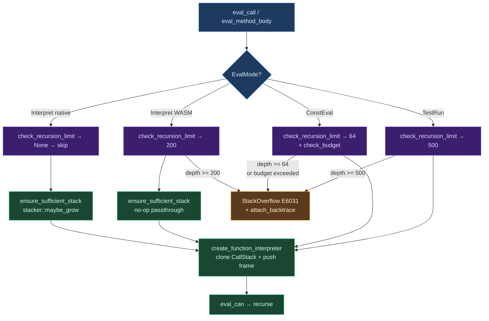

# Recursion Limits

Every language runtime must decide what happens when a program calls itself too deeply. The stack is finite. Without protection, unbounded recursion silently corrupts memory or produces cryptic, unrecoverable errors. This chapter examines the problem space, surveys the strategies that production language runtimes use, and then presents Ori's approach in detail: a platform-adaptive system that combines dynamic stack growth on native targets with frame-counted depth limits on constrained platforms.

## 1. Conceptual Foundations

### The Stack Overflow Problem

Every function call allocates a *stack frame* --- space for local variables, return addresses, and saved registers. On most operating systems, the stack is a contiguous region of virtual memory with a fixed maximum size (typically 1--8 MB on Linux/macOS, approximately 1 MB on Windows). When recursive calls exhaust this space, the program faults. The symptoms vary by platform:

- **Native (Linux/macOS)**: `SIGSEGV` or `SIGBUS` at the guard page.
- **Native (Windows)**: Structured exception `STATUS_STACK_OVERFLOW`.
- **WebAssembly (browser)**: `"Maximum call stack size exceeded"` or, worse, `"memory access out of bounds"` with no context.
- **WebAssembly (server)**: Runtime-dependent; Wasmtime and Wasmer provide configurable stack sizes but still terminate abruptly on overflow.

The fundamental challenge is that stack overflow is not a normal error. The program has already exhausted the resource it needs to handle the error. Any strategy must either *prevent* the overflow entirely or *detect* the impending overflow before it occurs.

### Classical Solutions

Language runtimes have converged on a handful of approaches, each with distinct tradeoffs:

**Fixed depth limits.** [Python's `sys.setrecursionlimit()`](https://docs.python.org/3/library/sys.html#sys.setrecursionlimit) counts call frames and raises `RecursionError` at a threshold (default 1000). Simple to implement, but the correct limit depends on the host stack size, frame sizes, and C extension depth --- all of which vary across platforms. Ruby takes a similar approach, raising `SystemStackError` at a configurable depth.

**Dynamic stack growth.** Go's [goroutine stacks](https://go.dev/doc/faq#goroutines) start small (a few kilobytes) and grow by copying to a larger allocation when a function prologue detects low space. Rust's [`stacker`](https://docs.rs/stacker/latest/stacker/) crate achieves a similar effect by allocating new stack segments on demand via `mmap`. These approaches decouple recursion depth from the initial stack size, but require runtime cooperation (prologues or wrapper functions).

**Trampolining and continuation-passing.** Languages without tail call optimization sometimes convert deep recursion into an iterative loop that allocates continuation frames on the heap. Clojure's `trampoline` function and Kotlin's `DeepRecursiveFunction` exemplify this pattern. The tradeoff is indirection overhead and loss of natural call stack structure for debugging.

**Tail call optimization.** [Scheme (R7RS)](https://standards.scheme.org/corrected-r7rs/r7rs.html) mandates that implementations optimize tail calls to reuse the current stack frame. [Erlang/BEAM](https://www.erlang.org/doc/system/efficiency_guide.html) processes rely on tail recursion as their primary looping mechanism. When applicable, this eliminates stack growth entirely, but it only helps when the recursive call is in tail position, and it complicates backtraces.

**Guard pages.** Operating systems typically place an unmapped page at the stack boundary. Touching it triggers a fault that the runtime can catch (on native) or that the host terminates (on WASM). This is a last resort, not a strategy --- it provides no graceful recovery path.

### Platform Divergence

The critical insight for a cross-platform language is that these strategies are not universally available. Native targets can grow the stack dynamically (via `stacker` or `mmap`), making hard depth limits unnecessary. WebAssembly targets have a fixed, small stack (often around 1 MB in browsers) with no mechanism for dynamic growth. A compile-time evaluator within the compiler itself needs an even tighter budget to prevent runaway expansion during compilation. A single strategy cannot serve all contexts.

## 2. What Makes Ori's Approach Distinctive

Ori's recursion limit system is built around three design principles:

1. **Platform-adaptive limits via `EvalMode`.** Rather than a single global recursion limit, the interpreter queries its evaluation mode to determine the appropriate limit for the current execution context. Native interpretation has no artificial limit. WASM interpretation enforces a conservative fixed limit. Compile-time evaluation and test execution each have their own budgets.

2. **Frame-level tracking, not just depth counting.** The `CallStack` structure maintains a vector of `CallFrame` values, each recording the interned function name and the source span of the call site. This provides structured backtrace data when overflow occurs, rather than a bare "recursion limit exceeded" message.

3. **Two-layer protection.** On native targets, `ori_stack::ensure_sufficient_stack` dynamically grows the Rust call stack at every recursive entry point (parser, type checker, evaluator). This handles the *physical* stack. Independently, `check_recursion_limit` enforces *logical* depth limits on platforms where dynamic growth is unavailable. The layers are complementary: native builds rely on `ensure_sufficient_stack` and skip the depth check; WASM builds rely on the depth check since `ensure_sufficient_stack` compiles to a no-op.

The result is that native Ori programs can recurse to depths exceeding 100,000 without configuration, while WASM builds fail gracefully at depth 200 with a full backtrace showing the call chain.

## 3. EvalMode-Based Limits

### The EvalMode Enum

`EvalMode` is the interpreter's policy switch. It determines I/O access, capability availability, test collection, and recursion limits:

```rust
#[derive(Clone, Copy, Debug, Default, PartialEq, Eq, Hash)]
pub enum EvalMode {
    #[default]
    Interpret,
    ConstEval { budget: u32 },
    TestRun { only_attached: bool },
}
```

The recursion limit is derived from this enum via `max_recursion_depth()`, which returns `Option<usize>`:

```rust
impl EvalMode {
    pub fn max_recursion_depth(&self) -> Option<usize> {
        match self {
            Self::Interpret => {
                #[cfg(target_arch = "wasm32")]
                { Some(200) }
                #[cfg(not(target_arch = "wasm32"))]
                { None }
            }
            Self::ConstEval { .. } => Some(64),
            Self::TestRun { .. } => Some(500),
        }
    }
}
```

### Why Each Mode Differs

**`Interpret` (native): `None`** --- no artificial limit. The `stacker` crate dynamically grows the Rust stack, so the only practical bound is available heap memory. Imposing a depth limit here would artificially constrain programs that legitimately use deep recursion (parsing deeply nested data structures, traversing large trees).

**`Interpret` (WASM): `Some(200)`** --- the WASM linear memory model provides a fixed stack, typically around 1 MB in browsers. Each Ori function call consumes 8--12 Rust stack frames (see Section 5). At 12 frames per call, 200 Ori calls consume approximately 2,400 Rust frames. With typical frame sizes of 200--400 bytes, this stays well within the 1 MB budget. The limit is conservative by design, leaving headroom for expression nesting within function bodies.

**`ConstEval`: `Some(64)`** --- compile-time evaluation must terminate quickly. A recursive function at the type level that does not terminate would block compilation indefinitely. The tight limit of 64 prevents runaway const evaluation while still permitting practical computations like compile-time factorial or Fibonacci.

**`TestRun`: `Some(500)`** --- test execution deserves a more generous limit than const-eval (tests may exercise recursive algorithms) but should still be bounded. An infinite recursion in a test should fail fast with a clear diagnostic, not consume all available memory.

### Returning `Option<usize>`

The `Option<usize>` return type is significant. `None` means "no limit" --- the interpreter skips the depth check entirely, avoiding a branch on every function call in native interpretation. `Some(n)` enables the check. This zero-cost-when-unnecessary pattern avoids penalizing the common case (native execution) for the sake of constrained platforms.

## 4. CallStack Architecture

### CallFrame and CallStack

The `CallStack` is the interpreter's live record of the current call chain. It replaces what might otherwise be a bare `call_depth: usize` counter with structured frame data:

```rust
#[derive(Clone, Debug)]
pub struct CallFrame {
    pub name: Name,
    pub call_span: Option<Span>,
}

#[derive(Clone, Debug)]
pub struct CallStack {
    frames: Vec<CallFrame>,
    max_depth: Option<usize>,
}
```

`Name` is an interned string identifier, so each frame is compact: one `u32` (the interned name index) plus one `Option<Span>` (16 bytes on 64-bit platforms). Total per frame is approximately 24 bytes, making a stack of 1,000 frames approximately 24 KiB.

### The Two-Check Pattern

Recursion enforcement follows a deliberate two-check pattern at every call site:

1. **`check_recursion_limit()`** --- called on the interpreter *before* creating the child. This is the authoritative check. On `Err`, it returns a `StackOverflow` error with the limit value. On `Ok`, execution proceeds.

2. **`CallStack::push()`** --- called on the *cloned child stack* after `check_recursion_limit()` has already passed. The `push()` method contains its own depth check, but at this point it serves as an **invariant assertion**, not a defensive check. The call site uses `.expect()`, not `?`:

```rust
child_stack
    .push(CallFrame { name: call_name, call_span: None })
    .expect("check_recursion_limit passed but CallStack::push failed");
```

This separation exists because `check_recursion_limit()` operates on the *parent* interpreter's state (before cloning), while `push()` operates on the *child* stack (after cloning). The invariant is: if the check passed, the push cannot fail, because no other code modifies depth between the two operations.

### Clone-per-Child Model

When the interpreter evaluates a function call, it clones the parent's `CallStack` and pushes a new frame onto the clone:

```rust
let mut child_stack = self.call_stack.clone();
child_stack.push(CallFrame { name, call_span: Some(span) })?;
```

The child interpreter receives the cloned stack. When the function returns, the child is dropped and the clone is freed. The parent's stack is never modified.

This model is O(N) per call in the depth of the stack, which seems expensive. However, the constant factor is small (a `memcpy` of 24N bytes), and at practical depths (a few hundred on WASM, effectively unbounded on native) the overhead is negligible. The benefit is simplicity: there is no shared mutable state, no locking, no interior mutability. Each interpreter owns its call stack outright.

### Backtrace Capture

When an error occurs, the call stack is snapshotted into an `EvalBacktrace` and attached to the error:

```rust
impl CallStack {
    pub fn capture(&self, interner: &StringInterner) -> EvalBacktrace {
        let frames = self.frames.iter().rev()  // Most recent call first
            .map(|f| BacktraceFrame {
                name: interner.lookup(f.name).to_string(),
                span: f.call_span,
            })
            .collect();
        EvalBacktrace::new(frames)
    }

    pub fn attach_backtrace(&self, err: EvalError, interner: &StringInterner) -> EvalError {
        err.with_backtrace(self.capture(interner))
    }
}
```

The `capture()` method resolves interned names to strings (a cheap hash lookup per frame) and reverses the frame order so that the most recent call appears first, matching the convention of native stack traces. The `attach_backtrace()` convenience method combines capture and attachment in a single call at error sites.

## 5. Stack Frame Analysis

Understanding *why* a WASM limit of 200 is conservative requires analyzing the actual Rust call stack produced by a single Ori function call. The following trace shows the frames from `eval_can` through the recursive re-entry:

```
Rust frames per Ori function call
==================================

1. eval_can(can_id)                         // Entry: canonical IR evaluation
   |-- ensure_sufficient_stack(|| ...)      // Stack guard (native: stacker; WASM: no-op)
2.     |-- eval_can_inner(can_id)           // Main dispatch on CanExpr
            match CanExpr::Call { ... } =>
3.          |-- eval_can(*func)             // Evaluate the function reference
4.          |-- eval_expr_list(args)        // Evaluate arguments
5.          |-- eval_call(&func, &args)     // Dispatch the call
                |-- check_recursion_limit() // Depth check
                |-- call_stack.clone()      // Clone parent stack
                |-- push(CallFrame { ... }) // Invariant assertion
                |-- check_arg_count(...)
                |-- prepare_call_env(...)   // Environment + captures
6.              |-- create_function_interpreter(...)
7.                  |-- InterpreterBuilder::build()
8.                      |-- eval_can(body)  // RECURSE: back to frame 1
```

**Minimum: 6--7 Rust frames per Ori call.** This is the tight path for a simple function with one argument and no method dispatch overhead.

Additional frames accumulate from:
- **Argument evaluation**: each argument adds 2--3 frames (`eval_can` -> `eval_can_inner`).
- **Helper functions**: `bind_captures`, `bind_parameters_with_defaults`, `check_arg_count`.
- **Method calls**: `eval_user_method` or `eval_associated_function` adds a layer before `eval_method_body`, which itself calls `check_recursion_limit` and `create_function_interpreter`.

**Realistic estimate: 8--12 Rust frames per Ori function call.**

### Why 200 Is Conservative

With approximately 1,000 Rust frames available in a typical browser WASM environment:

- **Best case** (8 frames/call): 1000 / 8 = 125 Ori calls
- **Worst case** (12 frames/call): 1000 / 12 = 83 Ori calls

The default of 200 assumes that some WASM runtimes provide more stack space than the minimum, that simple functions use fewer frames, and that a safety margin is needed for expression nesting within function bodies. If a runtime consistently provides more headroom (Node.js, Wasmtime with configured stack size), the limit can be raised by constructing a `CallStack` with a custom depth.

## 6. The `ori_stack` Crate

The `ori_stack` crate provides a single public function: `ensure_sufficient_stack`. This is the physical stack safety mechanism, complementing the logical depth checking in `CallStack`.

### API

```rust
/// Ensure sufficient stack space before executing `f`.
///
/// Native: uses stacker::maybe_grow to dynamically extend the stack.
/// WASM: no-op passthrough.
#[inline]
#[cfg(not(target_arch = "wasm32"))]
pub fn ensure_sufficient_stack<R>(f: impl FnOnce() -> R) -> R {
    stacker::maybe_grow(RED_ZONE, STACK_PER_RECURSION, f)
}

#[inline]
#[cfg(target_arch = "wasm32")]
pub fn ensure_sufficient_stack<R>(f: impl FnOnce() -> R) -> R {
    f()
}
```

### Configuration

Two constants control the growth behavior on native targets:

- **`RED_ZONE` (100 KB)**: If less than this amount of stack space remains, the function allocates a new segment before calling `f`. This must be large enough to accommodate the deepest non-recursive call chain within a single Ori evaluation step.
- **`STACK_PER_RECURSION` (1 MB)**: Each new segment is this size. At 1 MB per segment, a recursion depth of 100 results in approximately 100 MB of stack, which is acceptable for typical workloads.

On native targets, the [`stacker`](https://docs.rs/stacker/latest/stacker/) crate implements `maybe_grow` by probing the current stack pointer against a thread-local watermark. If the remaining space is below `RED_ZONE`, it allocates a new stack segment via `mmap` (or the platform equivalent), switches to it, calls `f`, then switches back. The overhead when the stack is sufficient (the common case) is a single pointer comparison --- effectively free.

On WASM, `ensure_sufficient_stack` compiles to a direct call of `f()`. WASM's execution model does not expose the stack pointer or permit dynamic growth, so the function cannot do anything useful. The WASM build relies entirely on the logical depth check in `check_recursion_limit()`.

### Application Sites

`ensure_sufficient_stack` wraps recursive entry points across the compiler pipeline:

- **Parser**: `parse_expr`, `parse_non_assign_expr`, `parse_non_comparison_expr` --- deeply nested expressions can produce unbounded parser recursion.
- **Type checker**: `infer_expr` and multiple `check_module` entry points --- type inference recurses through expression trees and may encounter Salsa framework + tracing span depth on top.
- **Evaluator**: `eval_can` --- the canonical IR evaluation entry point, which recurses for every sub-expression.

By wrapping all three phases, the compiler handles pathological inputs (a source file with 10,000 nested parentheses) without crashing on any platform with dynamic stack growth.

## 7. ConstEval Budget

Compile-time evaluation faces a distinct problem: it must not only avoid stack overflow but also prevent non-terminating computation from blocking the compiler. The `ConstEval` mode addresses this with both a recursion depth limit (64) and a *call budget*.

### ModeState and Budget Tracking

```rust
pub struct ModeState {
    call_count: usize,
    budget: Option<u32>,
    counters: Option<EvalCounters>,
}

impl ModeState {
    pub fn check_budget(&mut self) -> Result<(), BudgetExceeded> {
        if let Some(budget) = self.budget {
            self.call_count = self.call_count.saturating_add(1);
            if self.call_count > budget as usize {
                return Err(BudgetExceeded { budget, calls: self.call_count });
            }
        }
        Ok(())
    }
}
```

The budget counts *total function calls*, not recursion depth. A program that calls 1,000 different non-recursive functions exhausts the budget just as one that recurses 1,000 times does. This provides a hard upper bound on compile-time work regardless of call pattern.

### Why 64 Depth for ConstEval

The recursion depth limit (64) and the call budget are independent safeguards. The depth limit catches simple infinite recursion (a const function calling itself without progress). The budget catches more complex patterns: mutual recursion, non-recursive but extremely long computation, or combinatorial explosion in generic instantiation. Together, they ensure that const evaluation terminates within bounded time and space.

The specific value of 64 is chosen to be large enough for practical compile-time computations (a compile-time Fibonacci(20) needs depth 20; a compile-time sort on a 50-element list needs depth ~50) while small enough that a runaway const function fails quickly with a clear error message.

## 8. Call Sites

Recursion checks are performed at specific points in the evaluation pipeline. Understanding which calls are checked (and which are not) is important for reasoning about the system's guarantees.

### Checked: User-Defined Calls

The following call types invoke `check_recursion_limit()` and push a `CallFrame`:

- **`Value::Function`** --- standard function calls. The check occurs in `eval_call` before creating the child interpreter.
- **`Value::MemoizedFunction`** --- memoized calls. The cache is checked first; if there is a cache miss, the recursion check occurs before evaluation.
- **`eval_user_method`** --- user-defined methods from `impl` blocks. The check occurs in `eval_method_body`, the shared helper for both instance methods and associated functions.
- **`eval_associated_function`** --- associated functions (e.g., `Type.new()`). These also route through `eval_method_body`, which performs the check.

### Unchecked: Built-In Operations

The following do *not* increment call depth or check the recursion limit:

- **Built-in methods** (`.len()`, `.map()`, `.filter()`, string methods) --- these are implemented directly in Rust without creating a new interpreter instance. They consume Rust stack frames but do not recurse through `eval_call`.
- **Operators** (`+`, `*`, `==`) --- operator dispatch resolves to built-in implementations for primitive types.
- **Variant constructors and newtype constructors** --- these are value construction, not function evaluation.
- **`Value::FunctionVal`** --- built-in function values (prelude functions like `print`, `len`). These are dispatched via a direct Rust function pointer, not through the interpreter's recursive evaluation.

The distinction is architectural: only calls that create a new `Interpreter` instance (and thus consume significant Rust stack space) participate in recursion tracking. Built-in operations consume a bounded, small number of Rust frames.

## 9. Error Reporting

When the recursion limit is exceeded, the error factory produces a structured diagnostic:

```rust
#[cold]
pub fn recursion_limit_exceeded(limit: usize) -> EvalError {
    EvalError::from_kind(EvalErrorKind::StackOverflow { depth: limit })
}
```

The `#[cold]` annotation tells the compiler that this path is rarely taken, keeping it out of the instruction cache for the hot evaluation path. The `StackOverflow` error kind maps to diagnostic code `E6031`.

When the error propagates up the call chain, the interpreter attaches the call stack backtrace:

```rust
let err = self.call_stack.attach_backtrace(err, self.interner);
```

The resulting diagnostic includes:
- The exact depth limit that was reached.
- A full backtrace showing the call chain, with each frame's function name and source span.
- The spans of each call site, enabling the diagnostic emitter to underline the recursive call in the source.

For example, an infinite recursion in a WASM build produces:

```
[E6031] maximum recursion depth exceeded (limit: 200)

  --> src/main.ori:3:12
   |
 3 |     fib(n - 1) + fib(n - 2)
   |     ^^^^^^^^^^ recursive call here

  backtrace (most recent call first):
    fib (src/main.ori:3:5)
    fib (src/main.ori:3:5)
    ... (198 more frames)
    @main (src/main.ori:7:5)
```

## 10. Prior Art

Ori's approach draws on lessons from several production runtimes:

- **[Python (`sys.setrecursionlimit`)](https://docs.python.org/3/library/sys.html#sys.setrecursionlimit)**: Fixed counter, default 1000. No backtrace enrichment. The limit is global and does not adapt to the execution context.
- **[Ruby (`SystemStackError`)](https://ruby-doc.org/3.3.0/SystemStackError.html)**: VM-level detection. The error is not catchable in all contexts, making graceful recovery difficult.
- **[Java (`StackOverflowError`)](https://docs.oracle.com/en/java/javase/21/docs/api/java.base/java/lang/StackOverflowError.html)**: JVM detects via guard page probing. The error is throwable but recovery is fragile because the stack is nearly exhausted when the handler runs.
- **[Go (goroutine stack growth)](https://go.dev/doc/faq#goroutines)**: Goroutines start with small stacks (a few KB) that grow dynamically by copying. No explicit limit; the runtime grows until memory is exhausted. Elegant but requires runtime support in every function prologue.
- **[Rust (`stacker` crate)](https://docs.rs/stacker/latest/stacker/)**: Library-level dynamic stack growth. Requires explicit wrapping of recursive calls. Ori uses this directly for its native builds.
- **[Erlang/BEAM](https://www.erlang.org/doc/system/processes.html)**: Processes use tail call optimization as the primary loop mechanism, with a small initial stack that grows on demand. Tail calls eliminate stack growth entirely when applicable.
- **[Zig (comptime eval limit)](https://ziglang.org/documentation/master/#comptime)**: Compile-time evaluation has a hard step limit (currently 1000 backwards branches). Similar in spirit to Ori's `ConstEval` budget, though Zig counts branch instructions rather than function calls.

The key differentiator in Ori's design is the `EvalMode`-based dispatch: the same interpreter codebase serves native, WASM, const-eval, and test execution, with each context receiving the appropriate recursion policy without runtime detection or configuration.

## 11. Design Tradeoffs

### Dynamic Growth vs. Fixed Limits

On native targets, `ori_stack` provides effectively unlimited recursion depth via dynamic stack growth. This is strictly more capable than a fixed limit, but it means that a native program that recurses 50,000 times will succeed while the same program on WASM fails at 200. This behavioral divergence is a conscious tradeoff: constraining native builds to match WASM's limitations would cripple legitimate use cases, and expanding WASM's budget risks catastrophic stack overflow in browsers. The divergence is documented and the error message on WASM includes the limit value, so users can reason about the platform difference.

### Depth Counting vs. Budget Counting

The `ConstEval` mode employs *two* independent mechanisms: recursion depth (max 64) and call budget (configurable total call count). Depth counting catches simple infinite recursion but misses wide-but-shallow patterns (calling 10,000 distinct functions). Budget counting catches both but adds per-call overhead (an increment and comparison). For `Interpret` and `TestRun` modes, only depth counting is used, keeping the hot path fast. For `ConstEval`, the additional budget check is acceptable because const evaluation is inherently slower than runtime execution and correctness (guaranteed termination) outweighs speed.

### Clone-per-Child vs. Shared Mutable Stack

The clone-per-child model for `CallStack` means that every function call copies the entire call stack. An alternative would be a shared mutable stack (wrapped in `Rc<RefCell<CallStack>>` or similar) where push/pop operate in-place. The shared approach would be O(1) per call instead of O(N). Ori chose cloning for three reasons: (1) it avoids interior mutability, which complicates reasoning and interacts poorly with Salsa's determinism requirements; (2) at practical depths (a few hundred on WASM, where the check is active), the copy is negligible; (3) on native builds where depth is unlimited, the check is skipped entirely, so the clone never happens in the hot path.

### Platform-Adaptive vs. Uniform Limits

An alternative design would impose a single limit (say, 500) across all platforms. This has the advantage of behavioral consistency: a program that works on WASM also works on native, and vice versa. Ori rejects this in favor of platform adaptation because (1) a limit low enough for WASM safety (200) would frustrate native users, (2) a limit high enough for native flexibility (10,000) would crash WASM builds, and (3) the execution contexts genuinely differ in their physical constraints. The `EvalMode` abstraction makes the policy explicit and testable rather than hiding it behind a magic constant.



The diagram above illustrates the complete decision flow. Every function call begins at the top, branches on the evaluation mode, applies the appropriate checks, and either proceeds to recursive evaluation or produces a structured error diagnostic. The two protection layers --- logical depth checking and physical stack growth --- operate independently, each covering the cases the other cannot.
