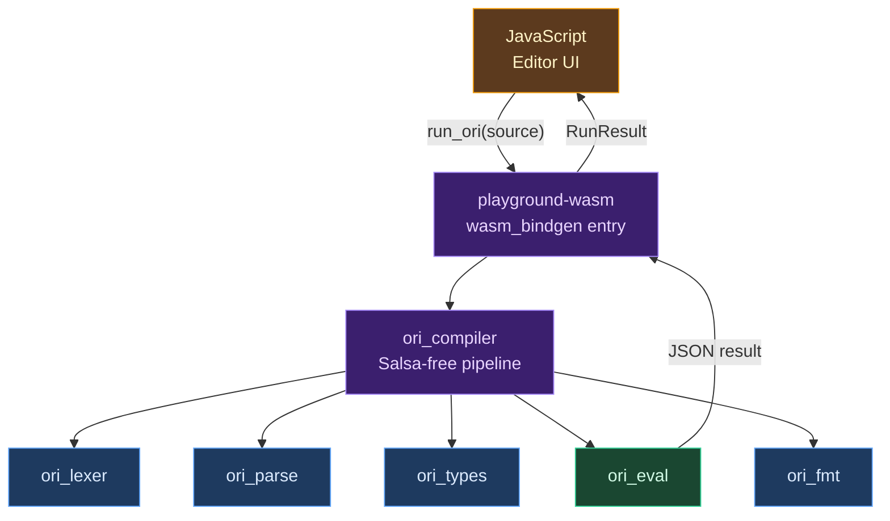

# WebAssembly Target

## Conceptual Foundations

### What Is WebAssembly?

[WebAssembly](https://webassembly.org/) (WASM) is a binary instruction format designed as a portable compilation target. Unlike native instruction sets that are specific to a physical CPU architecture — x86 instructions run on Intel and AMD processors, ARM instructions on mobile chips — WebAssembly defines a virtual instruction set that any conforming runtime can execute. The key word is *portable*: a `.wasm` binary produced on a Linux workstation runs identically in a browser on macOS, a serverless function on AWS, or an embedded runtime on a microcontroller.

The idea has a long lineage. The [W3C WebAssembly Community Group](https://www.w3.org/community/webassembly/) announced the project in 2015 as a successor to [asm.js](http://asmjs.org/), Mozilla's experiment in using a restricted subset of JavaScript as a compilation target. The [MVP specification](https://webassembly.github.io/spec/core/) shipped in 2017 with support across all major browsers — Chrome, Firefox, Safari, and Edge — making it the first new instruction format to achieve universal browser adoption since JavaScript itself. In 2019, the [W3C formally ratified WebAssembly](https://www.w3.org/TR/wasm-core-1/) as a web standard, giving it the same normative status as HTML, CSS, and the DOM.

But WebAssembly quickly outgrew the browser. [WASI](https://wasi.dev/) (the WebAssembly System Interface), proposed by Mozilla in 2019, standardized a capability-based API for WASM modules to access operating system services — file systems, clocks, random number generators, environment variables — without browser APIs. Runtimes like [Wasmtime](https://wasmtime.dev/), [Wasmer](https://wasmer.io/), and [WasmEdge](https://wasmedge.org/) execute WASM modules outside the browser entirely, enabling server-side, edge, and embedded deployment. The result is a platform that spans from browser tabs to cloud functions to IoT devices.

### Classical Approaches to WASM Support

Language compilers have adopted WebAssembly through several distinct strategies.

**Compile-to-WASM** is the most direct approach. The compiler targets WebAssembly as a native output format, producing `.wasm` binaries the same way it would produce ELF binaries for Linux or Mach-O for macOS. [Rust](https://rustwasm.github.io/docs/book/) (via `rustc --target wasm32-unknown-unknown` and the [wasm-pack](https://rustwasm.github.io/wasm-pack/) toolchain), [Zig](https://ziglang.org/) (with native WASM target support in its self-hosted compiler), and [Go](https://go.dev/wiki/WebAssembly) (via `GOOS=js GOARCH=wasm`) all follow this pattern. [Emscripten](https://emscripten.org/) pioneered it for C and C++, first compiling to asm.js and later to WASM. [AssemblyScript](https://www.assemblyscript.org/) takes the approach furthest by designing a TypeScript-like language specifically for WASM output. The advantage is performance: the generated code runs at near-native speed on any WASM runtime. The disadvantage is complexity — the compiler must handle WASM's memory model, calling conventions, and feature set as a first-class target.

**Interpreter-in-WASM** takes the opposite approach. Instead of compiling *programs* to WASM, the compiler compiles *itself* (or its interpreter) to WASM. The resulting WASM module can then interpret programs written in the source language. Browser-based REPLs and playgrounds commonly use this strategy: the language's interpreter, written in a WASM-friendly language like Rust or C, is compiled to a `.wasm` module, loaded into a web page, and fed source code from a text editor. [Pyodide](https://pyodide.org/) (CPython compiled to WASM via Emscripten), the [Elm playground](https://elm-lang.org/try), and the [Gleam playground](https://playground.gleam.run/) all work this way. The advantage is rapid iteration — the entire language works immediately, because the interpreter already handles every language feature. The trade-off is the performance ceiling of interpretation versus native execution.

**Hybrid approaches** combine both strategies. A language might compile its interpreter to WASM for an interactive playground while also supporting direct WASM compilation for production deployment. This is the approach Ori takes.

### Compiling TO WebAssembly vs. Running IN WebAssembly

The distinction matters because the two modes face fundamentally different constraints. Compiling *to* WASM means the LLVM backend targets `wasm32-unknown-unknown` or `wasm32-wasi` and produces a `.wasm` binary from Ori source code. The constraints are those of the WASM target architecture: 32-bit address space, linear memory, no threads (without SharedArrayBuffer), a fixed set of value types. Running *in* WASM means the Ori interpreter itself has been compiled to a `.wasm` module and executes Ori source code at runtime inside a WASM sandbox. The constraints are those of the host runtime: stack size limits, no environment variable access, no direct file system, and whatever APIs the host provides through imports.

Ori supports both modes, and the design of each is shaped by these distinct constraint sets.

## What Makes Ori's WASM Support Distinctive

### Two Modes, One Language

Ori provides WebAssembly support through two complementary paths:

1. **Compile-to-WASM**: The LLVM backend compiles Ori programs to `.wasm` binaries, producing native WebAssembly that runs in any conforming runtime. This is the production path — the output is a standalone WASM module with no dependency on the Ori compiler at runtime.

2. **Interpreter-in-WASM**: The Ori interpreter (`ori_eval` and its dependencies) is compiled to a WASM module for embedding in browsers. This powers the [Ori Playground](https://orilang.dev/playground) and enables Ori evaluation in any JavaScript environment.

These are not competing approaches — they serve different use cases. The compile-to-WASM path produces fast, small binaries for deployment. The interpreter-in-WASM path provides an instant development experience with zero installation. A program that works in the playground will compile to a native WASM binary with the same semantics, because both paths share the same front end (lexer, parser, type checker).

### Structured Configuration

Rather than exposing WASM options as loose CLI flags, Ori bundles WebAssembly configuration into a structured hierarchy. `WasmConfig` is the top-level type, composing four subordinate configurations: `WasmMemoryConfig` (page sizes, import/export, shared memory), `WasmStackConfig` (stack size as a linker argument), `WasmFeatures` (target feature flags), and `WasmOutputOptions` (post-processing and binding generation). When WASI support is enabled, a `WasiConfig` provides fine-grained control over which system capabilities the module may access.

This structure means configuration is validated at construction time, not at link time. A `WasmConfig::browser()` factory produces a configuration with JavaScript bindings and TypeScript declarations enabled. A `WasmConfig::wasi_cli()` factory produces a configuration with full WASI access. Each factory is a self-consistent set of options, eliminating the combinatorial explosion of flag interactions that plagues flat configuration models.

### Feature Flags as Capability Negotiation

WebAssembly's post-MVP feature set is a moving target. `WasmFeatures` captures the five most consequential extensions:

| Feature | Purpose | Default |
|---------|---------|---------|
| **Bulk memory** | Efficient `memory.copy` and `memory.fill` operations, replacing byte-by-byte loops | Enabled |
| **Multi-value** | Functions can return multiple values without struct packing | Enabled |
| **Reference types** | First-class references to host objects (`externref`, `funcref`) | Disabled |
| **SIMD** | 128-bit packed vector operations for numeric computation | Disabled |
| **Exception handling** | Structured try/catch in WASM, replacing trap-based error signaling | Disabled |

The defaults reflect a pragmatic assessment: bulk memory and multi-value are supported by all major runtimes and provide clear performance benefits. Reference types, SIMD, and exception handling have narrower support and are opt-in. Each feature maps to a `wasm-ld --enable-*` flag, and the `WasmFeatures::linker_args()` method generates the exact flag set the linker needs.

## Compiling Ori to WebAssembly

### Target Triples

The LLVM backend supports two WebAssembly targets:

| Target | Description |
|--------|-------------|
| `wasm32-unknown-unknown` | Standalone WebAssembly with no host API assumptions |
| `wasm32-wasi` | WebAssembly with [WASI](https://wasi.dev/) system interface |

The `wasm32-unknown-unknown` target produces a self-contained module. It can import and export functions, but makes no assumptions about the host environment. This is the right target for browser embedding, where the host provides custom JavaScript imports.

The `wasm32-wasi` target produces a module that uses WASI's standardized system interface for I/O, filesystem access, clocks, and other OS services. This is the right target for server-side execution, CLI tools compiled to WASM, and any context where the module needs to interact with the operating system through a portable API.

### CLI Usage

```bash
# Compile to standalone WASM
ori build --target wasm32-unknown-unknown program.ori

# Compile with WASI support
ori build --target wasm32-wasi program.ori
```

### Memory Configuration

WASM linear memory is organized in pages of 64 KB each. `WasmMemoryConfig` controls the initial allocation, maximum size, and whether memory is imported from or exported to the host:

| Setting | Default | Purpose |
|---------|---------|---------|
| `initial_pages` | 16 (1 MB) | Memory available at instantiation |
| `max_pages` | 256 (16 MB) | Upper bound for `memory.grow` |
| `import_memory` | `false` | Host provides memory at instantiation |
| `export_memory` | `true` | Host can read/write module memory |
| `shared` | `false` | Enable `SharedArrayBuffer`-backed memory for threading |

The configuration generates `wasm-ld` arguments: `--initial-memory`, `--max-memory`, `--import-memory`, `--export-memory`, and `--shared-memory`. The `export_name` defaults to `"memory"`, matching the convention expected by JavaScript's `WebAssembly.instantiate`.

### Stack Configuration

WebAssembly stack size is a linker argument, not a runtime parameter. The `WasmStackConfig` type captures this with a `size` field in bytes, defaulting to 1 MB. This value becomes the `--stack-size` argument to `wasm-ld`.

The default is conservative. Browser runtimes typically enforce a stack limit around 1 MB, and WASM's stack cannot grow dynamically — once exhausted, execution traps. Because each Ori function call expands into multiple WASM stack frames (interpreter dispatch, pattern matching, method resolution), the effective Ori call depth is a fraction of the raw WASM frame limit. The relationship between WASM stack bytes and Ori recursion depth is discussed in the [WASM Constraints](#wasm-constraints) section.

### WASI Configuration

When the `wasi` flag is set, `WasiConfig` provides granular control over which system capabilities the module may access. WASI's capability-based design aligns naturally with Ori's own capability system — both treat system access as something that must be explicitly granted rather than implicitly available.

| Capability | Default | WASI Symbols |
|-----------|---------|--------------|
| Filesystem | Enabled | `path_open`, `fd_seek`, `fd_readdir`, and 20+ others |
| Clock | Enabled | `clock_time_get`, `clock_res_get` |
| Random | Enabled | `random_get` |
| Environment variables | Enabled | `environ_sizes_get`, `environ_get` |
| Command-line arguments | Enabled | `args_sizes_get`, `args_get` |

`WasiConfig` also supports **preopened directories** — directory mappings that grant the WASM module access to specific host filesystem paths. A `WasiPreopen` maps a guest path (as seen by the module) to a host path (the real filesystem location). This is the WASI mechanism for sandboxed filesystem access: the module can only access directories that the host explicitly preopens.

Two WASI versions are supported: **Preview 1** (stable, widely supported by Wasmtime, Wasmer, and browser polyfills) and **Preview 2** (the component model, newer and more modular). The default is Preview 1.

Factory methods simplify common configurations:

- `WasiConfig::cli()` — full access to filesystem, clock, random, environment, and arguments
- `WasiConfig::minimal()` — clock and random only, no filesystem or environment access

At link time, `WasiConfig::undefined_symbols()` generates the list of WASI imports that `wasm-ld` should accept as undefined. These symbols will be provided by the WASI runtime at instantiation. The list is written to a file and passed via `--allow-undefined-file`, ensuring the linker knows exactly which unresolved symbols are expected host imports rather than genuine linking errors.

### Output Options and Post-Processing

`WasmOutputOptions` controls three post-compilation steps:

**JavaScript bindings** (`generate_js_bindings`): The `JsBindingGenerator` produces a `.js` file that handles WASM module loading, string marshalling (via `TextEncoder`/`TextDecoder`), memory management helpers, and clean wrapper functions for each exported Ori function. The generated code uses `WebAssembly.instantiateStreaming` when available and falls back to `WebAssembly.instantiate` for `ArrayBuffer` sources.

**TypeScript declarations** (`generate_dts`): A `.d.ts` file with typed function signatures for every export, enabling type-safe WASM module consumption from TypeScript. The `WasmType` enum maps Ori types to TypeScript equivalents: `int` and `float` become `number`, `str` becomes `string`, `void` stays `void`.

**wasm-opt post-processing** (`run_wasm_opt`): The [Binaryen](https://github.com/WebAssembly/binaryen) `wasm-opt` tool applies WASM-specific optimizations that LLVM's general-purpose passes miss. Optimization levels range from `O0` (no optimization) through `O4` (super-aggressive), plus `Os` and `Oz` for size optimization. The `WasmOptRunner` manages tool discovery, argument construction, and in-place optimization with atomic file replacement. When `wasm-opt` is not installed, the compiler produces a clear error message with installation instructions rather than silently skipping the step.

## Interpreter in WebAssembly

### Architecture

The Ori playground compiles the interpreter itself to WebAssembly. The `playground-wasm` crate is a thin `wasm_bindgen` wrapper around `ori_compiler`, which provides a Salsa-free, IO-free compilation pipeline. When a user types code in the browser and clicks "Run," JavaScript calls `run_ori(source)`, which invokes the full Ori pipeline — lexing, parsing, type checking, and evaluation — inside the WASM sandbox, returning the result as serialized JSON.



The `ori_compiler` crate sits between the core compiler crates and the WASM consumer. It orchestrates the pipeline without Salsa's incremental computation infrastructure, making it suitable for single-shot compilation in a sandboxed environment.

### Portable Crate Design

Not every compiler crate can compile to WASM. The division is determined by a single constraint: **Salsa compatibility**. Salsa, the incremental computation framework used by the `oric` CLI, requires `Arc<Mutex<T>>` for its database and query caching. This dependency on thread-safe interior mutability is incompatible with WASM's single-threaded execution model.

The following crates are WASM-compatible:

| Crate | Role |
|-------|------|
| `ori_compiler` | Salsa-free compilation pipeline |
| `ori_eval` | Tree-walking interpreter |
| `ori_types` | Type inference and checking |
| `ori_parse` | Parser |
| `ori_lexer` | Lexer |
| `ori_ir` | AST, spans, type IDs |
| `ori_fmt` | Source code formatter |
| `ori_stack` | Stack safety (no-op passthrough on WASM) |
| `ori_patterns` | Pattern matching system |
| `ori_diagnostic` | Error reporting |

The `oric` CLI crate is **not** WASM-compatible due to its Salsa dependency. This is by design — the CLI needs incremental compilation for IDE responsiveness, while the playground needs single-shot execution in a sandbox. The `ori_compiler` crate provides the bridge: the same front-end logic (lexing through evaluation) without the incremental infrastructure.

### Building for WASM

The playground WASM module is built with [wasm-pack](https://rustwasm.github.io/wasm-pack/):

```bash
wasm-pack build website/playground-wasm --target web --release
```

This produces a `.wasm` binary and JavaScript glue code. The `#[wasm_bindgen(start)]` attribute on `init()` installs a panic hook that routes Rust panics to `console.log`, ensuring that internal errors are visible in browser developer tools rather than silently trapping.

### JavaScript Interop

The WASM module exposes three functions to JavaScript:

- `run_ori(source, max_call_depth)` — compiles and executes Ori source, returning a JSON-serialized `RunResult` with `success`, `output`, `printed`, `error`, and `error_type` fields
- `format_ori(source, max_width)` — formats Ori source, returning a JSON-serialized `FormatResult`
- `version()` — returns the build version string from the `BUILD_NUMBER` file

The JSON serialization boundary (via `serde_json`) is deliberate. WASM-JavaScript interop for complex types is cumbersome — `wasm_bindgen` handles strings and numbers well, but nested structures require manual marshalling. By serializing to JSON on the WASM side and deserializing on the JavaScript side, the interface stays simple and the type contract is defined by the JSON schema rather than by `wasm_bindgen`'s type mapping.

Diagnostics are rendered with source context on the WASM side using the `TerminalEmitter` with `ColorMode::Never` (no ANSI escape codes). The JavaScript side receives fully formatted, human-readable error messages with line numbers, underlines, and error codes — the same output quality as the native CLI, adapted for a text display rather than a terminal.

## WASM Constraints

### Fixed Stack Size

Native platforms can grow the stack dynamically. The `ori_stack` crate uses the [stacker](https://docs.rs/stacker/) crate to detect when the stack is running low and allocate additional space on demand, with a 100 KB red zone and 1 MB growth increments. Deeply recursive Ori programs — the parser handling 100,000+ nested expressions, the type checker unifying deeply nested types — rely on this dynamic growth.

WASM has no equivalent mechanism. The stack is a fixed-size region of linear memory, determined at link time by `--stack-size` and enforced by the runtime. When the stack is exhausted, execution traps — there is no recovery, no signal handler, no opportunity to allocate more.

The `ori_stack` crate handles this gracefully through conditional compilation:

```rust
// Native: dynamically grow the stack
#[cfg(not(target_arch = "wasm32"))]
pub fn ensure_sufficient_stack<R>(f: impl FnOnce() -> R) -> R {
    stacker::maybe_grow(RED_ZONE, STACK_PER_RECURSION, f)
}

// WASM: pass through directly
#[cfg(target_arch = "wasm32")]
pub fn ensure_sufficient_stack<R>(f: impl FnOnce() -> R) -> R {
    f()
}
```

On WASM, `ensure_sufficient_stack` is a zero-cost passthrough. Stack protection shifts from the dynamic mechanism to a static recursion depth limit enforced by `EvalMode`. In `Interpret` mode, native builds have no recursion limit (stacker handles growth), while WASM builds cap recursion at 200 calls. In `TestRun` mode, the limit is 500. In `ConstEval` mode, it is 64.

### Stack Frame Multiplication

The recursion limits above are measured in *Ori* function calls, not WASM stack frames. Each Ori call expands into multiple Rust function calls in the interpreter, and each Rust function call becomes one or more WASM stack frames. The expansion factor depends on the call path, but a typical Ori function invocation traverses:

1. `eval_can()` — canonical IR evaluation entry
2. `eval_can_inner()` — main expression dispatch
3. `eval_call()` — function call handling
4. `create_function_interpreter()` — child interpreter setup
5. `InterpreterBuilder::build()` — builder pattern finalization
6. Back to `eval_can()` for the function body

That is five to six Rust frames per Ori call, plus additional frames for pattern matching, operators, and method calls within the body. A conservative estimate is 5 to 10 WASM frames per Ori call. At a 200-call recursion limit, the interpreter consumes roughly 1,000 to 2,000 WASM frames — well within the typical browser stack limit of around 1 MB.

| Runtime | Typical Stack | Effective Ori Depth |
|---------|---------------|---------------------|
| Browsers | ~1 MB | ~200 calls |
| Node.js | Larger (configurable) | ~500+ calls |
| Wasmtime / Wasmer | Configurable | ~1,000+ calls |
| Embedded runtimes | Limited | ~50-100 calls |

### No Salsa Queries

The `oric` CLI uses [Salsa](https://github.com/salsa-rs/salsa) for incremental computation: if a function's inputs haven't changed, Salsa returns the cached result without re-executing the query. Salsa's internal data structures use `Arc<Mutex<T>>` for thread-safe interior mutability — fine for a native CLI that might process multiple files concurrently, but incompatible with WASM's single-threaded execution model.

The WASM pipeline uses `ori_compiler` instead, which provides the same front-end logic without incremental caching. Every invocation re-lexes, re-parses, re-type-checks, and re-evaluates from scratch. For a playground where the user clicks "Run" and expects a result in under a second, this is acceptable — full compilation of a playground-sized program takes milliseconds.

### No Environment Variables

WASM modules cannot read environment variables at runtime (outside of WASI). All configuration that would normally come from the environment — `ORI_LOG`, `ORI_DUMP_AFTER_PARSE`, `ORI_TRACE_RC` — is unavailable. The playground handles this by using hardcoded defaults and accepting configuration through the JavaScript API (parameters to `run_ori` and `format_ori`) rather than the environment.

### No Native Capabilities

Ori's capability system (`uses Http`, `uses FileSystem`, `uses Clock`) assumes the existence of system services that the sandbox provides. In a WASM environment without WASI, none of these services exist. For the compile-to-WASM path with WASI, capabilities map naturally to WASI imports. For the interpreter-in-WASM path in a browser, capabilities must be provided by the host through JavaScript imports. The playground restricts execution to pure computation and `Print` (captured to a buffer), sidestepping the capability question entirely.

## Prior Art

Ori's approach to WebAssembly draws on established patterns from several language ecosystems.

**[Rust](https://www.rust-lang.org/)** provides the most mature WASM toolchain among systems languages. [wasm-pack](https://rustwasm.github.io/wasm-pack/) orchestrates compilation, binding generation (via [wasm-bindgen](https://rustwasm.github.io/docs/wasm-bindgen/)), and npm package publishing. The `wasm32-unknown-unknown` and `wasm32-wasi` targets are first-class `rustc` targets. Ori's `WasmConfig` structure and JS binding generation draw directly from patterns established by `wasm-pack` and `wasm-bindgen`.

**[Go](https://go.dev/wiki/WebAssembly)** supports WASM via `GOOS=js GOARCH=wasm`, producing modules that require a JavaScript runtime shim (`wasm_exec.js`). Go's WASM output includes the entire Go runtime — garbage collector, goroutine scheduler, channels — resulting in larger binaries than languages with lighter runtimes. Ori avoids this by compiling to WASM through LLVM rather than bundling an interpreter runtime, producing smaller output for the compile-to-WASM path.

**[Zig](https://ziglang.org/)** has native WASM target support in its self-hosted compiler, without requiring LLVM for WASM output. Zig's approach is notable for its minimal runtime overhead and direct control over memory layout. Ori uses LLVM for WASM codegen rather than a custom backend, trading some control for access to LLVM's mature optimization pipeline.

**[Emscripten](https://emscripten.org/)** was the pioneer of compiling C and C++ to WebAssembly (and before that, to asm.js). It provides a complete POSIX emulation layer that maps system calls to browser APIs. Ori's WASI support serves a similar purpose — providing system interfaces to WASM modules — but uses the standardized WASI API rather than a custom emulation layer.

**[AssemblyScript](https://www.assemblyscript.org/)** is a TypeScript-like language designed specifically for WebAssembly output. Its tight coupling with the WASM target enables optimizations that general-purpose compilers cannot make. Ori takes the opposite approach: WASM is one of many targets, sharing the full compilation pipeline with native targets, and the same source code compiles to both without modification.

## Design Tradeoffs

### Standalone WASM vs. WASI

The `wasm32-unknown-unknown` target produces a hermetically sealed module with no host API assumptions. The `wasm32-wasi` target produces a module that depends on a WASI-compatible runtime. The standalone target maximizes portability — the module runs anywhere that supports the WebAssembly spec — but limits functionality to pure computation and explicitly imported host functions. The WASI target provides rich system access (files, clocks, randomness) but restricts deployment to WASI-compatible runtimes. Ori supports both because neither is universally appropriate: browser embedding favors standalone, server-side deployment favors WASI.

### Interpreter-in-WASM vs. Compile-to-WASM

The interpreter path compiles the Ori evaluator itself to WASM. The compilation path uses LLVM to compile Ori programs to WASM. The interpreter path provides instant availability — every language feature works as soon as the interpreter supports it, with no codegen work required — but carries the performance overhead of tree-walking interpretation inside a WASM sandbox. The compilation path produces fast, compact output but requires every language feature to be implemented in the LLVM backend. Ori maintains both because they serve complementary use cases: rapid experimentation (playground) versus production deployment (compiled binaries).

### Fixed Recursion Limit vs. Dynamic Detection

On native platforms, `ori_stack` uses the `stacker` crate to detect stack exhaustion at runtime and grow the stack dynamically. On WASM, this mechanism is unavailable — WASM provides no API to query remaining stack space or allocate more. The alternative is a static recursion counter: the interpreter increments a depth counter on each function call and traps when the limit is reached. This is less flexible (the limit is a constant, not adaptive to the actual stack consumption per frame) but predictable. A WASM-specific stack depth probe — measuring the actual stack pointer against the stack base — would be more precise but relies on implementation details that vary across runtimes and are not part of the WASM specification. The static counter is the conservative, portable choice.

### wasm-opt Post-Processing vs. Direct Emit

LLVM produces good general-purpose WASM code, but [Binaryen](https://github.com/WebAssembly/binaryen)'s `wasm-opt` applies WASM-specific optimizations that LLVM's target-independent passes miss: stack machine optimization, dead code elimination tuned for WASM's structured control flow, and binary size reduction through instruction rewriting. The tradeoff is build complexity — `wasm-opt` is an external tool that must be installed separately, and running it adds a post-processing step to the build. Ori makes this opt-in (`run_wasm_opt: true` in `WasmOutputOptions`) with sensible defaults (O2 when enabled), providing the optimization opportunity without mandating the dependency.
