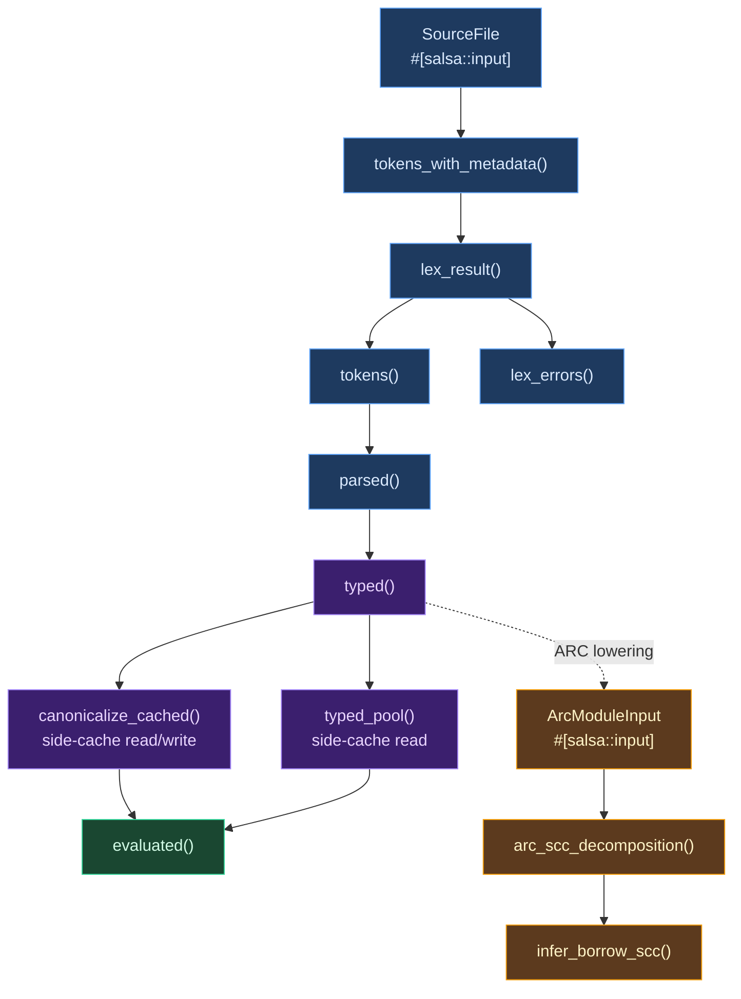

# Appendix A: Incremental Computation in Compilers

This appendix examines the problem of incremental computation in compilers, surveys the major approaches the field has developed, and uses Ori's integration with the Salsa framework as a detailed case study. The goal is not merely to document what Ori does, but to explain *why* these patterns exist and what tradeoffs they encode.

## 1. Conceptual Foundations

### The Recomputation Problem

A compiler is a function from source text to some output: diagnostics, object code, type information for an IDE. When the source text changes, the naive approach is to recompute everything from scratch. For a batch compiler invoked once, this is fine. For a language server responding to keystrokes hundreds of times per minute, it is catastrophically slow.

The fundamental tension is between **correctness** and **performance**. Recomputing everything is always correct but often slow. Caching results is fast but introduces the possibility of serving stale data. The art of incremental computation is finding the boundary between these two extremes: caching as aggressively as possible while guaranteeing that every cached result is consistent with the current inputs.

This is harder than it sounds. Compiler computations form a dependency graph: parsing depends on lexing, type checking depends on parsing, and evaluation depends on type checking. A change to one function's signature can invalidate the type checking of every function that calls it. Tracking these dependencies manually is labor-intensive and error-prone, and a single missed invalidation produces a silent correctness bug --- the most dangerous kind.

### Why Compilers Need Incrementality

Three scenarios drive the need:

**IDE responsiveness.** A language server must respond to completions, diagnostics, hover information, and go-to-definition within 100 milliseconds. Re-lexing, re-parsing, and re-type-checking the entire program on every keystroke makes this impossible for any non-trivial codebase.

**Edit-compile cycles.** Even for CLI compilation, developers edit one file and rebuild. Re-processing unchanged imports, re-type-checking unmodified modules, and re-generating code for functions whose types haven't changed wastes time proportional to the *total* program size rather than the *change* size.

**Watch mode.** A file watcher that re-checks on save benefits enormously from incrementality. Ori's `ori watch` command creates a single database and reuses it across edits, so most re-checks complete in a fraction of the time a cold check would take.

### Classical Approaches

The field has developed several strategies for incremental computation, each with different granularity, automation, and implementation complexity:

**File-level dependency tracking (Make, Ninja).** The oldest approach: track which output files depend on which input files, and rebuild only targets whose inputs have changed. Granularity is coarse --- a one-character edit to a source file triggers a full recompilation of that file. [Make](https://pubs.opengroup.org/onlinepubs/9699919799/utilities/make.html) (Feldman, 1979) was arguably the first practical incremental computation framework. [Ninja](https://ninja-build.org/) refines this with faster dependency scanning. Go and Zig use file-level caching: if a file hasn't changed, skip it entirely. Simple to implement, but a whitespace-only edit forces a full recompile of the affected file.

**Fine-grained function memoization (Adapton).** [Adapton](http://adapton.org/) (Hammer et al., 2014) provides a general-purpose framework for self-adjusting computation. Functions are memoized, and when an input changes, the framework propagates invalidation through the dependency graph. More fine-grained than file-level tracking, but requires the programmer to explicitly mark inputs and computations. The overhead of dependency tracking can be significant for small computations.

**Demand-driven incremental computation (Salsa).** [Salsa](https://salsa-rs.github.io/salsa/) refines the memoization approach for compiler workloads. Queries are demand-driven (computed only when needed), automatically tracked (dependencies recorded as queries execute), and support **early cutoff** (if a re-executed query produces the same result, its dependents skip re-execution). Created for [rust-analyzer](https://rust-analyzer.github.io/), the Rust language server.

**Immutable snapshots with version tracking (Roslyn).** Microsoft's [Roslyn](https://github.com/dotnet/roslyn) compiler for C# and Visual Basic uses immutable "red-green trees" --- syntax trees that share unchanged subtrees between versions. Rather than automatic dependency tracking, Roslyn uses explicit version stamps and snapshot isolation. This gives the compiler author more control over caching granularity at the cost of more manual bookkeeping.

**Build system as query framework (Shake).** [Shake](https://shakebuild.com/) (Mitchell, 2012) is a Haskell build system that models all computations as queries with automatic dependency tracking, much like Salsa but for build systems. It demonstrated that the query-based model could achieve both fine-grained incrementality and correct invalidation, and influenced Salsa's design.

### The Salsa Model

Salsa organizes computation around four concepts:

**Inputs** are external ground truth that can change: source file text, configuration flags, file paths. The compiler creates and updates inputs; Salsa tracks which queries read them.

**Tracked functions** (queries) are pure functions that compute derived data from inputs and other queries. Salsa memoizes their results and automatically records which inputs and queries they read during execution.

**Dependency tracking** is automatic. When a tracked function calls another tracked function or reads an input, Salsa records the dependency. This builds a DAG from inputs through intermediate queries to final results, with no manual registration required.

**Early cutoff** is the key optimization. When an input changes, Salsa re-executes affected queries bottom-up. But if a query produces the *same output* as its cached result (compared via `Eq`), Salsa does not re-execute queries that depend on it. This means a whitespace-only edit that changes tokens but not the AST causes lexing to re-run but parsing, type checking, and evaluation to return their cached results immediately.

These four capabilities combine so that the compiler author writes each phase as a normal function, while users experience an incremental system where only the minimum necessary work is performed on each change.

## 2. What Ori Uses (and Doesn't)

Ori uses a deliberate subset of Salsa's feature surface. Each decision reflects a specific architectural judgment.

| Feature | Status | Rationale |
|---------|--------|-----------|
| `#[salsa::tracked]` fn | **Used** | Core query memoization. Every phase boundary (`lex_result`, `tokens`, `parsed`, `typed`, `evaluated`) is a tracked function. |
| `#[salsa::input]` with `#[return_ref]` | **Used** | `SourceFile` and `ArcModuleInput` are Salsa inputs. `#[return_ref]` avoids cloning large source text on every access. |
| `#[salsa::db]` | **Used** | `CompilerDb` struct and `Db` trait. The database is the session-scoped owner of all cached state. |
| `#[salsa::accumulator]` | **Not used** | Ori's `DiagnosticQueue` predates Salsa integration and provides deduplication, follow-on filtering, and multi-format emission that accumulators don't support natively. Migrating would require rebuilding this infrastructure. |
| `#[salsa::interned]` | **Not used** | Ori uses a custom sharded `StringInterner` with per-shard `RwLock` for concurrent access. Salsa's interning is database-scoped; Ori needs cross-database sharing (multiple `CompilerDb` instances share one interner) and sharded locking for throughput. |
| `#[salsa::tracked]` struct | **Not used** | Ori's intermediate representations (AST nodes, type pool entries, canonical IR) use arena allocation with index-based references, which is more cache-friendly and avoids the per-struct tracking overhead Salsa imposes. |
| Cycle detection (`cycle_fn`) | **Not used** | Ori's query graph is acyclic by construction. The pipeline flows strictly from source text through lexing, parsing, type checking, and evaluation, with no cycles. If recursive queries are needed in the future (mutual type definitions, for example), the feature is available. |

## 3. Database and Query Setup

### The CompilerDb Struct

The `CompilerDb` is the heart of incremental compilation. It owns Salsa's storage, the string interner, and all session-scoped caches:

```rust
#[salsa::db]
#[derive(Clone)]
pub struct CompilerDb {
    storage: salsa::Storage<Self>,
    interner: SharedInterner,
    file_cache: Arc<RwLock<HashMap<PathBuf, SourceFile>>>,
    logs: Arc<Mutex<Option<Vec<String>>>>,
    pool_cache: PoolCache,
    canon_cache: CanonCache,
    imports_cache: ImportsCache,
}
```

`CompilerDb` must implement `Clone` because Salsa's snapshot mechanism requires it. All fields use `Arc` to make cloning a cheap reference-count increment rather than a deep copy. The `file_cache` prevents creating duplicate `SourceFile` inputs for the same path, which would break dependency tracking.

### The Db Trait

All code that needs database access takes `&dyn Db`, decoupling query implementations from the concrete database type:

```rust
#[salsa::db]
pub trait Db: salsa::Database {
    fn interner(&self) -> &StringInterner;
    fn load_file(&self, path: &Path) -> Option<SourceFile>;
    fn pool_cache(&self) -> &PoolCache;
    fn canon_cache(&self) -> &CanonCache;
    fn imports_cache(&self) -> &ImportsCache;
}
```

The `interner()` method provides access to the shared string interner without coupling queries to the interner's concrete type. The `load_file()` method creates Salsa inputs for imported files, ensuring that changes to imports trigger recomputation in dependent modules.

### The salsa_event Callback

Salsa calls `salsa_event` for every cache hit, cache miss, and query execution. Ori bridges these events to the `tracing` framework, which can be enabled at runtime via `ORI_LOG=oric=debug`:

```rust
#[salsa::db]
impl salsa::Database for CompilerDb {
    fn salsa_event(&self, event: &dyn Fn() -> salsa::Event) {
        let has_logs = self.logs.lock().is_some();
        let has_tracing = tracing::enabled!(tracing::Level::TRACE);

        if !has_logs && !has_tracing {
            return; // Skip event evaluation entirely
        }

        let event = event();
        match &event.kind {
            salsa::EventKind::WillExecute { .. } => {
                tracing::debug!(event = ?event.kind, "salsa: will execute");
            }
            salsa::EventKind::DidValidateMemoizedValue { .. } => {
                tracing::trace!(event = ?event.kind, "salsa: cache hit");
            }
            _ => {
                tracing::trace!(event = ?event.kind, "salsa event");
            }
        }
    }
}
```

The lazy event evaluation (accepting `&dyn Fn()` rather than a pre-computed event) avoids formatting overhead when neither logging nor tracing is active, which is the common case in production builds.

### SourceFile as Salsa Input

The primary input to the query pipeline is a source file:

```rust
#[salsa::input]
pub struct SourceFile {
    #[return_ref]
    pub path: PathBuf,

    #[return_ref]
    pub text: String,
}
```

The `#[return_ref]` annotation causes accessors to return `&String` and `&PathBuf` rather than cloning, which is critical for large source files. When a file changes (in watch mode, for example), calling `file.set_text(&mut db).to(new_content)` invalidates all queries that transitively depend on this file's text.

### Query Pipeline

The compilation pipeline is a chain of tracked functions, each depending on the previous:



Each arrow represents an automatic Salsa dependency. When source text changes, Salsa re-executes queries bottom-up, stopping at any point where the output is unchanged (early cutoff). The `tokens_with_metadata` to `lex_result` to `tokens` chain provides three levels of cutoff: metadata changes (comments, formatting) can cut off before reaching the parser; token-level changes that don't affect the AST cut off before type checking.

### Early Cutoff via Eq

Every query output type must implement `Eq`. Salsa compares the new output to the cached output after re-executing a query. If they are equal, dependents are not re-executed. This is why Ori's `TokenList` uses position-independent equality: two token lists that differ only in span offsets (because whitespace was added or removed) compare as equal, enabling early cutoff even when the source text has changed.

The practical effect is dramatic. Most keystrokes --- adding characters to a string literal, editing comments, adjusting whitespace --- produce changes that cut off at the token or AST level, skipping type checking and evaluation entirely.

## 4. Session-Scoped Side-Caches

### Why Side-Caches Exist

Salsa requires all query output types to implement `Clone + Eq + Hash`. This is reasonable for most data, but three categories of compiler output cannot satisfy these constraints:

| Cache | Stored Type | Why Not Salsa-Compatible |
|-------|-------------|--------------------------|
| `PoolCache` | `Arc<Pool>` | The type pool contains interned representations with internal indices. Two pools with identical types but different interning order compare as unequal, defeating early cutoff. |
| `CanonCache` | `SharedCanonResult` | Canonical IR contains arenas, decision tree pools, and constant pools. Deep structural equality would be expensive and provide negligible cutoff benefit. |
| `ImportsCache` | `Arc<ResolvedImports>` | Import resolution data evolves during multi-file compilation and contains cross-file references that resist meaningful equality comparison. |

Each cache is an `Arc<RwLock<HashMap<PathBuf, T>>>`, keyed by file path for consistent access patterns. The `Arc` enables cheap cloning when `CompilerDb` is cloned; the `RwLock` (from `parking_lot`, which avoids poison errors) allows concurrent readers with exclusive writers.

### The Invalidation Problem

Because these caches live outside Salsa's dependency graph, they are **not automatically invalidated** when inputs change. A stale pool from a previous type-check, combined with a fresh AST from a new parse, would produce silently incorrect results --- type information that doesn't match the code being compiled.

The `typed()` query calls `invalidate_file_caches()` before re-type-checking:

```rust
fn invalidate_file_caches(db: &dyn Db, path: &Path) -> CacheGuard {
    db.pool_cache().invalidate(path);
    db.canon_cache().invalidate(path);
    db.imports_cache().invalidate(path);
    CacheGuard(())
}
```

This manual process is a known source of bugs in every system that uses it. A developer adding a new code path that triggers type checking might forget to call `invalidate_file_caches()`, and the resulting bug would be intermittent, data-dependent, and difficult to reproduce.

### CacheGuard: Compile-Time Enforcement

Ori converts the "remember to invalidate" policy into a "cannot compile without invalidating" guarantee using a zero-sized proof token:

```rust
pub(crate) struct CacheGuard(());

impl CacheGuard {
    pub(crate) fn untracked() -> Self { CacheGuard(()) }
}
```

The function `type_check_with_imports_and_pool()` requires a `CacheGuard` parameter. This parameter can only be obtained from two sources:

1. `invalidate_file_caches()` --- for files tracked by Salsa, proving that stale cache entries have been cleared.
2. `CacheGuard::untracked()` --- for synthetic or imported modules not tracked by Salsa, which have no cache entries to invalidate.

Any future code path that triggers re-type-checking must obtain a `CacheGuard`, which forces it through one of these two functions. Forgetting to invalidate becomes a compile error, not a silent correctness bug. This is a lightweight application of the typestate pattern, using Rust's type system to encode a protocol invariant.

## 5. SharedInterner Pattern

### Why Not Salsa's Interning?

Salsa provides `#[salsa::interned]` for deduplicating values, but Ori uses a custom `StringInterner` for three reasons:

**Cross-database sharing.** Multiple `CompilerDb` instances (in the test runner, for example) need to share interned names. Salsa's interning is database-scoped; creating a second database would produce incompatible `Name` values for the same string. Ori's `SharedInterner` is `Arc`-wrapped and can be passed to `CompilerDb::with_interner()`.

**Sharded locking.** The custom interner uses per-shard `RwLock` for concurrent access. `Name` values encode the shard index in their high bits, so lookups can acquire only the relevant shard's lock. Salsa's interning uses a single lock for all interned values, which becomes a contention point under parallel compilation.

**Allocation strategy.** Interned strings are leaked to `'static` lifetime (via `Box::leak`), eliminating lifetime concerns and enabling `&'static str` storage. This is a deliberate memory-for-simplicity trade: the interner's memory is never freed, but for a compiler process that runs briefly and exits, this is the right tradeoff.

The `SharedInterner` type is `Arc<StringInterner>`, making `Clone` a reference-count increment. The `Db` trait exposes `interner()` so all queries can intern and resolve names without knowing the interner's concrete type.

## 6. Durability Control

Not all inputs change at the same rate. Standard library files are stable across an entire compilation session, while user files may change on every keystroke. Salsa's **durability** system exploits this asymmetry.

When `load_file()` detects a path under the `library/std/` directory, it marks the `SourceFile` with `Durability::HIGH`:

```rust
let file = if is_stdlib_path(&canonical) {
    SourceFile::builder(canonical.clone(), content)
        .durability(Durability::HIGH)
        .new(self)
} else {
    SourceFile::new(self, canonical.clone(), content)
};
```

The effect: when a user file changes (low durability), Salsa knows it does not need to re-validate queries that depend *only* on high-durability inputs. The prelude's token list, parsed AST, and type-check results are all preserved without even checking whether they are stale. For a compiler that imports the prelude on every file, this eliminates a significant amount of redundant validation.

The `is_stdlib_path()` function checks for consecutive `library` and `std` path components, using `Path::components()` for allocation-free, cross-platform matching.

## 7. ARC Borrow Inference: A Multi-Level Salsa Design

The ARC (Automatic Reference Counting) borrow inference pipeline demonstrates a more sophisticated use of Salsa, with multiple levels of queries and inter-query dependency edges.

### ArcModuleInput

After type checking, function bodies are lowered to ARC IR --- a basic-block intermediate representation suitable for borrow analysis. This lowered IR is stored as a second Salsa input:

```rust
#[salsa::input]
pub struct ArcModuleInput {
    #[return_ref]
    pub path: PathBuf,

    #[return_ref]
    pub functions: Vec<(Name, ArcFunction)>,
}
```

The `functions` field is sorted by `Name` to ensure deterministic `Eq` and `Hash` comparisons. Non-deterministic containers like `FxHashMap` cannot be used in Salsa-tracked types because iteration order varies between runs, causing spurious cache misses.

### SCC Decomposition

Functions that call each other are grouped into strongly connected components (SCCs) for fixed-point analysis. The SCC structure is a tracked query derived from the function list:

```rust
#[salsa::tracked]
pub fn arc_scc_decomposition(
    db: &dyn Db, module: ArcModuleInput
) -> SccDecomposition { ... }
```

This is a deliberate design choice: the SCC structure is *computed* from the functions, not stored alongside them. If a function body changes but its callees don't, the `SccDecomposition` is unchanged and all per-SCC queries return their cached results. Storing SCCs as input data would miss this cutoff opportunity.

### Per-SCC Borrow Inference

Each SCC's borrow signatures are inferred by a separate tracked query:

```rust
#[salsa::tracked]
pub fn infer_borrow_scc(
    db: &dyn Db, module: ArcModuleInput, scc_index: u32
) -> BorrowSigResult { ... }
```

When `infer_borrow_scc` needs the borrow signatures of functions in other SCCs (callees), it calls `infer_borrow_scc` for those SCCs, creating Salsa dependency edges. This is the mechanism for incremental invalidation: changing a function invalidates its SCC's borrow query, which invalidates any SCC that depends on it --- but only if the borrow signatures actually change. If a function's body changes but its ownership annotations remain the same, early cutoff stops the invalidation cascade.

The `BorrowSigResult` type sorts its entries by `Name` and derives `Eq + Hash`, ensuring that two results with the same signatures in different insertion order compare as equal.

## 8. Common Mistakes

### Forgetting Eq on Output Types

Salsa queries that return types without `Eq` will fail to compile. But the failure message can be obscure, especially when the missing trait is on a nested type. Every type that appears in a query signature --- including types nested inside `Vec`, `Option`, or other containers --- must derive `Clone, Eq, PartialEq, Hash, Debug`.

### Side Effects in Queries

Salsa assumes queries are pure functions of their inputs. A query that calls `println!` will print on the first execution but not on subsequent calls (because the result is cached). A query that reads the system clock will return the *first* call's timestamp forever.

Ori uses `tracing` for all diagnostic output, routed through `salsa_event()`. The one intentional exception is `evaluated()`, which is documented as impure because evaluation may execute I/O, run tests, or interact with external systems. Salsa caches its result, so fresh evaluation requires a new `SourceFile` input.

### Non-Deterministic Queries

If a query produces different output for the same input on different runs, early cutoff fails unpredictably. Common sources of non-determinism include `HashMap` iteration order, thread scheduling, and floating-point rounding differences. Ori's Salsa-tracked types use `Vec` with explicit sorting rather than `FxHashMap` to guarantee deterministic comparison.

### Large Clones Without return_ref

Salsa clones query results for snapshot isolation. For large results like `ParseOutput` (which contains an arena), this adds memory pressure. The `#[salsa::tracked(return_ref)]` annotation causes Salsa to return a reference to the cached result instead of cloning it, at the cost of preventing early cutoff (since references can't be compared for equality). Ori uses `return_ref` on `SourceFile` fields (source text, path) but not on query results where early cutoff is valuable.

### Forgetting to Call invalidate_file_caches()

Any code path that triggers re-type-checking must call `invalidate_file_caches()` first. The `CacheGuard` pattern (Section 4) catches most omissions at compile time, but `CacheGuard::untracked()` is an escape hatch that bypasses the check. Misusing `untracked()` for a Salsa-tracked file would produce stale cache reads.

## 9. Prior Art

**[Salsa](https://salsa-rs.github.io/salsa/) / [rust-analyzer](https://rust-analyzer.github.io/).** Salsa was created for rust-analyzer, the Rust language server. rust-analyzer demonstrates the full potential of query-based compilation: diagnostics, completions, go-to-definition, and refactoring all share the same cached query graph. When a file changes, only affected queries re-run, giving sub-100ms response times for most IDE operations. Ori uses the same framework with a smaller query graph suited to its current compilation model.

**[Roslyn](https://github.com/dotnet/roslyn) (C# / VB.NET).** Microsoft's Roslyn compiler uses immutable red-green syntax trees that share unchanged subtrees between versions. Unlike Salsa's automatic dependency tracking, Roslyn uses explicit version stamps and snapshot isolation. This gives the compiler author more control over what is cached and when, at the cost of more manual invalidation logic. Roslyn's approach is better suited to languages with complex incremental parsing needs (e.g., C# with preprocessor directives).

**[Adapton](http://adapton.org/).** A general-purpose incremental computation framework in Rust. Unlike Salsa, which is specialized for demand-driven query workloads, Adapton targets arbitrary self-adjusting computations. Its generality comes with higher per-operation overhead, making it less suitable for the high-throughput, low-latency demands of compiler pipelines.

**[Make](https://pubs.opengroup.org/onlinepubs/9699919799/utilities/make.html) / [Ninja](https://ninja-build.org/).** File-level dependency tracking. Make can be understood as a coarse-grained version of what Salsa does at function granularity: instead of file timestamps, Salsa uses content equality; instead of shell commands, Salsa uses Rust functions; instead of file outputs, Salsa caches in-memory query results. Ninja adds better dependency scanning and parallel execution but keeps the same file-level granularity.

**[Shake](https://shakebuild.com/).** A Haskell build system that models all computations as queries with automatic dependency tracking. Shake demonstrated that the query model could achieve both fine-grained incrementality and correct invalidation for build systems, and directly influenced Salsa's design. Its key insight --- that "build rules" and "cached computations" are the same abstraction --- carries through to Salsa's treatment of compiler phases as cached queries.

**[Query-based compilation](https://rustc-dev-guide.rust-lang.org/query.html) (rustc).** The Rust compiler itself uses a query system for incremental compilation, predating Salsa. Queries are defined as functions with automatic dependency tracking, and results are cached on disk between compiler invocations. Salsa can be seen as a library extraction and refinement of the patterns that rustc pioneered.

## 10. Design Tradeoffs

### Salsa vs. Custom Incremental Framework

**Chosen: Salsa.** Building a custom incremental computation framework would give maximum control over caching granularity, storage layout, and invalidation strategy. But it would also require implementing dependency tracking, early cutoff, and concurrency support from scratch --- engineering that Salsa provides for free, battle-tested by rust-analyzer's daily use by thousands of Rust developers.

The cost of using Salsa is accepting its constraints: `Clone + Eq + Hash` on all query types, deterministic queries, and the overhead of dependency recording. These constraints have shaped Ori's architecture (the side-cache system exists because of them), but the alternative --- building and maintaining a custom framework --- would cost far more in ongoing engineering effort.

### Side-Caches vs. Salsa-Tracked Outputs

**Chosen: Side-caches for types that can't satisfy trait bounds.** The ideal architecture would have every computed value inside Salsa's dependency graph. But `Pool`, `CanonResult`, and `ResolvedImports` resist the `Clone + Eq + Hash` requirements. Three options were considered:

1. **Wrapper types with custom Eq.** Implement `Eq` to always return `false`, forcing recomputation. This defeats early cutoff entirely for these queries and their dependents.
2. **Content hashing.** Compute a hash of the pool/canon/imports content and store the hash in Salsa, with the actual data in a side-cache keyed by hash. This adds complexity and still requires manual invalidation of the side-cache.
3. **Direct side-caches with CacheGuard.** Store the data outside Salsa with explicit invalidation, using a proof token to prevent omissions.

Option 3 was chosen because it is the simplest to implement correctly, the `CacheGuard` provides compile-time safety, and the invalidation sites are few and well-defined (only `typed()` and `CacheGuard::untracked()`).

### Custom Interner vs. Salsa Interning

**Chosen: Custom sharded interner.** Salsa's `#[salsa::interned]` provides deduplication with automatic dependency tracking, but it is database-scoped. Ori needs a single interner shared across multiple `CompilerDb` instances (the test runner creates one per test file) and across compilation phases that don't access the database (the lexer, for example, interns keywords). The custom interner's sharded `RwLock` design also provides better concurrent throughput than a single-lock approach.

The tradeoff is that interned `Name` values are not tracked by Salsa --- changing the interner's contents doesn't trigger query invalidation. In practice, this is not a problem because the interner only grows (new names are added, never removed), and source text changes are tracked at the `SourceFile` level.

### Query Granularity: Per-File vs. Per-Function

**Chosen: Per-file for most queries, per-SCC for borrow inference.** The compilation pipeline uses per-file queries (`tokens`, `parsed`, `typed`), while borrow inference uses per-SCC queries (`infer_borrow_scc`). Per-function queries would provide maximum incrementality --- changing one function would only re-type-check that function --- but would multiply the number of Salsa entries by the number of functions, increasing memory overhead and database management complexity.

Per-SCC granularity for borrow inference is a pragmatic middle ground: functions that call each other are analyzed together (they must be, for fixed-point convergence), while independent functions in separate SCCs are analyzed independently. Profiling will determine whether finer granularity (per-function `ArcFunctionInput`) is warranted.
