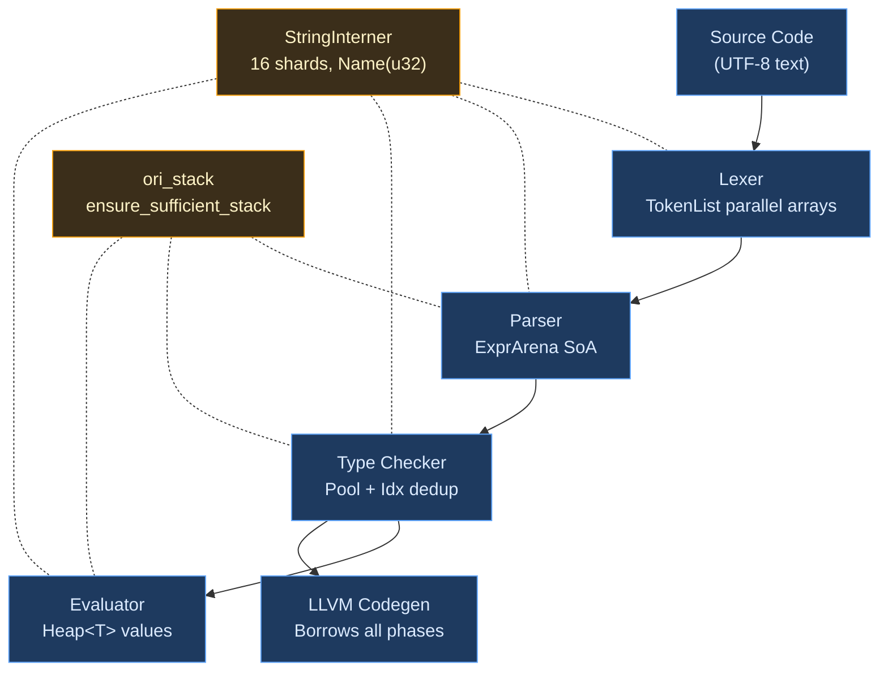

# Appendix B: Memory Management in the Ori Compiler

A compiler is, at its core, a machine that allocates prodigiously and deallocates rarely. Parsing a moderate source file produces tens of thousands of AST nodes. Type inference may instantiate thousands of type variables. The string `self` might appear hundreds of times across a module, and each occurrence must resolve to the same canonical representation in constant time. How a compiler manages this memory determines whether it compiles in milliseconds or seconds, whether it can handle million-line codebases or buckles under the weight of its own allocations.

This appendix documents the memory management strategies used in the Ori compiler, explaining both the mechanisms and the reasoning behind them. Where applicable, it draws connections to established techniques in the literature and to patterns employed by production compilers in other languages.

## 1. Conceptual Foundations

Compiler memory workloads have distinctive characteristics that distinguish them from general application programming. A compiler allocates millions of small, short-lived objects during parsing, retains a subset through type checking, transforms them during optimization passes, and then discards the entire working set when compilation completes. The access patterns are highly structured: the parser writes sequentially, the type checker reads randomly but within a bounded set, and code generation streams through the IR linearly.

Several classical approaches address these patterns:

**Malloc/free per node.** The simplest strategy, and the most expensive. Each AST node requires a separate heap allocation, introducing per-object overhead (typically 16-32 bytes of bookkeeping on modern allocators) and fragmenting the heap. More critically, individual deallocation of thousands of nodes during phase cleanup adds latency proportional to the node count.

**Arena (region) allocation.** First formalized by [Tofte and Talpin (1997)](https://doi.org/10.1006/inco.1997.2706), arena allocation groups objects into regions that are deallocated as a unit. All objects within a phase share a single backing buffer. Allocation is a pointer bump; deallocation is a single free. This eliminates per-object overhead and enables bulk cleanup at phase boundaries.

**Structure-of-Arrays (SoA).** Rather than storing each record as a contiguous struct (Array-of-Structures, AoS), SoA layouts store each field in its own array. When a hot loop only reads one field -- say, expression kinds without their spans -- SoA keeps the working set smaller and improves cache utilization. This is the layout used by [Zig's InternPool](https://github.com/ziglang/zig/blob/master/src/InternPool.zig) and by Ori's expression arena.

**Pools and interning.** When the same value appears repeatedly -- type representations, identifier strings, error messages -- interning ensures each unique value is stored exactly once. All references become small indices into the pool. Equality testing reduces from O(n) string comparison to O(1) index comparison.

**Generational garbage collection.** Some compilers (notably those hosted on the JVM or .NET) use generational GC. The nursery generation handles the high allocation rate of temporary objects efficiently, while the tenured generation holds long-lived data structures. Ori's Rust-hosted compiler does not use GC, relying instead on arenas and explicit lifetimes.

The Ori compiler combines arena allocation, SoA layouts, sharded interning, and type pooling into an integrated memory strategy. Each technique addresses a specific access pattern; together, they form a system where allocation is cheap, comparison is constant-time, and phase cleanup is instantaneous.

## 2. Arena Allocation

The expression arena is the backbone of Ori's intermediate representation. Every expression, statement, pattern, parameter, and match arm produced by the parser lives in a single `ExprArena`, referenced thereafter by compact 32-bit indices.

### Structure-of-Arrays Layout

The arena stores expressions in parallel arrays rather than a single `Vec<Expr>`. Expression kinds (24 bytes each) and spans (8 bytes each) occupy separate contiguous arrays:

```rust
pub struct ExprArena {
    expr_kinds: Vec<ExprKind>,  // 24 bytes per element
    expr_spans: Vec<Span>,      // 8 bytes per element
    expr_lists: Vec<ExprId>,    // flattened child lists
    stmts: Vec<Stmt>,
    params: Vec<Param>,
    arms: Vec<MatchArm>,
    // ... additional parallel arrays for patterns, types, etc.
}
```

Most compiler operations only need the expression kind -- the type checker reads kinds to determine what to infer, the evaluator dispatches on kinds to execute, and the ARC analysis examines kinds to determine ownership. By separating kinds from spans, these hot paths fit more useful data per cache line. The span array is touched only when reporting diagnostics or computing source positions.

### Index Newtypes

All arena references use `#[repr(transparent)]` newtypes over `u32`:

```rust
#[derive(Copy, Clone, Eq, PartialEq, Hash, Debug)]
#[repr(transparent)]
pub struct ExprId(u32);
```

This provides type safety (an `ExprId` cannot be accidentally used as a `StmtId`), `Copy` semantics (no heap allocation, no reference counting), and compact storage (4 bytes versus 8 for a pointer on 64-bit systems). The maximum capacity is `u32::MAX` (approximately 4.3 billion) expressions, which far exceeds any realistic source file.

### Range Types

Sub-sequences within the arena -- function parameters, match arms, list elements -- use compact range types generated by a `define_range!` macro:

```rust
#[derive(Copy, Clone, Eq, PartialEq, Hash, Default)]
#[repr(C)]
pub struct ExprRange {
    pub start: u32,  // offset into expr_lists
    pub len: u16,    // element count (max 65,535)
}
```

At 6 bytes (padded to 8), a range is more compact than a `Vec<ExprId>` (24 bytes) and avoids heap allocation entirely. The `u16` length limit of 65,535 elements per range is sufficient for any syntactic construct -- no function has 65,000 parameters, no match has 65,000 arms. The macro generates `new()`, `is_empty()`, `len()`, and `EMPTY` for each range type, ensuring a consistent API across all range kinds.

### Pre-allocation Heuristic

The arena pre-allocates based on source file size using an empirically tuned heuristic: approximately one expression per 20 bytes of source code. For a 10KB file, this pre-allocates space for roughly 500 expressions:

```rust
pub fn with_capacity(source_len: usize) -> Self {
    let estimated_exprs = source_len / 20;
    ExprArena {
        expr_kinds: Vec::with_capacity(estimated_exprs),
        expr_spans: Vec::with_capacity(estimated_exprs),
        expr_lists: Vec::with_capacity(estimated_exprs / 2),
        stmts: Vec::with_capacity(estimated_exprs / 4),
        // ... proportional scaling for secondary arrays
    }
}
```

This avoids the repeated reallocations that would occur if the vectors started empty and doubled their way up to the final size.

### Benefits

Arena allocation provides three key advantages for compiler workloads. First, **contiguous memory**: all expressions of a given kind are adjacent in memory, enabling efficient sequential access and prefetching. Second, **no individual deallocation**: when a compilation phase completes, the entire arena is dropped as a unit, regardless of how many thousands of nodes it contains. Third, **simple lifetimes**: expressions are valid for the lifetime of the arena, eliminating the need for reference counting or garbage collection within the AST.

## 3. String Interning

Every identifier, keyword, string literal, and type name in an Ori program passes through the string interner. The result is a `Name(u32)` -- a 4-byte handle that encodes both the shard and the local index of the interned string.

### Sharded Architecture

The `StringInterner` uses 16 shards to reduce lock contention during concurrent compilation:

```rust
pub struct StringInterner {
    shards: [RwLock<InternShard>; 16],
    total_count: AtomicUsize,
}

struct InternShard {
    map: FxHashMap<&'static str, u32>,
    strings: Vec<&'static str>,
}
```

Each shard holds an `FxHashMap` for deduplication lookup and a `Vec` for index-to-string resolution. Strings are distributed across shards by hashing the first 8 bytes -- a fast operation that provides reasonable distribution without reading the entire string.

### Name Layout

The `Name(u32)` type packs a shard index and a local index into a single 32-bit word:

```rust
pub struct Name(u32);
// Bits 31-28: shard index (0-15)
// Bits 27-0:  local index within shard (max 268 million per shard)
```

`Name::EMPTY` is defined as `Name(0)`, corresponding to shard 0, local index 0, which holds the pre-interned empty string. This sentinel value is used throughout the AST to represent the absence of a name -- for example, an unlabeled loop stores `Name::EMPTY` in its label field.

### Lifetime Management via Leak

Interned strings are given `'static` lifetime by leaking their allocation:

```rust
let owned: String = s.to_owned();
let leaked: &'static str = Box::leak(owned.into_boxed_str());
```

This is a deliberate design choice, not a memory leak. Interned strings live for the duration of the compilation process and are never individually deallocated. The `'static` lifetime eliminates lifetime parameters that would otherwise propagate through every data structure that holds a `Name`, simplifying the type signatures of the parser, type checker, and evaluator considerably.

### Double-Checked Locking

Interning uses a double-checked locking pattern to minimize write-lock contention:

1. Acquire a **read lock** on the target shard; check if the string is already interned.
2. If found, return the existing `Name` immediately.
3. If not found, release the read lock, acquire a **write lock**, and check again (another thread may have interned the string between releasing the read lock and acquiring the write lock).
4. If still not found, leak the string, insert it, and return the new `Name`.

The read-path fast case requires no allocation and no write lock, which is the common case since most identifiers appear many times after their first occurrence.

### Pre-interned Keywords

At construction, the interner pre-interns all Ori keywords (`if`, `then`, `else`, `let`, `match`, etc.), primitive type names (`int`, `float`, `str`), common identifiers (`main`, `print`, `assert_eq`), and standard library type names (`Option`, `Result`, `Some`, `None`). This ensures that keyword recognition during lexing is a hash lookup that always hits the read-path fast case.

### Memory Savings

The savings from interning are substantial. A `String` in Rust is 24 bytes (pointer + length + capacity) plus the heap-allocated content. A `Name` is 4 bytes total, with the content stored exactly once in the interner regardless of how many times it appears. In a typical source file, common identifiers like `self`, `int`, and variable names may appear hundreds of times; interning reduces these from hundreds of 24+ byte allocations to one 4-byte index each.

## 4. Type Pool

The type pool is the unified storage for all types in a compilation unit. Inspired by [Zig's InternPool](https://github.com/ziglang/zig/blob/master/src/InternPool.zig) and the substitution-array approach used by [Roc](https://github.com/roc-lang/roc), it provides O(1) type equality (index comparison), automatic deduplication, and pre-computed metadata.

### Structure

Types are stored in parallel arrays, following the same SoA principle as the expression arena:

```rust
pub struct Pool {
    items: Vec<Item>,            // tag (u8) + data (u32)
    flags: Vec<TypeFlags>,       // pre-computed metadata
    hashes: Vec<u64>,            // Merkle hashes for deduplication
    extra: Vec<u32>,             // variable-length data for complex types
    intern_map: FxHashMap<u64, Idx>,  // hash-based deduplication
    var_states: Vec<VarState>,   // inference variable state
    next_var_id: u32,
}
```

Each type is represented by an `Idx(u32)` -- a transparent newtype over a 32-bit index. Simple types like `List<int>` store their child type index directly in the `data` field. Complex types like `Function(int, str) -> bool` store an offset into the `extra` array, where their variable-length data (parameter types, return type) resides.

### Pre-interned Primitives

The 12 primitive types are interned at pool construction time at fixed indices:

| Index | Type | Index | Type |
|-------|------|-------|------|
| 0 | `int` | 6 | `unit` |
| 1 | `float` | 7 | `Never` |
| 2 | `bool` | 8 | `Error` |
| 3 | `str` | 9 | `Duration` |
| 4 | `char` | 10 | `Size` |
| 5 | `byte` | 11 | `Ordering` |

Code that needs to check whether a type is `int` can compare `idx == Idx::INT` -- a single integer comparison, with no indirection. Dynamic types (functions, structs, enums, generics) are assigned indices starting from `Idx::FIRST_DYNAMIC`.

### Merkle Hash Deduplication

Types are deduplicated using content-addressed Merkle hashes. When interning a new type, the pool computes a hash that recursively incorporates the hashes of child types rather than their raw indices. This makes the hash **stable across independent Pool instances**: the type `List<int>` produces the same hash regardless of which pool constructed it or in what order other types were interned.

The Merkle property enables efficient cross-module type resolution. When importing a function from another module, the compiler can look up its parameter types by hash rather than re-walking the AST.

### TypeFlags

Each type has a pre-computed `TypeFlags` bitfield that enables O(1) property queries:

- **Presence flags**: `HAS_VAR`, `HAS_ERROR`, `HAS_INFER` -- does this type contain inference variables or errors?
- **Category flags**: `IS_PRIMITIVE`, `IS_CONTAINER`, `IS_FUNCTION`, `IS_COMPOSITE` -- what kind of type is this?
- **Optimization flags**: `NEEDS_SUBST`, `IS_RESOLVED`, `IS_MONO`, `IS_COPYABLE` -- is this type fully resolved? Can it be substituted directly?

Flags propagate upward during construction: `List<T>` inherits `HAS_VAR` from `T` if `T` is a type variable. This allows the type checker to skip substitution passes over types that contain no variables, a significant optimization for large programs.

## 5. Token Storage

The lexer produces tokens into a `TokenList`, which uses three parallel arrays:

```rust
pub struct TokenList {
    tokens: Vec<Token>,       // kind + span (full token data)
    tags: Vec<u8>,            // discriminant tags (1 byte each)
    flags: Vec<TokenFlags>,   // whitespace/trivia metadata
}
```

The `tags` array stores the discriminant index of each token kind as a single byte, enabling the parser to perform O(1) tag comparison without touching the full 16-byte `TokenKind`. When the parser checks "is the next token a left parenthesis?", it reads one byte from the dense tag array rather than loading and matching against the full token variant.

The `TokenList` implements position-independent `Eq` and `Hash`: only token kinds and flags are compared, not spans. This enables [Salsa](https://github.com/salsa-rs/salsa)'s early cutoff optimization -- when a whitespace-only edit shifts token positions without changing token kinds, downstream queries (parsing, type checking) are not re-executed.

## 6. Copy Types

The compiler's most frequently passed values are all `Copy` types with no heap allocation:

```rust
pub struct ExprId(u32);             //  4 bytes
pub struct Name(u32);               //  4 bytes
pub struct Span { start: u32, end: u32 }  //  8 bytes
pub struct Idx(u32);                //  4 bytes
```

These types can be passed by value, stored in arrays, used as hash map keys, and embedded in enum variants without any lifetime complications or reference-counting overhead. A `MethodKey { type_name: Name, method_name: Name }` is 8 bytes total and supports zero-allocation hash lookups in method registries -- compared to the 48+ bytes that a `(String, String)` key would require.

## 7. The `Heap<T>` Wrapper

Runtime values in the interpreter that require heap allocation use a `Heap<T>` wrapper rather than raw `Arc<T>`:

```rust
#[repr(transparent)]
pub struct Heap<T: ?Sized>(Arc<T>);
```

The constructor `Heap::new()` is `pub(super)` -- visible only within the value module. External code cannot create `Heap` instances directly; it must use `Value::string()`, `Value::list()`, and similar factory methods. This prevents accidental bare `Arc` creation and ensures all heap allocations flow through a single point of control.

`Heap<T>` also provides `try_into_inner()` for copy elision (moving the inner value out when the reference count is one) and `make_mut()` for copy-on-write semantics (cloning only when the value is shared). These operations are critical for the interpreter's performance on collection-heavy code, where values are frequently destructured and reconstructed.

## 8. `SharedRegistry` vs `SharedMutableRegistry`

The compiler provides two patterns for sharing registries across compilation phases and threads:

**`SharedRegistry<T>`** wraps `Arc<T>` and is used for registries that are fully populated before use. Once constructed, the inner `T` is immutable. This is the preferred pattern: it has no synchronization overhead on read access, composes cleanly with Salsa's immutable query results, and makes reasoning about data flow straightforward.

**`SharedMutableRegistry<T>`** wraps `Arc<RwLock<T>>` and is used when entries must be added after dependent structures are built. The primary example is the `UserMethodRegistry`, which is cached in the evaluator's `MethodDispatcher` but receives new methods when `load_module()` processes imports. Without interior mutability, the entire dispatcher chain would need to be rebuilt on each module load.

The trade-off is explicit: `SharedMutableRegistry` sacrifices Salsa's automatic invalidation tracking for the ability to accept post-construction additions. This is acceptable because user methods do not change during a single evaluation run, and the registry is rebuilt from scratch when source files change.

## 9. Stack Safety

Deeply nested expressions -- whether in user code or generated by macro expansion -- can exhaust the default thread stack through recursive descent in the parser, type checker, or evaluator. The `ori_stack` crate provides a platform-aware guard:

```rust
const RED_ZONE: usize = 100 * 1024;        // 100KB minimum remaining
const STACK_PER_RECURSION: usize = 1024 * 1024;  // 1MB growth per extension

#[inline]
pub fn ensure_sufficient_stack<R>(f: impl FnOnce() -> R) -> R {
    stacker::maybe_grow(RED_ZONE, STACK_PER_RECURSION, f)
}
```

On native targets, this uses the [`stacker`](https://docs.rs/stacker) crate to dynamically extend the stack when the remaining space drops below the red zone threshold. On WASM targets, the function is a no-op passthrough, since WASM manages its own stack.

The guard is applied at the entry points of all recursive compiler phases: `parse_expr`, `infer_expr`, and `eval_expr`. The overhead on the non-growing path is a single stack pointer comparison -- negligible relative to the work performed by each recursive call. The growth size of 1MB per extension ensures that even pathological nesting depths (100,000+ levels) are handled without stack overflow.

## 10. Performance Annotations

The compiler uses three Rust attributes systematically to guide optimization:

**`#[inline]`** is applied to small, frequently-called functions that cross crate boundaries. Because Rust does not inline across crate boundaries by default, this annotation is essential for functions like `Span::new()`, `ExprId::index()`, and `Pool::tag()` that are called millions of times from downstream crates. Benchmarking confirmed a 20-30% instruction reduction when `#[inline]` was added to the parser's `Index` trait implementations and all precedence-level parse functions.

**`#[track_caller]`** is applied to panicking accessors like `ExprArena::get_expr()` and `Pool::tag()`. When an out-of-bounds access triggers a panic, `#[track_caller]` ensures the panic message reports the *caller's* source location rather than the accessor's, making bugs immediately localizable.

**`#[cold]`** is applied to error factory functions to communicate that they are unlikely execution paths. The evaluator's error module contains dedicated factory functions for each error kind -- division by zero, undefined variable, type mismatch, and so on. Marking these `#[cold]` hints the optimizer to move their code out of the hot path, improving instruction cache utilization for the common non-error case. The same annotation is used on the arena's capacity-overflow panic helpers.

## 11. Prior Art

The memory management patterns in Ori draw from a rich tradition of compiler engineering:

- **[Zig InternPool](https://github.com/ziglang/zig/blob/master/src/InternPool.zig)**: Unified type storage with parallel arrays, hash-based deduplication, and pre-interned primitives at fixed indices. Ori's `Pool` follows this model closely, adding Merkle hashing for cross-module stability.

- **[rustc `ty::TyKind`](https://doc.rust-lang.org/nightly/nightly-rustc/rustc_middle/ty/enum.TyKind.html)**: The Rust compiler's type representation uses interning through an arena-backed `TyCtxt`, ensuring that type equality is pointer comparison. Ori's `Idx`-based equality serves the same purpose with a more compact representation.

- **[V8 Zone allocation](https://v8.dev/)**: The V8 JavaScript engine uses "zones" -- arena-like memory regions that are freed in bulk when a compilation phase completes. Ori's `ExprArena::reset()` method, which clears all vectors while retaining their capacity, follows this pattern.

- **[LLVM BumpPtrAllocator](https://llvm.org/docs/ProgrammersManual.html#the-bumpptralllocator-class)**: LLVM's core allocation strategy for IR nodes. Objects are allocated by bumping a pointer forward in a pre-allocated slab; deallocation is a no-op until the entire allocator is destroyed. Ori's arena allocation is conceptually identical, implemented via `Vec::push` rather than raw pointer arithmetic.

- **[GHC Uniques](https://gitlab.haskell.org/ghc/ghc/-/wikis/commentary/compiler/unique-supply)**: The Glasgow Haskell Compiler assigns each name a globally unique integer identifier, enabling O(1) comparison and hash map lookup. Ori's `Name(u32)` serves the same purpose, with the additional structure of shard-based partitioning for concurrent access.

- **[Roc type substitution arrays](https://github.com/roc-lang/roc)**: Roc uses flat arrays with index-based type variable linking for its Hindley-Milner type inference. Ori's `Pool` with its `VarState` array and path-compressed union-find follows the same approach.

## 12. Design Tradeoffs

Every memory management decision involves tradeoffs. The following are the most consequential choices in Ori's design, along with the reasoning that led to each.

### Arena vs. Individual Allocation

**Choice**: Arena allocation with `Vec`-backed storage.

**Alternative**: Individual heap allocation (`Box<Expr>`) per AST node.

**Reasoning**: Individual allocation introduces 16-32 bytes of allocator bookkeeping per node, fragments the heap across thousands of small allocations, and requires individual deallocation during cleanup. Arena allocation eliminates all three costs. The tradeoff is that individual nodes cannot be freed before the arena is dropped -- but compiler phases have clear phase boundaries where bulk deallocation is the natural cleanup mechanism. No node needs to be freed mid-phase.

### Sharded vs. Single-Lock Interning

**Choice**: 16 shards with per-shard `RwLock`.

**Alternative**: A single `RwLock<HashMap>` for the entire interner.

**Reasoning**: With a single lock, concurrent threads contend on every intern operation. With 16 shards, contention is reduced by a factor of 16 on average, since strings are distributed across shards by hash. The cost is 16 `RwLock` instances and a shard-selection step on every lookup. For sequential compilation (the current default), the overhead is negligible. For future parallel compilation, the sharded design will scale without architectural changes. The shard count of 16 was chosen as a power of two that balances parallelism against the memory overhead of maintaining 16 independent hash maps.

### Parallel Arrays vs. Struct-of-Records

**Choice**: Separate `Vec<ExprKind>` and `Vec<Span>` (SoA).

**Alternative**: Single `Vec<Expr>` where `Expr { kind: ExprKind, span: Span }` (AoS).

**Reasoning**: Profiling showed that the vast majority of compiler operations read expression kinds without touching spans. With AoS layout, reading kinds loads span data into cache lines as well, wasting half the cache bandwidth. With SoA layout, kind-only iteration touches a contiguous array of 24-byte elements with no padding from unused span data. The tradeoff is that reconstructing a full `Expr` (kind + span) requires two array lookups instead of one. Since `Expr` is `Copy` (32 bytes), the reconstruction is cheap, and the hot-path improvement justifies the occasional cold-path cost.

### Leaked Strings vs. Lifetime-Tracked Interning

**Choice**: `Box::leak()` to give interned strings `'static` lifetime.

**Alternative**: Arena-allocated strings with a lifetime parameter (`Name<'arena>`) threaded through the compiler.

**Reasoning**: A lifetime-tracked interner would avoid the permanent memory commitment of leaked strings. However, it would require a lifetime parameter on `Name`, which would propagate to every data structure that stores a name -- `ExprKind`, `Stmt`, `MatchPattern`, `TypeDescriptor`, and dozens more. These types must implement `Clone`, `Eq`, `Hash`, and `Debug` for Salsa compatibility; adding a lifetime parameter to each would complicate every trait implementation and every function signature throughout the compiler. Since interned strings are small (typically 3-20 bytes) and finite in number (bounded by the source vocabulary), the total memory committed by leaking is negligible -- typically under 1MB even for large programs. The simplicity gained by a lifetime-free `Name(u32)` type justifies the committed memory.

### Content-Addressed vs. Index-Based Type Hashing

**Choice**: Merkle hashing that recursively incorporates child type hashes.

**Alternative**: Hashing raw `Idx` values directly.

**Reasoning**: Raw index hashing is simpler and faster (no recursive hash lookups), but produces hashes that are meaningful only within a single `Pool` instance. Two independent pools interning the same type structure would produce different hashes because the constituent types would occupy different indices. Merkle hashing sacrifices some construction-time performance for cross-pool stability: the same type structure always produces the same hash, regardless of interning order or pool identity. This property is essential for efficient cross-module type resolution, where imported types must be matched against locally-interned types without re-walking their entire structure.



The diagram above shows the flow of data through the compiler's memory systems. Each phase allocates into its own primary storage (TokenList, ExprArena, Pool, Heap) while sharing the StringInterner and stack safety utilities across all phases. Data flows forward through the pipeline; later phases borrow from earlier phases but never allocate into them.
