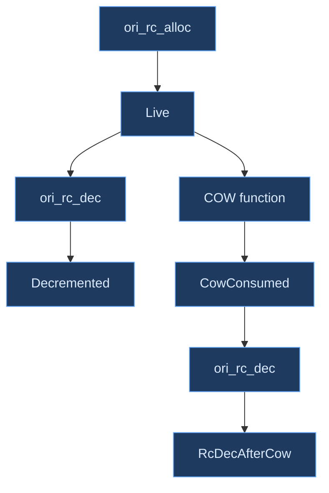

# Appendix D: Debugging Infrastructure

Compilers are among the hardest programs to debug. A bug in lexical analysis may not manifest until code generation, three pipeline stages later. A miscomputed type during inference may produce a valid-looking intermediate representation that only crashes at runtime under specific input. The distance between cause and symptom, both in time and in abstraction, is the defining challenge of compiler debugging.

This appendix documents the debugging infrastructure built into the Ori compiler, treating it as a case study in how modern compiler projects can approach the problem systematically. The techniques described here --- structured tracing, phase dumps, in-pipeline auditing, and runtime instrumentation --- are not Ori-specific patterns. They represent a layered strategy applicable to any multi-phase compilation pipeline.

## Conceptual Foundations

The classical approach to compiler debugging is `printf`. A developer inserts print statements at suspected fault sites, rebuilds, runs, reads output, and iterates. This works for small programs. It fails catastrophically for compilers, for three reasons.

First, **volume**. A compiler processing even a modest source file may execute thousands of type inference steps, pattern match expansions, and intermediate representation transformations. Unstructured print output at this scale is unreadable.

Second, **interference**. Compiler output goes to stdout. Debug output that also goes to stdout corrupts the very artifact under inspection. Interleaving debug traces with emitted code or error messages makes both useless.

Third, **cost**. Print statements that remain in production code impose overhead on every compilation, whether anyone reads the output or not. Print statements that are removed lose institutional knowledge about what was worth observing.

These problems have well-known solutions, each representing a step up in sophistication:

- **Structured logging** replaces `printf` with leveled, targeted, filterable trace events. A developer enables the specific subsystem and verbosity level needed for a particular investigation, leaving all other output suppressed.
- **Phase dumps** serialize the compiler's intermediate representations at well-defined pipeline boundaries. Rather than tracing the *process* of compilation, they capture *snapshots* of its artifacts --- the AST after parsing, the typed IR after inference, the control flow graph after optimization.
- **Auditing passes** walk the intermediate representation programmatically, checking invariants that are too complex for assertions but too important to leave to manual inspection. Where phase dumps show the developer what the compiler produced, auditing passes check whether what it produced is self-consistent.
- **Runtime instrumentation** operates on the *output* of the compiler --- the compiled binary itself --- detecting memory management bugs, reference counting imbalances, and resource leaks that originate in code generation but manifest only during execution.

The Ori compiler implements all four layers.

## The ORI_LOG Tracing System

The Ori compiler's structured logging is built on the [tracing](https://docs.rs/tracing/latest/tracing/) crate, the Rust ecosystem's standard for instrumented, structured, hierarchical diagnostics. The choice of `tracing` over simpler logging frameworks (such as `log` or `env_logger`) is deliberate: `tracing` supports *spans* --- nested regions of execution that naturally model the recursive structure of compilation phases.

### Initialization

Tracing is initialized once, at compiler startup, through a `OnceLock`-guarded setup function. The initialization reads three environment variables in priority order:

1. **`ORI_LOG`** --- the primary filter string, using [EnvFilter](https://docs.rs/tracing-subscriber/latest/tracing_subscriber/filter/struct.EnvFilter.html) syntax.
2. **`RUST_LOG`** --- the standard Rust ecosystem fallback, used when `ORI_LOG` is not set.
3. **Default** --- when neither variable is set, the filter defaults to `warn`, ensuring zero noise during normal usage.

All tracing output is directed to stderr, so it never interferes with the compiler's stdout (which carries program output during `ori run`, or emitted diagnostics in structured formats).

### Output Modes

The system supports two output modes, selected by the `ORI_LOG_TREE` environment variable:

- **Compact mode** (default): a flat, timestamped log using `tracing-subscriber`'s compact formatter. Each event appears on a single line with its target crate and level.
- **Tree mode** (`ORI_LOG_TREE=1`): a hierarchical, indented display using the [tracing-tree](https://docs.rs/tracing-tree/latest/tracing_tree/) crate. Spans nest visually, showing the call structure of instrumented functions. This mode is particularly valuable for understanding type inference, where a single top-level check may recurse through dozens of unification steps.

### Filter Syntax

The `EnvFilter` syntax allows precise control over which crates and modules produce output, and at what verbosity:

```bash
# All crates at debug level
ORI_LOG=debug ori check file.ori

# Single crate at trace level
ORI_LOG=ori_types=trace ori check file.ori

# Multiple crates at different levels
ORI_LOG=ori_types=debug,oric::query=trace ori check file.ori

# Full tree output of type inference
ORI_LOG=ori_types=trace ORI_LOG_TREE=1 ori check file.ori
```

### Tracing Targets

Each compiler crate registers as a distinct tracing target, allowing developers to focus on the pipeline stage relevant to their investigation:

| Target | Content |
|--------|---------|
| `oric` | Salsa query execution, cache hits and misses, top-level pipeline orchestration |
| `ori_types` | Type checking phases, inference steps, unification, trait resolution, type errors |
| `ori_eval` | Expression evaluation, method dispatch, function calls, built-in operations |
| `ori_llvm` | LLVM code generation, ABI decisions, ARC emission, optimization passes |
| `ori_parse` | Parser state transitions (limited instrumentation) |
| `ori_patterns` | Pattern matching compilation (limited instrumentation) |

### Levels

The four active tracing levels follow a consistent convention across all crates:

| Level | Semantics | Typical use |
|-------|-----------|-------------|
| `error` | Internal invariant violations that should never occur | Unreachable states reached, corrupt data structures |
| `warn` | Recoverable issues worth investigating | Fallback paths taken, deprecated features triggered |
| `debug` | Phase boundaries, query-level events, function-granularity progress | Type check pass start/end, Salsa query execution, signature collection |
| `trace` | Per-expression, per-instruction, hot-path detail | Individual inference steps, method dispatch decisions, LLVM instruction emission |

## Phase Dumps

Phase dumps serialize the compiler's intermediate representations to stderr at well-defined pipeline boundaries. They answer the question *"what did the compiler produce at stage X?"* without requiring the developer to understand or instrument the transformation logic between stages.

All phase dump flags are gated behind `#[cfg(debug_assertions)]`, ensuring zero overhead in release builds. The flags are read via the `dbg_set!` macro, which checks whether the corresponding environment variable exists and is not `"0"`.

### Available Dumps

| Variable | Pipeline stage | Content |
|----------|---------------|---------|
| `ORI_DUMP_AFTER_PARSE` | After parsing | Raw AST structure before type checking --- shows how the parser interpreted the source syntax |
| `ORI_DUMP_AFTER_TYPECK` | After type checking | Typed IR with type annotations on every node, resolved method dispatch, and inferred generics |
| `ORI_DUMP_AFTER_ARC` | After ARC lowering | ARC IR with reference counting strategy annotations, drop placement decisions, and COW operations |
| `ORI_DUMP_AFTER_LLVM` | After LLVM codegen | Annotated LLVM IR with Ori-aware comments mapping back to source constructs |
| `ORI_EMIT_ARC_DOT` | After ARC lowering | GraphViz DOT format of the ARC IR control flow graph |

### GraphViz Visualization

The `ORI_EMIT_ARC_DOT` flag produces DOT output suitable for rendering with [GraphViz](https://graphviz.org/). Each function becomes a directed graph where basic blocks are table nodes containing instruction listings, control flow edges represent branches and jumps, and reference counting operations are color-highlighted for visual inspection:

```bash
ORI_EMIT_ARC_DOT=1 ori build file.ori 2> arc.dot
dot -Tsvg arc.dot -o arc.svg
```

This visualization is particularly useful when debugging ARC lowering decisions, where the textual dump may obscure the relationship between RC operations and the control flow paths that govern their execution.

### Dump Composition

Phase dumps compose naturally. Setting multiple dump flags simultaneously produces output from each requested stage in pipeline order, allowing a developer to trace a specific construct through successive transformations:

```bash
ORI_DUMP_AFTER_PARSE=1 ORI_DUMP_AFTER_TYPECK=1 ori check file.ori
```

## Codegen Audit

The codegen audit is the most architecturally distinctive component of Ori's debugging infrastructure. Rather than dumping intermediate representations for human inspection, it walks the in-memory LLVM IR programmatically --- using the [inkwell](https://docs.rs/inkwell/latest/inkwell/) bindings to LLVM's C API --- and checks a set of structural invariants that are difficult to verify by eye.

The audit is gated behind `ORI_AUDIT_CODEGEN=1` and imposes zero cost when disabled. When enabled, it runs after code generation but before optimization, operating on the raw emitted IR where the relationship between source constructs and LLVM instructions is still direct.

### The Four Checks

The audit performs four categories of analysis, each implemented as a separate module:

**RC Balance** tracks pointer states through the reference counting lifecycle using a per-function state machine. Every pointer returned by `ori_rc_alloc` enters the `Live` state. A call to `ori_rc_dec` transitions it to `Decremented`. A COW function call transitions it to `CowConsumed`. The audit flags violations:

- A `Live` pointer at function exit with no corresponding `ori_rc_dec` (leak)
- An `ori_rc_dec` on a pointer already consumed by a COW function (double-free risk)
- An `ori_rc_dec` on an already-decremented pointer (strict mode only)



**COW Rules** verifies that copy-on-write operations follow the correct sequencing protocol. A pointer passed to a COW function must not be reused afterward (the COW function may have freed it), and `ori_rc_dec` must not be called on a pointer *before* it reaches a COW function that expects to manage it.

**ABI Conformance** checks that calls to runtime functions pass the correct number of arguments, that LLVM `load` instructions do not load aggregate types larger than 16 bytes (which triggers [FastISel bugs](https://bugs.llvm.org/) in JIT mode), and that `nounwind` functions are called with `call` rather than `invoke` (avoiding unnecessary landing pad generation).

**Safety Density** counts panic/assert calls and conditional branches targeting panic blocks, computing a per-function density metric (checks per 100 instructions). This is not an error check but a visibility tool: functions with unusually high or low safety check density may indicate over-instrumentation or missing bounds checks, respectively.

### Audit Options

Two additional environment variables modify the audit's behavior:

- **`ORI_AUDIT_STRICT=1`** enables pessimistic analysis. COW functions are treated as always-freeing, so any subsequent `ori_rc_dec` on the same pointer becomes a definite error rather than a warning. Function pointer parameters are tracked as `Live`, catching leaks even for pointers not allocated within the function.
- **`ORI_AUDIT_FUNCTION=name`** restricts the audit to functions whose LLVM name contains the given substring. This is essential for large programs where a full audit produces too much output to be useful.

### Severity Graduation

Findings are classified into three severity levels:

| Severity | Meaning | Example |
|----------|---------|---------|
| Error | Definite correctness bug | Leaked pointer, double decrement |
| Warning | Potential issue requiring human judgment | `ori_rc_dec` after COW (may be intentional) |
| Note | Informational observation | Safety check density statistics |

In strict mode, findings that would normally be warnings are elevated to errors, making the audit suitable for use in CI pipelines where any potential issue should block the build.

### Design Rationale

The audit operates on in-memory LLVM IR rather than textual IR for two reasons. First, parsing textual LLVM IR is fragile --- the format changes across LLVM versions, and comment annotations (which the phase dump adds) would need to be stripped. Second, the inkwell API provides typed access to instruction operands, making it straightforward to extract callee names, argument counts, and type sizes without string parsing.

The audit uses a linear walk rather than full CFG dataflow analysis. This is a deliberate tradeoff: linear analysis handles approximately 95% of RC patterns in the compiler's output (which is predominantly straight-line code with clearly scoped lifetimes), while avoiding the implementation complexity and runtime cost of fixed-point iteration. The linear approach may produce false negatives (missed bugs on conditional paths) but never false positives (spurious warnings on correct code).

## Runtime Instrumentation

The previous sections describe tools that operate during compilation. Runtime instrumentation operates on the *compiled binary itself*, detecting bugs that originate in code generation but manifest only during execution.

These environment variables are read by the AOT runtime library (`ori_rt`), not by the compiler. They are set when running the compiled binary, not when compiling it:

| Variable | Behavior |
|----------|----------|
| `ORI_TRACE_RC=1` | Logs every reference counting event: allocation, increment, decrement, and free. Modes: `1` (summary at exit), `verbose` (per-operation log), `quiet` (statistics only). Attributes each event to its allocation site. |
| `ORI_RT_DEBUG=1` | Enables runtime assertions: RC header validation, bounds checking, underflow detection. These checks are compiled into the runtime but gated behind this flag. |
| `ORI_CHECK_LEAKS=1` | At program exit, reports all live reference-counted objects that were never freed, with allocation-site attribution. |

The three flags compose: setting all three simultaneously produces a comprehensive runtime trace with assertions and a final leak report. A typical debugging session for a suspected memory management bug begins with `ORI_CHECK_LEAKS=1` (cheapest, answers "is there a leak?"), escalates to `ORI_TRACE_RC=1` (more expensive, answers "where is the leak?"), and uses `ORI_RT_DEBUG=1` to catch corruption that might otherwise manifest as a crash far from the root cause.

## Diagnostic Scripts

The `diagnostics/` directory contains shell scripts that compose the low-level debugging primitives into higher-level workflows. Each script supports `--help` for usage information and `--no-color`/`--color` for output formatting control.

### Composite Diagnostics

**`diagnose-aot.sh`** is the all-in-one entry point for investigating AOT compilation issues. Given a source file, it runs a battery of checks in sequence: compilation (with timing), execution (capturing exit code and output), leak detection (`ORI_CHECK_LEAKS=1`), RC balance analysis, and LLVM IR capture. Optional `--valgrind` adds memory error detection; `--verbose` adds native disassembly.

**`dual-exec-debug.sh`** runs a program through both the interpreter (`ori run`) and the AOT backend (`ori build` followed by execution), comparing exit codes and stdout. When the results differ --- indicating a codegen bug --- it automatically runs `ir-dump.sh` and `rc-stats.sh` to capture diagnostic context. This is the primary tool for "it works in the interpreter but crashes when compiled" investigations.

**`dual-exec-verify.sh`** extends the dual-execution concept to batch mode, running an entire test suite through both backends. Supports `--test-only` (only test functions), `--main-only` (only `@main` functions), and `--json` (machine-readable output). Used in CI to detect interpreter/AOT divergence across the full spec test suite.

### Focused Analysis

**`rc-stats.sh`** analyzes LLVM IR for reference counting balance. For each function, it counts `ori_rc_alloc`, `ori_rc_inc`, `ori_rc_dec`, and `ori_rc_free` calls, flagging functions where the counts do not balance. This is a lightweight static check that does not require executing the program.

**`codegen-audit.sh`** wraps the in-pipeline codegen audit (described in the previous section) with additional formatting and filtering options. Supports `--strict` for pessimistic analysis and `--function name` for targeted investigation.

**`ir-dump.sh`** captures annotated LLVM IR for a source file. The default output includes Ori-aware annotations mapping LLVM constructs back to source-level functions and types. The `--raw` flag produces undecorated LLVM IR suitable for processing by external tools.

**`ir-diff.sh`** compares the LLVM IR generated by two different source files side by side. Useful for understanding why two programs that should generate similar code produce different output, or for verifying that a source-level change produces the expected IR-level delta.

**`disasm-ori.sh`** produces native disassembly of a compiled Ori binary with Ori-aware symbol demangling, translating mangled names like `_ori_math$add` back to their source-level equivalents.

**`valgrind-aot.sh`** runs compiled binaries under [Valgrind](https://valgrind.org/) for memory error detection. Defaults to the programs in the `tests/valgrind/` directory. This script is not included in the standard `test-all.sh` suite because Valgrind is not available in all environments.

### Consistency Checking

**`check-debug-flags.sh`** validates that the debugging infrastructure itself is consistent. It performs three checks: every `ORI_*` flag defined in the central `debug_flags.rs` is actually used somewhere in the codebase (no stale flags); every raw `std::env::var("ORI_*")` check in the codebase references a flag defined in `debug_flags.rs` (no orphan checks); and `CLAUDE.md` documents all diagnostic environment variables (no undocumented flags).

## Common Debug Scenarios

This section provides recipe-style guidance for common debugging situations. Each recipe identifies the symptom, the diagnostic approach, and the tools to use.

**"Why is this type wrong?"** --- The type checker is producing an unexpected type for an expression.
```bash
ORI_LOG=ori_types=debug ori check file.ori
```
Shows type checker passes, signature collection, and body checking at function granularity. For per-expression detail, escalate to `trace` with tree output:
```bash
ORI_LOG=ori_types=trace ORI_LOG_TREE=1 ori check file.ori
```

**"Why is Salsa recomputing?"** --- A query that should be cached is being re-executed.
```bash
ORI_LOG=oric::db=debug ori run file.ori
```
Shows `WillExecute` events for cache misses. At `trace` level, also shows cache hits, revealing the full query evaluation pattern.

**"What is happening during evaluation?"** --- The interpreter is producing wrong output or crashing.
```bash
ORI_LOG=ori_eval=debug ori run file.ori
```
Shows function calls and method dispatch at function granularity. Use `trace` for per-expression evaluation detail.

**"Wrong AOT output?"** --- The compiled binary produces different output than the interpreter.
```bash
diagnostics/dual-exec-debug.sh file.ori --verbose
```
Runs both backends, compares results, and automatically captures IR and RC statistics on mismatch.

**"Memory leak?"** --- A compiled program's memory usage grows without bound.
```bash
ORI_CHECK_LEAKS=1 ./compiled_binary
diagnostics/rc-stats.sh file.ori
```
The first command identifies which objects leaked. The second identifies which functions have unbalanced RC operations in the generated code.

**"RC corruption?"** --- A compiled program crashes with a double-free or use-after-free.
```bash
ORI_TRACE_RC=1 ./compiled_binary
ORI_AUDIT_CODEGEN=1 ORI_AUDIT_STRICT=1 ori build file.ori
```
The runtime trace shows the sequence of RC events leading to corruption. The strict codegen audit checks whether the emitted code could produce such a sequence.

## Debug Flags System

The `debug_flags` module in the `oric` crate centralizes all compiler debugging environment variables as the single source of truth. It provides two macros:

- **`dbg_set!(flag)`** returns `true` if the named environment variable is set and not `"0"`. In release builds (when `debug_assertions` is disabled), it evaluates to `false` unconditionally --- the compiler removes the entire check.
- **`dbg_do!(flag, expr)`** executes the expression only when the flag is set. In release builds, the expression is never evaluated and imposes no overhead.

Flag constants are defined using a `flags!` macro that generates `pub const FLAG: &str = stringify!(FLAG)` for each entry, preserving doc comments for IDE hover support and consistency checking.

### Cross-Crate Synchronization

A subtle architectural challenge arises because `ori_llvm` cannot depend on `oric` (the dependency direction is reversed: `oric` depends on `ori_llvm`). The codegen audit flags are therefore defined in both crates --- as constants in `ori_llvm::verify` (the canonical source of truth for the audit module) and as constants in `oric::debug_flags` (the canonical registry of all debug flags).

To prevent these definitions from drifting, the `debug_flags` module includes compile-time assertions that compare the string values:

```rust
#[cfg(feature = "llvm")]
const _: () = {
    assert!(
        const_str_eq(ORI_AUDIT_CODEGEN, ori_llvm::verify::ENV_AUDIT_CODEGEN),
        "ORI_AUDIT_CODEGEN constant drifted between oric and ori_llvm"
    );
    // ... same for ORI_AUDIT_STRICT and ORI_AUDIT_FUNCTION
};
```

This pattern --- inspired by [Roc's `debug_flags` crate](https://github.com/roc-lang/roc) --- ensures that renaming a flag in one location produces a compile error rather than a silent behavioral divergence.

## Instrumentation Guidelines

When adding tracing to new compiler code, the following conventions ensure consistency across crates:

**Public API entry points** receive `#[tracing::instrument]` with `skip_all` or selective `skip` for arguments that are large or do not implement `Debug`:

```rust
#[tracing::instrument(level = "debug", skip_all)]
pub fn check_module(&mut self, module: &Module) -> Result<TypedModule> {
    // ...
}
```

**Per-expression functions** in hot paths use `trace` level and skip arena and engine parameters:

```rust
#[tracing::instrument(level = "trace", skip(engine, arena))]
fn infer_expr(&mut self, engine: &mut InferEngine, arena: &ExprArena, expr: ExprId) -> TypeId {
    // ...
}
```

**Salsa tracked functions** cannot use `#[instrument]` (the Salsa macro infrastructure conflicts). Use manual `tracing::debug!()` events instead:

```rust
#[salsa::tracked]
fn typed_module(db: &dyn Database, source: SourceFile) -> TypedModule {
    tracing::debug!("type checking module");
    // ...
}
```

**Error recording** includes the error kind for structured filtering:

```rust
tracing::debug!(kind = ?error.kind, "type error recorded");
```

**Phase completion** marks pipeline boundaries with a consistent message format:

```rust
tracing::debug!("phase complete: ARC lowering");
```

The overriding rule: always `skip` large or non-Debug arguments. Arenas, engines, pools, and LLVM contexts should never appear in trace output --- they are voluminous, unreadable, and slow to format.

## Prior Art

The Ori compiler's debugging infrastructure draws on established patterns from production compilers:

- [**rustc**](https://rustc-dev-guide.rust-lang.org/): `RUSTC_LOG` (tracing-based, same `EnvFilter` syntax), `-Zdump-mir` for MIR dumps at specified passes, `-Zdump-mir-dir` for dump output control. The `RUSTC_LOG` system was the direct inspiration for `ORI_LOG`.
- [**GCC**](https://gcc.gnu.org/onlinedocs/gcc/Developer-Options.html): `-fdump-tree-all` dumps GIMPLE IR after every tree optimization pass. `-fdump-rtl-all` does the same for RTL. The per-phase dump concept maps directly to Ori's `ORI_DUMP_AFTER_*` flags.
- [**LLVM**](https://llvm.org/docs/CommandGuide/opt.html): `opt -print-after-all` prints IR after every pass. `-print-before=<pass>` and `-print-after=<pass>` target specific passes. The `ORI_DUMP_AFTER_LLVM` flag wraps this capability with Ori-aware annotations.
- [**Zig**](https://ziglang.org/): the debug allocator tracks allocations with stack traces and detects leaks at scope exit. This pattern influenced `ORI_CHECK_LEAKS` and the allocation-site attribution in `ORI_TRACE_RC`.
- [**Go**](https://pkg.go.dev/runtime): `GODEBUG` controls runtime diagnostics (GC tracing, scheduler tracing, memory stats). The environment-variable-gated approach, where the runtime reads flags at startup rather than requiring recompilation, maps directly to Ori's runtime instrumentation flags.

## Design Tradeoffs

Three significant tradeoffs shaped the debugging infrastructure's design:

**Environment variables vs. CLI flags.** All debugging controls use environment variables rather than compiler command-line flags. This avoids polluting the user-facing CLI with developer-only options, allows flags to compose freely (set as many as needed in any combination), and works consistently across all invocation methods (direct, via build scripts, via IDE integrations). The cost is discoverability --- a developer must know the variable names. The `check-debug-flags.sh` consistency script and centralized `debug_flags.rs` documentation mitigate this.

**The `tracing` crate vs. a custom logging system.** The `tracing` crate adds compile-time and runtime overhead: each instrumented span creates a `Span` object, and the subscriber dispatch involves a virtual call per event. A custom system could eliminate this overhead for disabled targets. The tradeoff favors `tracing` because it integrates with the Rust ecosystem (any `tracing`-compatible subscriber works), provides the hierarchical span model that naturally fits compiler phase nesting, and the overhead is negligible relative to the work the compiler performs at each traced point. Benchmarks show less than 1% overhead with all tracing disabled.

**In-pipeline audit vs. post-compilation verification.** The codegen audit runs inside the compiler process, walking in-memory LLVM IR via inkwell. An alternative would be to emit textual IR, then run a separate verification tool. The in-pipeline approach was chosen because it avoids IR serialization/parsing costs, has access to the full LLVM type system through the inkwell API, and runs automatically as part of the build when the flag is set. The cost is coupling: the audit module depends on inkwell's representation of LLVM IR, which must be updated when the LLVM version changes. The textual approach would instead couple to LLVM's IR text format, which is arguably more stable but harder to analyze programmatically.
