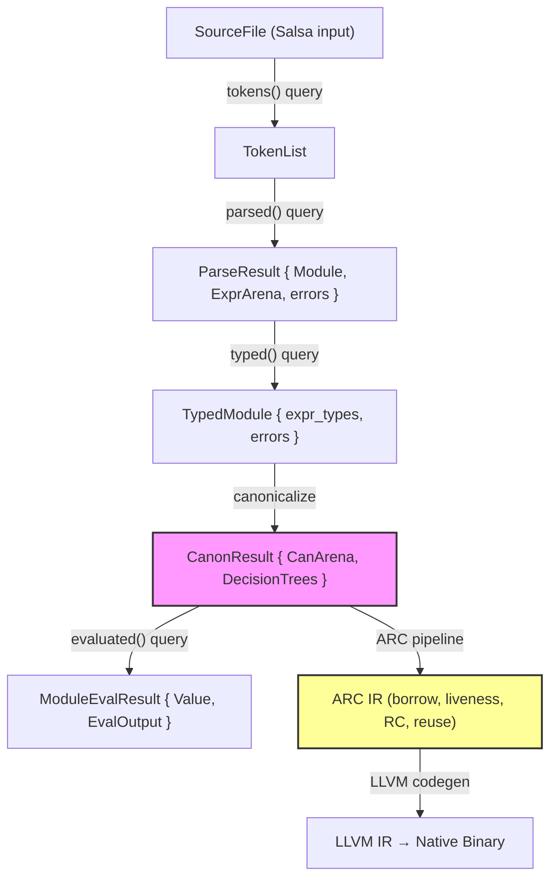

# Overview

This documentation describes the architecture and design decisions of the Ori compiler.

## Design Principle: Lean Core, Rich Libraries

The compiler implements only constructs that require **special syntax** or **static analysis**. Everything else belongs in the standard library.

| Location | What | Why |
|----------|------|-----|
| **Compiler** | blocks (`{ }`), `try`, `match`, `recurse`, `parallel`, `spawn`, `timeout`, `cache`, `with` | Require special syntax, bindings, `self()`, concurrency primitives, or capability checking |
| **Stdlib** | `map`, `filter`, `fold`, `find`, `retry`, `validate` | Standard method calls on collections; no special compiler support needed |

This keeps the compiler small (~30K lines), focused, and maintainable. The stdlib can evolve without compiler changes. When considering new features, ask: *"Does this need special syntax or static analysis?"* If no, it's a library function.

## Expression-Based Design

Ori is an **expression-based language**. Every construct produces a value, and the last expression in any block becomes that block's value. There is no `return` keyword.

| Construct | Value |
|-----------|-------|
| Function body | Last expression is the return value |
| `if...then...else` | Each branch is an expression |
| `match` arms | Each arm is an expression |
| `{ ... }` block | Last expression (without `;`) is the value |
| `for...yield` | Collected values form a list |

**Early exit mechanisms:**
- `?` operator — propagate `Err` or `None` (via `EvalError`)
- `break [value]` — exit loop, optionally with a value
- `panic(msg:)` — terminate with `Never` type

The `return` token is recognized by the lexer only to produce a helpful error message for users coming from other languages.

**Reference languages with expression-based design:**

| Language | Notes |
|----------|-------|
| **Rust** | Closest model — blocks/`if`/`match` are expressions; `return` exists but rarely used |
| **Gleam** | No `return` keyword; last expression is value; similar philosophy to Ori |
| **Roc** | No `return`; purely expression-based; functional |
| **Ruby** | Everything is an expression; implicit returns |
| **Elixir** | Last expression is return value; no explicit return |
| **OCaml/F#** | ML family; all constructs are expressions |
| **Kotlin** | Lambdas use last expression; `if` is an expression |
| **Scala** | Expression-oriented; `return` discouraged |

## Overview

The Ori compiler is a Rust-based incremental compiler built on the Salsa framework. It is organized as a **multi-crate workspace** with clear separation of concerns:

- **`ori_ir`** - Core IR types with no dependencies (AST, arena, interning, derives)
- **`ori_diagnostic`** - Error reporting system
- **`ori_lexer_core`** - Low-level lexer primitives (raw scanner, source buffer, token tags)
- **`ori_lexer`** - Tokenization
- **`ori_types`** - Type system: Pool, inference engine, unification, registries, checking
- **`ori_parse`** - Recursive descent parser
- **`ori_patterns`** - Pattern system, Value types, EvalError (single source of truth)
- **`ori_canon`** - Canonical IR lowering (desugaring, pattern compilation, constant folding)
- **`ori_arc`** - ARC analysis (CanExpr → ARC IR lowering, borrow inference, RC insertion/elimination, reset/reuse, FBIP diagnostics)
- **`ori_eval`** - Core evaluator components (Environment, operators)
- **`ori_fmt`** - Source code formatter (5-layer architecture)
- **`ori_llvm`** - LLVM backend for JIT/AOT compilation
- **`ori_rt`** - Runtime library for AOT-compiled binaries (C-ABI, zero compiler deps)
- **`oric`** - CLI orchestrator, Salsa queries, evaluator, reporting

The compiler features:

- **Incremental compilation** via Salsa's automatic caching and dependency tracking
- **Flat AST representation** using arena allocation for memory efficiency
- **String interning** for O(1) identifier comparison
- **Extensible pattern system** with registry-based pattern definitions
- **Comprehensive diagnostics** with code fixes and multiple output formats

## Statistics

| Component | Lines of Code | Purpose |
|-----------|--------------|---------|
| LLVM Backend | ~30,000 | JIT and AOT code generation |
| Type System | ~28,000 | Pool, inference, unification, registries, checking |
| ARC System | ~23,000 | RC optimization, borrow inference, reset/reuse |
| CLI & Queries | ~19,000 | `oric` orchestrator and Salsa queries |
| Parser | ~18,000 | Recursive descent parsing |
| Evaluator | ~14,000 | Tree-walking interpreter |
| IR | ~13,000 | AST types, arena, visitor, interning |
| Runtime | ~12,000 | AOT runtime library (`ori_rt`) |
| Formatter | ~11,000 | Code formatting engine |
| Patterns | ~10,000 | Pattern system and builtins |
| Lexer | ~8,000 | DFA-based tokenization (core + wrapper) |
| Canonicalization| ~6,000 | Desugaring and pattern compilation |
| Diagnostics | ~4,000 | Error reporting, DiagnosticQueue, fixes |
| **Total** | **~195,000** | |

## Compilation Pipeline

Each step is a Salsa query with automatic caching. If the input doesn't change, the cached output is returned immediately. After canonicalization, the pipeline **forks**: the evaluator (`ori_eval`) interprets the canonical IR directly, while the ARC system (`ori_arc`) lowers it to a basic-block SSA IR with explicit reference counting before LLVM codegen.

## Documentation Sections

### Pipeline Stages (in compilation order)

#### Architecture (Section 01)

- [Architecture Overview](01-architecture/index.md) - High-level compiler structure
- [Compilation Pipeline](01-architecture/pipeline.md) - Query-based pipeline design
- [Salsa Integration](01-architecture/salsa-integration.md) - Incremental compilation framework
- [Data Flow](01-architecture/data-flow.md) - How data moves through the compiler

#### Intermediate Representation (Section 02)

- [IR Overview](02-intermediate-representation/index.md) - Data structures for compilation
- [Flat AST](02-intermediate-representation/flat-ast.md) - Arena-based expression storage
- [Arena Allocation](02-intermediate-representation/arena-allocation.md) - Memory management strategy
- [String Interning](02-intermediate-representation/string-interning.md) - Identifier deduplication
- [Type Representation](02-intermediate-representation/type-representation.md) - Runtime type encoding

#### Lexer (Section 03)

- [Lexer Overview](03-lexer/index.md) - Tokenization design
- [Token Design](03-lexer/token-design.md) - Token types and structure

#### Parser (Section 04)

- [Parser Overview](04-parser/index.md) - Parsing architecture
- [Pratt Parser](04-parser/pratt-parser.md) - Binding power table and operator precedence
- [Error Recovery](04-parser/error-recovery.md) - ParseOutcome, TokenSet, synchronization
- [Grammar Modules](04-parser/grammar-modules.md) - Module organization and naming
- [Incremental Parsing](04-parser/incremental-parsing.md) - IDE reuse of unchanged declarations

#### Type System (Section 05)

- [Type System Overview](05-type-system/index.md) - Type checking architecture
- [Pool Architecture](05-type-system/pool-architecture.md) - SoA storage, interning, type construction
- [Type Inference](05-type-system/type-inference.md) - Hindley-Milner inference
- [Unification](05-type-system/unification.md) - Union-find, rank system, occurs check
- [Type Environment](05-type-system/type-environment.md) - Scope-based type tracking
- [Type Registry](05-type-system/type-registry.md) - User-defined types, traits, methods

#### Pattern System (Section 06)

- [Pattern System Overview](06-pattern-system/index.md) - Pattern architecture
- [Pattern Trait](06-pattern-system/pattern-trait.md) - PatternDefinition interface
- [Pattern Registry](06-pattern-system/pattern-registry.md) - Pattern lookup system
- [Pattern Fusion](06-pattern-system/pattern-fusion.md) - Optimization passes
- [Adding Patterns](06-pattern-system/adding-patterns.md) - How to add new patterns

#### Canonicalization (Section 07)

- [Canonicalization Overview](07-canonicalization/index.md) - Canonical IR lowering architecture
- [Desugaring](07-canonicalization/desugaring.md) - Syntactic sugar elimination
- [Pattern Compilation](07-canonicalization/pattern-compilation.md) - Decision tree construction
- [Constant Folding](07-canonicalization/constant-folding.md) - Compile-time evaluation

#### Evaluator (Section 08)

- [Evaluator Overview](08-evaluator/index.md) - Interpretation architecture
- [Tree Walking](08-evaluator/tree-walking.md) - Execution strategy
- [Environment](08-evaluator/environment.md) - Variable scoping
- [Value System](08-evaluator/value-system.md) - Runtime value representation
- [Module Loading](08-evaluator/module-loading.md) - Import resolution

#### ARC System (Section 09)

- [ARC System Overview](09-arc-system/index.md) - ARC pipeline overview, module structure
- [ARC IR](09-arc-system/arc-ir.md) - IR definitions, type classification
- [Lowering](09-arc-system/lowering.md) - CanExpr → ARC IR
- [Borrow Inference](09-arc-system/borrow-inference.md) - Global ownership inference
- [Liveness](09-arc-system/liveness.md) - Backward dataflow liveness analysis
- [RC Insertion](09-arc-system/rc-insertion.md) - Perceus algorithm RC placement
- [Reset/Reuse](09-arc-system/reset-reuse.md) - In-place constructor reuse
- [RC Elimination](09-arc-system/rc-elimination.md) - Redundant RC pair removal
- [Drop Descriptors](09-arc-system/drop-descriptors.md) - Per-type drop generation
- [Decision Trees](09-arc-system/decision-trees.md) - Pattern compilation in ARC IR

#### LLVM Backend (Section 10)

- [LLVM Backend Overview](10-llvm-backend/index.md) - JIT and AOT code generation architecture
- [AOT Compilation](10-llvm-backend/aot.md) - Native executable and WebAssembly generation
- [Closures](10-llvm-backend/closures.md) - Closure representation and calling conventions
- [User-Defined Types](10-llvm-backend/user-types.md) - Struct types, impl blocks, method dispatch
- [ARC Emitter](10-llvm-backend/arc-emitter.md) - ARC IR → LLVM IR translation
- [Builtins Codegen](10-llvm-backend/builtins-codegen.md) - Built-in function LLVM generation
- [Codegen Verification](10-llvm-backend/codegen-verification.md) - Audit pipeline and RC balance checking

### Subsystem Sections

#### Runtime (Section 11)

- [Runtime Overview](11-runtime/index.md) - `ori_rt` runtime library overview
- [Reference Counting](11-runtime/reference-counting.md) - RC header layout and tracing
- [Collections & COW](11-runtime/collections-cow.md) - Copy-on-write collection semantics
- [String SSO](11-runtime/string-sso.md) - Small string optimization
- [Data Structures](11-runtime/data-structures.md) - List, map, set memory layouts

#### Formatter (Section 12)

- [Formatter Overview](12-formatter/index.md) - 5-layer formatting architecture
- [Spacing](12-formatter/spacing.md) - O(1) token spacing lookup
- [Packing](12-formatter/packing.md) - Container single-line vs multi-line decisions
- [Rules](12-formatter/rules.md) - Breaking rules and priority

### Cross-Cutting Sections

#### Diagnostics (Section 13)

- [Diagnostics Overview](13-diagnostics/index.md) - Error reporting system
- [Problem Types](13-diagnostics/problem-types.md) - Error categorization
- [Code Fixes](13-diagnostics/code-fixes.md) - Automatic fix suggestions
- [Emitters](13-diagnostics/emitters.md) - Output format handlers

#### Testing (Section 14)

- [Testing Overview](14-testing/index.md) - Test system architecture
- [Test Discovery](14-testing/test-discovery.md) - Finding test functions
- [Test Runner](14-testing/test-runner.md) - Parallel test execution

#### Platform Targets (Section 15)

- [Platform Targets Overview](15-platform-targets/index.md) - Native vs WASM compilation
- [Conditional Compilation](15-platform-targets/conditional-compilation.md) - Platform-specific code patterns
- [WASM Target](15-platform-targets/wasm-target.md) - WebAssembly considerations
- [Recursion Limits](15-platform-targets/recursion-limits.md) - Stack safety implementation

### Appendices

- [Salsa Patterns](appendices/A-salsa-patterns.md) - Common Salsa usage patterns
- [Memory Management](appendices/B-compiler-memory.md) - Compiler-internal allocation strategies
- [Error Codes](appendices/C-error-codes.md) - Complete error code reference
- [Debugging](appendices/D-debugging.md) - Debug flags and tracing
- [Coding Guidelines](appendices/E-coding-guidelines.md) - Code style, testing, best practices

## Source Paths

The compiler is organized as a multi-crate workspace:

| Crate | Path | Purpose |
|-------|------|---------|
| `ori_ir` | `compiler/ori_ir/src/` | Core IR types (tokens, spans, AST, arena, interning, derives) |
| `ori_diagnostic` | `compiler/ori_diagnostic/src/` | DiagnosticQueue, error reporting, suggestions, emitters |
| `ori_lexer_core` | `compiler/ori_lexer_core/src/` | Low-level lexer primitives: raw scanner, source buffer, token tags |
| `ori_lexer` | `compiler/ori_lexer/src/` | Tokenization via logos |
| `ori_types` | `compiler/ori_types/src/` | Pool, Idx, InferEngine, ModuleChecker, registries |
| `ori_parse` | `compiler/ori_parse/src/` | Recursive descent parser |
| `ori_patterns` | `compiler/ori_patterns/src/` | Pattern definitions, Value types, EvalError, EvalContext |
| `ori_eval` | `compiler/ori_eval/src/` | Environment, OperatorRegistry (core eval components) |
| `ori_fmt` | `compiler/ori_fmt/src/` | Source code formatter (5-layer architecture) |
| `ori_canon` | `compiler/ori_canon/src/` | Canonical IR lowering: desugaring, pattern compilation, constant folding |
| `ori_arc` | `compiler/ori_arc/src/` | ARC analysis: borrow inference, RC insertion/elimination, reset/reuse |
| `ori_llvm` | `compiler/ori_llvm/src/` | LLVM backend for JIT/AOT compilation |
| `ori_rt` | `compiler/ori_rt/src/` | Runtime library for AOT-compiled binaries |
| `ori_stack` | `compiler/ori_stack/src/` | Stack safety utilities (stacker integration) |
| `ori_compiler` | `compiler/ori_compiler/src/` | Salsa-free compiler driver for WASM/testing |
| `oric` | `compiler/oric/src/` | CLI, Salsa queries, eval orchestration, reporting |
| `ori-lsp` | `tools/ori-lsp/src/` | Language Server Protocol support |

**Note:** `oric` modules (`ir`, `parser`, `diagnostic`, `types`) re-export from source crates for DRY.

### oric Internal Paths

| Component | Path |
|-----------|------|
| Library root | `compiler/oric/src/lib.rs` |
| Salsa database | `compiler/oric/src/db.rs` |
| Query system | `compiler/oric/src/query/` |
| Evaluator | `compiler/oric/src/eval/` |
| Problem types | `compiler/oric/src/problem/` |
| Diagnostic rendering | `compiler/oric/src/reporting/` |
| Tests | `compiler/oric/src/test/` |

### Architecture Notes

- **Patterns**: Pattern definitions and Value types are in `ori_patterns`. oric re-exports from this crate.
- **Environment**: The `Environment` type for variable scoping is in `ori_eval`. oric uses this directly.
- **Re-exports**: oric modules (`ir`, `types`, `diagnostic`) re-export from their source crates for DRY.
