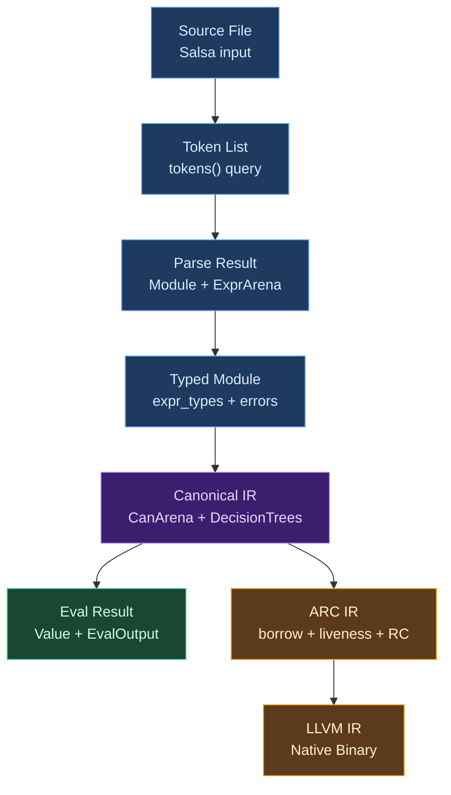

# Ori Compiler Design

## What This Document Covers

This is the design documentation for the Ori compiler — a multi-crate Rust codebase that compiles a statically-typed, expression-based language with Hindley-Milner type inference, automatic reference counting, and capability-based effects. The compiler features a dual backend: a tree-walking interpreter for rapid development and a full LLVM pipeline for native binaries and WebAssembly.

These documents serve the same purpose as a compiler textbook's case study chapters: they explain not just *what* each component does, but *why* it was designed that way, what alternatives were considered, and how the pieces fit together. Each section opens with the general compiler concept — what problem it solves, what the classical approaches are — then shows how Ori applies and adapts those ideas.

## The Anatomy of a Compiler

A compiler is a program that translates source code from one language to another — typically from a high-level language humans write to a low-level form machines execute. Every compiler, regardless of language, must solve the same fundamental problems:

1. **Lexical analysis** — Breaking source text into tokens (words, operators, punctuation)
2. **Parsing** — Organizing tokens into a tree structure that reflects the program's grammar
3. **Semantic analysis** — Checking that the program makes sense (types match, variables are defined, etc.)
4. **Optimization** — Transforming the program to run faster or use less memory without changing its meaning
5. **Code generation** — Producing the target output (machine code, bytecode, another language)

What makes each compiler interesting is the specific tradeoffs it makes at each stage. A compiler for a dynamically-typed language might skip semantic analysis entirely. A JIT compiler might skip optimization in favor of startup speed. A research compiler might explore novel type systems at the cost of compilation time.

Ori's compiler makes several distinctive choices across these stages that are worth understanding before diving into the details.

## What Makes Ori's Compiler Distinctive

### Dual Backend with Shared Canonical IR

Most compilers have one backend. Ori has two: a tree-walking interpreter for `ori run` (instant feedback during development) and a full LLVM pipeline for `ori build` (native performance for production). Both consume the same canonical IR — a sugar-free, type-annotated intermediate representation produced by a single canonicalization pass. This means desugaring, pattern compilation, and constant folding happen exactly once, regardless of which backend executes the result.

### Incremental Everything via Salsa

The compiler is built on the [Salsa](https://salsa-rs.netlify.app/) framework, which provides automatic incremental computation. Every phase — lexing, parsing, type checking, evaluation — is a Salsa query whose result is memoized. When a source file changes, only the affected queries re-execute. This matters for IDE integration: editing one function doesn't re-type-check the entire module.

### AIMS (ARC Intelligent Memory System) — Not GC, Not Borrow Checking

Ori uses automatic reference counting with compile-time optimizations inspired by [Perceus](https://www.microsoft.com/en-us/research/publication/perceus-garbage-free-reference-counting-with-reuse/) (Reinking et al., 2021) and [Lean 4](https://leanprover.github.io/). AIMS performs interprocedural contract analysis, backward dataflow analysis, unified realization, and reuse emission — all as compiler passes over a dedicated ARC IR. This sits between the simplicity of garbage collection (no borrow checker for users to fight) and the determinism of manual memory management (no GC pauses).

### Expression-Based with No Return

Ori is expression-based in the ML/Rust tradition: every construct produces a value, and the last expression in a block is that block's value. There is no `return` keyword — the language deliberately omits it, recognizing `return` only in the lexer to produce a helpful error for users coming from other languages.

| Construct | Value |
|-----------|-------|
| Function body | Last expression is the return value |
| `if...then...else` | Each branch is an expression |
| `match` arms | Each arm is an expression |
| `{ ... }` block | Last expression (without `;`) is the value |
| `for...yield` | Collected values form a list |

Early exit is handled through `?` (propagate errors), `break` (exit loops), and `panic` (diverge with `Never` type).

### Lean Core, Rich Libraries

The compiler implements only constructs that require special syntax or static analysis. Everything else — data transformation, string utilities, collection operations — belongs in the standard library as regular method calls.

| In Compiler | In Stdlib |
|-------------|-----------|
| `{ }` blocks, `try { }`, `match` (bindings, early return) | `map`, `filter`, `fold`, `find` (collection methods) |
| `recurse` (self-referential `self()`) | `retry`, `validate` (library functions) |
| `parallel`, `spawn`, `timeout` (concurrency) | |
| `cache`, `with` (capability-aware resources) | |

The test is simple: *"Does this need special syntax or static analysis?"* If not, it's a library function. This keeps the compiler focused and allows the stdlib to evolve without compiler changes.

### Capability-Based Effects

Side effects are tracked through a capability system. Functions declare what they need (`uses Http, FileSystem`), and callers must provide those capabilities (`with Http = MockHttp in expr`). This enables compile-time effect tracking and trivial mocking in tests — no dependency injection frameworks required.

## Compilation Pipeline

Each step is a Salsa query with automatic memoization. After canonicalization, the pipeline **forks**: the interpreter consumes canonical IR directly, while AIMS lowers it to a basic-block SSA IR with explicit reference counting before LLVM codegen.

## Compiler Architecture

The compiler is organized as a multi-crate Rust workspace. Dependencies flow strictly downward — later phases depend on earlier ones, never the reverse.

| Crate | Purpose |
|-------|---------|
| **`ori_ir`** | Core IR types (AST, arena, interning, derives) — no dependencies |
| **`ori_diagnostic`** | Error reporting, DiagnosticQueue, suggestions, emitters |
| **`ori_lexer_core`** | Raw scanner, source buffer, token tags |
| **`ori_lexer`** | Tokenization (cooking layer over core) |
| **`ori_parse`** | Recursive descent Pratt parser |
| **`ori_types`** | Type system: Pool, InferEngine, unification, registries |
| **`ori_patterns`** | Pattern system, Value types, EvalError |
| **`ori_canon`** | Canonical IR lowering (desugaring, pattern compilation, constant folding) |
| **`ori_eval`** | Tree-walking interpreter components |
| **`ori_arc`** | ARC analysis (borrow inference, RC insertion/elimination, reset/reuse) |
| **`ori_llvm`** | LLVM backend for JIT and AOT compilation |
| **`ori_rt`** | Runtime library for AOT binaries (C ABI, zero compiler deps) |
| **`ori_fmt`** | Source code formatter (5-layer architecture) |
| **`oric`** | CLI orchestrator, Salsa queries, reporting |

## Documentation Sections

### Pipeline Stages (in compilation order)

#### Architecture (Section 01)

- [Architecture Overview](01-architecture/index.md) - High-level compiler structure
- [Compilation Pipeline](01-architecture/pipeline.md) - Query-based pipeline design
- [Salsa Integration](01-architecture/salsa-integration.md) - Incremental compilation framework
- [Data Flow](01-architecture/data-flow.md) - How data moves through the compiler

#### Intermediate Representation (Section 02)

- [IR Overview](02-intermediate-representation/index.md) - Data structures for compilation
- [Flat AST](02-intermediate-representation/flat-ast.md) - Arena-based expression storage
- [Arena Allocation](02-intermediate-representation/arena-allocation.md) - Memory management strategy
- [String Interning](02-intermediate-representation/string-interning.md) - Identifier deduplication
- [Type Representation](02-intermediate-representation/type-representation.md) - Runtime type encoding

#### Lexer (Section 03)

- [Lexer Overview](03-lexer/index.md) - Tokenization design
- [Token Design](03-lexer/token-design.md) - Token types and structure

#### Parser (Section 04)

- [Parser Overview](04-parser/index.md) - Parsing architecture
- [Pratt Parser](04-parser/pratt-parser.md) - Binding power table and operator precedence
- [Error Recovery](04-parser/error-recovery.md) - ParseOutcome, TokenSet, synchronization
- [Grammar Modules](04-parser/grammar-modules.md) - Module organization and naming
- [Incremental Parsing](04-parser/incremental-parsing.md) - IDE reuse of unchanged declarations

#### Type System (Section 05)

- [Type System Overview](05-type-system/index.md) - Type checking architecture
- [Pool Architecture](05-type-system/pool-architecture.md) - SoA storage, interning, type construction
- [Type Inference](05-type-system/type-inference.md) - Hindley-Milner inference
- [Unification](05-type-system/unification.md) - Union-find, rank system, occurs check
- [Type Environment](05-type-system/type-environment.md) - Scope-based type tracking
- [Type Registry](05-type-system/type-registry.md) - User-defined types, traits, methods

#### Pattern System (Section 06)

- [Pattern System Overview](06-pattern-system/index.md) - Pattern architecture
- [Pattern Trait](06-pattern-system/pattern-trait.md) - PatternDefinition interface
- [Pattern Registry](06-pattern-system/pattern-registry.md) - Pattern lookup system
- [Pattern Fusion](06-pattern-system/pattern-fusion.md) - Optimization passes
- [Adding Patterns](06-pattern-system/adding-patterns.md) - How to add new patterns

#### Canonicalization (Section 07)

- [Canonicalization Overview](07-canonicalization/index.md) - Canonical IR lowering architecture
- [Desugaring](07-canonicalization/desugaring.md) - Syntactic sugar elimination
- [Pattern Compilation](07-canonicalization/pattern-compilation.md) - Decision tree construction
- [Constant Folding](07-canonicalization/constant-folding.md) - Compile-time evaluation

#### Evaluator (Section 08)

- [Evaluator Overview](08-evaluator/index.md) - Interpretation architecture
- [Tree Walking](08-evaluator/tree-walking.md) - Execution strategy
- [Environment](08-evaluator/environment.md) - Variable scoping
- [Value System](08-evaluator/value-system.md) - Runtime value representation
- [Module Loading](08-evaluator/module-loading.md) - Import resolution

#### AIMS (Section 09)

- [AIMS Overview](09-aims/index.md) - AIMS pipeline overview, module structure
- [ARC IR](09-aims/arc-ir.md) - IR definitions, type classification
- [Lowering](09-aims/lowering.md) - CanExpr → ARC IR
- [Interprocedural Contracts](09-aims/borrow-inference.md) - SCC-based contract computation
- [Backward Dataflow Analysis](09-aims/liveness.md) - 7D lattice analysis algorithm
- [Unified Realization](09-aims/rc-insertion.md) - RC, reuse, COW, and drop emission
- [Reuse Emission](09-aims/reset-reuse.md) - In-place constructor and collection reuse
- [RC Optimization](09-aims/rc-elimination.md) - Redundancy avoidance and remaining elimination
- [Drop Descriptors](09-aims/drop-descriptors.md) - Per-type drop generation
- [Decision Trees](09-aims/decision-trees.md) - Pattern compilation in ARC IR

#### LLVM Backend (Section 10)

- [LLVM Backend Overview](10-llvm-backend/index.md) - JIT and AOT code generation architecture
- [AOT Compilation](10-llvm-backend/aot.md) - Native executable and WebAssembly generation
- [Closures](10-llvm-backend/closures.md) - Closure representation and calling conventions
- [User-Defined Types](10-llvm-backend/user-types.md) - Struct types, impl blocks, method dispatch
- [ARC Emitter](10-llvm-backend/arc-emitter.md) - ARC IR → LLVM IR translation
- [Builtins Codegen](10-llvm-backend/builtins-codegen.md) - Built-in function LLVM generation
- [Codegen Verification](10-llvm-backend/codegen-verification.md) - Audit pipeline and RC balance checking

### Subsystem Sections

#### Runtime (Section 11)

- [Runtime Overview](11-runtime/index.md) - `ori_rt` runtime library overview
- [Reference Counting](11-runtime/reference-counting.md) - RC header layout and tracing
- [Collections & COW](11-runtime/collections-cow.md) - Copy-on-write collection semantics
- [String SSO](11-runtime/string-sso.md) - Small string optimization
- [Data Structures](11-runtime/data-structures.md) - List, map, set memory layouts

#### Formatter (Section 12)

- [Formatter Overview](12-formatter/index.md) - 5-layer formatting architecture
- [Spacing](12-formatter/spacing.md) - O(1) token spacing lookup
- [Packing](12-formatter/packing.md) - Container single-line vs multi-line decisions
- [Rules](12-formatter/rules.md) - Breaking rules and priority

### Cross-Cutting Sections

#### Diagnostics (Section 13)

- [Diagnostics Overview](13-diagnostics/index.md) - Error reporting system
- [Problem Types](13-diagnostics/problem-types.md) - Error categorization
- [Code Fixes](13-diagnostics/code-fixes.md) - Automatic fix suggestions
- [Emitters](13-diagnostics/emitters.md) - Output format handlers

#### Testing (Section 14)

- [Testing Overview](14-testing/index.md) - Test system architecture
- [Test Discovery](14-testing/test-discovery.md) - Finding test functions
- [Test Runner](14-testing/test-runner.md) - Parallel test execution

#### Platform Targets (Section 15)

- [Platform Targets Overview](15-platform-targets/index.md) - Native vs WASM compilation
- [Conditional Compilation](15-platform-targets/conditional-compilation.md) - Platform-specific code patterns
- [WASM Target](15-platform-targets/wasm-target.md) - WebAssembly considerations
- [Recursion Limits](15-platform-targets/recursion-limits.md) - Stack safety implementation

### Appendices

- [Salsa Patterns](appendices/A-salsa-patterns.md) - Common Salsa usage patterns
- [Memory Management](appendices/B-compiler-memory.md) - Compiler-internal allocation strategies
- [Error Codes](appendices/C-error-codes.md) - Complete error code reference
- [Debugging](appendices/D-debugging.md) - Debug flags and tracing
- [Coding Guidelines](appendices/E-coding-guidelines.md) - Code style, testing, best practices
