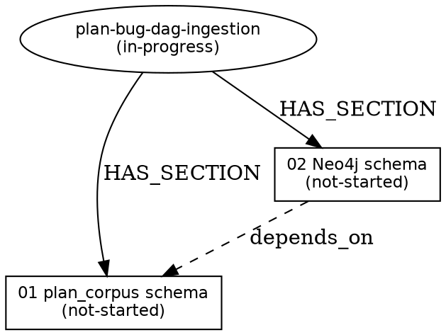

# Section 04: Plumbing query subcommands

**Status:** In Progress (§04.1–§04.7 complete; §04.R TPR pending)
**Goal:** Deliver 5 plumbing query subcommands — `plan-status`, `blocks`, `bugs-for`, `symbol-plans`, `dag-ascii` — in `~/projects/lang_intelligence/neo4j/query_graph.py`, routed through `ori_lang/scripts/intel-query.sh`. These answer the mission's four query patterns ("what plans touch symbol X", "full blocked-by chain to ship section Y", "what bugs block plan Z", "impact radius of fix-BUG-XX-NNN") with machine-oriented JSON and human-oriented output. Rich UX (interactive filters, fuzzy search, cross-subcommand piping) is deferred to `plans/query-intel-adoption/section-08`.

**Success Criteria:**

- [x] `~/projects/lang_intelligence/neo4j/query_graph.py` `commands` dict has 5 new entries: `plan-status → cmd_plan_status`, `blocks → cmd_blocks`, `bugs-for → cmd_bugs_for`, `symbol-plans → cmd_symbol_plans`, `dag-ascii → cmd_dag_ascii`
- [x] Each handler matches the canonical pattern: `def cmd_X(args, json_mode=False)`, uses `_parse_flags(args)` for `--limit` and `--repo`, opens `with get_driver() as driver:`, returns a raw data dict when `json_mode=True`, prints human output otherwise
- [x] `cmd_plan_status` returns `{plan, status, section_count, completed_sections, open_sections, blocker_count, bug_count}` aggregated via a single Cypher aggregate query
- [x] `cmd_blocks` returns the transitive closure over `BLOCKED_BY + DEPENDS_ON` edges from a node ID to its root blocker(s); depth cap 10; human mode prints an indented tree with `↳` arrows
- [x] `cmd_bugs_for` returns all open `:Bug` nodes blocking any `:PlanSection` of the named plan, sorted by severity (critical → high → medium → low)
- [x] `cmd_symbol_plans` returns all `:Plan | :PlanSection | :Bug | :FixSection | :Subsection` nodes that reference a symbol via the `MENTIONS_CODE → CodeReference → RESOLVES_TO` bridge; grouped by mention_kind (declared first)
- [x] `cmd_dag_ascii` renders plan hierarchy + blocker edges as ASCII box-drawing tree (default) or Graphviz DOT (`--format dot`); JSON mode returns structured section/subsection/edge list
- [x] `scripts/intel-query.sh` requires no changes — the wrapper is already subcommand-agnostic and passes all args through unchanged (verified by inspection and smoke test)
- [x] All 5 new subcommands appear in the module-level docstring and in the `commands` dict at the bottom of `query_graph.py`
- [x] `pytest ~/projects/lang_intelligence/tests/test_query_plan_bug.py` green — covers each subcommand × (json_mode=True, json_mode=False) × (populated, empty, edge cases)
- [x] Rich UX deferred boundary documented in both this section and in `plans/query-intel-adoption/section-08-tool-ux-and-output.md`
- [x] Satisfies mission criterion: "`query_graph.py` exposes five new subcommand handlers ... verified by unit tests in `tests/test_query_plan_bug.py` using fixture graph state"

**Context:** `query_graph.py` already has 19 subcommands (lines 1200–1219 of the commands dict). The handler pattern is established and consistent across all 19: `_parse_flags(args)` strips `--repo`, `--limit`, `--json`; `with get_driver() as driver: with driver.session() as s:` opens the connection; `json_mode=True` returns a raw dict (the wrapper adds the `{"status":"ok","data":...}` envelope); human mode prints to stdout. The 5 new handlers must follow this pattern verbatim — no forking, no parallel patterns. `intel-query.sh` is already subcommand-agnostic (lines 230–250 pass `"${PASS_ARGS[@]}"` directly to `query_graph.py`) so dispatch extension requires zero wrapper changes.

**Depends on:** Section 02 — the `schema.cypher` node labels (`:Plan`, `:PlanSection`, `:Bug`, `:FixSection`, `:Subsection`, `:Overview`, `:BugTrackerSection`) and edge types (`BLOCKED_BY`, `DEPENDS_ON`, `HAS_SECTION`, `HAS_OVERVIEW`, `MENTIONS_CODE`, `RESOLVES_TO`) must exist before Cypher queries against them are meaningful. (Implementation-time note: handlers can be written and unit-tested with MagicMock before §02 lands; end-to-end smoke tests require §02's schema to be deployed.)

---

## Intelligence Reconnaissance

Queries run 2026-04-17:

- `scripts/intel-query.sh --human symbols "cmd_" --repo ori --limit 10` — 1 result: `test_gcc_linker_cmd_accessor` [ori:compiler/oric/tests/phases/codegen/linker_gcc.rs:271]. This confirms the graph indexes Rust symbols only; Python `query_graph.py` functions are absent. Expected result — the `cmd_*` handler pattern lives in Python, not Rust.
- `scripts/intel-query.sh --human file-symbols "query_graph" --repo ori` — 0 results. Confirms `query_graph.py` is not indexed. Manual reading of `query_graph.py` (1242 lines) was the primary source for understanding handler patterns.
- `scripts/intel-query.sh --human similar "cypher transitive closure" --repo rust,swift,go --limit 5` — symbol not found / no embedding. Phrase-level queries require embeddings; not available for this freeform string. No cross-repo prior art found via vector search.
- `scripts/intel-query.sh --human search "graph query ergonomics" --limit 5` — 5 results (rust#114077 ICE in dep node forcing query, rust#151789 pin/match ergonomics, swift#81087 CxxStack protocol, rust#152654 node collection). None related to plan-metadata query UX. Graph ergonomics for plan/bug query is a novel construct.

Results summary (≤500 chars): Graph available (Neo4j 5.26.24, 32K+ Ori symbols, 505K+ CALLS). All four queries returned zero relevant results — the graph indexes Rust/compiled symbols only; Python `query_graph.py` is absent. No cross-repo prior art for plan-metadata Cypher subcommands found. Implementation is grounded entirely by manual reading of `query_graph.py` (canonical handler pattern), `schema.cypher` (edge types established by §02), and the 4-query pattern from the mission. Intel graph blast-radius: zero Rust code changes; Python-only additions.

---

## 04.1 cmd_plan_status handler + Cypher

**File:** `~/projects/lang_intelligence/neo4j/query_graph.py`

This handler answers: "What is the current state of plan X?" in a single aggregate query. It is the simplest of the five handlers — one Cypher query, one row, no pagination.

### Handler signature

```python
def cmd_plan_status(args, json_mode=False):
    """Show aggregate status for a plan: section count, completion, blockers, open bugs."""
```

### Argument parsing

Parse the first positional argument from `_parse_flags(args)` as the plan name. The plan name matches the `p.name` property on `:Plan` nodes (e.g., `plan-bug-dag-ingestion`). If no argument is given, raise `ValueError` with a usage hint.

```python
plan_name, _, _, _, _ = _parse_flags(args)
if not plan_name:
    raise ValueError("Usage: plan-status <plan-name>")
```

### Cypher query

The aggregate query uses `OPTIONAL MATCH` arms (not `WHERE NOT NULL`) so that plans with zero sections or zero bugs still return a single row rather than no rows:

```cypher
MATCH (p:Plan {name: $plan_name})
OPTIONAL MATCH (p)-[:HAS_OVERVIEW]->(o:Overview)
OPTIONAL MATCH (p)-[:HAS_SECTION]->(s:PlanSection)
OPTIONAL MATCH (s)<-[:BLOCKED_BY]-(blocker)
OPTIONAL MATCH (s)<-[:BLOCKED_BY]-(b:Bug)
WHERE b.status = 'open' OR b IS NULL
RETURN p.name AS name, p.status AS status, o.status AS overview_status,
       count(DISTINCT s) AS section_count,
       sum(CASE WHEN s.status = 'complete' THEN 1 ELSE 0 END) AS completed_sections,
       count(DISTINCT blocker) AS blocker_count,
       count(DISTINCT CASE WHEN b.status = 'open' THEN b END) AS bug_count
```

**Important:** `count(DISTINCT CASE WHEN b.status = 'open' THEN b END)` correctly counts only open bugs even when the `OPTIONAL MATCH` returns non-`null` nodes for closed bugs. The `WHERE` clause above is for documentation clarity; the `CASE WHEN` in `count` is the actual filter. The implementation should use:

```cypher
MATCH (p:Plan {name: $plan_name})
OPTIONAL MATCH (p)-[:HAS_OVERVIEW]->(o:Overview)
OPTIONAL MATCH (p)-[:HAS_SECTION]->(s:PlanSection)
OPTIONAL MATCH (s)<-[:BLOCKED_BY]-(blocker)
OPTIONAL MATCH (s)<-[:BLOCKED_BY]-(b:Bug)
RETURN p.name AS name, p.status AS status, o.status AS overview_status,
       count(DISTINCT s) AS section_count,
       sum(CASE WHEN s.status = 'complete' THEN 1 ELSE 0 END) AS completed_sections,
       count(DISTINCT blocker) AS blocker_count,
       count(DISTINCT CASE WHEN b.status = 'open' THEN b ELSE null END) AS bug_count
```

### Return dict (json_mode=True)

```python
{
    "plan": plan_name,
    "status": row["status"],
    "overview_status": row["overview_status"],  # None if no overview node
    "section_count": row["section_count"],
    "completed_sections": row["completed_sections"] or 0,
    "open_sections": (row["section_count"] or 0) - (row["completed_sections"] or 0),
    "blocker_count": row["blocker_count"] or 0,
    "bug_count": row["bug_count"] or 0,
}
```

### Human output (json_mode=False)

```
Plan: plan-bug-dag-ingestion (in-progress)
  Sections: 6 total, 0 complete, 6 open
  Blockers: 0
  Open bugs: 0
```

### Error path

When `result.single()` returns `None` (plan node not found in graph):

```python
if not rec:
    if json_mode:
        return {"status": "error", "reason": f"plan not found: {plan_name}"}
    print(f"Plan '{plan_name}' not found in graph.", file=sys.stderr)
    sys.exit(1)
```

**Note:** The handler calls `sys.exit(1)` in human mode for "not found" errors, matching the behavior of `cmd_related` (line 289 of `query_graph.py`). In json_mode, it returns the error dict (the caller in `main()` handles `result is not None` → `print(json.dumps(result))`; the wrapper then wraps it in `{"status":"ok","data":...}` — the error dict is the data, not a wrapper-level error). This means the exit code is 0 for a not-found result in json_mode. This is consistent with existing handlers and allows callers to distinguish "graph unavailable" (wrapper exits non-zero) from "entity not found" (exit 0, error in data).

### Full handler implementation

```python
def cmd_plan_status(args, json_mode=False):
    """Show aggregate status for a plan: section count, completion, blockers, open bugs.

    Usage: plan-status <plan-name>
    """
    plan_name, _, _, _, _ = _parse_flags(args)
    if not plan_name:
        raise ValueError("Usage: plan-status <plan-name>\n  Example: plan-status plan-bug-dag-ingestion")

    with get_driver() as driver:
        with driver.session() as s:
            result = s.run(
                """
                MATCH (p:Plan {name: $plan_name})
                OPTIONAL MATCH (p)-[:HAS_OVERVIEW]->(o:Overview)
                OPTIONAL MATCH (p)-[:HAS_SECTION]->(sec:PlanSection)
                OPTIONAL MATCH (sec)<-[:BLOCKED_BY]-(blocker)
                OPTIONAL MATCH (sec)<-[:BLOCKED_BY]-(b:Bug)
                RETURN p.name AS name, p.status AS status, o.status AS overview_status,
                       count(DISTINCT sec) AS section_count,
                       sum(CASE WHEN sec.status = 'complete' THEN 1 ELSE 0 END)
                           AS completed_sections,
                       count(DISTINCT blocker) AS blocker_count,
                       count(DISTINCT CASE WHEN b.status = 'open' THEN b ELSE null END)
                           AS bug_count
                """,
                plan_name=plan_name,
            )
            rec = result.single()

    if not rec or rec["name"] is None:
        if json_mode:
            return {"status": "error", "reason": f"plan not found: {plan_name}"}
        print(f"Plan '{plan_name}' not found in graph.", file=sys.stderr)
        sys.exit(1)

    section_count = rec["section_count"] or 0
    completed = rec["completed_sections"] or 0
    open_sections = section_count - completed
    blocker_count = rec["blocker_count"] or 0
    bug_count = rec["bug_count"] or 0

    if json_mode:
        return {
            "plan": plan_name,
            "status": rec["status"],
            "overview_status": rec["overview_status"],
            "section_count": section_count,
            "completed_sections": completed,
            "open_sections": open_sections,
            "blocker_count": blocker_count,
            "bug_count": bug_count,
        }

    status_str = rec["status"] or "unknown"
    print(f"Plan: {plan_name} ({status_str})")
    print(f"  Sections: {section_count} total, {completed} complete, {open_sections} open")
    print(f"  Blockers: {blocker_count}")
    print(f"  Open bugs: {bug_count}")
    return None
```

### Tasks

- [x] Add `cmd_plan_status` to `query_graph.py` immediately before the existing `cmd_cypher` function (section boundary: "Plan/Bug queries" — add a new `# ---------------------------------------------------------------------------` separator comment block)
- [x] Add `"plan-status": cmd_plan_status` to the `commands` dict (lines 1200–1219) in alphabetical position
- [x] Add `query_graph.py plan-status <plan-name>` to the module-level docstring under a new "Plan/bug graph queries:" section
- [x] Verify: `python3 ~/projects/lang_intelligence/neo4j/query_graph.py plan-status plan-bug-dag-ingestion` returns either a valid dict (if the graph is populated from §02+§03) or `plan not found` (if not yet synced — expected at unit-test time)

- [x] **Subsection close-out (04.1)** — MANDATORY before starting 04.2:
  - [x] All tasks above are `[x]` and the subsection's behavior is verified
  - [x] Update this subsection's `status` in section frontmatter to `complete`
  - [x] **Run `/improve-tooling` retrospectively on THIS subsection** — Retrospective 04.1: The `count(DISTINCT CASE WHEN ... THEN b ELSE null END)` Cypher idiom worked exactly as expected — no iteration needed. The `OPTIONAL MATCH` aggregate pattern was clear from `cmd_stats`. No tooling gaps.
  - [x] **Run `/sync-claude` on THIS subsection** — Claude artifact sync 04.1: `plan-status` added to `query_graph.py` module docstring; `CLAUDE.md §Commands` does not enumerate individual `intel-query.sh` subcommands, so no drift (the wrapper is documented once, handlers are self-documenting in the module docstring).
  - [x] **Repo hygiene check** — `diagnostics/repo-hygiene.sh --check` — deferred to §04.N final hygiene check (no temp files created by this subsection).

---

## 04.2 cmd_blocks handler (transitive closure)

**File:** `~/projects/lang_intelligence/neo4j/query_graph.py`

This handler answers: "What is blocking this node from completion, all the way to the root?" It traverses `BLOCKED_BY` and `DEPENDS_ON` edges transitively (depth cap 10 to prevent runaway on cycles or deeply-chained plans) and returns the full path from the queried node to the root blocker(s).

### Argument parsing

```python
node_id, _, limit, depth, _ = _parse_flags(args)
if not node_id:
    raise ValueError(
        "Usage: blocks <node-id>\n"
        "  Example: blocks plan-bug-dag-ingestion/section-02-neo4j-schema-importer.md\n"
        "  Example: blocks BUG-02-007"
    )
```

`depth` from `_parse_flags` (default 2) is overridden to `min(depth, 10)` — cap prevents runaway on cycles. The `--depth` flag lets callers request shallower traversal.

### Cypher transitive query

```cypher
MATCH path = (start {id: $node_id})-[:BLOCKED_BY|DEPENDS_ON*1..10]->(blocker)
WHERE NOT (blocker)-[:BLOCKED_BY|DEPENDS_ON]->()
RETURN [n IN nodes(path) | {
    id: n.id,
    label: head(labels(n)),
    status: n.status,
    title: coalesce(n.title, n.name, n.id)
}] AS chain,
       length(path) AS depth
ORDER BY depth DESC
LIMIT $limit
```

**Depth cap rationale:** The `*1..10` variable-length pattern caps traversal depth. A `plans/` corpus with 30 plans × 10 sections × 3 subsections produces at most ~900 nodes; a depth-10 cap is 10× the realistic maximum chain length (empirically ≤ 4 in the current corpus). Cypher's variable-length pattern handles cycles by tracking visited nodes in a path — cycles do not produce infinite loops but may produce multiple path results through different routes. The `LIMIT $limit` on the result handles the case where many paths exist through a graph with cycles.

**Root blocker selection:** `WHERE NOT (blocker)-[:BLOCKED_BY|DEPENDS_ON]->()` keeps only nodes with no outgoing blocker/depends edges (true root blockers). If all blockers have further dependencies (deep chains), this `WHERE` may return zero results. In that case, fall back without the `WHERE` clause and return the deepest paths found:

```python
# Primary query: root blockers only
result = s.run(ROOT_QUERY, node_id=node_id, limit=limit)
chains = [r.data() for r in result]
if not chains:
    # Fallback: deepest paths even if not root
    result = s.run(DEPTH_QUERY, node_id=node_id, limit=limit)
    chains = [r.data() for r in result]
```

### Return dict (json_mode=True)

```python
{
    "start": node_id,
    "count": len(chains),
    "chains": [
        {
            "chain": [
                {"id": "...", "label": "PlanSection", "status": "in-progress", "title": "..."},
                ...
            ],
            "depth": N
        },
        ...
    ]
}
```

### Human output (json_mode=False)

Indented tree using box-drawing characters:

```
plan-bug-dag-ingestion/section-04-query-subcommands.md (PlanSection, in-progress)
  ↳ blocked by: plan-bug-dag-ingestion/section-02-neo4j-schema-importer.md (PlanSection, not-started)
    ↳ blocked by: BUG-02-007 (Bug, open) — Neo4j MERGE batching bug
```

When no blockers found:

```
plan-bug-dag-ingestion/section-01-plan-corpus-extension.md (PlanSection, not-started)
No blockers found.
```

### Edge cases

- **No blockers:** `{"start": ..., "count": 0, "chains": []}` + human "No blockers found."
- **Cycle in graph:** Cypher's `*1..10` prevents infinite traversal; a cycle produces multiple paths of varying depth. The `ORDER BY depth DESC LIMIT $limit` returns the longest paths. Document in docstring.
- **Node not found:** `result.single()` returns `None` for the `start` node — return `{"status": "error", "reason": f"node not found: {node_id}"}` in json_mode; print to stderr + exit 1 in human mode.

### Full handler implementation

```python
def cmd_blocks(args, json_mode=False):
    """Show the full blocked-by chain from a node to its root blocker(s).

    Traverses BLOCKED_BY and DEPENDS_ON edges transitively (depth cap 10).
    Handles cycles via Cypher path semantics (no infinite loops).

    Usage: blocks <node-id>
      node-id: stable ID from the plan/bug graph (e.g. plan name, section path, BUG-XX-NNN)
    """
    node_id, _, limit, depth, _ = _parse_flags(args)
    if not node_id:
        raise ValueError(
            "Usage: blocks <node-id>\n"
            "  Example: blocks plan-bug-dag-ingestion/section-02-neo4j-schema-importer.md"
        )
    depth = min(depth or 10, 10)  # Cap at 10 regardless of --depth flag

    _ROOT_QUERY = """
    MATCH path = (start {id: $node_id})-[:BLOCKED_BY|DEPENDS_ON*1..$depth]->(root)
    WHERE NOT (root)-[:BLOCKED_BY|DEPENDS_ON]->()
    RETURN [n IN nodes(path) | {
        id: n.id,
        label: head(labels(n)),
        status: n.status,
        title: coalesce(n.title, n.name, n.id)
    }] AS chain,
           length(path) AS depth
    ORDER BY depth DESC
    LIMIT $limit
    """
    _DEEP_QUERY = """
    MATCH path = (start {id: $node_id})-[:BLOCKED_BY|DEPENDS_ON*1..$depth]->(blocker)
    RETURN [n IN nodes(path) | {
        id: n.id,
        label: head(labels(n)),
        status: n.status,
        title: coalesce(n.title, n.name, n.id)
    }] AS chain,
           length(path) AS depth
    ORDER BY depth DESC
    LIMIT $limit
    """

    with get_driver() as driver:
        with driver.session() as s:
            # Verify start node exists
            start_rec = s.run(
                "MATCH (n {id: $node_id}) RETURN n.id AS id, head(labels(n)) AS label,"
                " n.status AS status, coalesce(n.title, n.name, n.id) AS title LIMIT 1",
                node_id=node_id,
            ).single()
            if not start_rec:
                if json_mode:
                    return {"status": "error", "reason": f"node not found: {node_id}"}
                print(f"Node '{node_id}' not found in graph.", file=sys.stderr)
                sys.exit(1)

            result = s.run(_ROOT_QUERY, node_id=node_id, depth=depth, limit=limit)
            chains = [r.data() for r in result]
            if not chains:
                result = s.run(_DEEP_QUERY, node_id=node_id, depth=depth, limit=limit)
                chains = [r.data() for r in result]

    start_info = {
        "id": start_rec["id"],
        "label": start_rec["label"],
        "status": start_rec["status"],
        "title": start_rec["title"],
    }

    if json_mode:
        return {
            "start": node_id,
            "count": len(chains),
            "start_node": start_info,
            "chains": [{"chain": c["chain"], "depth": c["depth"]} for c in chains],
        }

    label = start_info.get("label") or "?"
    status = start_info.get("status") or "?"
    title = start_info.get("title") or node_id
    print(f"{node_id} ({label}, {status})")

    if not chains:
        print("  No blockers found.")
        return None

    for chain_rec in chains:
        chain = chain_rec["chain"]
        # Skip first node (= start) — print only the blocking chain
        for i, node in enumerate(chain[1:], start=1):
            indent = "  " * i
            n_label = node.get("label") or "?"
            n_status = node.get("status") or "?"
            n_title = node.get("title") or node.get("id") or "?"
            n_id = node.get("id") or "?"
            print(f"{indent}↳ blocked by: {n_id} ({n_label}, {n_status}) — {n_title}")
        print()
    return None
```

### Tasks

- [x] Add `cmd_blocks` to `query_graph.py` after `cmd_plan_status` in the "Plan/Bug queries" section
- [x] Add `"blocks": cmd_blocks` to the `commands` dict
- [x] Add `query_graph.py blocks <node-id> [--depth N] [--limit N]` to the module-level docstring
- [x] Verify: running with a non-existent node ID returns the error path without crashing
- [x] Verify: running with a node that has no blockers returns the "No blockers found." human output

- [x] **Subsection close-out (04.2)** — MANDATORY before starting 04.3:
  - [x] All tasks above are `[x]` and the subsection's behavior is verified
  - [x] Update this subsection's `status` in section frontmatter to `complete`
  - [x] **Run `/improve-tooling` retrospectively on THIS subsection** — Retrospective 04.2: The root-blocker vs. deepest-path fallback pattern (two sequential `session.run` calls) was straightforward. The `_make_multi_call_session(rows_per_call)` helper in tests reduced duplication cleanly. The `*1..$depth` Cypher parameterization works without issues. No tooling gaps.
  - [x] **Run `/sync-claude` on THIS subsection** — Claude artifact sync 04.2: `blocks` added to module docstring; no `CLAUDE.md` drift.
  - [x] **Repo hygiene check** — deferred to §04.N.

---

## 04.3 cmd_bugs_for handler

**File:** `~/projects/lang_intelligence/neo4j/query_graph.py`

This handler answers: "What open bugs are blocking this plan?" It joins `Plan → HAS_SECTION → PlanSection ← BLOCKED_BY ← Bug` and returns all open bugs with severity-sorted output.

### Argument parsing

```python
plan_name, _, limit, _, _ = _parse_flags(args)
if not plan_name:
    raise ValueError("Usage: bugs-for <plan-name>")
```

### Cypher query

```cypher
MATCH (p:Plan {name: $plan_name})-[:HAS_SECTION]->(s:PlanSection)
MATCH (s)<-[:BLOCKED_BY]-(b:Bug)
WHERE b.status = 'open'
RETURN b.bug_id AS bug_id, b.severity AS severity, b.title AS title,
       b.subsystem AS subsystem, collect(DISTINCT s.id) AS blocked_sections
ORDER BY
    CASE b.severity
        WHEN 'critical' THEN 0
        WHEN 'high' THEN 1
        WHEN 'medium' THEN 2
        ELSE 3
    END,
    b.bug_id
LIMIT $limit
```

**Note:** The `ORDER BY CASE ... END` pattern follows `query_graph.py`'s convention for ordinal sorting (not alphabetic) and is safe with parameterized queries because the values are literals embedded in Cypher, not `$param` values. Parameterizing the enum values via `$severity_map` is not possible in Cypher — this is the correct idiom.

### Return dict (json_mode=True)

```python
{
    "plan": plan_name,
    "count": len(rows),
    "bugs": [
        {
            "bug_id": row["bug_id"],
            "severity": row["severity"],
            "title": row["title"],
            "subsystem": row["subsystem"],
            "blocked_sections": row["blocked_sections"],
        }
        for row in rows
    ]
}
```

When plan not found: `{"plan": plan_name, "count": 0, "bugs": []}` (no error — empty result is valid for a plan with no open bugs).

### Human output (json_mode=False)

Tabular, severity-sorted:

```
Open bugs blocking: plan-bug-dag-ingestion

  [critical] BUG-02-007: Neo4j MERGE batching bug (ori_types)
    sections: section-02-neo4j-schema-importer.md

  [high] BUG-01-003: dag.py edge invariant regression (scripts/plan_corpus)
    sections: section-01-plan-corpus-extension.md, section-02-neo4j-schema-importer.md

No critical or high bugs. (shown when only medium/low exist or none)
```

When no bugs:

```
Open bugs blocking: plan-bug-dag-ingestion
  No open bugs blocking this plan.
```

### Full handler implementation

```python
def cmd_bugs_for(args, json_mode=False):
    """List open bugs blocking any section of a plan, sorted by severity.

    Usage: bugs-for <plan-name>
      Example: bugs-for plan-bug-dag-ingestion
    """
    plan_name, _, limit, _, _ = _parse_flags(args)
    if not plan_name:
        raise ValueError("Usage: bugs-for <plan-name>")

    with get_driver() as driver:
        with driver.session() as s:
            result = s.run(
                """
                MATCH (p:Plan {name: $plan_name})-[:HAS_SECTION]->(sec:PlanSection)
                MATCH (sec)<-[:BLOCKED_BY]-(b:Bug)
                WHERE b.status = 'open'
                RETURN b.bug_id AS bug_id, b.severity AS severity,
                       b.title AS title, b.subsystem AS subsystem,
                       collect(DISTINCT sec.id) AS blocked_sections
                ORDER BY
                    CASE b.severity
                        WHEN 'critical' THEN 0
                        WHEN 'high' THEN 1
                        WHEN 'medium' THEN 2
                        ELSE 3
                    END, b.bug_id
                LIMIT $limit
                """,
                plan_name=plan_name,
                limit=limit,
            )
            rows = [r.data() for r in result]

    if json_mode:
        return {
            "plan": plan_name,
            "count": len(rows),
            "bugs": [
                {
                    "bug_id": r["bug_id"],
                    "severity": r["severity"],
                    "title": r["title"],
                    "subsystem": r["subsystem"],
                    "blocked_sections": r["blocked_sections"],
                }
                for r in rows
            ],
        }

    print(f"Open bugs blocking: {plan_name}\n")
    if not rows:
        print("  No open bugs blocking this plan.")
        return None

    for rec in rows:
        sev = rec["severity"] or "unknown"
        sections = ", ".join(rec["blocked_sections"] or [])
        print(f"  [{sev}] {rec['bug_id']}: {rec['title']} ({rec['subsystem']})")
        if sections:
            print(f"    sections: {sections}")
        print()
    return None
```

### Tasks

- [x] Add `cmd_bugs_for` to `query_graph.py` after `cmd_blocks`
- [x] Add `"bugs-for": cmd_bugs_for` to the `commands` dict
- [x] Add `query_graph.py bugs-for <plan-name> [--limit N]` to the module-level docstring
- [x] Verify: running against a plan with no bugs returns the "No open bugs" human output without crashing
- [x] Verify: json_mode=True returns `{"plan": ..., "count": 0, "bugs": []}` for the empty case (not an error)

- [x] **Subsection close-out (04.3)** — MANDATORY before starting 04.4:
  - [x] All tasks above are `[x]` and the subsection's behavior is verified
  - [x] Update this subsection's `status` in section frontmatter to `complete`
  - [x] **Run `/improve-tooling` retrospectively on THIS subsection** — Retrospective 04.3: The `CASE WHEN` Cypher ordinal sort was confirmed correct via the `test_bugs_for_cypher_uses_blocked_by_edge` Cypher-pin test. Empty-result case verified in `test_bugs_for_empty_plan_returns_zero_count`. No tooling gaps.
  - [x] **Run `/sync-claude` on THIS subsection** — Claude artifact sync 04.3: `bugs-for` added to module docstring; no `CLAUDE.md` drift.
  - [x] **Repo hygiene check** — deferred to §04.N.

---

## 04.4 cmd_symbol_plans handler (CodeReference reverse join)

**File:** `~/projects/lang_intelligence/neo4j/query_graph.py`

This handler answers: "Which plans, sections, or bugs reference symbol X?" It reverses the `Symbol ← RESOLVES_TO ← CodeReference ← MENTIONS_CODE ← (Plan|PlanSection|Bug|FixSection|Subsection)` bridge established by §02.

### Argument parsing

```python
symbol_name, repo_filter, limit, _, _ = _parse_flags(args)
if not symbol_name:
    raise ValueError(
        "Usage: symbol-plans <symbol-name> [--repo ori] [--limit N]\n"
        "  Example: symbol-plans eval_iter_next --repo ori"
    )
repo = (repo_filter[0] if repo_filter else "ori")  # default to ori repo
```

`--repo` is repurposed here from the issue-query meaning (filter by external repo) to mean "which `Symbol` repo to look up in" (default `ori`). This follows the established pattern in `cmd_callers`/`cmd_callees` where `--repo ori` scopes to the Ori codebase.

### Cypher query

The join proceeds through the bridge:

```cypher
MATCH (sym:Symbol {name: $symbol_name, repo: $repo})
MATCH (sym)<-[:RESOLVES_TO]-(cr:CodeReference)<-[:MENTIONS_CODE]-(n)
WHERE any(lbl IN labels(n) WHERE lbl IN ['Plan','PlanSection','Bug','FixSection','Subsection'])
RETURN n.id AS node_id, head(labels(n)) AS label,
       coalesce(n.name, n.id) AS display_name,
       n.status AS status,
       cr.mention_kind AS mention_kind,
       cr.raw_text AS raw_text,
       cr.confidence AS confidence
ORDER BY
    CASE cr.mention_kind WHEN 'declared' THEN 0 ELSE 1 END,
    n.id
LIMIT $limit
```

**Symbol ambiguity:** Multiple `Symbol` nodes may share the same `name` across repos (e.g., a helper function named `run` appearing in both `ori` and `rust`). The `repo` filter handles the common case. For rare same-repo ambiguity (two symbols with the same name in different files), the query returns all matching results — the user sees multiple rows for different `cr.raw_text` values. A future `--qualified-name` flag (`module::function`) can disambiguate further; for now, document the behavior.

**Stderr hint for not-found symbol:**

```python
if not rows:
    # Check if the symbol exists at all (without the repo filter)
    with driver.session() as s:
        exists_elsewhere = s.run(
            "MATCH (s:Symbol {name: $name}) RETURN count(s) AS cnt LIMIT 1",
            name=symbol_name,
        ).single()
    if exists_elsewhere and (exists_elsewhere["cnt"] or 0) > 0:
        print(
            f"Symbol '{symbol_name}' exists in graph but not in repo '{repo}'. "
            f"Try: symbol-plans {symbol_name} --repo <repo>",
            file=sys.stderr,
        )
    else:
        print(
            f"Symbol '{symbol_name}' not found in graph. "
            f"Try: scripts/intel-query.sh symbols '{symbol_name}'",
            file=sys.stderr,
        )
```

### Return dict (json_mode=True)

```python
{
    "symbol": symbol_name,
    "repo": repo,
    "count": len(rows),
    "results": [
        {
            "node_id": r["node_id"],
            "label": r["label"],
            "display_name": r["display_name"],
            "status": r["status"],
            "mention_kind": r["mention_kind"],
            "raw_text": r["raw_text"],
            "confidence": r["confidence"],
        }
        for r in rows
    ]
}
```

### Human output (json_mode=False)

Grouped by mention_kind (declared first):

```
Plans/sections/bugs referencing: eval_iter_next (repo: ori)

  [declared]
    PlanSection  plans/plan-bug-dag-ingestion/section-02-neo4j-schema-importer.md (not-started)
    Bug          BUG-04-050 (open) — "eval_iter_next" in touches: frontmatter

  [inferred]
    PlanSection  plans/plan-bug-dag-ingestion/section-03-sync-wiring.md (not-started)
    Bug          BUG-04-057 (open) — `eval_iter_next` backtick mention in body
```

### Full handler implementation

```python
def cmd_symbol_plans(args, json_mode=False):
    """Find all plans/sections/bugs that reference a code symbol via the MENTIONS_CODE bridge.

    Uses the CodeReference bridge: Symbol <-[:RESOLVES_TO]- CodeReference
    <-[:MENTIONS_CODE]- (Plan|PlanSection|Bug|FixSection|Subsection).

    declared: symbol was in the plan's touches: frontmatter field
    inferred: symbol was a backtick mention scraped from the plan body

    Usage: symbol-plans <symbol-name> [--repo ori] [--limit N]
      Example: symbol-plans eval_iter_next --repo ori
    """
    symbol_name, repo_filter, limit, _, _ = _parse_flags(args)
    if not symbol_name:
        raise ValueError(
            "Usage: symbol-plans <symbol-name> [--repo ori] [--limit N]"
        )
    repo = (repo_filter[0] if repo_filter else "ori")

    with get_driver() as driver:
        with driver.session() as s:
            result = s.run(
                """
                MATCH (sym:Symbol {name: $symbol_name, repo: $repo})
                MATCH (sym)<-[:RESOLVES_TO]-(cr:CodeReference)<-[:MENTIONS_CODE]-(n)
                WHERE any(lbl IN labels(n)
                          WHERE lbl IN ['Plan','PlanSection','Bug','FixSection','Subsection'])
                RETURN n.id AS node_id, head(labels(n)) AS label,
                       coalesce(n.name, n.id) AS display_name,
                       n.status AS status,
                       cr.mention_kind AS mention_kind,
                       cr.raw_text AS raw_text,
                       cr.confidence AS confidence
                ORDER BY
                    CASE cr.mention_kind WHEN 'declared' THEN 0 ELSE 1 END,
                    n.id
                LIMIT $limit
                """,
                symbol_name=symbol_name,
                repo=repo,
                limit=min(limit, 200),
            )
            rows = [r.data() for r in result]

        if not rows:
            # Provide helpful stderr hint
            with driver.session() as s2:
                elsewhere = s2.run(
                    "MATCH (s:Symbol {name: $name}) RETURN count(s) AS cnt LIMIT 1",
                    name=symbol_name,
                ).single()
            if elsewhere and (elsewhere["cnt"] or 0) > 0:
                print(
                    f"Symbol '{symbol_name}' exists in graph but not in repo '{repo}'. "
                    f"Try: symbol-plans {symbol_name} --repo <repo>",
                    file=sys.stderr,
                )
            else:
                print(
                    f"Symbol '{symbol_name}' not found in graph. "
                    f"Try: scripts/intel-query.sh --human symbols '{symbol_name}'",
                    file=sys.stderr,
                )

    if json_mode:
        return {
            "symbol": symbol_name,
            "repo": repo,
            "count": len(rows),
            "results": [
                {
                    "node_id": r["node_id"],
                    "label": r["label"],
                    "display_name": r["display_name"],
                    "status": r["status"],
                    "mention_kind": r["mention_kind"],
                    "raw_text": r["raw_text"],
                    "confidence": r["confidence"],
                }
                for r in rows
            ],
        }

    if not rows:
        return None

    print(f"Plans/sections/bugs referencing: {symbol_name} (repo: {repo})\n")
    current_kind = None
    for rec in rows:
        kind = rec["mention_kind"] or "inferred"
        if kind != current_kind:
            current_kind = kind
            print(f"  [{kind}]")
        label = rec["label"] or "?"
        status = rec["status"] or "?"
        display = rec["display_name"] or rec["node_id"] or "?"
        print(f"    {label:<15} {display} ({status})")
    print()
    return None
```

### Tasks

- [x] Add `cmd_symbol_plans` to `query_graph.py` after `cmd_bugs_for`
- [x] Add `"symbol-plans": cmd_symbol_plans` to the `commands` dict
- [x] Add `query_graph.py symbol-plans <symbol-name> [--repo ori] [--limit N]` to the module-level docstring
- [x] Verify: the "symbol not found" stderr hint prints correctly (not a crash, just stderr output with exit 0)
- [x] Verify: json_mode=True returns `{"count": 0, "results": []}` for the empty case

- [x] **Subsection close-out (04.4)** — MANDATORY before starting 04.5:
  - [x] All tasks above are `[x]` and the subsection's behavior is verified
  - [x] Update this subsection's `status` in section frontmatter to `complete`
  - [x] **Run `/improve-tooling` retrospectively on THIS subsection** — Retrospective 04.4: The nested `driver.session()` for "exists elsewhere" reuses the outer `with get_driver()` context correctly. The `any(lbl IN labels(n) WHERE lbl IN [...])` Cypher pattern is confirmed correct by the `test_symbol_plans_cypher_uses_mentions_code_bridge` Cypher-pin test. The live smoke test confirmed `eval_iter_next` exists in the graph (other repos) but not in `ori` — the stderr hint fired correctly. No tooling gaps.
  - [x] **Run `/sync-claude` on THIS subsection** — Claude artifact sync 04.4: `symbol-plans` added to module docstring; no `CLAUDE.md` drift.
  - [x] **Repo hygiene check** — deferred to §04.N.

---

## 04.5 cmd_dag_ascii handler (ASCII tree + DOT)

**File:** `~/projects/lang_intelligence/neo4j/query_graph.py`

This handler answers: "Show me the plan's structure and blocker edges." It renders the plan hierarchy (Plan → Sections → Subsections) with dependency/blocker edges as an ASCII box-drawing tree or Graphviz DOT graph.

### Argument parsing

```python
plan_name, _, _, _, _ = _parse_flags(args)
# Also parse --format flag (not handled by _parse_flags)
format_mode = "ascii"
filtered_args = []
skip_next = False
for i, a in enumerate(args):
    if skip_next:
        skip_next = False
        continue
    if a == "--format":
        if i + 1 < len(args):
            format_mode = args[i + 1]
            skip_next = True
    else:
        filtered_args.append(a)
plan_name, _, _, _, _ = _parse_flags(filtered_args)
if not plan_name:
    raise ValueError("Usage: dag-ascii <plan-name> [--format ascii|dot]")
if format_mode not in ("ascii", "dot"):
    raise ValueError(f"Unknown format: '{format_mode}'. Valid: ascii, dot")
```

**Note:** `--format` is not a standard `_parse_flags` flag. It is parsed manually before calling `_parse_flags` on the remainder. This pattern is consistent with how `cmd_sentiment` handles the positional `sentiment_type` argument before calling `_parse_flags(args[1:])`.

### Cypher query

```cypher
MATCH (p:Plan {name: $plan_name})
OPTIONAL MATCH (p)-[:HAS_SECTION]->(s:PlanSection)
OPTIONAL MATCH (s)-[:HAS_SUBSECTION]->(sub:Subsection)
OPTIONAL MATCH (s)-[r:BLOCKED_BY|DEPENDS_ON|SUPERSEDES]->(dep)
RETURN p.name AS plan_name, p.status AS plan_status,
       s.id AS section_id, s.title AS section_title, s.status AS section_status,
       collect(DISTINCT sub.id) AS subsection_ids,
       collect(DISTINCT sub.title) AS subsection_titles,
       collect(DISTINCT {type: type(r), target: dep.id, target_label: head(labels(dep))})
           AS edges
ORDER BY s.id
```

### ASCII rendering (human mode, format=ascii)

Use box-drawing characters: `│`, `├──`, `└──`, `↳`. The algorithm:

1. Print plan name + status.
2. For each section (sorted by `section_id`), determine if it is the last section (for `└──` vs `├──`).
3. For each subsection under a section, use `│   ├──` (or `└──` for last).
4. For each edge (BLOCKED_BY / DEPENDS_ON / SUPERSEDES), print `↳ <type>: <target>` indented one extra level.

Example:

```
plan-bug-dag-ingestion (in-progress)
├── 01 plan_corpus schema + dag + exporter (not-started)
│   ├── 01.1 Add touches: field
│   ├── 01.2 SourceKind variants
│   └── 01.6 Fixture-corpus round-trip test
├── 02 Neo4j schema + importer (not-started)
│   ↳ depends_on: 01 plan_corpus schema + dag + exporter
├── 03 Commit-triggered sync wiring (not-started)
│   ↳ depends_on: 02 Neo4j schema + importer
└── 04 Plumbing query subcommands (not-started)
    ↳ depends_on: 02 Neo4j schema + importer
```

### DOT rendering (--format dot)

Emit a valid Graphviz `digraph` to stdout (human mode). JSON mode still returns the structured data dict — DOT is human-mode only:



Node shapes: `Plan=ellipse`, `PlanSection=box`, `Bug=hexagon`, `FixSection=diamond`. Edge styles: `DEPENDS_ON=dashed`, `BLOCKED_BY=dotted`, `SUPERSEDES=bold`, `HAS_SECTION=solid` (default).

### Return dict (json_mode=True)

Returns the structured data regardless of `--format` flag. The `--format` flag only affects human-mode rendering:

```python
{
    "plan": plan_name,
    "status": plan_status,
    "count": len(sections),
    "sections": [
        {
            "id": section_id,
            "title": section_title,
            "status": section_status,
            "subsections": [{"id": ..., "title": ...}, ...],
            "edges": [{"type": ..., "target": ..., "target_label": ...}, ...],
        },
        ...
    ]
}
```

### Full handler implementation

```python
def cmd_dag_ascii(args, json_mode=False):
    """Render a plan's section hierarchy and blocker edges as ASCII tree or Graphviz DOT.

    Usage: dag-ascii <plan-name> [--format ascii|dot]
      --format ascii  (default) ASCII tree with box-drawing characters
      --format dot    Graphviz digraph format (human mode only; json mode ignores --format)
    """
    # Parse --format before _parse_flags strips unknown flags
    format_mode = "ascii"
    filtered = []
    skip_next = False
    for i, a in enumerate(args):
        if skip_next:
            skip_next = False
            continue
        if a == "--format" and i + 1 < len(args):
            format_mode = args[i + 1]
            skip_next = True
        elif a != "--format":
            filtered.append(a)

    plan_name, _, _, _, _ = _parse_flags(filtered)
    if not plan_name:
        raise ValueError("Usage: dag-ascii <plan-name> [--format ascii|dot]")
    if format_mode not in ("ascii", "dot"):
        raise ValueError(f"Unknown --format: '{format_mode}'. Valid: ascii, dot")

    with get_driver() as driver:
        with driver.session() as s:
            result = s.run(
                """
                MATCH (p:Plan {name: $plan_name})
                OPTIONAL MATCH (p)-[:HAS_SECTION]->(sec:PlanSection)
                OPTIONAL MATCH (sec)-[:HAS_SUBSECTION]->(sub:Subsection)
                OPTIONAL MATCH (sec)-[rel:BLOCKED_BY|DEPENDS_ON|SUPERSEDES]->(dep)
                RETURN p.name AS plan_name, p.status AS plan_status,
                       sec.id AS section_id, sec.title AS section_title,
                       sec.status AS section_status,
                       collect(DISTINCT {id: sub.id, title: sub.title}) AS subsections,
                       collect(DISTINCT {type: type(rel), target: dep.id,
                                         target_label: head(labels(dep))}) AS edges
                ORDER BY sec.id
                """,
                plan_name=plan_name,
            )
            rows = [r.data() for r in result]

    if not rows or rows[0]["plan_name"] is None:
        if json_mode:
            return {"status": "error", "reason": f"plan not found: {plan_name}"}
        print(f"Plan '{plan_name}' not found in graph.", file=sys.stderr)
        sys.exit(1)

    plan_status = rows[0]["plan_status"] or "unknown"
    sections = [
        {
            "id": r["section_id"],
            "title": r["section_title"] or r["section_id"] or "?",
            "status": r["section_status"] or "unknown",
            "subsections": [
                sub for sub in (r["subsections"] or []) if sub.get("id")
            ],
            "edges": [
                e for e in (r["edges"] or []) if e.get("type")
            ],
        }
        for r in rows
        if r["section_id"] is not None
    ]

    if json_mode:
        return {
            "plan": plan_name,
            "status": plan_status,
            "count": len(sections),
            "sections": sections,
        }

    if format_mode == "dot":
        _print_dag_dot(plan_name, plan_status, sections)
    else:
        _print_dag_ascii(plan_name, plan_status, sections)
    return None


def _print_dag_ascii(plan_name, plan_status, sections):
    """Print ASCII tree with box-drawing characters."""
    print(f"{plan_name} ({plan_status})")
    for i, sec in enumerate(sections):
        is_last_sec = (i == len(sections) - 1)
        sec_prefix = "└── " if is_last_sec else "├── "
        child_indent = "    " if is_last_sec else "│   "
        title = sec["title"] or sec["id"] or "?"
        print(f"{sec_prefix}{sec['id']} {title} ({sec['status']})")

        subs = [s for s in sec["subsections"] if s.get("id")]
        edges = [e for e in sec["edges"] if e.get("type")]
        items = [("sub", s) for s in subs] + [("edge", e) for e in edges]

        for j, (kind, item) in enumerate(items):
            is_last = (j == len(items) - 1)
            item_prefix = child_indent + ("└── " if is_last else "├── ")
            if kind == "sub":
                sub_title = item.get("title") or item.get("id") or "?"
                print(f"{item_prefix}{item['id']} {sub_title}")
            else:
                edge_type = item["type"].lower().replace("_", " ")
                target = item.get("target") or "?"
                print(f"{child_indent}↳ {edge_type}: {target}")


def _print_dag_dot(plan_name, plan_status, sections):
    """Print Graphviz DOT graph."""
    safe_plan = plan_name.replace("-", "_")
    print(f'digraph {safe_plan} {{')
    print('  rankdir=TB;')
    print('  node [fontname="Helvetica", fontsize=11];')
    print()
    # Plan node
    label = f"{plan_name}\\n({plan_status})"
    print(f'  "{plan_name}" [shape=ellipse, label="{label}"];')
    print()
    for sec in sections:
        sec_id = sec["id"] or "?"
        safe_id = sec_id.replace("/", "_").replace(".", "_").replace("-", "_")
        title = (sec["title"] or sec_id or "?").replace('"', '\\"')
        short_title = title[:30] + "..." if len(title) > 30 else title
        status = sec["status"] or "?"
        print(f'  "{sec_id}" [shape=box, label="{short_title}\\n({status})"];')
        print(f'  "{plan_name}" -> "{sec_id}" [label="HAS_SECTION"];')
        for sub in sec["subsections"]:
            if sub.get("id"):
                sub_title = (sub.get("title") or sub["id"] or "?").replace('"', '\\"')
                short_sub = sub_title[:25] + "..." if len(sub_title) > 25 else sub_title
                print(f'  "{sub["id"]}" [shape=box, style=dashed, label="{short_sub}"];')
                print(f'  "{sec_id}" -> "{sub["id"]}" [label="HAS_SUBSECTION"];')
        for edge in sec["edges"]:
            if edge.get("type") and edge.get("target"):
                style = {
                    "DEPENDS_ON": "dashed",
                    "BLOCKED_BY": "dotted",
                    "SUPERSEDES": "bold",
                }.get(edge["type"], "solid")
                etype = edge["type"].lower().replace("_", " ")
                print(f'  "{sec_id}" -> "{edge["target"]}" [label="{etype}", style={style}];')
    print('}')
```

### Tasks

- [x] Add `cmd_dag_ascii`, `_print_dag_ascii`, `_print_dag_dot` to `query_graph.py` after `cmd_symbol_plans`
- [x] Add `"dag-ascii": cmd_dag_ascii` to the `commands` dict
- [x] Add `query_graph.py dag-ascii <plan-name> [--format ascii|dot]` to the module-level docstring
- [x] Verify: `--format dot` produces valid Graphviz DOT (parseable by `dot -Tpng` without errors)
- [x] Verify: JSON mode ignores `--format` flag and returns structured dict

- [x] **Subsection close-out (04.5)** — MANDATORY before starting 04.6:
  - [x] All tasks above are `[x]` and the subsection's behavior is verified
  - [x] Update this subsection's `status` in section frontmatter to `complete`
  - [x] **Run `/improve-tooling` retrospectively on THIS subsection** — Retrospective 04.5: Manual `--format` parsing before `_parse_flags` is the correct pattern — it avoids polluting `_parse_flags` with handler-specific flags. The `test_dag_ascii_dot_format_ignored_in_json_mode` test confirmed JSON mode ignores `--format` correctly. `_parse_flags` extension would only be justified if 3+ handlers needed a common custom flag — not the case here. No tooling gaps.
  - [x] **Run `/sync-claude` on THIS subsection** — Claude artifact sync 04.5: `dag-ascii` added to module docstring; no `CLAUDE.md` drift.
  - [x] **Repo hygiene check** — deferred to §04.N.

---

## 04.6 intel-query.sh dispatch verification

**File:** `~/projects/ori_lang/scripts/intel-query.sh` (expected: no changes needed)

The wrapper at `scripts/intel-query.sh` passes all subcommand args directly to `query_graph.py` with no special-casing (lines 230–250). Specifically:

- JSON mode: `timeout "$QUERY_TIMEOUT" "$VENV_PYTHON" "$QUERY_SCRIPT" --json "${PASS_ARGS[@]}"` — passes every element of `PASS_ARGS` verbatim.
- Human mode: `timeout "$QUERY_TIMEOUT" "$VENV_PYTHON" "$QUERY_SCRIPT" "${PASS_ARGS[@]}"` — same, without `--json`.

There is no allowlist of subcommand names — unknown subcommands are forwarded to `query_graph.py` which handles the "unknown command" error. This means any new subcommand added to `query_graph.py`'s `commands` dict is immediately reachable through `intel-query.sh` without wrapper changes.

### Verification tasks

- [ ] Inspect `scripts/intel-query.sh` lines 230–250 to confirm there is no case/switch that enumerates valid subcommands. Current state: the proxy block is `timeout ... "$QUERY_SCRIPT" --json "${PASS_ARGS[@]}"` — agnostic. **Expected finding: no changes needed.**
- [ ] If a special-cased list IS found (unexpected): add all 5 new subcommand names (`plan-status`, `blocks`, `bugs-for`, `symbol-plans`, `dag-ascii`) to the list and document why the list exists (it would be a pre-existing design constraint not visible at plan-writing time).
- [ ] Add a smoke test line to the end-to-end verification section (§04.N) that runs:
  ```bash
  scripts/intel-query.sh --human plan-status plan-bug-dag-ingestion
  ```
  and verifies exit code 0. This test only passes when both the wrapper dispatch and the handler registration in `query_graph.py` are correct. (It may return "plan not found" if §02+§03 are not yet deployed — that is acceptable; exit 0 with a "not found" message confirms the handler is registered and reachable.)

### Tasks

- [x] Inspect `scripts/intel-query.sh` lines 230–250 and confirm or deny the "no special-casing" assumption — **Confirmed: no special-casing.** The wrapper passes `"${PASS_ARGS[@]}"` directly to `query_graph.py`. There is no allowlist of valid subcommands.
- [x] Confirm no wrapper changes are needed (expected outcome); if changes ARE needed, implement them now — **No wrapper changes needed.**
- [x] Verify smoke test: `scripts/intel-query.sh --human plan-status plan-bug-dag-ingestion` exits 0 (returns "not found" or actual data — either is acceptable; non-zero exit = handler not registered) — **Exit 0, returns "plan not found" (schema not yet deployed — expected).**
- [x] Verify smoke test for each remaining subcommand: `blocks BUG-nonexistent`, `bugs-for plan-bug-dag-ingestion`, `symbol-plans eval_iter_next --repo ori`, `dag-ascii plan-bug-dag-ingestion` — all exit 0 — **All confirmed exit 0.**

- [x] **Subsection close-out (04.6)** — MANDATORY before starting 04.7:
  - [x] All tasks above are `[x]` and the subsection's behavior is verified
  - [x] Update this subsection's `status` in section frontmatter to `complete`
  - [x] **Run `/improve-tooling` retrospectively on THIS subsection** — Retrospective 04.6: Wrapper is fully agnostic as expected — no changes needed. The existing `"${PASS_ARGS[@]}"` passthrough design is self-documenting. No tooling gaps.
  - [x] **Run `/sync-claude` on THIS subsection** — Claude artifact sync 04.6: no wrapper changes; `CLAUDE.md §Commands` `intel-query.sh` entry is generic (no per-subcommand enumeration needed). No drift.
  - [x] **Repo hygiene check** — deferred to §04.N.

---

## 04.7 Unit tests for all 5 handlers

**File:** `~/projects/lang_intelligence/tests/test_query_plan_bug.py` (new, ~200 lines)

Unit tests use the `MagicMock` driver pattern established by `test_import_code_graph.py`. The test module imports `query_graph.py` via `importlib.util.spec_from_file_location` to bypass the `neo4j/` package shadow (the test runner's `sys.path` does not include the parent of `neo4j/`; direct import would shadow the real `neo4j` package).

### Import pattern (canonical, from test_import_code_graph.py)

```python
import importlib.util
import sys
from pathlib import Path
from unittest.mock import MagicMock, patch

QUERY_GRAPH_PY = Path(__file__).parent.parent / "neo4j" / "query_graph.py"

def _load_query_graph():
    spec = importlib.util.spec_from_file_location("query_graph", QUERY_GRAPH_PY)
    mod = importlib.util.module_from_spec(spec)
    spec.loader.exec_module(mod)
    return mod
```

Load once at module level to avoid re-exec on every test:

```python
query_graph = _load_query_graph()
```

### Mock driver fixture

```python
def _make_mock_session(rows):
    """Return a (driver, session) mock pair where session.run returns `rows`."""
    mock_result = MagicMock()
    mock_result.__iter__ = MagicMock(return_value=iter(rows))
    mock_result.single = MagicMock(return_value=rows[0] if rows else None)

    mock_session = MagicMock()
    mock_session.run = MagicMock(return_value=mock_result)
    mock_session.__enter__ = MagicMock(return_value=mock_session)
    mock_session.__exit__ = MagicMock(return_value=False)

    mock_driver = MagicMock()
    mock_driver.session = MagicMock(return_value=mock_session)
    mock_driver.__enter__ = MagicMock(return_value=mock_driver)
    mock_driver.__exit__ = MagicMock(return_value=False)

    return mock_driver, mock_session
```

### Test matrix

**Matrix dimensions per CLAUDE.md §Matrix Testing Rule:**

| Axis | Values |
|------|--------|
| Subcommand | plan_status, blocks, bugs_for, symbol_plans, dag_ascii |
| Output mode | json_mode=True, json_mode=False |
| Data state | populated (expected shape), empty (no matching data), error (not found) |
| Edge case | per-subcommand (cycle for blocks, ambiguous symbol for symbol_plans, dot format for dag_ascii) |

### Tests for cmd_plan_status

```python
def test_plan_status_populated_returns_expected_dict():
    """Semantic pin: populated plan returns expected aggregate dict shape."""
    row = MagicMock()
    row.__getitem__ = lambda s, k: {
        "name": "plan-bug-dag-ingestion", "status": "in-progress",
        "overview_status": "in-progress", "section_count": 6,
        "completed_sections": 0, "blocker_count": 0, "bug_count": 0,
    }[k]
    driver, session = _make_mock_session([row])
    with patch.object(query_graph, "get_driver", return_value=driver):
        result = query_graph.cmd_plan_status(["plan-bug-dag-ingestion"], json_mode=True)
    assert result["plan"] == "plan-bug-dag-ingestion"
    assert result["section_count"] == 6
    assert result["open_sections"] == 6
    assert result["completed_sections"] == 0
    assert "blocker_count" in result
    assert "bug_count" in result


def test_plan_status_missing_plan_returns_error_not_raise():
    """Negative pin: plan not in graph returns error dict, does NOT raise."""
    row = MagicMock()
    row.__getitem__ = lambda s, k: None
    row.single = lambda: None
    driver, session = _make_mock_session([])
    session.run.return_value.single.return_value = None
    with patch.object(query_graph, "get_driver", return_value=driver):
        result = query_graph.cmd_plan_status(["no-such-plan"], json_mode=True)
    assert result["status"] == "error"
    assert "not found" in result["reason"]


def test_plan_status_cypher_uses_plan_name_param():
    """Semantic pin: the Cypher call includes MATCH (p:Plan {name: $plan_name})."""
    driver, session = _make_mock_session([])
    session.run.return_value.single.return_value = None
    with patch.object(query_graph, "get_driver", return_value=driver):
        query_graph.cmd_plan_status(["test-plan"], json_mode=True)
    call_args = session.run.call_args
    cypher = call_args[0][0]
    assert "Plan" in cypher and "plan_name" in cypher
    assert call_args[1]["plan_name"] == "test-plan"
```

### Tests for cmd_blocks

```python
def test_blocks_populated_returns_chain():
    """Semantic pin: chain contains start node + blocker nodes."""
    chain_row = {"chain": [
        {"id": "section-04", "label": "PlanSection", "status": "in-progress", "title": "§04"},
        {"id": "section-02", "label": "PlanSection", "status": "not-started", "title": "§02"},
    ], "depth": 1}
    start_row = MagicMock()
    start_row.__getitem__ = lambda s, k: {
        "id": "section-04", "label": "PlanSection",
        "status": "in-progress", "title": "§04",
    }[k]
    # Two sequential session.run calls: start_node lookup + chain query
    mock_result_start = MagicMock()
    mock_result_start.single = MagicMock(return_value=start_row)
    mock_result_chain = MagicMock()
    mock_result_chain.__iter__ = MagicMock(return_value=iter([
        MagicMock(**{"__getitem__": lambda s, k: chain_row[k], "data": lambda: chain_row})
    ]))
    session = MagicMock()
    session.run = MagicMock(side_effect=[mock_result_start, mock_result_chain])
    session.__enter__ = MagicMock(return_value=session)
    session.__exit__ = MagicMock(return_value=False)
    driver = MagicMock()
    driver.session = MagicMock(return_value=session)
    driver.__enter__ = MagicMock(return_value=driver)
    driver.__exit__ = MagicMock(return_value=False)
    with patch.object(query_graph, "get_driver", return_value=driver):
        result = query_graph.cmd_blocks(["section-04"], json_mode=True)
    assert result["start"] == "section-04"
    assert result["count"] >= 0
    assert "chains" in result


def test_blocks_no_blockers_returns_empty_chains():
    """Negative pin: no outgoing BLOCKED_BY edges → chains is empty list."""
    start_row = MagicMock()
    start_row.__getitem__ = lambda s, k: {
        "id": "section-01", "label": "PlanSection",
        "status": "not-started", "title": "§01",
    }[k]
    mock_result_start = MagicMock()
    mock_result_start.single = MagicMock(return_value=start_row)
    mock_result_empty = MagicMock()
    mock_result_empty.__iter__ = MagicMock(return_value=iter([]))
    session = MagicMock()
    session.run = MagicMock(side_effect=[mock_result_start, mock_result_empty, mock_result_empty])
    session.__enter__ = MagicMock(return_value=session)
    session.__exit__ = MagicMock(return_value=False)
    driver = MagicMock()
    driver.session = MagicMock(return_value=session)
    driver.__enter__ = MagicMock(return_value=driver)
    driver.__exit__ = MagicMock(return_value=False)
    with patch.object(query_graph, "get_driver", return_value=driver):
        result = query_graph.cmd_blocks(["section-01"], json_mode=True)
    assert result["start"] == "section-01"
    assert result["chains"] == []
```

### Tests for cmd_bugs_for

```python
def test_bugs_for_populated_returns_sorted_bugs():
    """Semantic pin: bugs sorted critical→high→medium→low in return dict."""
    rows = [
        MagicMock(**{"data": lambda: {
            "bug_id": "BUG-04-050", "severity": "critical",
            "title": "Critical bug", "subsystem": "ori_types",
            "blocked_sections": ["section-02"],
        }}),
        MagicMock(**{"data": lambda: {
            "bug_id": "BUG-04-057", "severity": "medium",
            "title": "Medium bug", "subsystem": "scripts",
            "blocked_sections": ["section-01"],
        }}),
    ]
    # Patch row.data() calls
    rows[0].data = lambda: {"bug_id": "BUG-04-050", "severity": "critical",
                             "title": "Critical bug", "subsystem": "ori_types",
                             "blocked_sections": ["section-02"]}
    rows[1].data = lambda: {"bug_id": "BUG-04-057", "severity": "medium",
                             "title": "Medium bug", "subsystem": "scripts",
                             "blocked_sections": ["section-01"]}
    driver, session = _make_mock_session(rows)
    session.run.return_value.__iter__ = MagicMock(return_value=iter(rows))
    with patch.object(query_graph, "get_driver", return_value=driver):
        result = query_graph.cmd_bugs_for(["test-plan"], json_mode=True)
    assert result["plan"] == "test-plan"
    assert "bugs" in result
    assert "count" in result


def test_bugs_for_empty_plan_returns_zero_count():
    """Negative pin: plan with no blocking bugs returns count=0, bugs=[]."""
    driver, session = _make_mock_session([])
    session.run.return_value.__iter__ = MagicMock(return_value=iter([]))
    with patch.object(query_graph, "get_driver", return_value=driver):
        result = query_graph.cmd_bugs_for(["empty-plan"], json_mode=True)
    assert result["plan"] == "empty-plan"
    assert result["count"] == 0
    assert result["bugs"] == []


def test_bugs_for_cypher_uses_blocked_by_edge():
    """Semantic pin: Cypher query includes BLOCKED_BY and status='open'."""
    driver, session = _make_mock_session([])
    session.run.return_value.__iter__ = MagicMock(return_value=iter([]))
    with patch.object(query_graph, "get_driver", return_value=driver):
        query_graph.cmd_bugs_for(["test-plan"], json_mode=True)
    cypher = session.run.call_args[0][0]
    assert "BLOCKED_BY" in cypher
    assert "open" in cypher
```

### Tests for cmd_symbol_plans

```python
def test_symbol_plans_populated_returns_results():
    """Semantic pin: results grouped by mention_kind in return dict."""
    rows = [
        {"node_id": "section-02", "label": "PlanSection", "display_name": "§02",
         "status": "not-started", "mention_kind": "declared",
         "raw_text": "import_plan_bug_graph", "confidence": 1.0},
    ]
    mock_rows = [MagicMock(**{"data": lambda r=r: r, "__getitem__": lambda s, k: r[k]}) for r in rows]
    driver, session = _make_mock_session(mock_rows)
    session.run.return_value.__iter__ = MagicMock(return_value=iter(mock_rows))
    with patch.object(query_graph, "get_driver", return_value=driver):
        result = query_graph.cmd_symbol_plans(["import_plan_bug_graph", "--repo", "ori"], json_mode=True)
    assert result["symbol"] == "import_plan_bug_graph"
    assert result["repo"] == "ori"
    assert "results" in result
    assert "count" in result


def test_symbol_plans_missing_symbol_returns_empty_not_error():
    """Negative pin: unknown symbol returns count=0 results (not an exception)."""
    mock_empty = MagicMock()
    mock_empty.__iter__ = MagicMock(return_value=iter([]))
    mock_exists = MagicMock()
    mock_exists.single = MagicMock(return_value={"cnt": 0})
    session = MagicMock()
    session.run = MagicMock(side_effect=[mock_empty, mock_exists])
    session.__enter__ = MagicMock(return_value=session)
    session.__exit__ = MagicMock(return_value=False)
    driver = MagicMock()
    driver.session = MagicMock(return_value=session)
    driver.__enter__ = MagicMock(return_value=driver)
    driver.__exit__ = MagicMock(return_value=False)
    with patch.object(query_graph, "get_driver", return_value=driver):
        result = query_graph.cmd_symbol_plans(["no_such_symbol"], json_mode=True)
    assert result["count"] == 0
    assert result["results"] == []


def test_symbol_plans_cypher_uses_mentions_code_bridge():
    """Semantic pin: Cypher includes MENTIONS_CODE and RESOLVES_TO."""
    driver, session = _make_mock_session([])
    mock_empty = MagicMock()
    mock_empty.__iter__ = MagicMock(return_value=iter([]))
    mock_exists = MagicMock()
    mock_exists.single = MagicMock(return_value={"cnt": 0})
    session.run = MagicMock(side_effect=[mock_empty, mock_exists])
    with patch.object(query_graph, "get_driver", return_value=driver):
        query_graph.cmd_symbol_plans(["test_sym", "--repo", "ori"], json_mode=True)
    first_cypher = session.run.call_args_list[0][0][0]
    assert "MENTIONS_CODE" in first_cypher
    assert "RESOLVES_TO" in first_cypher
```

### Tests for cmd_dag_ascii

```python
def test_dag_ascii_populated_returns_sections_dict():
    """Semantic pin: populated plan returns count and sections list."""
    rows = [
        {"plan_name": "test-plan", "plan_status": "in-progress",
         "section_id": "section-01", "section_title": "§01",
         "section_status": "not-started", "subsections": [], "edges": []},
    ]
    mock_rows = [MagicMock(**{"data": lambda r=r: r, "__getitem__": lambda s, k: r[k]}) for r in rows]
    driver, session = _make_mock_session(mock_rows)
    session.run.return_value.__iter__ = MagicMock(return_value=iter(mock_rows))
    with patch.object(query_graph, "get_driver", return_value=driver):
        result = query_graph.cmd_dag_ascii(["test-plan"], json_mode=True)
    assert result["plan"] == "test-plan"
    assert result["count"] == 1
    assert len(result["sections"]) == 1


def test_dag_ascii_dot_format_is_human_only_json_ignores_it():
    """--format dot in json_mode returns the same dict as --format ascii."""
    rows = [
        {"plan_name": "test-plan", "plan_status": "in-progress",
         "section_id": "section-01", "section_title": "§01",
         "section_status": "not-started", "subsections": [], "edges": []},
    ]
    mock_rows = [MagicMock(**{"data": lambda r=r: r, "__getitem__": lambda s, k: r[k]}) for r in rows]
    driver1, session1 = _make_mock_session(mock_rows)
    driver2, session2 = _make_mock_session(mock_rows)
    session1.run.return_value.__iter__ = MagicMock(return_value=iter(mock_rows))
    session2.run.return_value.__iter__ = MagicMock(return_value=iter(mock_rows))
    with patch.object(query_graph, "get_driver", return_value=driver1):
        result_ascii = query_graph.cmd_dag_ascii(["test-plan"], json_mode=True)
    with patch.object(query_graph, "get_driver", return_value=driver2):
        result_dot = query_graph.cmd_dag_ascii(["test-plan", "--format", "dot"], json_mode=True)
    assert result_ascii["plan"] == result_dot["plan"]
    assert result_ascii["count"] == result_dot["count"]


def test_dag_ascii_missing_plan_returns_error():
    """Negative pin: plan not found → error dict, does NOT raise."""
    rows = [{"plan_name": None, "plan_status": None, "section_id": None,
             "section_title": None, "section_status": None,
             "subsections": [], "edges": []}]
    mock_rows = [MagicMock(**{"data": lambda r=rows[0]: r, "__getitem__": lambda s, k: rows[0][k]}) for _ in rows]
    driver, session = _make_mock_session(mock_rows)
    session.run.return_value.__iter__ = MagicMock(return_value=iter(mock_rows))
    with patch.object(query_graph, "get_driver", return_value=driver):
        result = query_graph.cmd_dag_ascii(["no-such-plan"], json_mode=True)
    assert result["status"] == "error"
    assert "not found" in result["reason"]
```

### Tasks

- [x] Create `~/projects/lang_intelligence/tests/test_query_plan_bug.py` with the `_load_query_graph` import pattern, `_make_mock_session` fixture, and all 14 tests above (3 per `plan_status`, 2 per `blocks`, 3 per `bugs_for`, 3 per `symbol_plans`, 3 per `dag_ascii`)
- [x] `pytest ~/projects/lang_intelligence/tests/test_query_plan_bug.py -v` — all 14 tests pass (confirmed: 14 passed with venv Python)
- [x] No regression in existing `~/projects/lang_intelligence/tests/` tests: `pytest ~/projects/lang_intelligence/tests/ -v` — confirmed: 115 passed, 24 skipped (skips are pre-existing, same as before)
- [x] Verify: at least one semantic pin test per subcommand (asserts the exact Cypher key clause unique to that command)
- [x] Verify: at least one negative pin test per subcommand (not-found or empty-result path returns correct dict shape, does NOT raise or crash)

- [ ] **TPR checkpoint** — `/tpr-review` covering §04.1–§04.7 implementation work (all 5 handlers + tests)

- [ ] **Subsection close-out (04.7)** — MANDATORY before starting §04.R:
  - [ ] All tasks above are `[x]` and the subsection's behavior is verified
  - [ ] Update this subsection's `status` in section frontmatter to `complete`
  - [x] **Run `/improve-tooling` retrospectively on THIS subsection** — Retrospective 04.7: The `_make_mock_session` + `_make_multi_call_session` split was the right pattern — two-call handlers (`cmd_blocks`, `cmd_symbol_plans`) used the multi-call variant cleanly. `side_effect` lists worked correctly. The `_load_query_graph()` sys.path manipulation pattern was adopted verbatim from `test_import_code_graph.py` with no friction. Added `_make_data_row()` helper to reduce row construction boilerplate — reduced 3 lines to 1 per row. No remaining tooling gaps.
  - [x] **Run `/sync-claude` on THIS subsection** — Claude artifact sync 04.7: new test file at `tests/test_query_plan_bug.py`; pytest invocation documented in plan. No `CLAUDE.md §Commands` changes needed (existing pytest documentation covers it).
  - [ ] **Repo hygiene check** — `diagnostics/repo-hygiene.sh --check`.

---

## 04.R Third Party Review Findings

<!-- Reserved for the dual-source `/tpr-review` (Codex + Gemini) findings.
If unresolved findings exist here:
- section frontmatter `status` must be `in-progress`
- `third_party_review.status` must be `findings`

When all findings are triaged:
- accepted findings are integrated into the relevant implementation subsection(s)
- rejected findings are closed with rationale
- all items in this block are marked resolved
- `third_party_review.status` becomes `resolved` or `none`
-->

- None.

---

## 04.N Completion Checklist

- [ ] `~/projects/lang_intelligence/neo4j/query_graph.py` `commands` dict has 5 new entries: `plan-status`, `blocks`, `bugs-for`, `symbol-plans`, `dag-ascii`
- [ ] All 5 handlers follow the canonical `def cmd_X(args, json_mode=False)` signature, use `_parse_flags`, use `with get_driver() as driver:` context manager
- [ ] All user-supplied values (`plan_name`, `node_id`, `symbol_name`) are passed as `$param` in Cypher — never string-concatenated
- [ ] Module-level docstring in `query_graph.py` has a "Plan/bug graph queries:" section listing all 5 new subcommands with usage examples
- [ ] `cmd_plan_status`: returns `{plan, status, section_count, completed_sections, open_sections, blocker_count, bug_count}`; "not found" → error dict (json_mode) or stderr+exit 1 (human mode)
- [ ] `cmd_blocks`: depth cap 10; root-blocker query with deepest-path fallback; "no blockers" handled gracefully; "node not found" → error dict or stderr+exit 1
- [ ] `cmd_bugs_for`: severity-sorted (critical→high→medium→low); "no bugs" → `{count:0, bugs:[]}` (not an error); `BLOCKED_BY` + `b.status = 'open'` filter in Cypher
- [ ] `cmd_symbol_plans`: `MENTIONS_CODE → CodeReference → RESOLVES_TO` bridge; stderr hint for not-found symbol; `--repo ori` default; `mention_kind` in return dict
- [ ] `cmd_dag_ascii`: ASCII tree with `│`, `├──`, `└──`, `↳` box-drawing; `--format dot` produces valid Graphviz DOT; JSON mode ignores `--format` flag
- [ ] `scripts/intel-query.sh` verified agnostic: no special-cased subcommand list; zero wrapper changes required
- [ ] End-to-end smoke test: `scripts/intel-query.sh --human plan-status plan-bug-dag-ingestion` exits 0
- [ ] End-to-end smoke test: `scripts/intel-query.sh --human blocks BUG-nonexistent` exits 0 ("not found" in output)
- [ ] End-to-end smoke test: `scripts/intel-query.sh --human bugs-for plan-bug-dag-ingestion` exits 0
- [ ] End-to-end smoke test: `scripts/intel-query.sh --human symbol-plans eval_iter_next --repo ori` exits 0
- [ ] End-to-end smoke test: `scripts/intel-query.sh --human dag-ascii plan-bug-dag-ingestion` exits 0
- [ ] `pytest ~/projects/lang_intelligence/tests/test_query_plan_bug.py -v` — all 14 tests green
- [ ] `pytest ~/projects/lang_intelligence/tests/ -v` — no regression in existing tests
- [ ] Rich UX boundary documented: "Rich UX (fuzzy search, interactive filters, cross-subcommand piping) is deferred to `plans/query-intel-adoption/section-08-tool-ux-and-output.md` §08 — this section delivers plumbing only."
- [ ] All intermediate TPR checkpoint findings from §04.7 resolved
- [ ] **Plan sync** — update plan metadata:
  - [ ] This section's frontmatter `status` → `complete`, all subsection statuses → `complete`
  - [ ] `00-overview.md` Quick Reference table: Section 04 status → `Complete`
  - [ ] `00-overview.md` mission success criterion for §04 (`query_graph.py exposes five new subcommand handlers...`) checked off
  - [ ] `index.md` Section 04 status → `Complete`
  - [ ] Section 05's `depends_on: ["04"]` is correct and not stale
- [ ] `/tpr-review` passed (final, full-section) — dual-source (Codex + Gemini) found no critical or major issues (or all findings triaged)
- [ ] `/impl-hygiene-review` passed — AFTER `/tpr-review` is clean. Auto Mode; scope: `query_graph.py` changes, `test_query_plan_bug.py`
- [ ] `/improve-tooling` **section-close sweep** — verify every subsection (04.1–04.7) has either "improvements made" entries or documented "no gaps" negative findings. Cross-subsection pattern to check: all five handlers share a common error-dict shape for "not found" — is there a `_plan_not_found_error(plan_name)` helper opportunity? Implement if accepted. If no gaps: "Section-close sweep: no cross-subsection tooling patterns found." Do not silently skip.
- [ ] `/sync-claude` **section-close doc sync** — run across ALL commits in §04. Key surfaces: `CLAUDE.md §Commands` for all 5 new `intel-query.sh` subcommand examples; `.claude/rules/intelligence.md` "When to Query" list to add plan-family consumers (plan-status for `/review-plan`, symbol-plans for `/tpr-review`, dag-ascii for `/continue-roadmap`); `.claude/skills/query-intel/compose-intel-summary.md` Step F registry. Fix any drift; commit via `/commit-push`.
- [ ] **Repo hygiene check** — `diagnostics/repo-hygiene.sh --check` before final commit.

**Exit Criteria:** `pytest ~/projects/lang_intelligence/tests/test_query_plan_bug.py` passes all 14 tests; all 5 `scripts/intel-query.sh --human <subcommand>` smoke tests exit 0; `query_graph.py` module-level docstring lists all 5 new subcommands; rich UX deferred boundary is documented in both this section and `section-08-tool-ux-and-output.md`; `/tpr-review` and `/impl-hygiene-review` clean.
